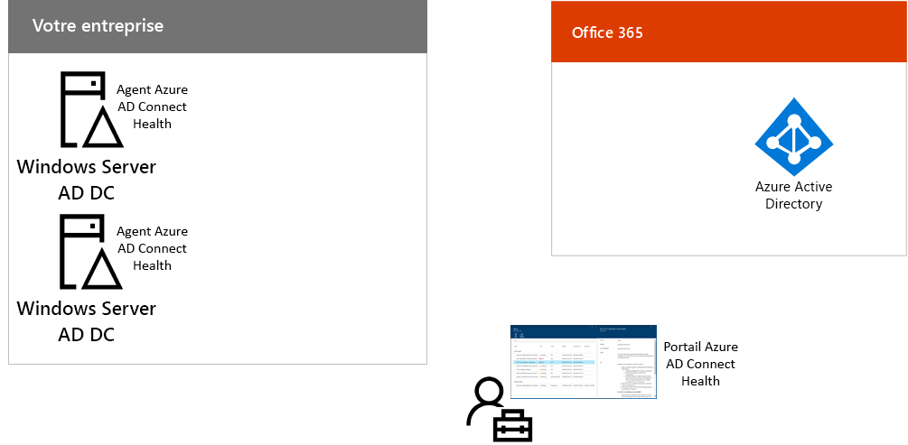

# Étape 3 : Configurer une identité hybride

## Synchroniser les identités

*Cette opération, obligatoire pour les environnements hybrides, s’applique aux versions E3 et E5 de Microsoft 365 Entreprise*

Dans cette section, vous allez synchroniser votre instance locale d’AD DS (Active Directory Domain Services) avec le locataire Azure Active Directory (Azure AD) utilisé par vos abonnements Office 365 et Enterprise Mobility + Security (EMS).

Azure AD Connect est l’outil Microsoft pris en charge qui vous guide tout au long de la synchronisation des identités dont vous avez réellement besoin, des environnements AD DS à une ou plusieurs forêts à votre locataire Azure AD. La figure suivante illustre le processus de base de la synchronisation Azure AD Connect.

1. Azure AD Connect exécuté sur un serveur interroge AD DS pour identifier les modifications apportées aux comptes, aux groupes et aux contacts.
2. Azure AD Connect envoie ces modifications au locataire Azure AD de votre abonnement Microsoft 365.

La première décision dans votre solution d’identité hybride est votre exigence d’authentification. Vous disposez des options suivantes :

- Avec l’**authentification gérée**, Azure AD gère le processus d’authentification pour la connexion de l’utilisateur. Il existe deux méthodes pour l’authentification gérée : 
    - **Synchronisation du hachage de mot de passe (PHS)** [recommandée et requise pour certaines fonctionnalités premium]. Il s’agit du moyen le plus simple d’activer l’authentification des objets d’annuaire locaux dans Azure AD. Azure AD Connect extrait le mot de passe haché d’AD DS, lui applique un traitement de sécurité supplémentaire et l’enregistre dans Azure AD. Pour plus d’informations, consultez [Implémenter la synchronisation de hachage du mot de passe avec la synchronisation Azure AD Connect](https://docs.microsoft.com/azure/active-directory/connect/active-directory-aadconnectsync-implement-password-synchronization).
    - L’**authentification directe** fournit une solution de validation du mot de passe simple pour les services Azure AD. L’authentification directe utilise un agent qui s’exécute sur un ou plusieurs serveurs locaux pour valider les authentifications des utilisateurs directement auprès de votre instance locale d’AD DS. Pour plus d’informations, consultez [Connexion utilisateur avec l’authentification directe Azure Active Directory](https://docs.microsoft.com/azure/active-directory/connect/active-directory-aadconnect-pass-through-authentication).
- Avec l’**authentification fédérée**, le processus d’authentification est redirigé vers un autre fournisseur d’identité via un serveur de fédération des identités, tels que les services de fédération Active Directory (AD FS), pour la connexion d’un utilisateur. Le fournisseur d’identité peut fournir des méthodes d’authentification supplémentaires, telles que l’authentification par carte à puce. Pour en savoir plus, reportez-vous à l’article [Choisir la méthode d’authentification adaptée à votre solution d’identité hybride Azure Active Directory](https://docs.microsoft.com/azure/security/azure-ad-choose-authn).

Après avoir déterminé votre solution d’identité hybride, téléchargez et exécutez l’[outil de correction d’erreurs de synchronisation d’annuaires IdFix](https://www.microsoft.com/download/details.aspx?id=36832) pour analyser les problèmes de votre instance d’AD.

Après avoir résolu tous les problèmes identifiés par l’outil IdFix, consultez [Implémenter la synchronisation de hachage de mot de passe avec la synchronisation](https://docs.microsoft.com/azure/active-directory/connect/active-directory-aadconnectsync-implement-password-hash-synchronization) pour savoir comment installer l’outil Azure AD Connect et configurer la synchronisation d’annuaires entre votre instance locale d’AD DS et le locataire Azure AD de vos abonnements Office 365 et EMS. Une fois la synchronisation lancée, vous gérerez vos groupes et comptes d’utilisateur avec votre fournisseur d’identité local, par exemple AD DS.

Microsoft fournit un ensemble de recommandations sur l’[accès aux appareils et à l’identité](microsoft-365-policies-configurations.md) pour garantir un personnel conforme et productif. 

- Concernant la configuration recommandée pour les environnements hybrides, consultez la colonne **Active Directory avec la synchronisation de hachage de mot de passe** de la section [Travail préparatoire](identity-access-prerequisites.md#prerequisites). 

- Pour la configuration recommandée pour les environnements cloud uniquement, reportez-vous à la colonne **Cloud uniquement** de la section [Travail préparatoire](identity-access-prerequisites.md#prerequisites).

Une fois vos groupes et utilisateurs locaux présents dans Azure AD, vous pouvez commencer à attribuer des licences et à utiliser Exchange Online. Pour déployer Exchange Online auprès de vos utilisateurs et migrer des boîtes aux lettres locales, consultez [Déployer Exchange Online pour Microsoft 365 Entreprise](exchangeonline-workload.md).

|||
|:-------|:-----|
|| [Guide de laboratoire de test : Synchronisation de hachage de mot de passe](password-hash-sync-m365-ent-test-environment.md)  [Guide de laboratoire de test : Authentification directe](pass-through-auth-m365-ent-test-environment.md) |
|||

Comme point de contrôle intermédiaire, consultez les [critères de sortie](identity-exit-criteria.md#crit-identity-sync) correspondant à cette section.

## Surveiller l’état de la synchronisation

*Cette étape facultative s’applique aux versions E3 et E5 de Microsoft 365 Entreprise*

Dans cette section, vous allez installer un agent d’intégrité Azure AD Connect sur chacun de vos serveurs d’identité locaux pour surveiller votre infrastructure d’identité et les services de synchronisation fournis par Azure AD Connect. Les informations de surveillance sont disponibles sur un portail Azure AD Connect Health, où vous pouvez afficher les alertes, surveiller les performances, analyser les utilisations, etc.

La décision de conception clé concernant l’utilisation d’Azure AD Connect Health est basée sur la manière dont vous utilisez Azure AD Connect :

- Si vous utilisez de nouveau l’option d’**authentification gérée**, commencez avec la rubrique relative à l’[utilisation d’Azure AD Connect Health avec la synchronisation](https://docs.microsoft.com/azure/active-directory/connect-health/active-directory-aadconnect-health-sync) pour comprendre et configurer Azure AD Connect Health.
- Si vous synchronisez uniquement les noms des comptes et des groupes à l’aide de l’**authentification fédérée** avec Active Directory Federation Services (AD FS), commencez avec la rubrique [Utilisation d’Azure AD Connect Health avec AD FS](https://docs.microsoft.com/azure/active-directory/connect-health/active-directory-aadconnect-health-adfs) pour comprendre et configurer Azure AD Connect Health.

Au terme de cette section, vous aurez :

- l’agent Azure AD Connect Health installé sur vos serveurs de fournisseur d’identité local ;
- le portail Azure AD Connect Health qui affiche l’état actuel de vos activités d’infrastructure et de synchronisation locales avec le client Azure AD pour vos abonnements Office 365 et EMS.

Comme point de contrôle intermédiaire, vous pouvez consulter les [critères de sortie](identity-exit-criteria.md#crit-identity-sync-health) de cette section.

## Étape suivante

|||
|:-------|:-----|
| [Configurer l’authentification utilisateur sécurisée](identity-multi-factor-authentication.md)
