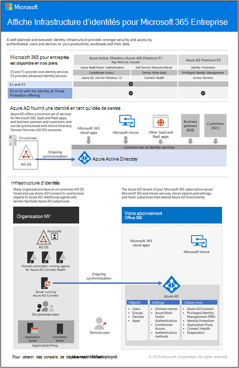

# Feuille de route relative à l’identité pour Microsoft 365

Dans Microsoft 365 entreprise, une infrastructure d’identités bien planifiée et exécutée ouvre la voie à une sécurité renforcée, notamment en limitant l’accès à vos charges de travail de productivité et à leurs données uniquement aux utilisateurs et appareils authentifiés.

Pour obtenir une vue d’ensemble des modèles d’identité et de l’authentification pour Microsoft 365 entreprise, regardez cette vidéo.

 

> [!VIDEO https://www.microsoft.com/videoplayer/embed/RE2Pjwu]

Pour plus d’informations sur les fonctionnalités d’identité de chaque Microsoft 365 pour le plan d’entreprise, le rôle de Azure Active Directory, les composants locaux et en nuage, ainsi que les configurations d’authentification les plus courantes, voir l’affiche Infrastructure d’identités.

Examinez cette affiche de deux pages pour accélérer rapidement les concepts et les configurations d’identité pour Microsoft 365 entreprise.

Vous pouvez également [télécharger cette affiche](https://github.com/MicrosoftDocs/microsoft-365-docs/raw/public/microsoft-365/downloads/m365e-identity-infra.pdf) et l’imprimer au format lettre, légal ou tabloïd (11 x 17).

## Planification

Pour planifier l’implémentation de votre identité :

- [Comprendre les différents modèles d’identité](about-microsoft-365-identity.md)
- [Planifier la synchronisation d’identités et d’annuaires hybride](plan-for-directory-synchronization.md)

## Déployer

Pour déployer votre implémentation d’identité :

- [Protéger vos comptes Administrateur général](protect-your-global-administrator-accounts.md)
- [Configurer et utiliser des identités cloud uniquement](cloud-only-identities.md)
- [Configurer et utiliser des identités hybrides](prepare-for-directory-synchronization.md)
- [Configurer la synchronisation d’annuaires](set-up-directory-synchronization.md)
- Si nécessaire, déployez [des scénarios d’identité hybride](hybrid-solutions.md)

### Recommandations en matière d’identité et d’accès aux appareils

Pour garantir un personnel sécurisé et productif, Microsoft fournit un ensemble de recommandations pour l’accès aux identités [et appareils.](../security/office-365-security/microsoft-365-policies-configurations.md) Pour l’identité, utilisez les recommandations et les paramètres des articles suivants :

- [Conditions préalables](../security/office-365-security/identity-access-prerequisites.md)
- [Stratégies communes pour les identités et l’accès aux appareils](../security/office-365-security/identity-access-policies.md)

## Gestion

Pour gérer votre déploiement d Microsoft 365 d’identité, voir :

- [Comptes d’utilisateur](manage-microsoft-365-accounts.md)
- [Licences](assign-licenses-to-user-accounts.md)
- [Mots de passe](manage-microsoft-365-passwords.md)
- [Groupes](manage-microsoft-365-groups.md)
- [Governance](manage-microsoft-365-identity-governance.md)
- [Synchronisation d’annuaires](view-directory-synchronization-status.md)

## Comment Microsoft fait l’identité pour Microsoft 365

Découvrez comment les experts informatiques de [Microsoft gèrent les identités et la sécurisation des accès](https://www.microsoft.com/en-us/itshowcase/managing-user-identities-and-secure-access-at-microsoft).

>[!Note]
>Cette ressource IT Showcase est disponible uniquement en anglais.
>

## Comment Contoso a fait l’identité pour Microsoft 365

Pour obtenir un exemple de la façon dont une multinationale fictive mais représentative a déployé une infrastructure d’identité hybride pour les services cloud Microsoft 365, voir [Identity for the Contoso Corporation](contoso-identity.md).

## Étape suivante

Démarrez la planification de votre identité avec [des modèles d’identité.](about-microsoft-365-identity.md)
