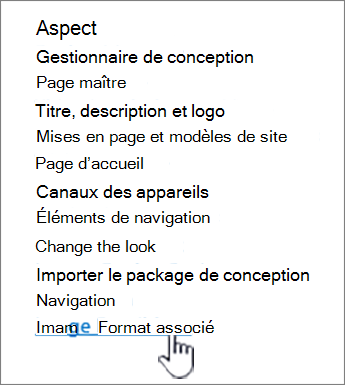
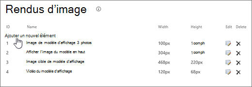
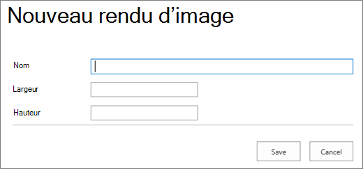

# Optimisation des images pour les sites de publication Classique SharePoint Online

La vitesse de chargement d’une page web dépend de la taille combinée de tous les composants requis pour afficher la page, y compris les images, HTML, JavaScript et CSS. Les images sont un excellent moyen de rendre votre site plus attrayant, mais leur taille peut affecter les performances. En optimisant vos images avec la compression et le redimensionnement, et en utilisant des sprites, vous pouvez compenser les effets des images volumineuses. À l’aide des rendus d’image SharePoint, vous pouvez charger une seule image volumineuse et afficher des sections de l’image qui lui permettent d’être réutilisée plutôt que rechargée.

>[!NOTE]
>Cette rubrique s’applique aux sites de publication Classique SharePoint Online, et non aux sites portail modernes. Pour plus d’informations sur l’optimisation des images dans les sites du portail moderne SharePoint Online, consultez [Optimiser les images dans les pages du portail moderne SharePoint Online](modern-image-optimization.md).
  
## Utilisation de sprites pour accélérer le chargement d’images

Un sprite d’image contient de nombreuses images plus petites. À l’aide de CSS, vous sélectionnez une partie de l’image composite à afficher sur une partie particulière de la page avec un positionnement absolu. Fondamentalement, vous déplacez une seule image autour de la page au lieu de charger plusieurs images, et rendez une petite partie de cette image visible par le biais d’une petite fenêtre où la partie requise de l’image sprite est affichée à l’utilisateur final. SharePoint Online utilise des sprites pour afficher ses différentes icônes dans le fichier spcommon.png sprite.

Ce qui est abordé ici :
- Compression d’image
- Optimisation de l’image
- Rendus d’images SharePoint
   
Cela peut augmenter les performances, car vous ne téléchargez qu’une seule image au lieu de plusieurs, puis mettez en cache et réutilisez cette image. Même si l’image ne reste pas mise en cache, en ayant une seule image au lieu de plusieurs images, cette méthode réduit le nombre total de requêtes HTTP adressées au serveur, ce qui réduit les temps de chargement des pages. C’est vraiment une forme de regroupement d’images. Il s’agit d’une technique utile si les images ne changent pas souvent, par exemple, les icônes, comme indiqué dans l’exemple SharePoint fourni ci-dessus. Vous pouvez voir comment utiliser [Web Essentials](https://vswebessentials.com/), un projet tiers open source basé sur la communauté, pour y parvenir facilement dans Microsoft Visual Studio. Pour plus d’informations, consultez [Minification et regroupement dans SharePoint Online](./minification-and-bundling-in-sharepoint-online.md).
  
## Utilisation de la compression et de l’optimisation des images pour accélérer le chargement des pages

La compression et l’optimisation des images consistent à réduire la taille de fichier des images que vous utilisez sur votre site. Souvent, la meilleure technique pour réduire la taille d’une image consiste à redimensionner l’image aux dimensions maximales qu’elle sera affichée sur le site. Il n’y a aucun sens à avoir une image plus grande qu’elle ne sera jamais affichée. S’assurer que les images sont des dimensions correctes à l’aide d’un éditeur d’images est un moyen rapide et simple de réduire la taille de votre page.
  
Une fois que les images ont la bonne taille, l’étape suivante consiste à optimiser la compression de ces images. Divers outils sont disponibles pour la compression et l’optimisation, notamment la galerie de photos et des outils tiers. La clé de la compression consiste à réduire la taille de fichier autant que possible sans perdre de qualité perceptible pour les utilisateurs finaux. Vérifiez que vous testez vos fichiers compressés sur un affichage haute définition pour vous assurer qu’ils restent corrects.
  
## Accélérer les téléchargements de pages à l’aide de rendus d’images SharePoint

Les rendus d’images sont une fonctionnalité de SharePoint Online qui vous permet de traiter différentes versions d’images en fonction des dimensions d’image prédéfinies. Cela est particulièrement important lorsque le contenu de l’image généré par l’utilisateur ou les dimensions d’image telles que la largeur et la hauteur sont fixes par le CSS sur le site. Même si une image est fixe par CSS, l’image de résolution complète est toujours chargée. Dans ce cas, la taille du fichier peut être réduite à l’aide de rendus d’image.
  
> [!NOTE]
> Les rendus sont disponibles uniquement pour SharePoint lorsque la publication est activée. Vous pouvez activer la publication sous Paramètres des paramètres \> de site Gérer les fonctionnalités \> \> de site SharePoint Server Publishing. L’option n’apparaît pas dans le cas contraire.
  
Le redimensionnement d’image fonctionne en prenant la plus petite dimension que vous définissez, largeur ou hauteur, puis en redimensionnant l’image afin que l’autre dimension soit automatiquement redimensionnée en fonction du ratio d’aspect verrouillé. Par défaut, il rognera l’image à partir du centre en fonction des dimensions restantes. Par exemple, si vous définissez un rendu de 100 px de large et de 50 px de haut et que votre image d’origine a une largeur de 1 000 pixels et une hauteur de 800 px, elle est redimensionnée de sorte que la dimension 800px soit désormais de 50 px et que la dimension 1 000px (maintenant 62,5 px) soit rognée à partir du centre de l’image.
  
Les étapes sont relativement simples, mais pour que les images utilisent les rendus, les rendus doivent se trouver sur le site SharePoint avant d’ajouter les images. En outre, vous devez également activer les fonctionnalités d’infrastructure de publication SharePoint Server (niveau collection de sites) et de publication SharePoint Server (niveau site).
  
### Ajouter un rendu d’image pour accélérer le chargement de page
  
1. Vérifiez que le compte d’utilisateur qui effectue cette procédure dispose, au minimum, des autorisations de conception sur le site de niveau supérieur de la collection de sites et que le site est publié sur une page web.

2. Dans un navigateur web, accédez au site de niveau supérieur de la collection de sites de publication.

3. Choisissez l'icône **Paramètres**.

4. Dans la page **Paramètres du site** , dans la section **Apparence** , vous verrez les rendus d’image intégrés.

    Vous pouvez utiliser les rendus out of the box ou choisir les **rendus d’image** pour en créer un.

    
  
5. Sur la page **Rendus d’image**, sélectionnez **Ajouter un nouvel élément**.

    
  
6. Sur la page **Nouveau rendu d'Image**, dans la zone **Nom**, saisissez un nom pour le rendu.

7. Dans les zones de texte **Largeur** et **Hauteur**, saisissez la largeur et la hauteur, en pixels, du rendu voulu, puis choisissez **Enregistrer**.

    
  
## Rognage personnalisé avec rendus d’image

Par défaut, un rendu d'image est généré à partir du centre de l'image. Vous pouvez régler le rendu d'image de chaque image en détourant la partie de l'image que vous souhaitez utiliser. Vous pouvez rogner les images individuellement, par rendu. Le rognage des images accélère le chargement des pages à l’aide du cache d’objets blob de SharePoint pour créer une version de l’image pour chaque rendu. De cette façon, la charge du serveur est réduite, car l’image n’est redimensionnée qu’une seule fois et est alors prête à servir plusieurs fois aux utilisateurs finaux. Pour plus d’informations sur la façon de rogner un rendu d’image, consultez [Rogner un rendu d’image](/sharepoint/dev/general-development/sharepoint-design-manager-device-channels).
