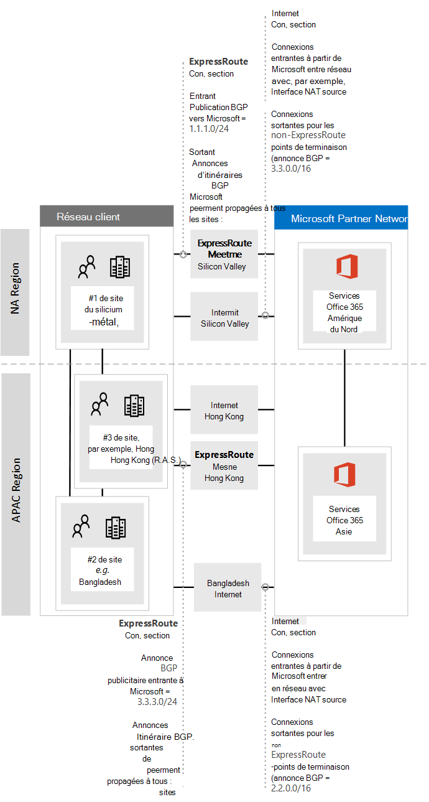

# <a name="implementing-expressroute-for-office-365"></a>Implémentation d’ExpressRoute pour Office 365

*Cet article est valable pour Microsoft 365 Entreprise et Office 365 Entreprise.*

ExpressRoute pour Office 365 fournit un autre chemin de routage vers de nombreux services Office 365 internet. L’architecture d’ExpressRoute pour Office 365 est basée sur la publicité de préfixes IP publics de services Office 365 déjà accessibles via Internet dans vos circuits ExpressRoute mis en service pour la redistribution ultérieure de ces préfixes IP dans votre réseau. Avec ExpressRoute, vous activez efficacement plusieurs itinéraires de routage différents, via Internet et expressRoute, pour de nombreux services Office 365 réseau. Cet état de routage sur votre réseau peut représenter une modification significative de la conception de votre topologie réseau interne.
  
 **État :** Guide complet v2
  
Vous devez soigneusement planifier votre implémentation d’ExpressRoute pour Office 365 afin de prendre en charge les complexités réseau de mise à disposition du routage via un circuit dédié avec des itinéraires injectés dans votre réseau principal et sur Internet. Si vous et votre équipe n’effectuez pas la planification et les tests détaillés dans ce guide, vous risquez d’être intermittent ou de perdre totalement la connectivité aux services Office 365 lorsque le circuit ExpressRoute est activé.
  
Pour réussir l’implémentation, vous devez analyser les exigences de votre infrastructure, passer par une évaluation et une conception détaillées du réseau, planifier soigneusement le déploiement de manière intermédiaire et contrôlée, et créer un plan de validation et de test détaillé. Pour un environnement distribué de grande taille, il n’est pas rare de voir des implémentations s’étendre sur plusieurs mois. Ce guide est conçu pour vous aider à planifier l’avenir.
  
La planification de déploiements réussis de grande envergure peut prendre six mois et inclure souvent des membres d’équipe de nombreux domaines de l’organisation, y compris la mise en réseau, les administrateurs de serveur proxy et de pare-feu, les administrateurs Office 365, la sécurité, le support des utilisateurs finaux, la gestion de projet et le soutien exécutif. Votre investissement dans le processus de planification réduit la probabilité d’échec de déploiement qui entraîne un temps d’arrêt ou un dépannage complexe et coûteux.
  
Nous attendons que les conditions préalables suivantes soient terminées avant le début de ce guide d’implémentation.
  
1. Vous avez effectué une évaluation réseau pour déterminer si ExpressRoute est recommandé et approuvé.

2. Vous avez sélectionné un fournisseur de services réseau ExpressRoute. Recherchez des détails sur les partenaires [ExpressRoute et les emplacements d’homologue.](/azure/expressroute/expressroute-locations)

3. Vous avez déjà lu et compris la [documentation ExpressRoute](https://azure.microsoft.com/documentation/services/expressroute/) et votre réseau interne est en mesure de répondre de bout en bout aux conditions préalables d’ExpressRoute.

4. Votre équipe a lu l’ensemble des conseils publics et de la documentation sur , et a vu la série de formations Azure ExpressRoute pour Office 365 sur Channel 9 pour comprendre les détails techniques [https://aka.ms/expressrouteoffice365](./azure-expressroute.md) [https://aka.ms/ert](https://aka.ms/ert) critiques, [](https://channel9.msdn.com/series/aer) notamment :

      - Dépendances Internet des services SaaS.

      - Comment éviter les itinéraires asymétriques et gérer le routage complexe.

      - Comment incorporer des contrôles de sécurité, de disponibilité et de niveau application de périmètre.

## <a name="begin-by-gathering-requirements"></a>Commencez par collecter les conditions requises
<a name="requirements"> </a>

Commencez par déterminer les fonctionnalités et services que vous prévoyez d’adopter au sein de votre organisation. Vous devez déterminer les fonctionnalités des différents services Office 365 qui seront utilisées et les emplacements de votre réseau qui hébergeront des personnes utilisant ces fonctionnalités. Avec le catalogue de scénarios, vous devez ajouter les attributs réseau dont chacun de ces scénarios a besoin ; tels que les flux de trafic réseau entrant et sortant et si les points de terminaison Office 365 sont disponibles ou non sur ExpressRoute.
  
Pour rassembler les besoins de votre organisation :
  
- Cataloguez le trafic réseau entrant et sortant pour les services Office 365 que votre organisation utilise. Consultez Office 365 page url et plages d’adresses IP pour obtenir la description des flux Office 365 différents scénarios.

- Collectez de la documentation sur la topologie réseau existante affichant les détails de la topologie et de la structure de votre réseau wan interne, la connectivité des sites satellites, la connectivité utilisateur de dernière distance, le routage vers les points de sortie du périmètre réseau et les services proxy.

  - Identifiez les points de terminaison du service entrant sur les diagrammes réseau à Office 365 et d’autres services Microsoft, en affichant les chemins de connexion Internet et ExpressRoute proposés.

  - Identifiez tous les emplacements des utilisateurs géographiques et la connectivité WAN entre les emplacements, ainsi que les emplacements qui disposent actuellement d’une sortie vers Internet et les emplacements proposés pour une sortie vers un emplacement d’homologue ExpressRoute.

  - Identifiez tous les périphériques edge, tels que les proxies, les pare-feu, etc. et cataloguez leur relation avec les flux qui circulent sur Internet et ExpressRoute.

  - Indiquez si les utilisateurs finaux accèderont aux services Office 365 via un routage direct ou un proxy d’application indirect pour les flux Internet et ExpressRoute.

- Ajoutez l’emplacement de votre client et mes rendez-vous à votre diagramme réseau.

- Estimons les caractéristiques de latence et de performances réseau attendues et observées des principaux emplacements des utilisateurs Office 365. N’oubliez pas que Office 365 est un ensemble global et distribué de services et que les utilisateurs se connectent à des emplacements qui peuvent être différents de l’emplacement de leur client. Pour cette raison, il est recommandé de mesurer et d’optimiser la latence entre l’utilisateur et le bord le plus proche du réseau global Microsoft sur les connexions ExpressRoute et Internet. Vous pouvez utiliser les résultats de l’évaluation réseau pour faciliter cette tâche.

- Ré listez les exigences de haute disponibilité et de sécurité du réseau de l’entreprise qui doivent être satisfaites avec la nouvelle connexion ExpressRoute. Par exemple, comment les utilisateurs continuent-ils à accéder aux Office 365 en cas de défaillance du circuit ExpressRoute ou de sortie Internet ?

- Documentez les flux réseau entrants Office 365 sortants qui utiliseront le chemin Internet et ExpressRoute. Les spécificités des emplacements géographiques de vos utilisateurs et les détails de votre topologie réseau sur site peuvent nécessiter que le plan soit différent d’un emplacement d’utilisateur à un autre.

### <a name="catalog-your-outbound-and-inbound-network-traffic"></a>Cataloguer votre trafic réseau entrant et sortant
<a name="trafficCatalog"> </a>

Pour minimiser le routage et d’autres complexités réseau, nous vous recommandons d’utiliser ExpressRoute uniquement pour les Office 365 pour les flux de trafic réseau qui doivent passer par une connexion dédiée en raison des exigences réglementaires ou du résultat de l’évaluation du réseau. En outre, nous vous recommandons de mettre en place l’étendue du routage ExpressRoute et d’aborder les flux de trafic réseau entrant et sortant en tant qu’étapes différentes et distinctes du projet d’implémentation. Déployer ExpressRoute pour Office 365 uniquement pour les flux de trafic réseau sortant initiés par l’utilisateur et laisser des flux de trafic réseau entrant sur Internet peut aider à contrôler l’augmentation de la complexité et des risques liés à l’introduction de possibilités de routage asymétriques supplémentaires.
  
Votre catalogue de trafic réseau doit contenir des listes de toutes les connexions réseau entrantes et sortantes que vous aurez entre votre réseau local et Microsoft.
  
- Les flux de trafic réseau sortant sont tous les scénarios dans lequel une connexion est initiée à partir de votre environnement local, par exemple à partir de clients internes ou de serveurs, avec une destination du services Microsoft. Ces connexions peuvent être directes à Office 365 ou indirectes, par exemple lorsque la connexion passe par des serveurs proxy, des pare-feu ou d’autres périphériques réseau sur le chemin d’accès Office 365.

- Les flux de trafic réseau entrant sont tous les scénarios dans lequel une connexion est initiée à partir du cloud Microsoft vers un hôte local. Ces connexions doivent généralement passer par un pare-feu et une autre infrastructure de sécurité dont la stratégie de sécurité des clients a besoin pour les flux d’origine externe.

Lisez la section Vérifier la symétrie de **l’itinéraire** de l’article Routage avec [ExpressRoute pour Office 365](https://support.office.com/article/Routing-with-ExpressRoute-for-Office-365-e1da26c6-2d39-4379-af6f-4da213218408) pour déterminer les services qui envoieront le trafic entrant et recherchez la colonne **marquée ExpressRoute** pour Office 365 dans l’article de référence des points de terminaison [Office 365](https://support.office.com/article/Office-365-URLs-and-IP-address-ranges-8548a211-3fe7-47cb-abb1-355ea5aa88a2) pour déterminer le reste des informations de connectivité.
  
Pour chaque service nécessitant une connexion sortante, vous devez décrire la connectivité planifiée pour le service, y compris le routage réseau, la configuration du proxy, l’inspection des paquets et les besoins en bande passante.
  
Pour chaque service nécessitant une connexion entrante, vous aurez besoin d’informations supplémentaires. Les serveurs du cloud Microsoft établissent des connexions à votre réseau local. pour vous assurer que les connexions sont correctement réalisées, vous devez décrire tous les aspects de cette connectivité, y compris ; les entrées DNS publiques pour les services qui accepteront ces connexions entrantes, les adresses IP IPv4 au format CIDR, l’équipement isP concerné et la manière dont la nat entrante ou la nat source est gérée pour ces connexions.
  
Les connexions entrantes doivent être examinées, qu’elles se connectent via Internet ou ExpressRoute pour s’assurer que le routage asymétrique n’a pas été introduit. Dans certains cas, les points de terminaison locaux où les services Office 365 lancent des connexions entrantes peuvent également avoir besoin d’être accessibles par d’autres microsoft et non-services Microsoft. Il est essentiel que l’activation du routage ExpressRoute vers ces services à des fins Office 365 ne casse pas les autres scénarios. Dans de nombreux cas, les clients peuvent avoir besoin d’implémenter des modifications spécifiques à leur réseau interne, telles que la nat basée sur la source, pour s’assurer que les flux entrants de Microsoft restent symétriques une fois ExpressRoute activé.
  
Voici un exemple du niveau de détail requis. Dans ce cas, Exchange hybride est acheminé vers le système local sur ExpressRoute. 

|Connection, propriété   |Valeur  |
|----------|-----------|
|**Direction du trafic réseau** <br/> |Entrant  <br/> |
|**Service** <br/> |Environnement Exchange hybride  <br/> |
|**Point de Office 365 public (source)** <br/> |Exchange Online (adresses IP)  <br/> |
|**Point de terminaison local public (destination)** <br/> |5.5.5.5  <br/> |
|**Entrée DNS publique (Internet)** <br/> |Autodiscover.contoso.com  <br/> |
|**Ce point de terminaison local sera-t-il utilisé par d’autres Office 365 (non Office 365) services Microsoft** <br/> |Non  <br/> |
|**Ce point de terminaison local sera-t-il utilisé par les utilisateurs/systèmes sur Internet ?** <br/> |Oui  <br/> |
|**Systèmes internes publiés via des points de terminaison publics** <br/> |Exchange Server d’accès client (local) 192.168.101, 192.168.102, 192.168.103  <br/> |
|**Publication IP du point de terminaison public** <br/> |**Vers Internet**: 5.5.0.0/16 **To ExpressRoute**: 5.5.5.0/24  <br/> |
|**Contrôles de sécurité/de périmètre** <br/> |**Chemin d’accès Internet**: DeviceID_002  **ExpressRoute :** DeviceID_003  <br/> |
|**Haute disponibilité** <br/> |Actif/actif sur 2 circuits géo-redondants/ExpressRoute - Chicago et Dallas  <br/> |
|**Contrôle de symétrie de chemin d’accès** <br/> |**Méthode**: Chemin d’accès **Internet** NAT source : connexions entrantes NAT sources vers le chemin **ExpressRoute** 192.168.5.5 : Connexions NAT source vers 192.168.1.0 (Chicago) et 192.168.2.0 (Dallas)  <br/> |

Voici un exemple de service sortant uniquement :

|**Connection, propriété**|**Valeur**|
|----------|-----------|
|**Direction du trafic réseau** <br/> |Sortant  <br/> |
|**Service** <br/> |SharePoint Online  <br/> |
|**Point de terminaison local (source)** <br/> |Station de travail utilisateur  <br/> |
|**Point de terminaison Office 365 public (destination)** <br/> |SharePoint En ligne (adresses IP)  <br/> |
|**Entrée DNS publique (Internet)** <br/> |\*.sharepoint.com (et des FQDN supplémentaires)  <br/> |
|**CDN Références** <br/> |cdn.sharepointonline.com (et autres FQDN) : adresses IP conservées par CDN fournisseurs)  <br/> |
|**Publication IP et NAT en cours d’utilisation** <br/> |**Chemin d’accès Internet/NAT source**: 1.1.1.0/24  <br/> **Chemin ExpressRoute/NAT source**: 1.1.2.0/24 (Chicago) et 1.1.3.0/24 (Dallas)  <br/> |
|**Méthode connectivity** <br/> |**Internet**: via le proxy de couche 7 (fichier .pac)  <br/> **ExpressRoute**: routage direct (aucun proxy)  <br/> |
|**Contrôles de sécurité/de périmètre** <br/> |**Chemin d’accès Internet**: DeviceID_002  <br/> **Chemin ExpressRoute**: DeviceID_003  <br/> |
|**Haute disponibilité** <br/> |**Chemin d’accès Internet**: sortie Internet redondante  <br/> **Chemin ExpressRoute**: routage « hot hot hot » actif/actif sur 2 circuits ExpressRoute géo-redondants - Chicago et Dallas  <br/> |
|**Contrôle de symétrie de chemin d’accès** <br/> |**Méthode**: SOURCE NAT pour toutes les connexions  <br/> |

### <a name="your-network-topology-design-with-regional-connectivity"></a>Conception de votre topologie réseau avec connectivité régionale
<a name="topology"> </a>

Une fois que vous avez compris les services et les flux de trafic réseau associés, vous pouvez créer un diagramme réseau qui incorpore ces nouvelles exigences de connectivité et illustre les modifications que vous allez apporter pour utiliser ExpressRoute pour Office 365. Votre diagramme doit inclure les suivants :
  
1. Tous les emplacements d’utilisateurs Office 365 et d’autres services seront accessibles.

2. Tous les points de sortie Internet et ExpressRoute.

3. Tous les périphériques sortants et entrants qui gèrent la connectivité dans et hors du réseau, y compris les routeurs, les pare-feu, les serveurs proxy d’application et la détection/prévention des intrusions.

4. Destinations internes pour tout le trafic entrant, telles que les serveurs ADFS internes qui acceptent les connexions à partir des serveurs proxy d’application web ADFS.

5. Catalogue de tous les sous-réseaux IP qui seront publiés

6. Identifiez chaque emplacement où les personnes accèderont Office 365 à partir de l’emplacement meet-me qui sera utilisé pour ExpressRoute.

7. Emplacements et parties de votre topologie réseau interne, où les préfixes IP Microsoft appris à partir d’ExpressRoute seront acceptés, filtrés et propagés vers.

8. La topologie réseau doit illustrer l’emplacement géographique de chaque segment réseau et la façon dont elle se connecte au réseau Microsoft via ExpressRoute et/ou Internet.

Le diagramme ci-dessous montre chaque emplacement où les personnes utiliseront Office 365 à partir des annonces de routage entrant et sortant vers Office 365.
  

  
Pour le trafic sortant, les personnes accèdent Office 365 de trois manières :
  
1. Par le biais d’un emplacement de rencontre en Amérique du Nord pour les personnes en Californie.

2. Par le biais d’un lieu de rencontre à Hong Kong pour les personnes à Hong Kong.

3. Via Internet au Bangladesh, où il y a moins de personnes et aucun circuit ExpressRoute n’est provisioné.


  
De même, le trafic réseau entrant provenant de Office 365 de l’une des trois manières ci-après :
  
1. Par le biais d’un emplacement de rencontre en Amérique du Nord pour les personnes en Californie.

2. Par le biais d’un lieu de rencontre à Hong Kong pour les personnes à Hong Kong.

3. Via Internet au Bangladesh, où il y a moins de personnes et aucun circuit ExpressRoute n’est provisioné.


  
### <a name="determine-the-appropriate-meet-me-location"></a>Déterminer l’emplacement de rendez-vous approprié

La sélection d’emplacements de rendez-vous, qui sont l’emplacement physique à partir duquel votre circuit ExpressRoute connecte votre réseau au réseau Microsoft, est influencée par les emplacements depuis lesquels les personnes accèderont Office 365 réseau. En tant qu’offre SaaS, Office 365 ne fonctionne pas sous le modèle régional IaaS ou PaaS de la même manière qu’Azure. Au lieu de cela, Office 365 est un ensemble distribué de services de collaboration, où les utilisateurs peuvent avoir besoin de se connecter à des points de terminaison dans plusieurs centres de données et régions, qui ne sont peut-être pas nécessairement dans le même emplacement ou la même région où le client de l’utilisateur est hébergé.
  
Cela signifie que la considération la plus importante que vous devez prendre en compte lors de la sélection des emplacements de rendez-vous pour ExpressRoute pour Office 365 est l’emplacement à partir de lequel les personnes de votre organisation se connectent. La recommandation générale pour une connectivité Office 365 optimale consiste à implémenter le routage, de sorte que les demandes des utilisateurs aux services Office 365 soient transmises au réseau Microsoft sur le chemin réseau le plus court. Ce routage est également souvent appelé « routage à chaud ». Par exemple, si la plupart des utilisateurs Office 365 se trouve dans un ou deux emplacements, la sélection d’emplacements de rendez-vous qui se trouve le plus près de l’emplacement de ces utilisateurs crée la conception optimale. Si votre entreprise possède des populations d’utilisateurs importantes dans de nombreuses régions différentes, vous pouvez envisager d’avoir plusieurs circuits ExpressRoute et des emplacements de rendez-vous. Pour certains de vos emplacements d’utilisateurs, le chemin d’accès le plus court/optimal au réseau Microsoft et au Office 365 peut ne pas passer par vos points de rendez-vous wan et ExpressRoute internes, mais via Internet.
  
Souvent, il existe plusieurs emplacements de rendez-vous qui peuvent être sélectionnés dans une région avec une proximité relative avec vos utilisateurs. Remplissez le tableau suivant pour guider vos décisions.

**Emplacements de rendez-vous ExpressRoute planifiés en Californie et à New York**

|Emplacement  <br/> |Nombre de personnes  <br/> |Latence attendue pour le réseau Microsoft via la sortie Internet  <br/> |Latence attendue pour le réseau Microsoft sur ExpressRoute  <br/> |
|----------|-----------|----------|-----------|
|Los Angeles  <br/> |10 000  <br/> |~15 ms  <br/> |~10 ms (via la Californie du Nord)  <br/> |
|Washington DC  <br/> |15 000  <br/> |~20 ms  <br/> |~10 ms (via New York)  <br/> |
|Dallas  <br/> |5 000  <br/> |~15 ms  <br/> |~40 ms (via New York)  <br/> |

Une fois que l’architecture réseau globale affichant la région Office 365, le fournisseur de services réseau ExpressRoute et la quantité de personnes par emplacement a été développée, elle peut être utilisée pour identifier si des optimisations peuvent être réalisées. Il peut également afficher les connexions réseau d’épingles globales où le trafic a lieu à un emplacement distant afin d’obtenir l’emplacement meet-me. Si une épingle sur le réseau global est découverte, elle doit être corrigé avant de continuer. Recherchez un autre emplacement de rendez-vous ou utilisez des points de sortie internet sélectifs pour éviter l’épingle.
  
Le premier diagramme montre un exemple de client ayant deux emplacements physiques en Amérique du Nord. Vous pouvez voir les informations sur les emplacements de bureau, Office 365 les emplacements de client et plusieurs choix d’emplacements ExpressRoute meet-me. Dans cet exemple, le client a sélectionné le lieu de la rencontre en fonction de deux principes, dans l’ordre :
  
1. Proximité la plus proche des personnes de leur organisation.

2. Le plus proche d’un centre de données Microsoft Office 365 est hébergé.


  
Pour étendre légèrement ce concept, le deuxième diagramme illustre un exemple de client national confronté à des informations et à des prises de décision similaires. Ce client possède un petit bureau au Bangladesh avec une petite équipe de dix personnes uniquement axée sur l’augmentation de son empreinte dans la région. Il existe un emplacement de rendez-vous à Chennai et un centre de données Microsoft avec Office 365 hébergé à Chennai afin qu’un lieu de rencontre soit logique ; Toutefois, pour dix personnes, la dépense du circuit supplémentaire est fastidieuse. Lorsque vous examinerez votre réseau, vous devez déterminer si la latence impliquée dans l’envoi de votre trafic réseau sur votre réseau est plus efficace que de passer le capital à acquérir un autre circuit ExpressRoute.
  
En outre, les dix personnes au Bangladesh peuvent connaître de meilleures performances avec leur trafic réseau envoyé via Internet au réseau Microsoft qu’elles ne le feraient sur leur réseau interne, comme nous l’avons montré dans les diagrammes d’introduction et reproduits ci-dessous.
  

  
## <a name="create-your-expressroute-for-office-365-implementation-plan"></a>Créer votre plan d’implémentation ExpressRoute pour Office 365 entreprise
<a name="implementation"> </a>

Votre plan d’implémentation doit englober à la fois les détails techniques de la configuration d’ExpressRoute, ainsi que les détails de la configuration de toutes les autres infrastructures de votre réseau, tels que les suivants.
  
- Planifier les services partagés entre ExpressRoute et Internet.

- Planifiez la bande passante, la sécurité, la haute disponibilité et leover.

- Concevoir un routage entrant et sortant, y compris des optimisations de chemin de routage correctes pour différents emplacements

- Déterminez le chemin d’accès ExpressRoute à annoncer dans votre réseau et quel est le mécanisme permettant aux clients de sélectionner le chemin d’accès Internet ou ExpressRoute ; par exemple, le routage direct ou le proxy d’application.

- Planifiez les modifications des enregistrements DNS, y compris [les entrées de l’infrastructure de stratégie de](../security/office-365-security/set-up-spf-in-office-365-to-help-prevent-spoofing.md) l’expéditeur.

- Planifier la stratégie NAT, y compris la nat source sortante et entrante.

### <a name="plan-your-routing-with-both-internet-and-expressroute-network-paths"></a>Planifier votre routage avec des chemins réseau Internet et ExpressRoute
<a name="paths"> </a>

- Pour votre déploiement initial, tous les services entrants, tels que le courrier entrant ou la connectivité hybride, sont recommandés pour utiliser Internet.

- Planifiez le routage LAN du client final, comme la configuration d’un fichier [PAC/WPAD,](./managing-office-365-endpoints.md)de l’itinéraire par défaut, des serveurs proxy et des annonces d’itinéraire BGP.

- Planifier le routage du périmètre, y compris les serveurs proxy, les pare-feu et les proxys cloud.

### <a name="plan-your-bandwidth-security-high-availability-and-failover"></a>Planifier la bande passante, la sécurité, la haute disponibilité et leover
<a name="availability"> </a>

Créez un plan de bande passante requis pour chaque charge Office 365 charge de travail principale. Évaluez séparément les Exchange Online, SharePoint Online et Skype Entreprise bande passante en ligne. Vous pouvez utiliser les calculatrices d’estimation que nous avons fournies pour Exchange Online et Skype Entreprise comme point de départ ; toutefois, un test pilote avec un échantillon représentatif des profils utilisateur et des emplacements est nécessaire pour bien comprendre les besoins en bande passante de votre organisation.
  
Ajoutez la façon dont la sécurité est gérée à chaque emplacement de sortie Internet et ExpressRoute à votre plan, n’oubliez pas que toutes les connexions ExpressRoute à Office 365 utilisent l’homologue public et doivent toujours être sécurisées conformément aux stratégies de sécurité de votre entreprise de connexion aux réseaux externes.
  
Ajoutez des détails à votre plan sur les personnes qui seront affectées par le type de panne et la façon dont ces personnes pourront effectuer leur travail à pleine capacité de la manière la plus simple.
  
#### <a name="plan-bandwidth-requirements-including-skype-for-business-requirements-on-jitter-latency-congestion-and-headroom"></a>Planifier les besoins en bande passante, Skype Entreprise la gigue, la latence, la congestion et la capacité d’en-tête
  
Skype Entreprise Online présente également des exigences réseau supplémentaires spécifiques, qui sont détaillées dans l’article Qualité des médias et Performances de [connectivité réseau dans Skype Entreprise Online.](https://support.office.com/article/Media-Quality-and-Network-Connectivity-Performance-in-Skype-for-Business-Online-5fe3e01b-34cf-44e0-b897-b0b2a83f0917)
  
Lisez la section **Planification de la bande passante pour Azure ExpressRoute** dans la planification réseau avec [ExpressRoute pour Office 365](https://support.office.com/article/Network-planning-with-ExpressRoute-for-Office-365-103208f1-e788-4601-aa45-504f896511cd).
  
Lorsque vous effectuez une évaluation de la bande passante avec vos utilisateurs pilotes, vous pouvez utiliser notre guide . [Office 365 réglage des performances à l’aide des lignes de base et de l’historique des performances.](https://support.office.com/article/Office-365-performance-tuning-using-baselines-and-performance-history-1492cb94-bd62-43e6-b8d0-2a61ed88ebae)
  
#### <a name="plan-for-high-availability-requirements"></a>Planifier les besoins en haute disponibilité
  
Créez un plan de haute disponibilité pour répondre à vos besoins et intégrez-le à votre diagramme de topologie réseau mis à jour. Lisez la section **Haute disponibilité et le failover avec Azure ExpressRoute** dans la planification réseau avec [ExpressRoute pour Office 365](https://support.office.com/article/Network-planning-with-ExpressRoute-for-Office-365-103208f1-e788-4601-aa45-504f896511cd).
  
#### <a name="plan-for-network-security-requirements"></a>Planifier les exigences de sécurité réseau
  
Créez un plan pour répondre aux exigences de sécurité de votre réseau et incorporez-le à votre diagramme de topologie réseau mis à jour. Lisez la section Application de contrôles de sécurité à **Azure ExpressRoute pour Office 365 scénarios** de planification réseau avec [ExpressRoute pour Office 365](https://support.office.com/article/Network-planning-with-ExpressRoute-for-Office-365-103208f1-e788-4601-aa45-504f896511cd).
  
### <a name="design-outbound-service-connectivity"></a>Concevoir la connectivité des services sortants
<a name="outbound"> </a>

ExpressRoute pour Office 365 a des *exigences de* réseau sortant qui ne sont peut-être pas familières. Plus précisément, les adresses IP qui représentent vos utilisateurs et réseaux à Office 365 et qui agissent en tant que points de terminaison source pour les connexions réseau sortantes à Microsoft doivent respecter les exigences spécifiques décrites ci-dessous.
  
1. Les points de terminaison doivent être des adresses IP publiques, inscrites auprès de votre entreprise ou de l’opérateur qui vous fournit la connectivité ExpressRoute.

2. Les points de terminaison doivent être publiés à Microsoft et validés/acceptés par ExpressRoute.

3. Les points de terminaison ne doivent pas être publiés sur Internet avec la même mesure de routage préférée ou plus.

4. Les points de terminaison ne doivent pas être utilisés pour la connectivité services Microsoft qui ne sont pas configurés sur ExpressRoute.

Si votre conception réseau ne répond pas à ces exigences, il existe un risque élevé que vos utilisateurs rencontrent des échecs de connectivité à Office 365 et à d’autres services Microsoft en raison de l’acheminement d’un holage noir ou d’un routage asymétrique. Cela se produit lorsque les demandes à services Microsoft sont acheminées via ExpressRoute, mais que les réponses sont réacheminées sur Internet, ou vice versa, et que les réponses sont abandonnées par des périphériques réseau avec état tels que des pare-feu.
  
La méthode la plus courante que vous pouvez utiliser pour répondre aux exigences ci-dessus consiste à utiliser la nat source, soit implémentée dans le cadre de votre réseau, soit fournie par votre opérateur ExpressRoute. La nat source vous permet d’abstraction des détails et de l’adressage IP privé de votre réseau Internet à partir d’ExpressRoute et ; couplés à des annonces d’itinéraire IP correctes, fournissent un mécanisme simple pour garantir la symétrie du chemin d’accès. Si vous utilisez des périphériques réseau avec état spécifiques aux emplacements d’homologue ExpressRoute, vous devez implémenter des pools NAT distincts pour chaque homologue ExpressRoute afin de garantir la symétrie du chemin d’accès.
  
En savoir plus sur les exigences [de nat ExpressRoute](/azure/expressroute/expressroute-nat).
  
Ajoutez les modifications de la connectivité sortante au diagramme de topologie réseau.
  
### <a name="design-inbound-service-connectivity"></a>Concevoir la connectivité des services entrants
<a name="inbound"> </a>

La majorité des déploiements d’Office 365 d’entreprise supposent une forme de connectivité entrante entre Office 365 et les services locaux, comme pour les scénarios hybrides Exchange, SharePoint et Skype Entreprise, les migrations de boîtes aux lettres et l’authentification à l’aide de l’infrastructure ADFS. Lorsque ExpressRoute vous activez un chemin de routage supplémentaire entre votre réseau local et Microsoft pour la connectivité sortante, ces connexions entrantes peuvent être touchées par inadvertance par le routage asymétrique, même si vous prévoyez que ces flux continuent d’utiliser Internet. Quelques précautions décrites ci-dessous sont recommandées pour vous assurer qu’il n’y a aucun impact sur les flux entrants basés sur Internet depuis Office 365 vers les systèmes locaux.
  
Pour réduire les risques de routage asymétrique pour les flux de trafic réseau entrant, toutes les connexions entrantes doivent utiliser la nat source avant d’être acheminées en segments de votre réseau qui ont une visibilité de routage dans ExpressRoute. Si les connexions entrantes sont autorisées sur un segment réseau avec une visibilité de routage dans ExpressRoute sans nat source, les demandes provenant de Office 365 entrent à partir d’Internet, mais la réponse qui revient à Office 365 préférera le chemin d’accès réseau ExpressRoute au réseau Microsoft, ce qui entraîne un routage asymétrique.
  
Vous pouvez envisager l’un des modèles d’implémentation suivants pour répondre à cette exigence :
  
1. Effectuez la nat source avant que les demandes soient acheminées vers votre réseau interne à l’aide d’équipements réseau tels que des pare-feux ou des équilibreurs de charge sur le chemin d’accès à partir d’Internet vers vos systèmes locaux.

2. Assurez-vous que les itinéraires ExpressRoute ne sont pas propagés aux segments réseau où résident les services entrants, tels que les serveurs frontaux ou les systèmes proxy inverses, qui gèrent les connexions Internet.

La comptabilité explicite de ces scénarios dans votre réseau et la conservation de tous les flux de trafic réseau entrant sur Internet permettent de minimiser le déploiement et les risques opérationnels de routage asymétrique.
  
Dans certains cas, vous pouvez choisir de diriger certains flux entrants sur des connexions ExpressRoute. Pour ces scénarios, prenez en compte les considérations supplémentaires suivantes.
  
1. Office 365 pouvez cibler uniquement les points de terminaison locaux qui utilisent des fai publics. Cela signifie que même si le point de terminaison entrant local n’est exposé qu’à Office 365 sur ExpressRoute, l’adresse IP publique doit toujours lui être associée.

2. Toutes les résolutions de noms DNS Office 365 que les services exécutent pour résoudre les points de terminaison locaux se produisent à l’aide du DNS public. Cela signifie que vous devez inscrire le FQDN des points de terminaison du service entrant sur les mappages IP sur Internet.

3. Pour recevoir des connexions réseau entrantes sur ExpressRoute, les sous-réseaux IP publics de ces points de terminaison doivent être publiés à Microsoft sur ExpressRoute.

4. Évaluez attentivement ces flux de trafic réseau entrant pour vous assurer que la sécurité et les contrôles réseau appropriés leur sont appliqués conformément aux stratégies de sécurité et de réseau de votre entreprise.

5. Une fois que vos points de terminaison entrants locaux sont publiés à Microsoft sur ExpressRoute, ExpressRoute devient effectivement le chemin de routage préféré vers ces points de terminaison pour toutes les services Microsoft, y compris les Office 365. Cela signifie que ces sous-réseaux de point de terminaison doivent uniquement être utilisés pour les communications avec les services Office 365 et aucun autre service sur le réseau Microsoft. Dans le cas contraire, votre conception provoquera un routage asymétrique lorsque les connexions entrantes provenant d’autres services Microsoft préfèrent router le trafic entrant sur ExpressRoute, tandis que le chemin d’accès de retour utilisera Internet.

6. Si un circuit ExpressRoute ou un emplacement meet-me est en panne, vous devez vous assurer que les points de terminaison entrants locaux sont toujours disponibles pour accepter les demandes sur un chemin réseau distinct. Cela peut signifier des sous-réseaux publicitaires pour ces points de terminaison via plusieurs circuits ExpressRoute.

7. Nous vous recommandons d’appliquer la nat source pour tous les flux de trafic réseau entrant qui entrent dans votre réseau via ExpressRoute, en particulier lorsque ces flux traversent des périphériques réseau avec état tels que des pare-feu.

8. Certains services locaux, tels que le proxy ADFS ou la découverte automatique Exchange, peuvent recevoir des demandes entrantes de services Office 365 et d’utilisateurs provenant d’Internet. Pour ces demandes, Office 365 ciblera le même nom de groupe que les demandes des utilisateurs sur Internet. Autoriser les connexions utilisateur entrantes à partir d’Internet à ces points de terminaison locaux, tout en forçant les connexions Office 365 à utiliser ExpressRoute, représente une complexité de routage importante. Pour la grande majorité des clients qui implémentent des scénarios aussi complexes sur ExpressRoute, il n’est pas recommandé en raison de considérations opérationnelles. Cette surcharge supplémentaire inclut la gestion des risques de routage asymétrique et vous obligera à gérer avec soin les annonces et stratégies de routage dans plusieurs dimensions.

### <a name="update-your-network-topology-plan-to-show-how-you-would-avoid-asymmetric-routes"></a>Mettre à jour votre plan de topologie réseau pour montrer comment éviter les itinéraires asymétriques
<a name="asymmetric"> </a>

Vous souhaitez éviter le routage asymétrique pour vous assurer que les membres de votre organisation peuvent utiliser en toute transparence Office 365 ainsi que d’autres services importants sur Internet. Il existe deux configurations courantes pour les clients qui provoquent un routage asymétrique. Il est maintenant temps de passer en revue la configuration réseau que vous envisagez d’utiliser et de vérifier si l’un de ces scénarios de routage asymétrique pourrait exister.
  
Pour commencer, nous allons examiner quelques situations différentes associées au diagramme réseau suivant. Dans ce diagramme, tous les serveurs qui reçoivent des demandes entrantes, tels que les services ADFS ou les serveurs hybrides locaux, se sont situés dans le centre de données du New Jersey et sont publiés sur Internet.
  
1. Bien que le réseau de périmètre soit sécurisé, aucune nat source n’est disponible pour les demandes entrantes.

2. Les serveurs du centre de données du New Jersey peuvent voir les itinéraires Internet et ExpressRoute.


  
Nous vous proposons également des suggestions sur la façon de les résoudre.
  
#### <a name="problem-1-cloud-to-on-premises-connection-over-the-internet"></a>Problème 1 : connexion cloud à la connexion sur site via Internet
  
Le diagramme suivant illustre le chemin d’accès réseau asymétrique pris lorsque votre configuration réseau ne fournit pas nat pour les demandes entrantes à partir du cloud Microsoft sur Internet.
  
1. La demande entrante de Office 365 récupère l’adresse IP du point de terminaison local à partir du DNS public et envoie la demande à votre réseau de périmètre.

2. Dans cette configuration défectueux, aucune nat source n’est configurée ou disponible sur le réseau de périmètre où le trafic est envoyé, ce qui entraîne l’utilisation de l’adresse IP source réelle comme destination de retour.

  - Le serveur de votre réseau route le trafic de retour vers Office 365 via n’importe quelle connexion réseau ExpressRoute disponible.

  - Le résultat est un chemin asymétrique pour ce flux vers Office 365, ce qui entraîne une connexion rompue.


  
##### <a name="solution-1a-source-nat"></a>Solution 1a : NAT source
  
Le simple ajout d’un NAT source à la demande entrante résout ce réseau mal configuré. Dans ce schéma :
  
1. La demande entrante continue d’entrer via le réseau de périmètre du centre de données du New Jersey. Cette fois, la nat source est disponible.

2. La réponse du serveur retourne vers l’adresse IP associée au NAT source au lieu de l’adresse IP d’origine, ce qui entraîne le renvoi de la réponse sur le même chemin réseau.


  
##### <a name="solution-1b-route-scoping"></a>Solution 1b : portée de l’itinéraire
  
Vous pouvez également choisir de ne pas autoriser la publicité des préfixes BGP ExpressRoute, en supprimant le chemin d’accès réseau alternatif pour ces ordinateurs. Dans ce schéma :
  
1. La demande entrante continue d’entrer via le réseau de périmètre du centre de données du New Jersey. Cette fois, les préfixes publiés de Microsoft sur le circuit ExpressRoute ne sont pas disponibles pour le centre de données du New Jersey.

2. La réponse du serveur retourne vers l’adresse IP associée à l’adresse IP d’origine sur le seul itinéraire disponible, ce qui entraîne le renvoi de la réponse sur le même chemin réseau.


  
#### <a name="problem-2-cloud-to-on-premises-connection-over-expressroute"></a>Problème 2 : Connexion cloud à local sur ExpressRoute
  
Le diagramme suivant illustre le chemin d’accès réseau asymétrique pris lorsque votre configuration réseau ne fournit pas nat pour les demandes entrantes en provenance du cloud Microsoft sur ExpressRoute.
  
1. La demande entrante de Office 365 l’adresse IP à partir du DNS et envoie la demande à votre réseau de périmètre.

2. Dans cette configuration défectueux, aucune nat source n’est configurée ou disponible sur le réseau de périmètre où le trafic est envoyé, ce qui entraîne l’utilisation de l’adresse IP source réelle comme destination de retour.

  - L’ordinateur de votre réseau route le trafic de retour vers Office 365 via n’importe quelle connexion réseau ExpressRoute disponible.

  - Le résultat est une connexion asymétrique à Office 365.


  
##### <a name="solution-2-source-nat"></a>Solution 2 : NAT source
  
Le simple ajout d’un NAT source à la demande entrante résout ce réseau mal configuré. Dans ce schéma :
  
1. La demande entrante continue d’entrer via le réseau de périmètre du centre de données de New York. Cette fois, la nat source est disponible.

2. La réponse du serveur retourne vers l’adresse IP associée au NAT source au lieu de l’adresse IP d’origine, ce qui entraîne le renvoi de la réponse sur le même chemin réseau.


  
### <a name="paper-verify-that-the-network-design-has-path-symmetry"></a>Papier vérifier que la conception réseau présente une symétrie de chemin d’accès

À ce stade, vous devez vérifier sur papier que votre plan d’implémentation offre une symétrie d’itinéraire pour les différents scénarios dans lesquels vous utiliserez Office 365. Vous identifierez l’itinéraire réseau spécifique qui doit être pris lorsqu’une personne utilise différentes fonctionnalités du service. Du routage réseau local et WAN, aux périphériques de périmètre, au chemin de connectivité ; ExpressRoute ou Internet, et sur la connexion au point de terminaison en ligne.
  
Vous devrez le faire pour tous les services réseau Office 365 précédemment identifiés en tant que services que votre organisation adoptera.
  
Cette feuille vous aide à parcourir les itinéraires avec une deuxième personne. Expliquez-leur à quel endroit chaque saut réseau doit obtenir son itinéraire suivant et assurez-vous que vous êtes familiarisé avec les chemins de routage. N’oubliez pas qu’ExpressRoute fournira toujours un itinéraire plus large vers les adresses IP du serveur Microsoft, ce qui lui permet de réduire le coût d’itinéraire par rapport à un itinéraire Internet par défaut.
  
### <a name="design-client-connectivity-configuration"></a>Concevoir la configuration de la connectivité client
<a name="asymmetric"> </a>


  
Si vous utilisez un serveur proxy pour le trafic lié à Internet, vous devez ajuster les fichiers de configuration de client ou PAC pour vous assurer que les ordinateurs clients de votre réseau sont correctement configurés pour envoyer le trafic ExpressRoute souhaité à Office 365 sans transiter par votre serveur proxy, et le trafic restant, y compris du trafic Office 365, est envoyé au proxy approprié. Lisez notre guide sur la gestion Office 365 points de [terminaison par](./managing-office-365-endpoints.md) exemple des fichiers PAC.
  
> [!NOTE]
> Les points de terminaison changent fréquemment, aussi souvent qu’une fois par semaine. Vous devez uniquement apporter des modifications en fonction des services et fonctionnalités que votre organisation a adoptés pour réduire le nombre de modifications que vous devrez apporter pour rester à jour. Accordez une attention particulière à la **date** d’effet dans le flux RSS où les modifications sont annoncées et où un enregistrement est conservé de toutes les modifications passées, les adresses IP annoncées peuvent ne pas être publiées ou supprimées de la publication tant que la date d’effet n’est pas atteinte.
  
## <a name="build-your-deployment-and-testing-procedures"></a>Créer vos procédures de déploiement et de test
<a name="testing"> </a>

Votre plan d’implémentation doit inclure à la fois des tests et une planification de la récupération. Si votre implémentation ne fonctionne pas comme prévu, le plan doit être conçu pour affecter le moins de personnes avant la découverte de problèmes. Voici quelques principes de haut niveau que votre plan doit prendre en considération.
  
1. Stage the network segment and user service onboarding to minimize disruption.

2. Planifiez les itinéraires de test avec traceroute et connexion TCP à partir d’un hôte connecté à Internet distinct.

3. De préférence, le test des services entrants et sortants doit être effectué sur un réseau de test isolé avec un client Office 365 test.

      - Vous pouvez également effectuer des tests sur un réseau de production si le client n’utilise pas encore Office 365 ou est en phase pilote.

      - Vous pouvez également effectuer des tests lors d’une panne de production qui est réservée aux tests et à la surveillance.

      - Vous pouvez également tester en vérifiant les itinéraires de chaque service sur chaque nœud du routeur de couche 3. Ce retour ne doit être utilisé que si aucun autre test n’est possible, car un manque de test physique présente un risque.

### <a name="build-your-deployment-procedures"></a>Créer vos procédures de déploiement

Vos procédures de déploiement doivent être déployées pour de petits groupes de personnes par étapes afin de permettre le test avant le déploiement vers des groupes de personnes plus importants. Voici plusieurs façons de mettre en place le déploiement d’ExpressRoute.
  
1. Configurer ExpressRoute avec l’homologue Microsoft et faire en cas de rediriger les publicités d’itinéraire vers un seul hôte uniquement à des fins de test par étapes.

2. Annoncez d’abord des itinéraires vers le réseau ExpressRoute vers un segment réseau unique et développez les annonces d’itinéraire par segment ou région réseau.

3. Si vous déployez Office 365 pour la première fois, utilisez le déploiement réseau ExpressRoute comme pilote pour un petit nombre de personnes.

4. Si vous utilisez des serveurs proxy, vous pouvez également configurer un fichier PAC de test pour diriger un petit nombre de personnes vers ExpressRoute avec des tests et des commentaires avant d’en ajouter d’autres.

Votre plan d’implémentation doit énumérer chacune des procédures de déploiement qui doivent être prises ou les commandes qui doivent être utilisées pour déployer la configuration réseau. Lorsque le temps d’in panne du réseau arrive, toutes les modifications apportées doivent être du plan de déploiement écrit écrit à l’avance et révisé par l’homologue. Consultez nos conseils sur la configuration technique d’ExpressRoute.
  
- Mise à jour de vos enregistrements TXT SPF si vous avez modifié des adresses IP pour des serveurs locaux qui continueront d’envoyer des messages électroniques.

- Mise à jour des entrées DNS pour les serveurs locaux si vous avez modifié des adresses IP pour prendre en charge une nouvelle configuration NAT.

- Assurez-vous que vous vous êtes abonné au flux RSS pour Office 365 notifications de point de terminaison afin de gérer les configurations de routage ou de proxy.

Une fois votre déploiement ExpressRoute terminé, les procédures du plan de test doivent être exécutées. Les résultats de chaque procédure doivent être enregistrés. Vous devez inclure des procédures de revenir à l’environnement de production d’origine au cas où les résultats du plan de test indiquent que l’implémentation n’a pas réussi.
  
### <a name="build-your-test-procedures"></a>Créer vos procédures de test

Vos procédures de test doivent inclure des tests pour chaque service réseau entrant et sortant pour les Office 365 qui utiliseront ExpressRoute et ceux qui n’utiliseront pas ExpressRoute. Les procédures doivent inclure des tests à partir de chaque emplacement réseau unique, y compris les utilisateurs qui ne sont pas locaux dans le réseau local d’entreprise.
  
Voici quelques exemples d’activités de test:
  
1. Ping à partir de votre routeur local vers votre routeur opérateur réseau.

2. Validez les 500 Office 365 et les annonces d’adresse IP CRM Online reçues par votre routeur local.

3. Validez que votre nat entrant et sortant fonctionne entre ExpressRoute et le réseau interne.

4. Vérifier que les itinéraires vers votre nat sont publiés à partir de votre routeur.

5. Vérifier qu’ExpressRoute a accepté vos préfixes publiés.

      - Utilisez l’cmdlet suivante pour vérifier l’homologue des publicités :

      ```PowerShell
      Get-AzureRmExpressRouteCircuitRouteTable -DevicePath Primary -ExpressRouteCircuitName TestER -ResourceGroupName RG -PeeringType MicrosoftPeering
      ```

6. Validez que votre plage d’adresses IP NAT publiques n’est pas publiée à Microsoft par le biais d’un autre circuit ExpressRoute ou réseau Internet public, sauf s’il s’agit d’un sous-ensemble spécifique d’une plage plus importante, comme dans l’exemple précédent.

7. Les circuits ExpressRoute sont couplés, ce qui permet de vérifier que les deux sessions BGP sont en cours d’exécution.

8. Configurer un hôte unique à l’intérieur de votre nat et utiliser ping, tracert et tcpping pour tester la connectivité entre le nouveau circuit et le serveur outlook.office365.com. Vous pouvez également utiliser un outil tel que Wireshark ou Microsoft Network Monitor 3.4 sur un port en miroir vers le MSEE pour vérifier que vous êtes en mesure de vous connecter à l’adresse IP associée à outlook.office365.com.

9. Testez les fonctionnalités au niveau de l’application Exchange Online.

  - Testez Outlook pouvez vous connecter à Exchange Online et envoyer/recevoir des messages électroniques.

  - Test Outlook est en mesure d’utiliser le mode en ligne.

  - Testez la connectivité des smartphones et la fonctionnalité d’envoi/réception.

10. Tester la fonctionnalité de niveau application pour SharePoint Online

  - Testez OneDrive Entreprise client de synchronisation.

  - Testez SharePoint l’accès web en ligne.

11. Testez les fonctionnalités au niveau de l’application Skype Entreprise scénarios d’appel :

  - Participer à une conférence téléphonique en tant qu’utilisateur authentifié [invitation initiée par l’utilisateur final].

  - Inviter un utilisateur à une conférence téléphonique [invitation envoyée à partir du MCU].

  - Participez à une conférence en tant qu’utilisateur anonyme à l’Skype Entreprise’application web.

  - Participez à l’appel à partir de votre connexion PC câblé, de votre téléphone IP et de votre appareil mobile.

  - Appel à l’utilisateur fédéré o Appel à la validation PSTN : l’appel est terminé, la qualité de l’appel est acceptable, le temps de connexion est acceptable.

  - Vérifiez que l’état de présence des contacts est mis à jour pour les membres du client et les utilisateurs fédérés.

### <a name="common-problems"></a>Problèmes courants

Le routage asymétrique est le problème d’implémentation le plus courant. Voici quelques sources courantes à rechercher :
  
- Utilisation d’une topologie de routage réseau ouverte ou plate sans NAT source en place.

- Ne pas utiliser SNAT pour router vers les services entrants via les connexions Internet et ExpressRoute.

- Ne teste pas les services entrants sur ExpressRoute sur un réseau de test avant le déploiement à grande étendue.

## <a name="deploying-expressroute-connectivity-through-your-network"></a>Déploiement de la connectivité ExpressRoute via votre réseau
<a name="testing"> </a>

Planifiez votre déploiement sur un segment du réseau à la fois, en déploient progressivement la connectivité à différentes parties du réseau avec un plan de mise à jour pour chaque nouveau segment réseau. Si votre déploiement est aligné sur un déploiement Office 365, déployez d’abord vers Office 365 utilisateurs pilotes et étendez-les à partir de là.
  
Tout d’abord pour votre test, puis pour la production :
  
- Exécutez les étapes de déploiement pour activer ExpressRoute.

- Testez que les itinéraires réseau sont comme prévu.

- Effectuez des tests sur chaque service entrant et sortant.

- La récupération si vous découvrez des problèmes.

### <a name="set-up-a-test-connection-to-expressroute-with-a-test-network-segment"></a>Configurer une connexion de test à ExpressRoute avec un segment réseau de test

Maintenant que vous avez terminé le plan sur papier, il est temps de tester à petite échelle. Dans ce test, vous allez établir une connexion ExpressRoute unique avec Microsoft Peering à un sous-réseau de test sur votre réseau local. Vous pouvez configurer un client d’essai [Office 365](https://go.microsoft.com/fwlink/p/?LinkID=403802) avec une connectivité vers et depuis le sous-réseau de test et inclure tous les services sortants et entrants que vous utiliserez en production dans le sous-réseau de test. Configurer le DNS pour le segment réseau de test et établir tous les services entrants et sortants. Exécutez votre plan de test et assurez-vous que vous êtes familiarisé avec le routage pour chaque service et la propagation de l’itinéraire.
  
### <a name="execute-the-deployment-and-test-plans"></a>Exécuter les plans de déploiement et de test

À mesure que vous complétez les éléments décrits ci-dessus, vérifiez les domaines que vous avez terminés et vérifiez que vous et votre équipe les avez examinés avant d’exécuter vos plans de déploiement et de test.
  
- Liste des services sortants et entrants impliqués dans le changement de réseau.

- Diagramme d’architecture réseau global montrant à la fois les emplacements de sortie Internet et d’ExpressRoute meet-me.

- Diagramme de routage réseau montrant les différents chemins d’accès réseau utilisés pour chaque service déployé.

- Un plan de déploiement avec des étapes pour implémenter les modifications et la récupération si nécessaire.

- Un plan de test pour tester chaque Office 365 service réseau.

- Validation papier terminée des itinéraires de production pour les services entrants et sortants.

- Test terminé sur un segment réseau de test, y compris le test de disponibilité.

Choisissez une fenêtre de panne suffisamment longue pour s’exécuter dans l’ensemble du plan de déploiement et du plan de test, dispose d’un certain temps pour la résolution des problèmes et du temps pour la revenir en arrière si nécessaire.
  
> [!CAUTION]
> En raison de la nature complexe du routage sur Internet et ExpressRoute, il est recommandé d’ajouter un temps tampon supplémentaire à cette fenêtre pour la résolution des problèmes de routage complexe.
  
### <a name="configure-qos-for-skype-for-business-online"></a>Configurer la QoS pour Skype Entreprise Online

La QoS est nécessaire pour obtenir les avantages de la voix et des réunions pour Skype Entreprise Online. Vous pouvez configurer QoS après vous être assuré que la connexion réseau ExpressRoute ne bloque aucun autre accès Office 365 service. La configuration de la QoS est décrite dans l’article ExpressRoute et [QoS dans Skype Entreprise Online.](https://support.office.com/article/ExpressRoute-and-QoS-in-Skype-for-Business-Online-20c654da-30ee-4e4f-a764-8b7d8844431d)
  
## <a name="troubleshooting-your-implementation"></a>Résolution des problèmes de votre implémentation
<a name="troubleshooting"> </a>

Le premier endroit où examiner les étapes de ce guide de mise en œuvre a-t-il été manqué dans votre plan d’implémentation ? Revenir en arrière et exécuter d’autres tests réseau de petite taille si possible pour répliquer l’erreur et la déboguer.
  
Identifier les services entrants ou sortants qui ont échoué lors des tests. Obtenez spécifiquement les adresses IP et les sous-réseaux pour chacun des services qui ont échoué. Allez de l’avant et présentez le diagramme de topologie réseau sur papier et validez le routage. Validez spécifiquement l’endroit où le routage ExpressRoute est publié, testez ce routage pendant la panne si possible avec des traces.
  
Exécutez PSPing avec un suivi réseau pour chaque point de terminaison du client et évaluez les adresses IP source et de destination pour vérifier qu’elles sont comme prévu. Exécutez telnet sur n’importe quel hôte de messagerie que vous exposez sur le port 25 et vérifiez que SNAT masquait l’adresse IP source d’origine si cela est attendu.
  
N’oubliez pas que lors du déploiement de Office 365 avec une connexion ExpressRoute, vous devez vous assurer que la configuration réseau d’ExpressRoute est conçue de manière optimale et que vous avez également optimisé les autres composants de votre réseau, tels que les ordinateurs clients. Outre l’utilisation de ce guide de planification pour résoudre les problèmes que vous avez peut-être manqués, nous avons également écrit un plan de résolution des problèmes de performances [pour Office 365](https://support.office.com/article/Performance-troubleshooting-plan-for-Office-365-e241e5d9-b1d8-4f1d-a5c8-4106b7325f8c) .
  
Voici un lien que vous pouvez utiliser pour revenir : [https://aka.ms/implementexpressroute365]()
  
## <a name="related-topics"></a>Rubriques connexes

[Évaluation de la connectivité réseau Office 365](assessing-network-connectivity.md)
  
[Azure ExpressRoute pour Office 365](azure-expressroute.md)
  
[Gestion d’ExpressRoute pour la connectivité d’Office 365](managing-expressroute-for-connectivity.md)
  
[Routage avec ExpressRoute pour Office 365](routing-with-expressroute.md)
  
[Planification de réseau avec ExpressRoute pour Office 365](network-planning-with-expressroute.md)
  
[Utilisation de communautés BGP dans ExpressRoute pour Office 365 scénarios](bgp-communities-in-expressroute.md)
  
[Qualité des médias et performances de connectivité réseau dans Skype Entreprise Online](https://support.office.com/article/5fe3e01b-34cf-44e0-b897-b0b2a83f0917)
  
[Optimisation de votre réseau pour Skype Entreprise Online](https://support.office.com/article/b363bdca-b00d-4150-96c3-ec7eab5a8a43)
  
[ExpressRoute et QoS dans Skype Entreprise Online](https://support.office.com/article/20c654da-30ee-4e4f-a764-8b7d8844431d)
  
[Appel du flux à l’aide d’ExpressRoute](https://support.office.com/article/413acb29-ad83-4393-9402-51d88e7561ab)
  
[Réglage des performances Office 365 à l’aide du planning de référence et de l’historique des performances](performance-tuning-using-baselines-and-history.md)
  
[Plan de résolution des problèmes de performances pour Office 365](performance-troubleshooting-plan.md)
  
[URL et plages dʼadresses IP Office 365](https://support.office.com/article/8548a211-3fe7-47cb-abb1-355ea5aa88a2)
  
[Paramétrage des performances et du réseau Office 365](network-planning-and-performance.md)
