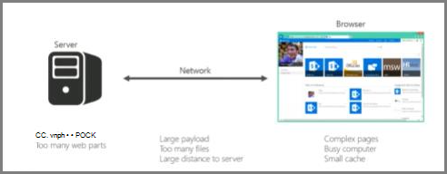

# Introduction à l’optimisation des performances pour SharePoint Online

Cet article explique les aspects spécifiques à prendre en compte lors de la conception de pages pour de meilleures performances dans SharePoint Online.
     
## SharePoint Mesures en ligne

Les mesures générales suivantes pour SharePoint Online fournissent des données réelles sur les performances :
  
- Chargement rapide des pages
    
- Nombre d’allers-retours requis par page
    
- Problèmes avec le service
    
- Autres éléments qui entraînent une dégradation des performances
    
### Conclusions atteintes en raison des données

Les données nous indiquent :
  
- La plupart des pages s’exécutent bien sur SharePoint Online.
    
- Les pages non personnalisées se chargent très rapidement.
    
- OneDrive Entreprise, les sites d’équipe et les pages système, telles que _layouts, etc., sont tous rapidement chargés.
    
- Le plus lent 1 % des pages SharePoint Online prennent plus de 5 000 millisecondes à charger.
    
Un test d’évaluation simple que vous pouvez utiliser serait de mesurer les performances en comparant le temps de chargement de votre propre portail au temps de chargement de la page d’accueil OneDrive Entreprise, car elle utilise peu de fonctionnalités personnalisées. Il s’agit souvent de la première étape que le support vous demande d’effectuer lors de la résolution des problèmes de performances réseau.
  
## Utiliser un compte d’utilisateur standard lors de la vérification des performances

Un administrateur de collection de sites, un propriétaire de site, un éditeur ou un collaborateur appartiennent à des groupes de sécurité supplémentaires, ont des autorisations supplémentaires et, par conséquent, ont des éléments SharePoint charge sur une page.
  
Cela s’applique à SharePoint local et SharePoint Online, mais dans un scénario local, les différences ne seront pas aussi facilement perceptibles que dans SharePoint Online.
  
Pour évaluer correctement le fonctionnement d’une page pour les utilisateurs, vous devez utiliser un compte d’utilisateur standard pour éviter de charger les contrôles de auteur et le trafic supplémentaire lié aux groupes de sécurité.
  
## Catégories de connexion pour l’optimisation des performances

Vous pouvez classer les connexions entre le serveur et l’utilisateur en trois composants principaux. Prenons ces éléments lors de la conception SharePoint pages En ligne pour obtenir des informations sur les temps de chargement.
  
- **Serveur** Serveurs que Microsoft héberge dans les centres de données.
    
- **Réseau** Le réseau Microsoft, Internet et votre réseau local entre le centre de données et vos utilisateurs.
    
- **Navigateur** L’endroit où la page est chargée.
    
Au sein de ces trois connexions, il existe généralement cinq raisons qui provoquent 95 % de pages lentes. Chacune de ces raisons est abordée dans cet article :
  
- Problèmes de navigation
    
- Roll up de contenu
    
- Fichiers de grande taille
    
- De nombreuses demandes au serveur
    
- Traitement de la partie Web
    
### Connexion au serveur

Bon nombre des problèmes qui affectent les performances avec SharePoint en local s’appliquent également à SharePoint Online.
  
Comme vous vous y attendiez, vous avez beaucoup plus de contrôle sur la façon dont les serveurs fonctionnent avec les SharePoint. Avec SharePoint Online, les choses sont légèrement différentes. Plus vous faites de travail sur un serveur, plus le rendu d’une page est long. Avec SharePoint, le principal responsable à cet égard sont les pages complexes avec plusieurs composants Web Parts.
  
SharePoint Serveur local
  

  
SharePoint Online
  

  
Avec SharePoint Online, certaines demandes de page peuvent en réalité finir par appeler plusieurs serveurs. Vous pouvez obtenir une matrice de demandes entre les serveurs pour une demande individuelle. Ces interactions sont coûteuses du point de vue du chargement des pages et ralentissent les choses.
  
Voici quelques exemples de ces interactions serveur à serveur :
  
- Serveurs web SQL serveur
    
- Serveurs web et d’applications
    
L’autre chose qui peut ralentir les interactions avec le serveur est les manques de cache. Contrairement à l’SharePoint local, il est très probable que vous touchez le même serveur pour une page que vous avez visitée précédemment . Cela rend la mise en cache d’objets obsolète.
  
### Connexion réseau 

Avec des SharePoint locaux qui n’utilisent pas de réseau wan, vous pouvez utiliser une connexion haut débit entre le centre de données et les utilisateurs finaux. En règle générale, les choses sont faciles à gérer du point de vue du réseau.
  
Avec SharePoint Online, plusieurs facteurs sont à prendre en compte . par exemple :
  
- Le réseau Microsoft
    
- The Internet
    
- Le isp
    
Quelle que soit la version de SharePoint (et le réseau) que vous utilisez, les éléments qui entraînent généralement la occupé(e) du réseau sont les suivants :
  
- Charge utile importante
    
- Nombreux fichiers
    
- Distance physique importante avec le serveur
    
L’une des fonctionnalités que vous pouvez utiliser dans SharePoint Online est microsoft CDN (réseau de distribution de contenu). Un CDN est essentiellement une collection distribuée de serveurs déployés dans plusieurs centres de données. Avec un CDN, le contenu des pages peut être hébergé sur un serveur proche du client, même si le client est loin du serveur SharePoint d’origine. Microsoft l’utilisera davantage à l’avenir pour stocker des instances locales de pages qui ne peuvent pas être personnalisées, par exemple la page d’accueil de l’administrateur SharePoint Online. Pour plus d’informations sur les CDN, voir [Réseaux de distribution de contenu.](content-delivery-networks.md)
  
Vous devez connaître la vitesse de connexion de votre isp. Un outil de test de vitesse simple vous indiquera la vitesse de connexion.
  
### Connexion du navigateur

Il existe quelques facteurs à prendre en compte pour les navigateurs web du point de vue des performances.
  
La visite de pages complexes aura une incidence sur les performances. La plupart des navigateurs n’ont qu’un petit cache (environ 90 Mo), alors que la page web moyenne est généralement d’environ 1,6 Mo. L’utilisation n’est pas longue.
  
La bande passante peut également être un problème. Par exemple, si un utilisateur regardera des vidéos dans une autre session, cela aura une incidence sur les performances de votre SharePoint page. Bien que vous ne pouvez pas empêcher les utilisateurs de diffuser des contenus multimédias en continu, vous pouvez contrôler la façon dont une page se charge pour les utilisateurs.
  
Consultez les articles suivants pour découvrir différentes techniques de personnalisation de page SharePoint Online et d’autres meilleures pratiques pour obtenir des performances optimales.
  
- [Options de navigation pour SharePoint Online](navigation-options-for-sharepoint-online.md)
    
- [Utiliser l’outil Diagnostic de page pour SharePoint Online](page-diagnostics-for-spo.md)
    
- [Optimisation des images pour SharePoint Online](image-optimization-for-sharepoint-online.md)
    
- [Différer le chargement des images et des éléments JavaScript dans SharePoint Online](delay-loading-images-and-javascript-in-sharepoint-online.md)
    
- [Minimisation et regroupement dans SharePoint Online](minification-and-bundling-in-sharepoint-online.md)
    
- [Utilisation du réseau de distribution de contenu Office 365 avec SharePoint Online](use-microsoft-365-cdn-with-spo.md)
    
- [Utilisation du service Web De recherche de contenu au lieu du partie Web De requête de contenu pour améliorer les performances dans SharePoint Online](using-content-search-web-part-instead-of-content-query-web-part-to-improve-perfo.md)
    
- [Planification de la capacité et test de charge SharePoint Online](capacity-planning-and-load-testing-sharepoint-online.md)
    
- [Diagnostic des problèmes de performances avec SharePoint Online](diagnosing-performance-issues-with-sharepoint-online.md)
    
- [Utilisation du cache d’objets avec SharePoint Online](using-the-object-cache-with-sharepoint-online.md)
    
- [Procédure : éviter les limitations ou les blocages dans SharePoint Online](/sharepoint/dev/general-development/how-to-avoid-getting-throttled-or-blocked-in-sharepoint-online)
