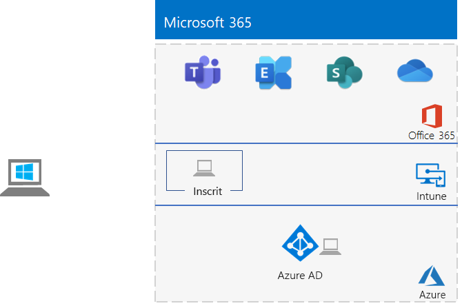

# <a name="the-lightweight-base-configuration"></a>Configuration de base légère

*Ce Guide de Laboratoire Test peut être utilisé pour les environnements de test Microsoft 365 Enterprise et Office 365 Enterprise.*

Cet article vous fournit des instructions étape par étape pour créer un environnement simplifié avec un abonnement Microsoft 365 E5 et un ordinateur exécutant Windows 10 Entreprise. 



Utilisez l’environnement que vous aurez créé pour tester les fonctionnalités et le bon fonctionnement de [Microsoft 365 Entreprise](https://www.microsoft.com/microsoft-365/enterprise).


  
> [!TIP]
> Cliquez [ici](../media/m365-enterprise-test-lab-guides/Microsoft365EnterpriseTLGStack.pdf) pour afficher le plan de tous les articles de l’ensemble de guides de laboratoire de test de Microsoft 365 Entreprise.

## <a name="phase-1-create-your-office-365-e5-subscription"></a>Phase 1 : Création de votre abonnement Office 365 E5

Nous allons commencer avec un abonnement d’évaluation Office 365 E5, puis ajouter l’abonnement Microsoft 365 E5 à celui-ci.

Pour démarrer votre abonnement d’évaluation Office 365 E5, vous avez besoin d’un nom d’entreprise fictif et d’un nouveau compte Microsoft.
  
1. Nous vous recommandons d’utiliser une variante du nom d’entreprise Contoso pour le nom de votre entreprise. Il s’agit d’une entreprise fictive utilisée dans le contenu d’exemple de Microsoft. Toutefois, cette étape n’est pas obligatoire. Indiquer le nom fictif de votre entreprise ici : 
    
2. Pour ouvrir un nouveau compte Microsoft, accédez à [https://outlook.com](https://outlook.com) et créez un compte avec un nouveau compte de messagerie et une nouvelle adresse. Vous utiliserez ce compte pour vous inscrire à Office 365.
    
  - Enregistrez le prénom et le nom de famille utilisés pour votre nouveau compte ici : 
    
  - Enregistrez l’adresse du nouveau compte de messagerie ici : @outlook.com
    
### <a name="sign-up-for-an-office-365-e5-trial-subscription"></a>Inscription à un abonnement d’évaluation Office 365 E5

1. Ouvrez le navigateur Internet sur votre ordinateur, puis accédez à [https://aka.ms/e5trial](https://aka.ms/e5trial).
    
2. Sur la page **Merci d’avoir choisi Office 365 E5**, spécifiez votre nouvelle adresse de compte de messagerie à l’étape 1.
3. À l’étape 2 du processus d’abonnement d’évaluation, tapez les informations demandées, puis procédez à la vérification.
4. À l’étape 3, tapez un nom d’organisation, puis un nom de compte qui sera l’administrateur général de l’abonnement. 
5. À l’étape 4, enregistrer l’URL de la page de connexion ici (sélectionnez-la et copiez-la) :  
6. Enregistrez l’identifiant utilisateur ici : .onmicrosoft.com  
   Enregistrez le mot de passe saisi dans un emplacement sécurisé.
   Cette valeur correspond au **nom de l’administrateur général Office 365**.
8. Sélectionnez **Configurer**.
9. Dans la configuration d’Office 365 E5, cliquez sur **Continuer à utiliser *votre organisation*.onmicrosoft.com pour la messagerie et la connexion**, puis cliquez sur **Quitter et continuer plus tard**.

Le Centre d’administration Microsoft 365 doit s’afficher.
  
Vous avez créé un abonnement d’évaluation Office 365 pour que votre environnement de développement/test ait un client Azure AD distinct de tout abonnement payant actuellement utilisé. Cette séparation signifie que vous pouvez ajouter et supprimer des utilisateurs et groupes dans le client test sans incidence sur vos abonnements de production.
    
## <a name="phase-2-configure-your-office-365-trial-subscription"></a>Phase 2 : configuration de votre abonnement d’évaluation Office 365

Durant cette phase, configurez votre abonnement Office 365 en y ajoutant des utilisateurs supplémentaires et assignez-les aux licences Office 365 E5.
  
Suivez les instructions dans [Se connecter à Office 365 PowerShell](https://docs.microsoft.com/office365/enterprise/powershell/connect-to-office-365-powershell#connect-with-the-azure-active-directory-powershell-for-graph-module) pour vous connecter à votre abonnement Office 365 avec le module Graph Azure Active Directory PowerShell à partir de votre ordinateur.
    
Dans la boîte de dialogue **Demande d’informations d’identification Windows PowerShell**, saisissez le nom de l’administrateur général Office 365 (exemple : jdoe@contosotoycompany.onmicrosoft.com) et le mot de passe.
  
Entrez le nom de votre organisation (exemple : contosotoycompany) et le code de pays à deux caractères pour indiquer votre emplacement, ainsi qu’un mot de passe de compte commun, puis exécutez les commandes suivantes à partir de l’invite PowerShell :

```powershell
$orgName="<organization name>"
$loc="<two-character country code, such as US>"
$commonPW="<common user account password>"
$PasswordProfile=New-Object -TypeName Microsoft.Open.AzureAD.Model.PasswordProfile
$PasswordProfile.Password=$commonPW

$userUPN= "user2@" + $orgName + ".onmicrosoft.com"
New-AzureADUser -DisplayName "User 2" -GivenName User -SurName 2 -UserPrincipalName $userUPN -UsageLocation $loc -AccountEnabled $true -PasswordProfile $PasswordProfile -MailNickName "user2"
$License = New-Object -TypeName Microsoft.Open.AzureAD.Model.AssignedLicense
$License.SkuId = (Get-AzureADSubscribedSku | Where-Object -Property SkuPartNumber -Value "ENTERPRISEPREMIUM" -EQ).SkuID
$LicensesToAssign = New-Object -TypeName Microsoft.Open.AzureAD.Model.AssignedLicenses
$LicensesToAssign.AddLicenses = $License
Set-AzureADUserLicense -ObjectId $userUPN -AssignedLicenses $LicensesToAssign

$userUPN= "user3@" + $orgName + ".onmicrosoft.com"
New-AzureADUser -DisplayName "User 3" -GivenName User -SurName 3 -UserPrincipalName $userUPN -UsageLocation $loc -AccountEnabled $true -PasswordProfile $PasswordProfile -MailNickName "user3"
$License = New-Object -TypeName Microsoft.Open.AzureAD.Model.AssignedLicense
$License.SkuId = (Get-AzureADSubscribedSku | Where-Object -Property SkuPartNumber -Value "ENTERPRISEPREMIUM" -EQ).SkuID
$LicensesToAssign = New-Object -TypeName Microsoft.Open.AzureAD.Model.AssignedLicenses
$LicensesToAssign.AddLicenses = $License
Set-AzureADUserLicense -ObjectId $userUPN -AssignedLicenses $LicensesToAssign

$userUPN= "user4@" + $orgName + ".onmicrosoft.com"
New-AzureADUser -DisplayName "User 4" -GivenName User -SurName 4 -UserPrincipalName $userUPN -UsageLocation $loc -AccountEnabled $true -PasswordProfile $PasswordProfile -MailNickName "user4"
$License = New-Object -TypeName Microsoft.Open.AzureAD.Model.AssignedLicense
$License.SkuId = (Get-AzureADSubscribedSku | Where-Object -Property SkuPartNumber -Value "ENTERPRISEPREMIUM" -EQ).SkuID
$LicensesToAssign = New-Object -TypeName Microsoft.Open.AzureAD.Model.AssignedLicenses
$LicensesToAssign.AddLicenses = $License
Set-AzureADUserLicense -ObjectId $userUPN -AssignedLicenses $LicensesToAssign
```
> [!NOTE]
> L’utilisation ici d’un mot de passe courant est destinée à l’automatisation et à la simplification de la configuration pour un environnement de test. Bien évidemment, cela est hautement déconseillé pour les abonnements de production. 

### <a name="record-key-information-for-future-reference"></a>Enregistrer les informations clés pour future référence

Nous vous recommandons d’imprimer cet article afin de consigner les informations dont vous aurez besoin dans cet environnement au cours des 30 jours de votre abonnement à la version d’évaluation Office 365. Vous pouvez facilement étendre l’abonnement d’évaluation pour une période supplémentaire de 30 jours. Pour un environnement de développement/test permanent, créez un nouvel abonnement payant avec un client Azure AD séparé et un nombre réduit de licences.

Enregistrez les valeurs suivantes :
  
- Le nom de l’administrateur général Office 365 : .onmicrosoft.com(à partir de l’étape 6 de la phase 1)
    
    Enregistrez également le mot de passe de ce compte dans un emplacement sécurisé.
    
- Nom de l’organisation bénéficiant de l’abonnement à la version d’évaluation :  (à partir de l’étape 4 de la phase 1)
    
- Pour répertorier les comptes pour Utilisateur 2, Utilisateur 3, Utilisateur 4 et Utilisateur 5, exécutez la commande suivante à partir de l’invite Module Windows Azure Active Directory pour Windows PowerShell :
    
  ```powershell
  Get-AzureADUser | Sort UserPrincipalName | Select UserPrincipalName
  ```

    Enregistrez les noms de compte ici :
    
  - Nom du compte de l’utilisateur 2 : utilisateur2@.onmicrosoft.com
    
  - Nom du compte de l’utilisateur 3 : utilisateur3@.onmicrosoft.com
    
  - Nom du compte de l’utilisateur 4 : utilisateur4@.onmicrosoft.com
    
  - Nom du compte de l’utilisateur 5 : utilisateur5@.onmicrosoft.com
    
    Enregistrez également les mots de passe communs de ces comptes dans un emplacement sécurisé.
   

### <a name="using-an-office-365-test-environment"></a>Utilisation d’un environnement de test Office 365

Si vous avez simplement besoin d’un environnement de test Office 365, vous pouvez vous arrêter ici. 

Pour plus d’informations sur les guides de labo de test, voir [les guides de laboratoire de test Microsoft 365 Entreprise](m365-enterprise-test-lab-guides.md) pour Office 365 et Microsoft 365.
  
## <a name="phase-3-add-a-microsoft-365-e5-trial-subscription"></a>Phase 3 : Ajoutez un abonnement d’évaluation Microsoft 365 E5.

Dans cette phase, vous vous inscrivez pour l’abonnement d’évaluation Microsoft 365 E5 et l’ajoutez à la même organisation que votre abonnement d’évaluation d’Office 365 E5.
  
Tout d’abord, ajoutez l’abonnement d’évaluation Microsoft 365 E5 et attribuez une licence Microsoft 365 à votre compte d’administrateur général.
  
1. Utilisez une instance privée d’un navigateur Internet pour vous connecter au centre d’administration Microsoft 365 sur [https://admin.microsoft.com](https://admin.microsoft.com)à l’aide de vos informations d’identification de compte d’administrateur général.
    
2. Sur la page **Centre d’administration Microsoft 365**, dans le volet de navigation de gauche, cliquez sur **Facturation > Acheter des services**.
    
3. Sur la page **Acheter des services**, cliquez sur **Microsoft 365 E5**, puis cliquez sur **Obtenir une version d’évaluation gratuite**.

4. Sur la page **version d’évaluation de Microsoft 365 E5**, choisissez de recevoir un SMS ou un appel, entrez votre numéro de téléphone, puis cliquez sur **envoyer un SMS** ou **m’appeler**. Effectuez la vérification.

5. Dans la page **Confirmer votre commande**, cliquez sur **Essayer maintenant**.

6. Dans la page **Réception de la commande**, cliquez sur **Continuer**.

7. Dans l’onglet Centre d’administration Microsoft 365, cliquez sur **Utilisateurs > Utilisateurs actifs**.

8. Dans **Utilisateurs actifs**, cliquez sur votre compte d’administrateur.

9. Cliquez sur **Licences et applications**.

10. Désactivez la licence pour Office 365 Entreprise E5 et activez la licence pour Microsoft 365 E5.

11. Cliquez sur **Enregistrer les modifications** puis fermez le volet informations sur le compte d’utilisateur.

Ensuite, répétez les étapes 8 et 11 de la procédure précédente pour tous vos autres comptes (Utilisateur2, Utilisateur3, Utilisateur4 et Utilisateur5).
  
> [!NOTE]
> L’abonnement d’évaluation de Microsoft 365 E5 est de 30 jours. Pour un environnement de test permanent, convertissez cet abonnement en abonnement payant avec un nombre réduit de licences. 
  
Votre environnement de test comporte maintenant :
  
- Un abonnement d’évaluation de Microsoft 365 E5.
- Tous vos comptes d’utilisateur appropriés (l’administrateur général ou tous les cinq comptes d’utilisateur) sont activés pour utiliser Microsoft 365 E5.
    
Voici la configuration qui en résulte, avec ajout de Microsoft 365 E5, qui inclut Office 365 et Enterprise Security + Management (EMS).
  

  
## <a name="phase-4-create-a-windows-10-enterprise-computer"></a>Phase 4 : Création d’un ordinateur Windows 10 Entreprise

Au cours de cette phase, vous allez créer un ordinateur autonome exécutant Windows 10 Entreprise sous forme d’un ordinateur physique, d’une machine virtuelle ou d’une machine virtuelle Azure.
  
### <a name="physical-computer"></a>Ordinateur physique

Munissez-vous d’un ordinateur personnel et installez Windows 10 Entreprise dessus. Vous pouvez télécharger la version d’évaluation de Windows 10 Entreprise [ici](https://www.microsoft.com/evalcenter/evaluate-windows-10-enterprise).
  
### <a name="virtual-machine"></a>Machine virtuelle

Créez une machine virtuelle à l’aide de l’hyperviseur de votre choix et installez Windows 10 Entreprise dessus. Vous pouvez télécharger la version d’évaluation de Windows 10 Entreprise [ici](https://www.microsoft.com/evalcenter/evaluate-windows-10-enterprise).
  
### <a name="virtual-machine-in-azure"></a>Machine virtuelle dans Azure

Pour créer une machine virtuelle exécutant Windows 10 dans Microsoft Azure, ***vous devez disposer d’un abonnement Visual Studio*** qui vous permet d’accéder à l’image pour Windows 10 Entreprise. D’autres types d’abonnements Azure, tels que les abonnements d’évaluation et payants, ne permettent pas d’accéder à cette image. Pour obtenir les informations les plus récentes, reportez-vous à l’article [Utilisation d’un client Windows dans Azure pour les scénarios de développement et/ou test](https://docs.microsoft.com/azure/virtual-machines/windows/client-images).
  
> [!NOTE]
> Les ensembles de commandes suivants utilisent la dernière version d’Azure PowerShell. Reportez-vous à l’article relatif à la [prise en main des cmdlets Azure PowerShell](https://docs.microsoft.com/powershell/azureps-cmdlets-docs/). Ces ensembles de commandes créent une machine virtuelle Windows 10 Entreprise nommée WIN10 ainsi que l’intégralité de son infrastructure requise, y compris un groupe de ressources, un compte de stockage et un réseau virtuel. Si vous connaissez déjà les services d’infrastructure Azure, adaptez ces instructions à votre infrastructure actuellement déployée. 
  
Tout d’abord, lancez une invite Microsoft PowerShell.
  
Connectez-vous à votre compte Azure avec la commande suivante.
  
```powershell
Connect-AzAccount
```

Obtenez le nom de votre abonnement à l’aide de la commande suivante.
  
```powershell
Get-AzSubscription | Sort Name | Select Name
```

Définissez votre abonnement Azure. Remplacez tout le texte entre guillemets, y compris les caractères \< et >, avec le nom correct.
  
```powershell
$subscr="<subscription name>"
Get-AzSubscription -SubscriptionName $subscr | Select-AzSubscription
```

Ensuite, créez un nouveau groupe de ressources. Pour déterminer un nom de groupe de ressources unique, utilisez cette commande pour répertorier vos groupes de ressources existants.
  
```powershell
Get-AzResourceGroup | Sort ResourceGroupName | Select ResourceGroupName
```

Créez votre groupe de ressources avec ces commandes. Remplacez tout le texte entre guillemets, y compris les caractères \< et >, par les noms corrects.
  
```powershell
$rgName="<resource group name>"
$locName="<location name, such as West US>"
New-AzResourceGroup -Name $rgName -Location $locName
```

Ensuite, créez une ressource virtuelle et la machine virtuelle WIN10 avec ces commandes. Lorsque vous y êtes invité, indiquez le nom et le mot de passe du compte d’administrateur local pour WIN10, et enregistrez ces informations dans un emplacement sécurisé.
  
```powershell
$corpnetSubnet=New-AzVirtualNetworkSubnetConfig -Name Corpnet -AddressPrefix 10.0.0.0/24
New-AzVirtualNetwork -Name "M365Ent-TestLab" -ResourceGroupName $rgName -Location $locName -AddressPrefix 10.0.0.0/8 -Subnet $corpnetSubnet
$rule1=New-AzNetworkSecurityRuleConfig -Name "RDPTraffic" -Description "Allow RDP to all VMs on the subnet" -Access Allow -Protocol Tcp -Direction Inbound -Priority 100 -SourceAddressPrefix Internet -SourcePortRange * -DestinationAddressPrefix * -DestinationPortRange 3389
New-AzNetworkSecurityGroup -Name Corpnet -ResourceGroupName $rgName -Location $locName -SecurityRules $rule1
$vnet=Get-AzVirtualNetwork -ResourceGroupName $rgName -Name "M365Ent-TestLab"
$nsg=Get-AzNetworkSecurityGroup -Name Corpnet -ResourceGroupName $rgName
Set-AzVirtualNetworkSubnetConfig -VirtualNetwork $vnet -Name Corpnet -AddressPrefix "10.0.0.0/24" -NetworkSecurityGroup $nsg
$vnet | Set-AzVirtualNetwork
$pip=New-AzPublicIpAddress -Name WIN10-PIP -ResourceGroupName $rgName -Location $locName -AllocationMethod Dynamic
$nic=New-AzNetworkInterface -Name WIN10-NIC -ResourceGroupName $rgName -Location $locName -SubnetId $vnet.Subnets[0].Id -PublicIpAddressId $pip.Id
$vm=New-AzVMConfig -VMName WIN10 -VMSize Standard_A2_V2
$cred=Get-Credential -Message "Type the name and password of the local administrator account for WIN10."
$vm=Set-AzVMOperatingSystem -VM $vm -Windows -ComputerName WIN10 -Credential $cred -ProvisionVMAgent -EnableAutoUpdate
$vm=Set-AzVMSourceImage -VM $vm -PublisherName MicrosoftWindowsDesktop -Offer Windows-10 -Skus RS3-Pro -Version "latest"
$vm=Add-AzVMNetworkInterface -VM $vm -Id $nic.Id
$vm=Set-AzVMOSDisk -VM $vm -Name WIN10-TestLab-OSDisk -DiskSizeInGB 128 -CreateOption FromImage
New-AzVM -ResourceGroupName $rgName -Location $locName -VM $vm
```

## <a name="phase-5-join-your-windows-10-computer-to-azure-ad"></a>Phase 5 : Association de votre ordinateur Windows 10 à Azure AD

Lorsque l’ordinateur physique ou la machine virtuelle avec Windows 10 Entreprise est créée, connectez-vous avec un compte d’administrateur local.
  
> [!NOTE]
> Suivez [ces instructions](https://docs.microsoft.com/azure/virtual-machines/windows/connect-logon) pour vous connecter à une machine virtuelle dans Azure.
  
Ensuite, associez l’ordinateur WIN10 au client Azure AD de votre abonnement Microsoft 365 E5.
  
1. Sur le bureau de l’ordinateur WIN10, cliquez sur **Démarrer > Paramètres > Comptes > Accès Professionnel ou Scolaire > Se connecter**.
    
2. Dans la boîte de dialogue **Configurer un compte professionnel ou scolaire**, cliquez sur **Joindre cet appareil à Azure Active Directory**.
    
3. Dans **Compte professionnel ou scolaire**, saisissez le nom de compte Administrateur général de votre abonnement Microsoft 365 E5, puis cliquez sur **Suivant**.
    
4. Dans **Saisie du mot de passe**, saisissez le mot de passe de votre compte Administrateur général, puis cliquez sur **Se connecter**.
    
5. Lorsque vous devez confirmer qu’il s’agit bien de votre organisation, cliquez sur **Joindre**, puis sur **Terminé**.
    
6. Fermez la fenêtre Paramètres.
    
Ensuite, installez Office 365 ProPlus sur l’ordinateur WIN10.
  
1. Ouvrez le navigateur Microsoft Edge et connectez-vous au portail Office à l’aide de vos informations d’identification de compte d’administrateur général. Pour obtenir de l’aide, consultez [Où se connecter à Office 365](https://support.office.com/Article/Where-to-sign-in-to-Office-365-e9eb7d51-5430-4929-91ab-6157c5a050b4).
    
2. Dans l’onglet **Accueil Microsoft Office**, cliquez sur **Installer Office**.
    
3. Lorsque vous êtes invité à décider de l’action à effectuer, cliquez sur **Exécuter**, puis sur **Oui** pour **Contrôle de compte d’utilisateur**.
    
4. Attendez qu’Office termine l’installation. Lorsque le message **Vous voilà prêt !** s’affiche, cliquez deux fois sur **Fermer**.
    
Voici votre environnement final.


Cela inclut l’ordinateur WIN10 avec :

- rejoint le client Azure AD de votre abonnement Microsoft 365 E5 ;
- été inscrit en tant que périphérique Azure AD dans Microsoft Intune (EMS) ;
- installé Office 365 ProPlus.
  
Vous êtes désormais prêt à profiter des fonctionnalités supplémentaires de [Microsoft 365 Entreprise](https://www.microsoft.com/microsoft-365/enterprise).
  
## <a name="next-steps"></a>Étapes suivantes

Découvrez les nouveaux ensembles de guides pour les tests de laboratoire :
  
- [Identité](m365-enterprise-test-lab-guides.md#identity)
- [Gestion des appareils mobiles](m365-enterprise-test-lab-guides.md#mobile-device-management)
- [Protection des informations](m365-enterprise-test-lab-guides.md#information-protection)
   

## <a name="see-also"></a>Voir aussi

[Guides de laboratoire de test Microsoft 365 Entreprise](m365-enterprise-test-lab-guides.md)

[Déployer Microsoft 365 Entreprise](deploy-microsoft-365-enterprise.md)

[Documentation Microsoft 365 Entreprise](https://docs.microsoft.com/microsoft-365-enterprise/)
