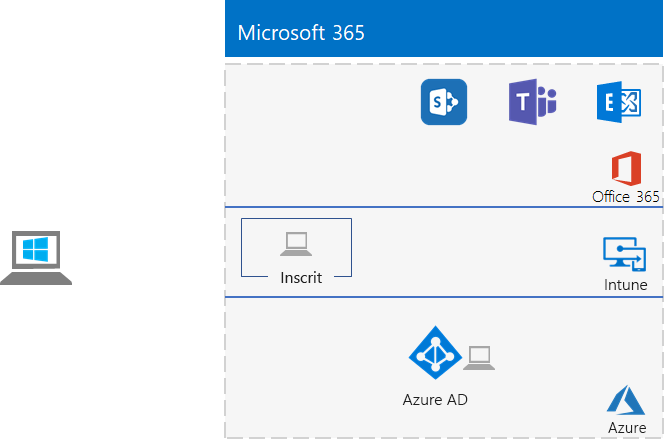
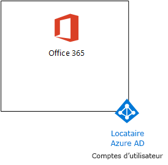
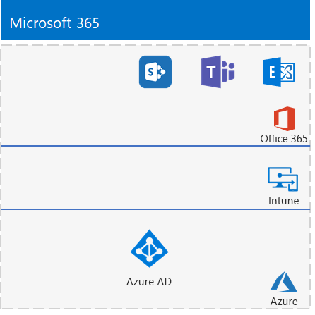

# <a name="the-lightweight-base-configuration"></a>Configuration de base légère

Cet article vous fournit des instructions étape par étape pour créer un environnement simplifié qui comprend Office 365 E5, Enterprise Mobility + Security (EMS) E5 et un ordinateur exécutant Windows 10 Entreprise. 



Utilisez l’environnement que vous aurez créé pour tester les fonctionnalités et le bon fonctionnement de [Microsoft 365 Entreprise](https://www.microsoft.com/microsoft-365/enterprise).


  
> [!TIP]
> Cliquez [ici](https://aka.ms/m365etlgstack) pour afficher le plan de tous les articles de l’ensemble de guides de laboratoire de test de Microsoft 365 Entreprise.

## <a name="phase-1-create-your-office-365-e5-subscription"></a>Phase 1 : Création de votre abonnement Office 365 E5

Suivez les étapes des phases 2 et 3 de l’article sur l’[environnement de développement/test Office 365](https://docs.microsoft.com/office365/enterprise/office-365-dev-test-environment) pour créer un environnement de développement/test Office 365 léger, comme illustré à la Figure 1.
  
**Figure 1 : Votre abonnement Office 365 E5 avec son client et ses comptes d’utilisateur Azure Active Directory (AD)**



> [!NOTE]
> L’abonnement à la version d’évaluation d’Office 365 E5 est valide pendant 30 jours. Vous pouvez facilement l’étendre jusqu’à 60 jours. Pour un environnement de test permanent, créez un abonnement payant avec un nombre réduit de licences. 
  
## <a name="phase-2-add-ems"></a>Phase 2 : Ajout d’EMS

Dans cette phase, vous vous inscrivez pour l’abonnement à la version d’évaluation d’EMS E5 et l’ajoutez à la même organisation que votre abonnement à la version d’évaluation d’Office 365 E5.
  
Tout d’abord, ajoutez l’abonnement d’évaluation EMS E5 et attribuez une licence EMS à votre compte Administrateur général.
  
1. Utilisez une instance privée d’un navigateur Internet pour vous connecter au portail Office à l’aide de vos informations d’identification de compte d’administrateur général. Pour obtenir de l’aide, consultez [Où se connecter à Office 365](https://support.office.com/Article/Where-to-sign-in-to-Office-365-e9eb7d51-5430-4929-91ab-6157c5a050b4).
    
2. Cliquez sur la vignette **Administration**.
    
3. Sous l’onglet **Centre d’administration Microsoft 365** de votre navigateur, dans le volet de navigation gauche, cliquez sur **Facturation > Acheter des services**.
    
4. Dans la page **Acheter des services**, recherchez l’élément **Enterprise Mobility + Security E5**. Pointez votre souris dessus et cliquez sur **Démarrer l’essai gratuit**.
    
5. Dans la page **Confirmer votre commande**, cliquez sur **Essayer maintenant**.
    
6. Dans la page **Réception de la commande**, cliquez sur **Continuer**.
    
7. Sous l’onglet **Centre d’administration Office 365** de votre navigateur, dans le volet de navigation gauche, cliquez sur **Utilisateurs > Utilisateurs actifs**.
    
8. Cliquez sur votre compte Administrateur général, puis cliquez sur **Modifier** pour les **licences de produit**.
    
9. Dans le volet **Licences de produit**, activez la licence de produit pour **Enterprise Mobility + Security E5** en sélectionnant **Activer**, cliquez sur **Enregistrer**, cliquez deux fois sur **Fermer**.
    
> [!NOTE]
> L’abonnement à la version d’évaluation d’Enterprise Mobility + Security E5 est de 90 jours. Pour un environnement de test permanent, créez un nouvel abonnement payant avec un nombre réduit de licences. 
  
 ***Si vous avez terminé la Phase 3 de l’*** [environnement de développement/test Office 365](https://docs.microsoft.com/office365/enterprise/office-365-dev-test-environment), répétez les étapes 8 et 9 de la procédure précédente pour tous vos autres comptes (Utilisateur 2, Utilisateur 3, Utilisateur 4 et Utilisateur 5).
  
Votre environnement de test comporte maintenant :
  
- Des abonnements d’évaluation Office 365 E5 Entreprise et EMS E5 qui partagent le même client Azure AD avec votre liste des comptes d’utilisateur.
- Tous vos comptes d’utilisateur appropriés (l’administrateur général ou tous les cinq comptes d’utilisateur) sont activés pour utiliser Office 365 E5 et EMS E5.
    
La figure 2 montre la configuration obtenue, qui ajoute EMS.
  
**Figure 2 : Ajout de l’abonnement à la version d’évaluation d’EMS**


  
## <a name="phase-3-create-a-windows-10-enterprise-computer"></a>Phase 3 : Création d’un ordinateur Windows 10 Entreprise

Au cours de cette phase, vous allez créer un ordinateur autonome exécutant Windows 10 Entreprise sous forme d’un ordinateur physique, d’une machine virtuelle ou d’une machine virtuelle Azure.
  
### <a name="physical-computer"></a>Ordinateur physique

Munissez-vous d’un ordinateur personnel et installez Windows 10 Entreprise dessus. Vous pouvez télécharger la version d’évaluation de Windows 10 Entreprise [ici](https://www.microsoft.com/evalcenter/evaluate-windows-10-enterprise).
  
### <a name="virtual-machine"></a>Machine virtuelle

Créez une machine virtuelle à l’aide de l’hyperviseur de votre choix et installez Windows 10 Entreprise dessus. Vous pouvez télécharger la version d’évaluation de Windows 10 Entreprise [ici](https://www.microsoft.com/evalcenter/evaluate-windows-10-enterprise).
  
### <a name="virtual-machine-in-azure"></a>Machine virtuelle dans Azure

Pour créer une machine virtuelle exécutant Windows 10 dans Microsoft Azure, ***vous devez disposer d’un abonnement Visual Studio*** qui vous permet d’accéder à l’image pour Windows 10 Entreprise. D’autres types d’abonnements Azure, tels que les abonnements d’évaluation et payants, ne permettent pas d’accéder à cette image. Pour obtenir les informations les plus récentes, reportez-vous à l’article [Utilisation d’un client Windows dans Azure pour les scénarios de développement et/ou test](https://docs.microsoft.com/azure/virtual-machines/windows/client-images).
  
> [!NOTE]
> Les ensembles de commandes suivants utilisent la dernière version d’Azure PowerShell. Reportez-vous à l’article relatif à la [prise en main des cmdlets Azure PowerShell](https://docs.microsoft.com/powershell/azureps-cmdlets-docs/). Ces ensembles de commandes créent une machine virtuelle Windows 10 Entreprise nommée WIN10 ainsi que l’intégralité de son infrastructure requise, y compris un groupe de ressources, un compte de stockage et un réseau virtuel. Si vous connaissez déjà les services d’infrastructure Azure, adaptez ces instructions à votre infrastructure actuellement déployée. 
  
Tout d’abord, lancez une invite Microsoft PowerShell.
  
Connectez-vous à votre compte Azure avec la commande suivante.
  
```
Connect-AzAccount
```

Obtenez le nom de votre abonnement à l’aide de la commande suivante.
  
```
Get-AzSubscription | Sort Name | Select Name
```

Définissez votre abonnement Azure. Remplacez tout le texte entre guillemets, y compris les caractères \< et >, avec le nom correct.
  
```
$subscr="<subscription name>"
Get-AzSubscription -SubscriptionName $subscr | Select-AzSubscription
```

Ensuite, créez un nouveau groupe de ressources. Pour déterminer un nom de groupe de ressources unique, utilisez cette commande pour répertorier vos groupes de ressources existants.
  
```
Get-AzResourceGroup | Sort ResourceGroupName | Select ResourceGroupName
```

Créez votre groupe de ressources avec ces commandes. Remplacez tout le texte entre guillemets, y compris les caractères \< et >, par les noms corrects.
  
```
$rgName="<resource group name>"
$locName="<location name, such as West US>"
New-AzResourceGroup -Name $rgName -Location $locName
```

Ensuite, créez une ressource virtuelle et la machine virtuelle WIN10 avec ces commandes. Lorsque vous y êtes invité, indiquez le nom et le mot de passe du compte d’administrateur local pour WIN10, et enregistrez ces informations dans un emplacement sécurisé.
  
```
$corpnetSubnet=New-AzVirtualNetworkSubnetConfig -Name Corpnet -AddressPrefix 10.0.0.0/24
New-AzVirtualNetwork -Name "M365Ent-TestLab" -ResourceGroupName $rgName -Location $locName -AddressPrefix 10.0.0.0/8 -Subnet $corpnetSubnet
$rule1=New-AzNetworkSecurityRuleConfig -Name "RDPTraffic" -Description "Allow RDP to all VMs on the subnet" -Access Allow -Protocol Tcp -Direction Inbound -Priority 100 -SourceAddressPrefix Internet -SourcePortRange * -DestinationAddressPrefix * -DestinationPortRange 3389
New-AzNetworkSecurityGroup -Name Corpnet -ResourceGroupName $rgName -Location $locName -SecurityRules $rule1
$vnet=Get-AzVirtualNetwork -ResourceGroupName $rgName -Name "M365Ent-TestLab"
$nsg=Get-AzNetworkSecurityGroup -Name Corpnet -ResourceGroupName $rgName
Set-AzVirtualNetworkSubnetConfig -VirtualNetwork $vnet -Name Corpnet -AddressPrefix "10.0.0.0/24" -NetworkSecurityGroup $nsg
$pip=New-AzPublicIpAddress -Name WIN10-PIP -ResourceGroupName $rgName -Location $locName -AllocationMethod Dynamic
$nic=New-AzNetworkInterface -Name WIN10-NIC -ResourceGroupName $rgName -Location $locName -SubnetId $vnet.Subnets[0].Id -PublicIpAddressId $pip.Id
$vm=New-AzVMConfig -VMName WIN10 -VMSize Standard_D1_V2
$cred=Get-Credential -Message "Type the name and password of the local administrator account for WIN10."
$vm=Set-AzVMOperatingSystem -VM $vm -Windows -ComputerName WIN10 -Credential $cred -ProvisionVMAgent -EnableAutoUpdate
$vm=Set-AzVMSourceImage -VM $vm -PublisherName MicrosoftWindowsDesktop -Offer Windows-10 -Skus RS3-Pro -Version "latest"
$vm=Add-AzVMNetworkInterface -VM $vm -Id $nic.Id
$vm=Set-AzVMOSDisk -VM $vm -Name WIN10-TestLab-OSDisk -DiskSizeInGB 128 -CreateOption FromImage
New-AzVM -ResourceGroupName $rgName -Location $locName -VM $vm
```

## <a name="phase-4-join-your-windows-10-computer-to-azure-ad"></a>Phase 4 : Association de votre ordinateur Windows 10 à Azure AD

Lorsque l’ordinateur physique ou la machine virtuelle avec Windows 10 Entreprise est créée, connectez-vous avec un compte d’administrateur local.
  
> [!NOTE]
> Suivez [ces instructions](https://docs.microsoft.com/azure/virtual-machines/windows/connect-logon) pour vous connecter à une machine virtuelle dans Azure.
  
Ensuite, associez l’ordinateur WIN10 au client Azure AD de vos abonnements Office 365 et EMS.
  
1. Sur le bureau de l’ordinateur WIN10, cliquez sur **Démarrer > Paramètres > Comptes > Accès Professionnel ou Scolaire > Se connecter**.
    
2. Dans la boîte de dialogue **Configurer un compte professionnel ou scolaire**, cliquez sur **Joindre cet appareil à Azure Active Directory**.
    
3. Dans **Compte professionnel ou scolaire**, saisissez le nom de compte Administrateur général de votre abonnement Office 365, puis cliquez sur **Suivant**.
    
4. Dans **Saisie du mot de passe**, saisissez le mot de passe de votre compte Administrateur général, puis cliquez sur **Se connecter**.
    
5. Lorsque vous devez confirmer qu’il s’agit bien de votre organisation, cliquez sur **Joindre**, puis sur **Terminé**.
    
6. Fermez la fenêtre Paramètres.
    
Ensuite, installez Office 365 ProPlus sur l’ordinateur WIN10.
  
1. Ouvrez le navigateur Microsoft Edge et connectez-vous au portail Office à l’aide de vos informations d’identification de compte d’administrateur général. Pour obtenir de l’aide, consultez [Où se connecter à Office 365](https://support.office.com/Article/Where-to-sign-in-to-Office-365-e9eb7d51-5430-4929-91ab-6157c5a050b4).
    
2. Dans l’onglet **Accueil Microsoft Office**, cliquez sur **Installer Office 2016**.
    
3. Lorsque vous êtes invité à décider de l’action à effectuer, cliquez sur **Exécuter**, puis sur **Oui** pour **Contrôle de compte d’utilisateur**.
    
4. Attendez qu’Office termine l’installation. Lorsque le message **Vous voilà prêt !** s’affiche, cliquez deux fois sur **Fermer**.
    
La figure 3 indique l’environnement obtenu, incluant l’ordinateur WIN10 qui a :

- rejoint le client Azure AD de vos abonnements Office 365 et EMS ;
- été inscrit en tant que périphérique Azure AD dans Intune (EMS) ;
- installé Office 365 ProPlus.
  
**Figure 3 : Configuration finale de l’environnement de test Microsoft 365**


  
Vous êtes désormais prêt à profiter des fonctionnalités supplémentaires de [Microsoft 365 Entreprise](https://www.microsoft.com/microsoft-365/enterprise).
  
## <a name="next-steps"></a>Étapes suivantes

Découvrez les nouveaux ensembles de guides pour les tests de laboratoire :
  
- [Identité](m365-enterprise-test-lab-guides.md#identity)
- [Gestion des appareils mobiles](m365-enterprise-test-lab-guides.md#mobile-device-management)
- [Protection des informations](m365-enterprise-test-lab-guides.md#information-protection)
   

## <a name="see-also"></a>Voir aussi

[Guides de laboratoire de test Microsoft 365 Entreprise](m365-enterprise-test-lab-guides.md)

[Déployer Microsoft 365 Entreprise](deploy-microsoft-365-enterprise.md)

[Documentation Microsoft 365 Entreprise](https://docs.microsoft.com/microsoft-365-enterprise/)
