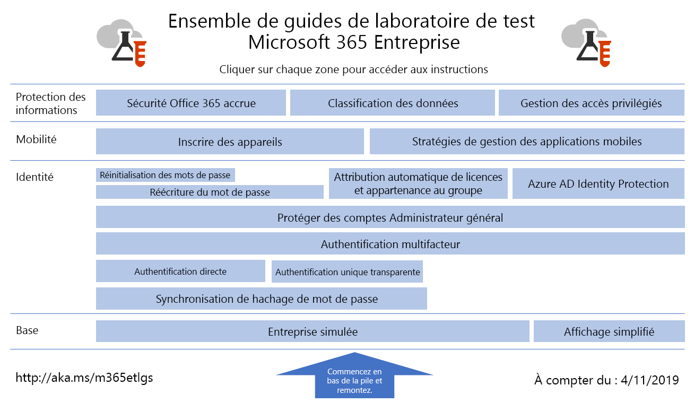

# Guides de laboratoire de test Microsoft 365 pour entreprise

*Sont valables pour Microsoft 365 pour entreprise et Office 365 Entreprise*.

Les guides de laboratoire de test vous permettent de vous familiariser rapidement avec les produits Microsoft. Ils fournissent des instructions normatives sur la configuration d’environnements de test simplifiés mais représentatifs. Vous pouvez utiliser ces environnements pour la démonstration, la personnalisation ou la création de preuves de concept complexes pour la durée d’un abonnement d’évaluation ou payant.

Les TLL sont conçus pour être modulaires. Ils s’appuient les uns sur les autres pour créer plusieurs configurations qui correspondent plus étroitement à vos besoins de configuration d’apprentissage ou de test. L’expérience pratique « Je l’ai créée moi-même et elle fonctionne » vous aide à comprendre les exigences de déploiement d’un nouveau produit ou scénario, afin de mieux planifier son hébergement en production.

Vous pouvez également utiliser des TLL pour créer des environnements représentatifs afin de développer et de tester des applications, également appelées environnements de développement/test.
  

Pour obtenir une carte visuelle de tous les articles de la Microsoft 365 pour la pile des guides de laboratoire de test d’entreprise, développez le graphique suivant ou accédez à Microsoft 365 pour la pile des guides de laboratoire de test [d’entreprise](../downloads/Microsoft365EnterpriseTLGStack.pdf).

## Configuration de base

Tout d’abord, créez un environnement de test pour [Microsoft 365 pour l’entreprise](/microsoft-365-enterprise/). Vous pouvez créer deux types de configurations de base différents :

- [Configuration de base légère](lightweight-base-configuration-microsoft-365-enterprise.md) : utilisez-la lorsque vous souhaitez configurer et démontrer Microsoft 365 pour les fonctionnalités et fonctionnalités d’entreprise dans un environnement cloud uniquement, qui n’inclut aucun composant local.

- [Configuration de base d’entreprise simulée](simulated-ent-base-configuration-microsoft-365-enterprise.md) : utilisez-la lorsque vous souhaitez configurer et démontrer Microsoft 365 pour les fonctionnalités et fonctionnalités d’entreprise dans un environnement cloud hybride, qui utilise des composants locaux tels qu’un domaine services de domaine Active Directory (AD DS).

Vous pouvez également créer des environnements de test pour Office 365 E5 sans ajouter la licence Microsoft 365 E5 à votre version d’évaluation ou à votre environnement de test de production.
    
## Identité

Pour obtenir une description des fonctionnalités liées à l’identité, reportez-vous aux ressources suivantes :

- [Synchronisation de hachage de mot de passe](password-hash-sync-m365-ent-test-environment.md)
  
   Activez et testez la synchronisation de répertoires basée sur le hachage de mots de passe à partir d’un contrôleur de domaine AD DS.

- [Authentification directe](pass-through-auth-m365-ent-test-environment.md)
  
   Activez et testez l’authentification directe à un contrôleur de domaine Windows Server AD DS.

- [Authentification fédérée](federated-identity-for-your-microsoft-365-dev-test-environment.md)
  
   Activez et testez l’authentification fédérée à un contrôleur de domaine Windows Server AD DS.

- [Authentification unique transparente Azure AD](single-sign-on-m365-ent-test-environment.md)
  
   Activez et testez Azure AD’authentification unique transparente (SSO transparente) avec un contrôleur de domaine AD DS.

- [Authentification multifacteur](multi-factor-authentication-microsoft-365-test-environment.md)
  
   Activez et testez l’authentification multifacteur sur smartphone pour un compte utilisateur spécifique.

- [Protéger des comptes Administrateur général](protect-global-administrator-accounts-microsoft-365-test-environment.md)

   Verrouillez vos comptes d’administrateur général avec des stratégies d’accès conditionnel.

- [Écriture différée de mot de passe](password-writeback-m365-ent-test-environment.md)

   Utilisez l’écriture différée de mot de passe pour modifier le mot de passe de votre compte d’utilisateur Windows Server AD DS à partir d’Azure AD.

- [Réinitialisation des mots de passe](password-reset-m365-ent-test-environment.md)

   Utilisez la réinitialisation de mot de passe en libre-service pour réinitialiser votre mot de passe.

- [Attribution automatique de licences et appartenance au groupe](automate-licenses-group-membership-microsoft-365-test-environment.md)

   Facilitez l’administration des nouveaux comptes grâce à l’attribution automatique de licences et l’appartenance au groupe dynamique.

- [Azure AD Identity Protection](azure-ad-identity-protection-microsoft-365-test-environment.md)

   Recherchez des vulnérabilités dans vos comptes utilisateur actuel.

- [Accès aux identités et appareils](identity-device-access-m365-test-environment.md)

   Créez un environnement pour tester les configurations recommandées pour l’accès aux identités aux appareils et les stratégies d’accès conditionnel.

## Gestion des appareils mobiles

Pour obtenir une description des fonctionnalités liées à la gestion des appareils mobiles, reportez-vous aux ressources suivantes :

- [Stratégies de conformité d’appareil](mam-policies-for-your-microsoft-365-enterprise-dev-test-environment.md)
    
   Créez un groupe d’utilisateurs et une stratégie de conformité d’appareil pour les appareils Windows 10.
    
- [Inscription d’appareils iOS et Android](enroll-ios-and-android-devices-in-your-microsoft-enterprise-365-dev-test-environ.md)
   
   Inscrivez des appareils iOS ou Android et gérez-les à distance.

## Protection des informations

Pour faire la démonstration de fonctionnalités liées à la protection des informations, reportez-vous à :

- [Sécurité Microsoft 365 renforcée](increased-o365-security-microsoft-365-enterprise-dev-test-environment.md)
    
   Configurez les paramètres pour une sécurité Microsoft 365 renforcée et examinez les outils de sécurité intégrée.
  
- [Classification des données](data-classification-microsoft-365-enterprise-dev-test-environment.md)
    
   Configurez et appliquez des étiquettes à un document dans un site d’équipe SharePoint Online.
    
- [Gestion des accès privilégiés](privileged-access-microsoft-365-enterprise-dev-test-environment.md)
    
   Configurez la gestion des accès privilégiés pour un accès juste-à-temps aux tâches élevées et privilégiées dans votre organisation.