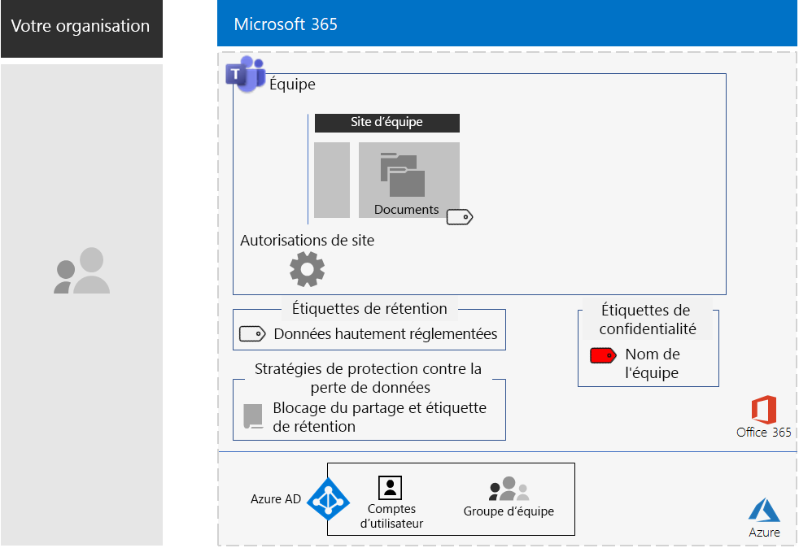
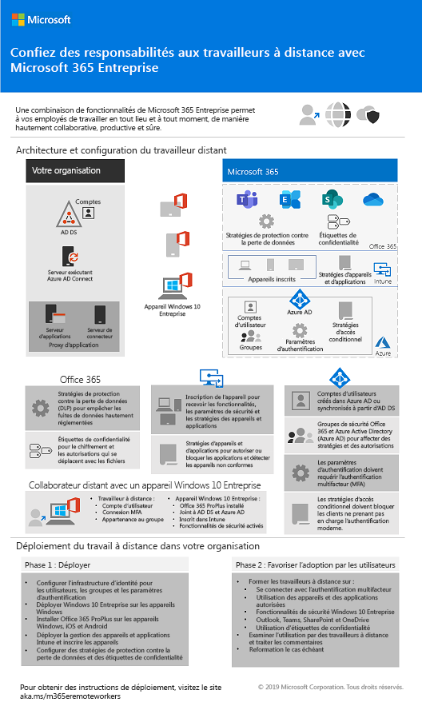
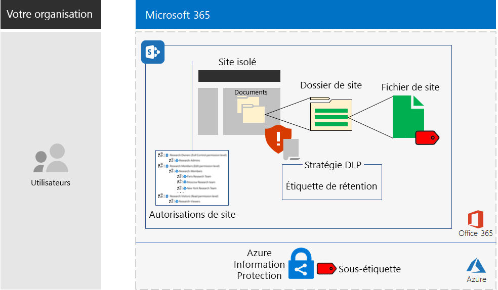
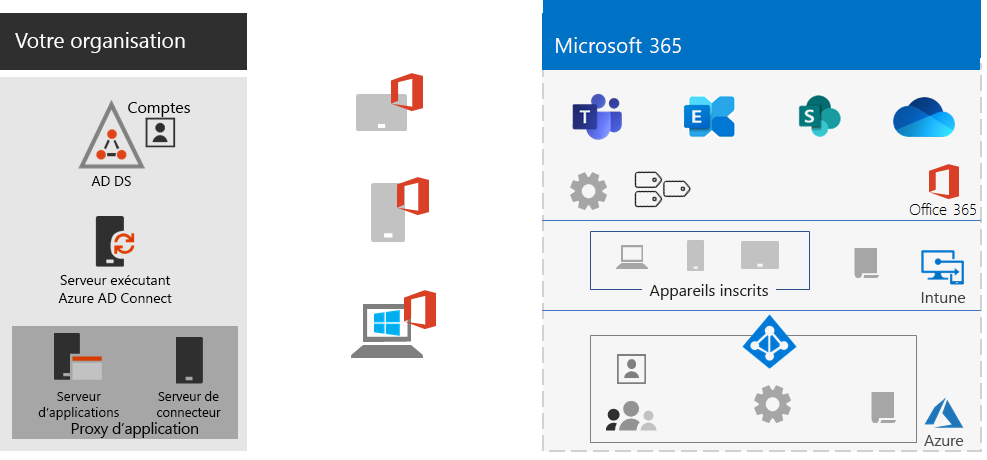
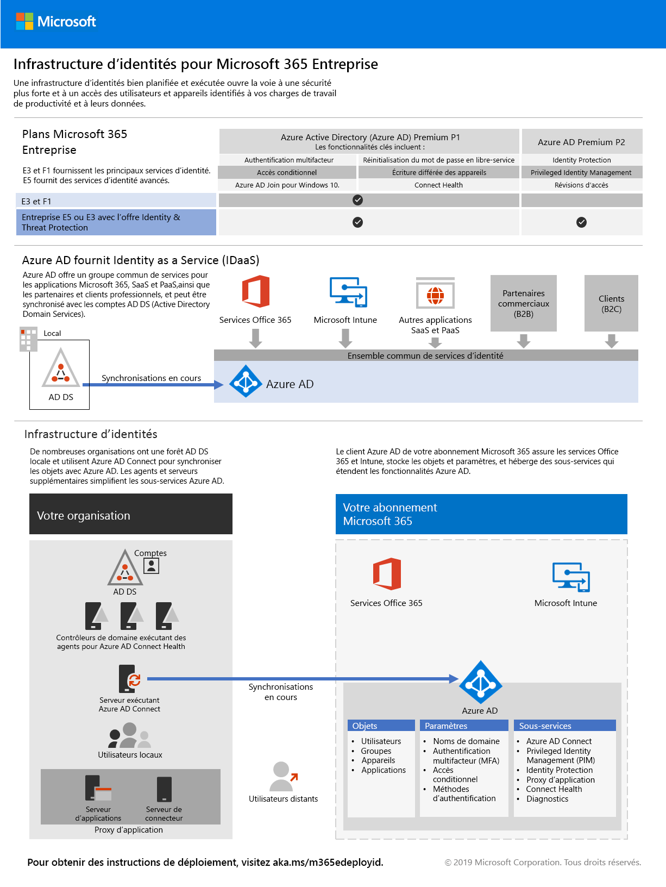
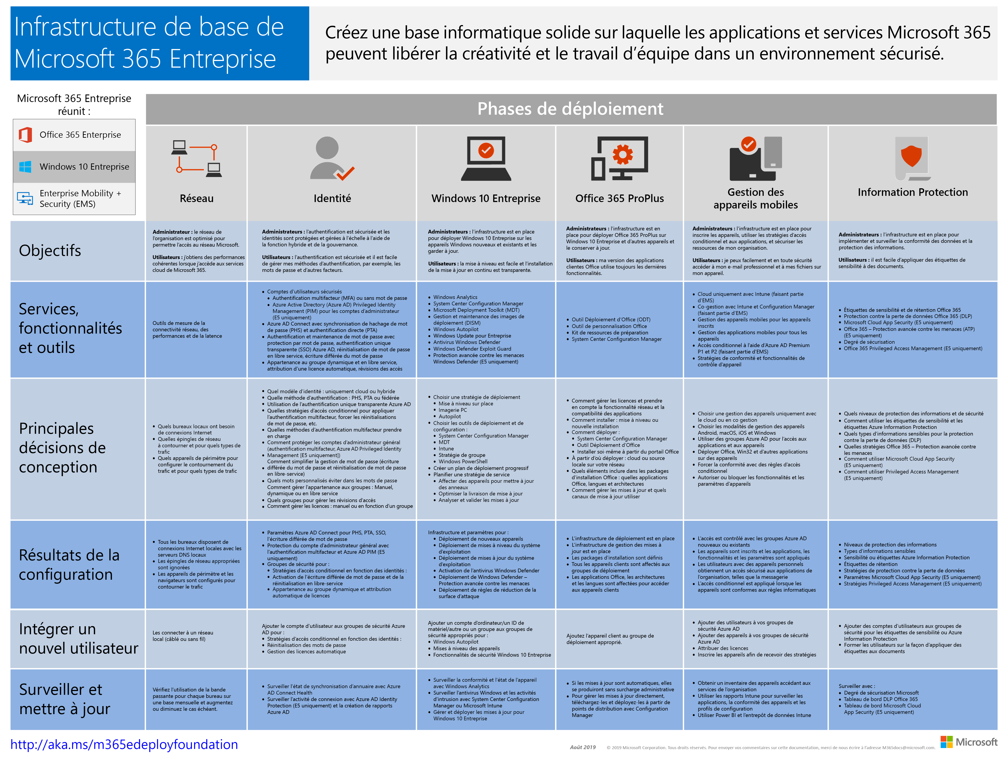
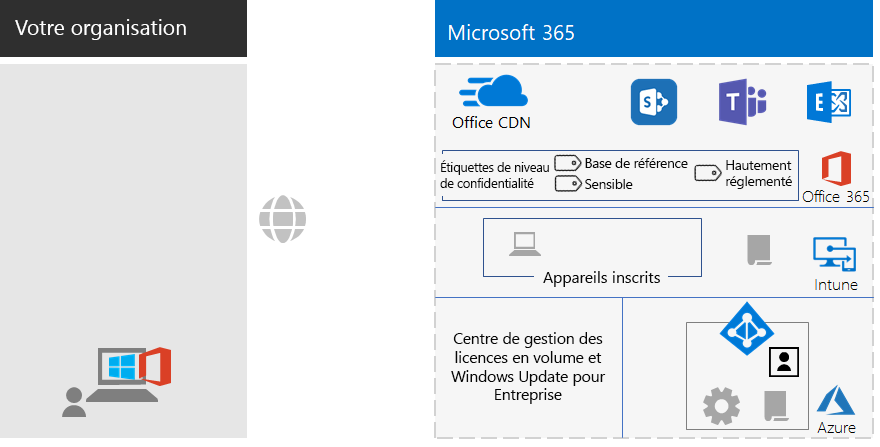

# Modifications du contenu du déploiement de Microsoft 365 Entreprise

## Octobre 2019

### Nouveau contenu 

- [Scénario Teams pour les données hautement réglementées](secure-teams-highly-regulated-data-scenario.md)

  

- [Affiche Confiez des responsabilités aux travailleurs à distance](empower-people-to-work-remotely.md#poster)

   
 

### Mises à jour et améliorations

- Actualisation de l’[étude de cas Contoso](contoso-case-study.md)
- Actualisation des charges de travail [Microsoft Teams](teams-workload.md), [Exchange Online](exchangeonline-workload.md) et [SharePoint Online](sharepoint-online-onedrive-workload.md)
- Actualisation du scénario des [sites SharePoint pour les données hautement réglementées](teams-sharepoint-online-sites-highly-regulated-data.md)
 
  

- [Affiche Microsoft 365 Entreprise](microsoft-365-overview.md#get-the-big-picture) pour les nouveaux scénarios 

  

## Septembre 2019

### Nouveau contenu 

- [Scénario des travailleurs distants](empower-people-to-work-remotely.md)

   
 
- [Étape de chiffrement des e-mails](infoprotect-email-encryption.md) pour [Phase 6 : Protection des informations](infoprotect-infrastructure.md)

### Mises à jour et améliorations

- Réorganisation et actualisation de [Phase 2 : Identité](identity-infrastructure.md)
- Actualisation de [Phase 1 : Mise en réseau](networking-infrastructure.md) et [Phase 6 : Protection des informations](infoprotect-infrastructure.md)

## Août 2019

### Nouveau contenu 

- [Affiche Transition de votre organisation vers Microsoft 365 Entreprise](migration-microsoft-365-enterprise-workload.md#transition-your-entire-organization)

   
 
- [Affiche Infrastructure d’identités pour Microsoft 365 Entreprise](identity-infrastructure.md)

  

  Annonces : [Blog de la communauté technique Microsoft 365](https://techcommunity.microsoft.com/t5/Microsoft-365-Blog/Get-the-new-Identity-infrastructure-for-Microsoft-365-Enterprise/ba-p/874941)  |  [LinkedIn](https://www.linkedin.com/pulse/how-can-i-quickly-ramp-up-key-concepts-features-identity-joe-davies/?published=t)

- [Affiche de la fin de la prise en charge pour Windows 7 et Office 10](migration-microsoft-365-enterprise-workload.md#summary-of-options-for-office-2010-clients-and-servers-and-windows-7)
  
  

  Annonces : [Blog de la communauté technique Microsoft 365](https://techcommunity.microsoft.com/t5/Microsoft-365-Blog/Move-from-Office-2010-clients-and-servers-and-Windows-7-to/ba-p/846994)  |  [LinkedIn](https://www.linkedin.com/pulse/how-can-microsoft-365-enterprise-help-me-end-support-products-davies/)

### Mises à jour et améliorations

- [Affiche Microsoft 365 Entreprise](microsoft-365-overview.md#get-the-big-picture) pour les nouveaux scénarios de productivité

   

## Juillet 2019

### Nouveau contenu

- Classeur Excel pour l’[article Microsoft 365 Entreprise pour les organisations tierces](deploy-foundation-infrastructure-non-enterprises.md#onboarding)

## Mai 2019

### Nouveau contenu

- [Affiche Infrastructure Foundation](deploy-foundation-infrastructure.md#at-a-glance)

  

  Annonces : [LinkedIn](https://www.linkedin.com/pulse/how-can-i-get-big-picture-microsoft-365-enterprise-joe-davies/)

 
- [Article Microsoft 365 Entreprise pour les organisations tierces](deploy-foundation-infrastructure-non-enterprises.md)

  

  Annonces : [Blog de la communauté technique Microsoft 365](https://techcommunity.microsoft.com/t5/Microsoft-365-Blog/Deploy-Microsoft-365-Enterprise-infrastructure-even-if-you-re/ba-p/900012)  |  [LinkedIn](https://www.linkedin.com/pulse/how-do-i-deploy-microsoft-365-enterprise-without-joe-davies/)

## Avril 2019

### Nouveau contenu 

- Guides de laboratoire de test prérequis [Accès aux identités et aux appareils](identity-device-access-m365-test-environment.md)
- Étapes [Protection des informations Windows](infoprotect-deploy-windows-information-protection.md) et [Prévention de la perte de données Office 365](infoprotect-data-loss-prevention.md) pour [Phase 6: Protection des informations](infoprotect-infrastructure.md)

## Voir aussi

[Guide de déploiement](deploy-microsoft-365-enterprise.md)
