# Modifications du contenu de déploiement de Microsoft 365 Entreprise

## Décembre 2019

### Nouveau contenu 

- [Guide Test Lab pour Teams sécurisé pour les fichiers](https://docs.microsoft.com/microsoft-365/security/office-365-security/secure-team-for-files-in-a-dev-test-environment)

### Mises à jour et améliorations

-  Actualiser l’ensemble des [Guides de laboratoire de test](m365-enterprise-test-lab-guides.md) 

## Novembre 2019

### Nouveau contenu 

- [Migration de Microsoft 365 Entreprise vers Microsoft 365 E3](https://docs.microsoft.com/microsoft-365/business/migrate-from-microsoft-365-business-to-microsoft-365-enterprise)

- [Faire équipe pour un projet top secret de Contoso Corporation](contoso-team-for-top-secret-project.md)

  [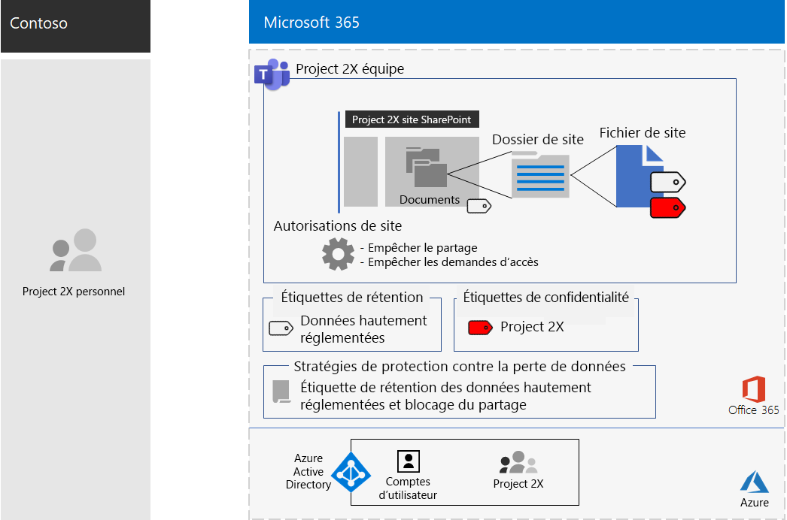](contoso-team-for-top-secret-project.md)

## Octobre 2019

### Nouveau contenu 

- [Affiche Teams pour les données hautement réglementées](secure-teams-highly-regulated-data-scenario.md#poster)

  [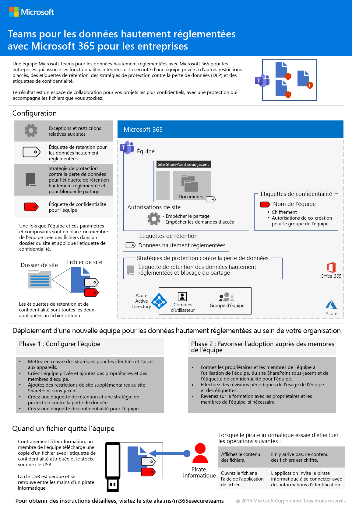](../media/secure-teams-highly-regulated-data-scenario/TeamsHighlyRegulatedData.pdf)

  Vous pouvez également télécharger cette affiche au format [PDF](https://github.com/MicrosoftDocs/microsoft-365-docs/raw/public/microsoft-365/media/secure-teams-highly-regulated-data-scenario/TeamsHighlyRegulatedData.pdf) ou [PowerPoint](https://github.com/MicrosoftDocs/microsoft-365-docs/raw/public/microsoft-365/media/secure-teams-highly-regulated-data-scenario/Teams-Highly-Regulated-Data-Poster.pptx) et l’imprimer sur du papier au format lettre, légal ou tabloïd (11 x 17).

- [Affiche Sites SharePoint pour les données hautement réglementées](teams-sharepoint-online-sites-highly-regulated-data.md#poster)

  [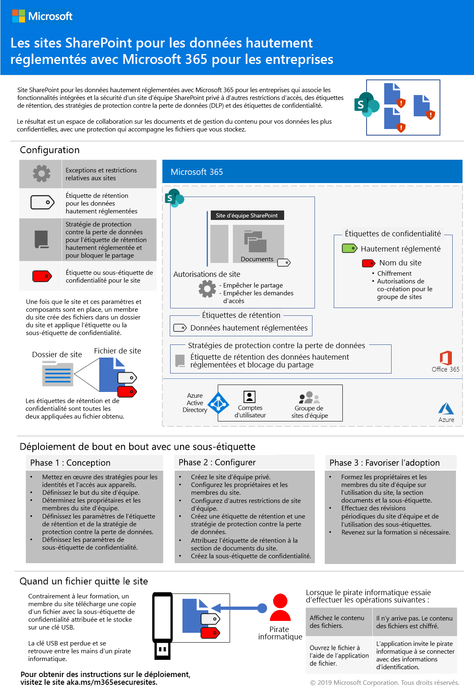](../media/teams-sharepoint-online-sites-highly-regulated-data/SharePointSitesHighlyRegulatedData.pdf)

  Vous pouvez également télécharger cette affiche au format [PDF](https://github.com/MicrosoftDocs/microsoft-365-docs/raw/public/microsoft-365/media/teams-sharepoint-online-sites-highly-regulated-data/SharePointSitesHighlyRegulatedData.pdf) ou [PowerPoint](https://github.com/MicrosoftDocs/microsoft-365-docs/raw/public/microsoft-365/media/teams-sharepoint-online-sites-highly-regulated-data/SharePoint-Sites-Highly-Regulated-Data.pptx) et l’imprimer sur du papier au format lettre, légal ou tabloïd (11 x 17).

- [Affiche Déployer Windows 10 avec autopilot](windows10-deploy-autopilot.md) 

  [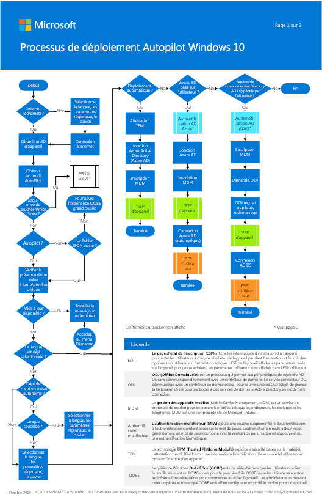](https://docs.microsoft.com/windows/deployment/media/Windows10AutopilotFlowchart.pdf)

  Vous pouvez également télécharger cette affiche au format [PDF](https://github.com/MicrosoftDocs/windows-itpro-docs/raw/public/windows/deployment/media/Windows10AutopilotFlowchart.pdf) ou [Visio](https://github.com/MicrosoftDocs/windows-itpro-docs/raw/public/windows/deployment/media/Windows10Autopilotflowchart.vsdx).

- [Affiche Déploiement de Windows 10 avec Configuration Manager](windows10-deploy-inplaceupgrade.md)

  [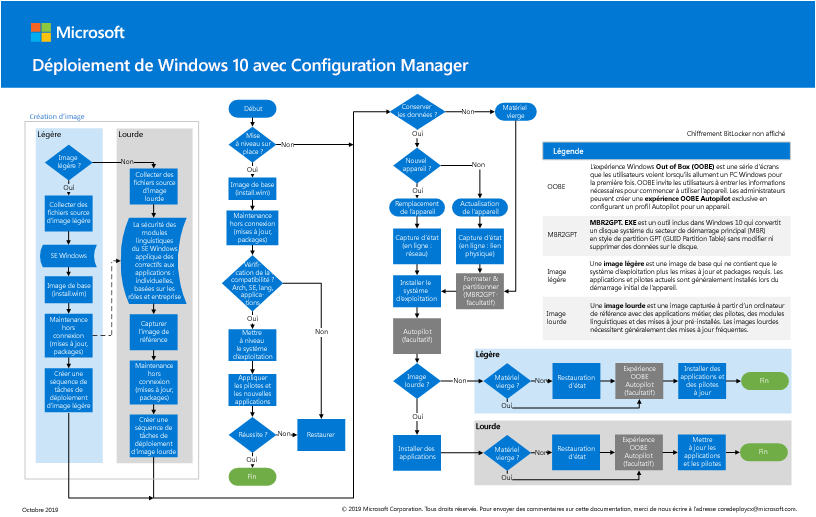](https://docs.microsoft.com/windows/deployment/media/Windows10DeploymentConfigManager.pdf)

  Vous pouvez également télécharger cette affiche au format [PDF](https://github.com/MicrosoftDocs/windows-itpro-docs/raw/public/windows/deployment/media/Windows10DeploymentConfigManager.pdf) ou [Visio](https://github.com/MicrosoftDocs/windows-itpro-docs/raw/public/windows/deployment/media/Windows10DeploymentConfigManager.vsdx).

- [Scénario Teams pour les données hautement réglementées](secure-teams-highly-regulated-data-scenario.md)

  

  Annonces : [Blog de la communauté technique Microsoft 365](https://techcommunity.microsoft.com/t5/Microsoft-365-Blog/Protect-your-highly-regulated-files-in-Teams-with-Microsoft-365/ba-p/962985)  |  [LinkedIn](https://www.linkedin.com/pulse/how-can-i-lock-down-team-sensitive-top-secret-joe-davies/?published=t)

- [Affiche Confiez des responsabilités aux travailleurs à distance](empower-people-to-work-remotely.md#poster)

  [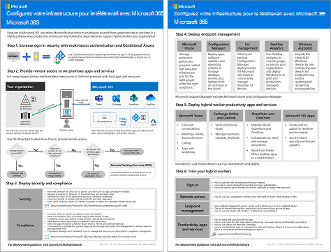](../media/empower-people-to-work-remotely/empower-remote-workers-scenario.pdf) 

  Vous pouvez également télécharger cette affiche au format [PDF](https://github.com/MicrosoftDocs/microsoft-365-docs/raw/public/microsoft-365/media/empower-people-to-work-remotely/empower-remote-workers-scenario.pdf) ou [PowerPoint](https://github.com/MicrosoftDocs/microsoft-365-docs/raw/public/microsoft-365/media/empower-people-to-work-remotely/Empower-Remote-Workers-Poster.pptx) et l’imprimer sur du papier au format lettre, légal ou tabloïd (11 x 17).

### Mises à jour et améliorations

- Actualisation de [Phase 4 : Office 365 ProPlus](office365proplus-infrastructure.md)
- Actualisation de l’[étude de cas Contoso](contoso-case-study.md)
- Actualisation des charges de travail [Microsoft Teams](teams-workload.md), [Exchange Online](exchangeonline-workload.md) et [SharePoint Online](sharepoint-online-onedrive-workload.md)
- Actualisation du scénario des [sites SharePoint pour les données hautement réglementées](teams-sharepoint-online-sites-highly-regulated-data.md)
 
  [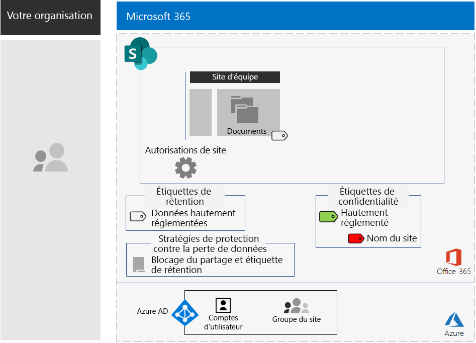](teams-sharepoint-online-sites-highly-regulated-data.md)

- [Affiche de l’entreprise Microsoft 365](microsoft-365-overview.md#get-the-big-picture) pour les nouveaux scénarios 

  

## Septembre 2019

### Nouveau contenu 

- [Scénario des travailleurs distants](empower-people-to-work-remotely.md)

  [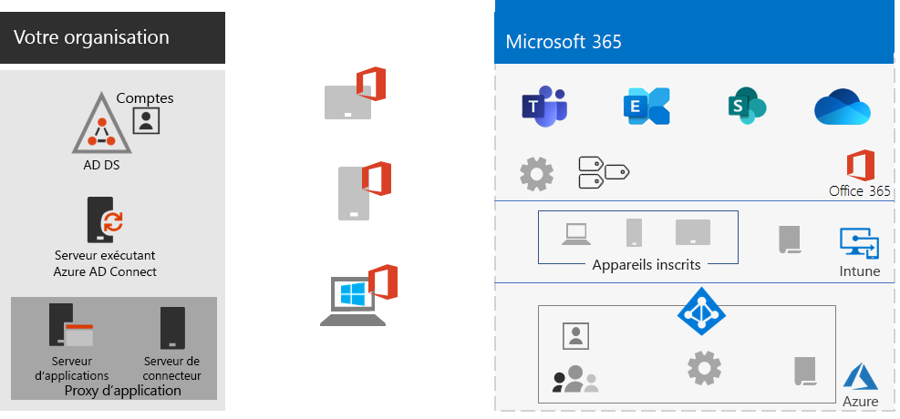](empower-people-to-work-remotely.md) 
 
  Annonces : [Blog de la communauté technique Microsoft 365](https://techcommunity.microsoft.com/t5/Microsoft-365-Blog/Empower-your-remote-workers-with-Microsoft-365-Enterprise/ba-p/935196#M236)  |  [LinkedIn](https://www.linkedin.com/pulse/how-do-i-configure-microsoft-365-enterprise-empower-my-joe-davies/)

- [Étape de chiffrement des e-mails](infoprotect-email-encryption.md) pour [Phase 6 : Protection des informations](infoprotect-infrastructure.md)

### Mises à jour et améliorations

- Réorganisation et actualisation de [Phase 2 : Identité](identity-infrastructure.md)
- Actualisation de [Phase 1 : Mise en réseau](networking-infrastructure.md) et [Phase 6 : Protection des informations](infoprotect-infrastructure.md)

## Août 2019

### Nouveau contenu 

- [Affiche pour la transition de votre organisation vers Microsoft 365 pour entreprise](migration-microsoft-365-enterprise-workload.md#transition-your-entire-organization)

   [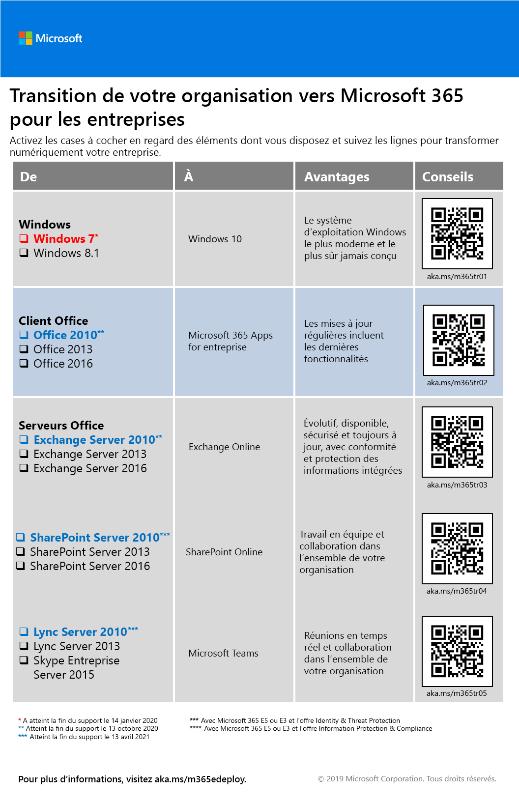](../media/deploy-microsoft-365-enterprise/transition-org-to-m365.pdf)
 
- [Affiche Infrastructure d’identités pour Microsoft 365 pour entreprise](identity-infrastructure.md)

  [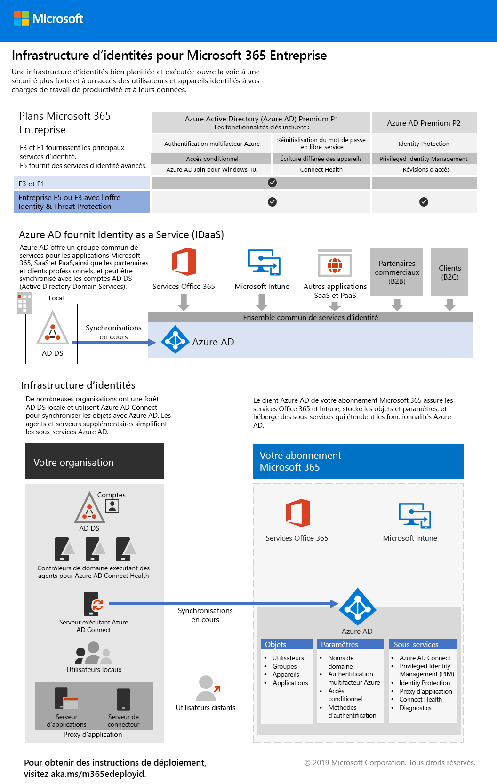](../media/identity-infrastructure/M365E-ID-Infra.pdf)

  Annonces : [Blog de la communauté technique Microsoft 365](https://techcommunity.microsoft.com/t5/Microsoft-365-Blog/Get-the-new-Identity-infrastructure-for-Microsoft-365-Enterprise/ba-p/874941)  |  [LinkedIn](https://www.linkedin.com/pulse/how-can-i-quickly-ramp-up-key-concepts-features-identity-joe-davies/?published=t)

- [Affiche de la fin de la prise en charge pour Windows 7 et Office 10](migration-microsoft-365-enterprise-workload.md#summary-of-options-for-office-2010-clients-and-servers-and-windows-7)
  
  

  Annonces : [Blog de la communauté technique Microsoft 365](https://techcommunity.microsoft.com/t5/Microsoft-365-Blog/Move-from-Office-2010-clients-and-servers-and-Windows-7-to/ba-p/846994)  |  [LinkedIn](https://www.linkedin.com/pulse/how-can-microsoft-365-enterprise-help-me-end-support-products-davies/)

### Mises à jour et améliorations

- [Affiche Microsoft 365 pour entreprise](microsoft-365-overview.md#get-the-big-picture) pour les nouveaux scénarios de productivité

   

## Juillet 2019

### Nouveau contenu

- Classeur Excel pour l’[article Microsoft 365 pour entreprise pour les organisations tierces](deploy-foundation-infrastructure-non-enterprises.md#onboarding)

## Mai 2019

### Nouveau contenu

- [Affiche Infrastructure Foundation](deploy-foundation-infrastructure.md#at-a-glance)

  [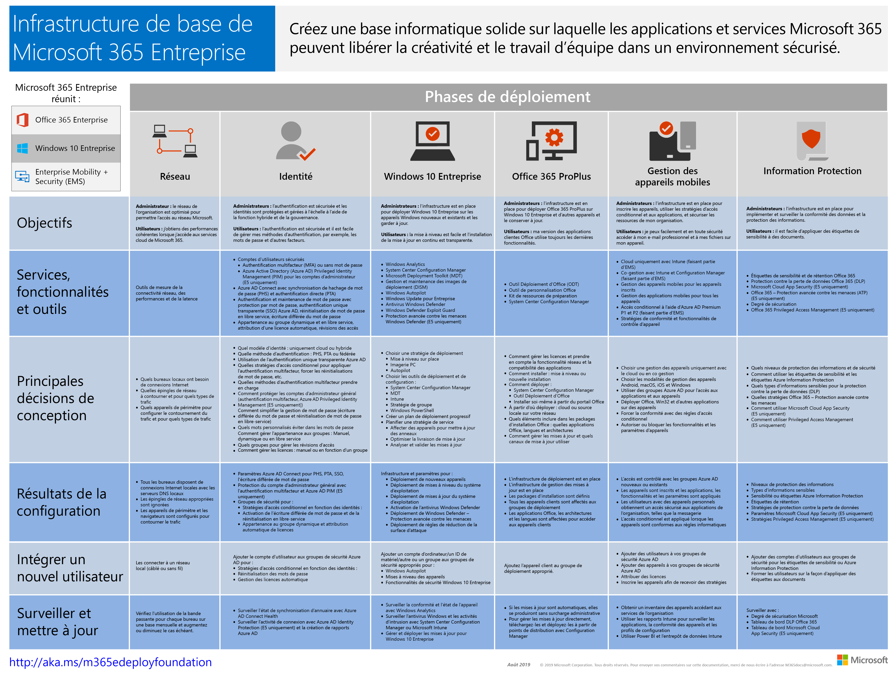](../media/deploy-foundation-infrastructure/Microsoft365EnterpriseFoundInfra.pdf)

  Annonces : [LinkedIn](https://www.linkedin.com/pulse/how-can-i-get-big-picture-microsoft-365-enterprise-joe-davies/)

 
- [Article Microsoft 365 pour entreprise pour les organisations tierces](deploy-foundation-infrastructure-non-enterprises.md)

  [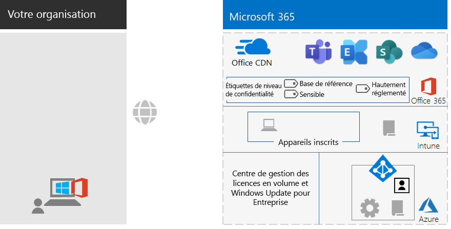](deploy-foundation-infrastructure-non-enterprises.md)

  Annonces : [Blog de la communauté technique Microsoft 365](https://techcommunity.microsoft.com/t5/Microsoft-365-Blog/Deploy-Microsoft-365-Enterprise-infrastructure-even-if-you-re/ba-p/900012)  |  [LinkedIn](https://www.linkedin.com/pulse/how-do-i-deploy-microsoft-365-enterprise-without-joe-davies/)

## Avril 2019

### Nouveau contenu 

- Guides de laboratoire de test prérequis [Accès aux identités et aux appareils](identity-device-access-m365-test-environment.md)
- Étapes [Protection des informations Windows](infoprotect-deploy-windows-information-protection.md) et [Prévention de la perte de données Office 365](infoprotect-data-loss-prevention.md) pour [Phase 6: Protection des informations](infoprotect-infrastructure.md)

## Voir aussi

[Guide de déploiement](deploy-microsoft-365-enterprise.md)
