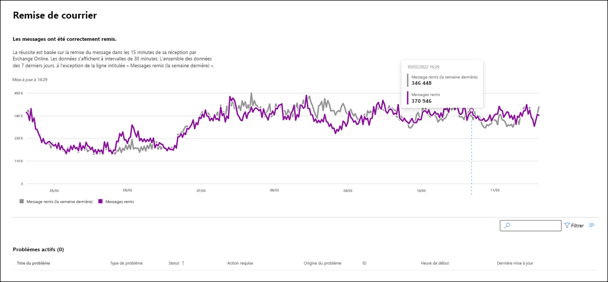

# Déployer Exchange Online pour Microsoft 365 Éducation

L’analyse Exchange Online prend en charge les scénarios suivants au niveau de l’organisation :

- **Clients de** messagerie : vous pouvez afficher l’état des clients de messagerie suivants en fonction de l’activité de lecture des e-mails :

  - Version de bureau d’Outlook
  - Outlook sur le web
  - Clients de messagerie natifs d’iOS et Android
  - Application Outlook Mobile pour iOS et Android
  - Client Outlook Mac

   Pour ces clients, vous pouvez connaître le nombre d’utilisateurs actifs au cours des 30 dernières minutes en fonction des utilisateurs qui lisent un e-mail, ainsi que le nombre d’incidents et de conseils dans le tableau de bord. Le programme compare ces données au même intervalle pour la semaine précédente afin de déterminer si un problème s’est produit.

   >[!Note]
   > Le programme détermine le nombre d’utilisateurs actifs selon une activité unique. Par exemple, lorsqu’un utilisateur lit un e-mail. Il rend compte seulement des 30 dernières minutes d’activité.

- **App connectivity**: Estimated connectivity is based on the percentage of successful, synthetic connections between your organization's devices and Exchange Online, and may include issues outside of Microsoft's control. To learn more, see [Microsoft 365 Connectivity Optics](microsoft-365-connectivity-optics.md).

- **Authentification de base et authentification moderne** : nombre d’utilisateurs correctement validés dans le service Exchange Online.

- **Flux de courriers** : nombre de messages remis correctement dans une boîte aux lettres sans délai une fois le message arrivé sur le réseau Microsoft 365.

- **Ouvrir Outlook pour le web** : nombre d’utilisateurs connectés et ayant démarré Outlook sur le web.
  
Voici un exemple de scénarios au niveau de l’organisation pour Exchange Online dans le tableau de bord principal.

Dans tous ces scénarios, les chiffres clés s’appliquent aux 30 dernières minutes dans le tableau de bord principal. Les affichages détaillés pour chacun de ces scénarios illustrent la tendance quasiment en temps réel pendant sept jours avec un agrégat de 30 minutes comparé à la semaine précédente.

Vous remarquerez des incidents ou des avertissements créés pour votre organisation avec l'« origine du problème » dans la communication marquée comme « Votre organisation ». Il s’agit de notifications destinées individuellement à votre organisation avec des problèmes qui nécessitent votre attention pour l’atténuation et la résolution. Pour plus d’informations sur les différents types de problèmes créés et communiqués dans l’intégrité du service pour informer votre organisation de l’impact potentiel, consultez les articles suivants :

- [Alertes de service pour l’utilisation des boîtes aux lettres](microsoft-365-mailbox-utilization-service-alerts.md)

- [Alertes de service pour les retards de source MRS](microsoft-365-mrs-source-delays-service-alerts.md)

- [Alertes de service pour les messages en attente de livraison à des destinataires externes](microsoft-365-external-recipient-service-alerts.md)

## Scénarios de surveillance des comptes prioritaires

Avec la surveillance des comptes prioritaires Exchange Online, vous pouvez afficher l’intégrité des scénarios suivants après avoir configuré les [comptes prioritaires](/microsoft-365/admin/setup/priority-accounts) :

- Gestion des licences Exchange

- Stockage de boîtes aux lettres

- Limite de message

- Sous-dossiers par dossier

- Hiérarchie de dossiers

- Éléments récupérables

Le scénario de licence Exchange vérifie si le compte de priorité n’est pas en mesure de se connecter en raison de problèmes de licence non valides, qui peuvent être résolus par l’administrateur client.

Les cinq autres scénarios ci-dessus vérifient si la boîte aux lettres de votre compte prioritaire est proche ou a atteint les limites décrites dans [Limites Exchange Online](/office365/servicedescriptions/exchange-online-service-description/exchange-online-limits#mailbox-storage-limits).

Pour ces scénarios, vous pouvez voir des avertissements et des incidents actifs et résolus affectant vos comptes prioritaires. Les informations d’identification des comptes prioritaires seront affichées dans les informations d’avertissement ou d’incident, ainsi que dans les recommandations. Voici un exemple de la page sur **Intégrité > Intégrité des services > Exchange Online**.

:::image type="content" source="../media/microsoft-365-exchange-monitoring/exchange-priority-accounts-example.png" alt-text="Exemple d’incidents et d’avertissements actifs et résolus affectant vos comptes prioritaires":::

Dans le volet de compte affecté, la colonne **État** a les valeurs suivantes :

- Fixed: The issue causing the advisory or incident has been addressed for the priority account. There's no longer an issue. 

- Active: The issue causing the advisory or incident is ongoing for the priority account. The issue remains. 

- Delayed: The issue causing the advisory or incident hasn't been addressed for the priority account in 96 hours, so it's suspended. The issue remains. 

Voici un exemple.

:::image type="content" source="../media/microsoft-365-exchange-monitoring/exchange-status-column-example.png" alt-text="Exemple de colonne d’état dans le volet de compte affecté":::

Un avertissement ou un incident est résolu si aucun compte n’est encore dans l’état **Actif**.

## Foire aux questions

### 1. Le nombre d’utilisateurs actifs dans le tableau de bord pour chaque client est bas. Nous avons attribué un grand nombre de licences actives à des utilisateurs. Qu’est-ce que cela signifie ?

Le nombre d’utilisateurs actifs indiqué dans la surveillance est basé sur une période de 30 minutes au cours de laquelle les utilisateurs ont effectué l’activité indiquée dans la fonctionnalité. Ce nombre est différent des nombres d’utilisations. Pour afficher les numéros d’utilisation, utilisez les rapports d’activité dans le Centre d'administration Microsoft 365 (**Reports**  >  <a href="https://go.microsoft.com/fwlink/p/?linkid=2074756" target="_blank">**Usage**</a>).

### 2. Où les données sont-elles instrumentées pour les scénarios qui montrent les tendances d’activité ?

The data is instrumented in the Exchange Online service. If there's a failure that happens before the request reaches Exchange Online or there's a failure in Exchange Online, you'll see a drop in the activity signal.
