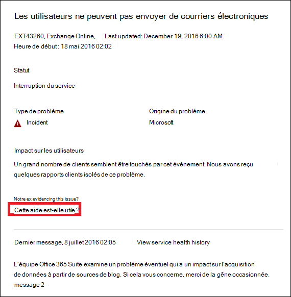

# Déployer Exchange Online pour Microsoft 365 Éducation

La surveillance d’Exchange Online dans le <a href="https://go.microsoft.com/fwlink/p/?linkid=2024339" target="_blank">Centre d’administration Microsoft 365</a> vous permet de surveiller l’état d’intégrité du service Exchange pour l’abonnement Microsoft 365 de votre organisation. La surveillance d’Exchange Online fournit des informations sur les incidents et les conseils collectés dans les catégories suivantes :

- **Infrastructure** : le programme détecte un problème dans l’infrastructure Microsoft 365 détenue par Microsoft pour fournir des mises à jour régulières et résoudre le problème. Par exemple, les utilisateurs ne peuvent pas accéder à Exchange Online en raison de problèmes liés à Exchange ou à une autre infrastructure cloud Microsoft 365.
- **Infrastructure tierce** : le programme détecte un problème dans une infrastructure tierce sur laquelle votre organisation a pris une dépendance. Votre organisation doit alors effectuer l’action nécessaire pour résoudre le problème. Par exemple, un fournisseur de services d’émission de jeton de sécurité (STS) tiers limite les transactions d’authentification utilisateur et empêche les utilisateurs de se connecter à Exchange Online.
- **Infrastructure cliente** : le programme détecte un problème dans l’infrastructure de votre organisation. Celle-ci doit alors effectuer l’action nécessaire pour résoudre le problème. Par exemple, les utilisateurs ne peuvent pas accéder à Exchange Online, car ils ne peuvent pas obtenir de jeton d’authentification via un fournisseur STS hébergé par votre organisation en raison d’un certificat arrivé à expiration.

Voici un exemple de page **Intégrité des services** dans le Centre d'administration Microsoft 365, disponible **Intégrité > Intégrité des services** pour l’organisation et les scénarios des [comptes prioritaires](../admin/setup/priority-accounts.md).

**Les problèmes au sein de votre organisation** seront identifiés et utilisés par la surveillance au niveau de l’organisation et la surveillance des comptes prioritaires.

La valeur de la colonne **Intégrité** sous **Les problèmes au sein de votre organisation** indique si l’infrastructure de votre organisation ou les logiciels tiers affectent l’expérience d’intégrité des services des utilisateurs et/ou des comptes prioritaires de votre organisation dans Exchange Online. Les conseils ou incidents nécessitent *vos* actions pour résoudre le problème.

La valeur **de la colonne** d’état sous État du **service Microsoft Corporation** indique que le service est sain ou qu’il a des conseils ou des incidents basés sur les services cloud que Microsoft maintient.

Voici un exemple de page de surveillance Exchange Online dans le Centre d'administration Microsoft 365 qui indique l’intégrité d’état des scénarios de comptes prioritaires et au niveau de l’organisation disponibles à partir de **Intégrité > Intégrité des services > Exchange Online**.

La page de surveillance **Exchange Online** indique si le service Exchange Online est intègre ou non, et si des incidents ou conseils associés sont présents. Avec la surveillance Exchange Online, vous pouvez consulter l’état d’intégrité des services pour des scénarios d’e-mails spécifiques. Vous pouvez également consulter des signaux en temps réel pour déterminer l’impact par scénario. Vous pouvez également voir l’intégrité des scénarios de compte prioritaires.

## Configuration requise

Cette préversion est activée pour les clients qui répondent aux exigences suivantes :

- Votre organisation doit avoir un nombre de licences d’au moins 5 000, soit une combinaison de ces produits : Office 365 E3, Microsoft 365 E3, Office 365 E5, Microsoft 365 E5.

  Par exemple, votre organisation peut avoir 3 000 licences Office 365 E3 et 2 500 Microsoft 365 E5, pour un total de 5 500 licences provenant des produits éligibles.

- Votre organisation doit avoir au moins 50 utilisateurs actifs mensuels pour un ou plusieurs services Microsoft 365 principaux, notamment les applications Microsoft Teams, OneDrive Entreprise, SharePoint Online, Exchange Online et Office.

- Tout rôle avec des autorisations de niveau Tableau de bord d’état du service peut accéder Exchange Online surveillance. Pour plus d’informations, consultez [Vérifier l’état du service Microsoft 365](view-service-health.md).

## Scénarios au niveau de l’organisation

Avec Exchange Online surveillance des données prend en charge les scénarios suivants :

- **Clients de** messagerie : vous pouvez afficher l’état des clients de messagerie suivants en fonction de l’activité de lecture des e-mails :

  - Version de bureau d’Outlook
  - Outlook sur le web
  - Clients de messagerie natifs d’iOS et Android
  - Application Outlook Mobile pour iOS et Android
  - Client Outlook Mac
  - Ouvrez la boîte aux lettres d’archivage à l’aide d’Outlook sur le web.

   Pour ces clients, vous pouvez connaître le nombre d’utilisateurs actifs au cours des 30 dernières minutes en fonction des utilisateurs qui lisent un e-mail, ainsi que le nombre d’incidents et de conseils dans le tableau de bord. Le programme compare ces données au même intervalle pour la semaine précédente afin de déterminer si un problème s’est produit.

   >[!Note]
   > Le programme détermine le nombre d’utilisateurs actifs selon une activité unique. Par exemple, lorsqu’un utilisateur lit un e-mail. Il rend compte seulement des 30 dernières minutes d’activité.

- **Connectivité des** applications : la connectivité estimée est basée sur le pourcentage de connexions synthétiques réussies entre les appareils et les Exchange Online de votre organisation, et peut inclure des problèmes en dehors du contrôle de Microsoft Corporation. Pour plus d’informations, voir [Optiques de connectivité Microsoft 365](microsoft-365-connectivity-optics.md).

- **Authentification de base et authentification moderne** : nombre d’utilisateurs correctement validés dans le service Exchange Online.

- **Flux de courriers** : nombre de messages remis correctement dans une boîte aux lettres sans délai une fois le message arrivé sur le réseau Microsoft 365.

  

Dans tous ces scénarios, les chiffres clés s’appliquent aux 30 dernières minutes dans le tableau de bord principal. Les affichages détaillés pour chacun de ces scénarios illustrent la tendance quasiment en temps réel pendant sept jours avec un agrégat de 30 minutes comparé à la semaine précédente.

## Scénarios de surveillance des comptes prioritaires

Avec la surveillance des comptes prioritaires Exchange Online, vous pouvez afficher l’intégrité des scénarios suivants après avoir configuré les [comptes prioritaires](/microsoft-365/admin/setup/priority-accounts) :

- Gestion des licences Exchange

- Stockage de boîtes aux lettres

- Limite de message

- Sous-dossiers par dossier

- Hiérarchie de dossiers

- Éléments récupérables

Le scénario de gestion des licences Exchange vérifie si le compte prioritaire n’est pas en mesure de se connecter en raison de problèmes de licence non valides, qui peuvent être résolus par l’administrateur client.

Les cinq autres scénarios ci-dessus vérifient si la boîte aux lettres de votre compte prioritaire est proche ou a atteint les limites décrites dans [Limites Exchange Online](/office365/servicedescriptions/exchange-online-service-description/exchange-online-limits#mailbox-storage-limits).

Pour ces scénarios, vous pouvez voir des avertissements et des incidents actifs et résolus affectant vos comptes prioritaires. Les informations d’identification des comptes prioritaires seront affichées dans les informations d’avertissement ou d’incident, ainsi que dans les recommandations. Voici un exemple de la page sur **Intégrité > Intégrité des services > Exchange Online**.

:::image type="content" source="../media/microsoft-365-exchange-monitoring/exchange-priority-accounts-example.png" alt-text="Exemple d’incidents et d’avertissements actifs et résolus affectant vos comptes prioritaires":::

Dans le volet de compte affecté, la colonne **État** a les valeurs suivantes :

- Résolu : le problème à l’origine de l’avertissement ou de l’incident a été résolu pour le compte prioritaire. Il n’y a plus de problème. 

- Actif : le problème à l’origine de l’avertissement ou de l’incident est en cours pour le compte prioritaire. Le problème reste. 

- Différé : le problème à l’origine de l’avertissement ou de l’incident n’a pas été résolu pour le compte prioritaire depuis 96 heures, il est donc suspendu. Le problème reste. 

Voici un exemple.

:::image type="content" source="../media/microsoft-365-exchange-monitoring/exchange-status-column-example.png" alt-text="Exemple de colonne d’état dans le volet de compte affecté":::

Un avertissement ou un incident est résolu si aucun compte n’est encore dans l’état **Actif**. 

## Nous envoyer des commentaires

Vous pouvez envoyer vos commentaires de deux manières :

- Utilisez l’option **Envoyer des commentaires** disponible sur chaque page du Centre d’administration Microsoft 365.

- Envoyez vos commentaires à l’aide du lien **Cette publication est-elle utile ?** pour un incident ou un conseil spécifique.

  

## Foire aux questions

#### 1. Pourquoi la mention « Surveillance Exchange Online » n’apparaît-elle pas dans le Centre d’administration Microsoft 365? 

Tout d’abord, vérifiez que vous avez activé le nouveau Centre d’administration sur la page **Accueil** du Centre d’<a href="https://go.microsoft.com/fwlink/p/?linkid=2024339" target="_blank">administration Microsoft 365</a>.

Vérifiez que vous remplissez les deux conditions suivantes :

- Votre organisation doit avoir un nombre de licences d’au moins 5 000, soit une combinaison de ces produits : Office 365 E3, Microsoft 365 E3, Office 365 E5, Microsoft 365 E5.

- Votre organisation doit avoir au moins 50 utilisateurs actifs mensuels pour un ou plusieurs services Microsoft 365 principaux, notamment les applications Microsoft Teams, OneDrive Entreprise, SharePoint Online, Exchange Online et Office.

Si le nombre de licences de votre organisation est inférieur à 5 000 utilisateurs et que le nombre d’utilisateurs actifs par mois passe au-dessous de 50 dans les principaux services, la surveillance Exchange Online ne sera pas activée tant que ces conditions ne seront pas remplies.

#### 2. Le nombre d’utilisateurs actifs dans le tableau de bord pour chaque client semble faible. Nous avons attribué un grand nombre de licences actives à des utilisateurs. Qu’est-ce que cela signifie ?

Le nombre d’utilisateurs actifs indiqué dans la surveillance est basé sur une période de 30 minutes au cours de laquelle les utilisateurs ont effectué l’activité indiquée dans la fonctionnalité. Ce nombre est différent des nombres d’utilisations. Pour afficher les numéros d’utilisation, utilisez les rapports d’activité dans le Centre d'administration Microsoft 365 (**Reports**  >  <a href="https://go.microsoft.com/fwlink/p/?linkid=2074756" target="_blank">**Usage**</a>).

#### 3. D’autres scénarios de surveillances seront-ils présents pour d’autres services tels que Teams et SharePoint ?

Microsoft a intégré cette expérience directement dans le tableau de bord Intégrité des services du Centre d’administration Microsoft 365. Microsoft pourra ainsi étendre les scénarios de surveillance à d’autres services qui figureront dans les prochaines actualités à partager.

#### 4. Quelle est l’offre prévue pour la disponibilité générale de cette expérience ?

Microsoft a intégré la surveillance Exchange Online directement dans le <a href="https://go.microsoft.com/fwlink/p/?linkid=842900" target="_blank"> tableau de bord **Intégrité des services** du Centre d’administration Microsoft 365</a>.

Grâce à cette nouvelle expérience intégrée, Microsoft envisage de recueillir vos commentaires, puis de définir notre offre en faveur de la disponibilité générale.

#### 5. Cette fonctionnalité est-elle gratuite (incluse) ou payante (comme supplément) ? 

Cette fonctionnalité est en préversion publique et uniquement disponible pour les clients répondant aux critères de la question 1. Il n’existe aucune option payante pour la réception de ce contenu.

#### 6. Comment faire part de mes commentaires ?

Pour vos commentaires généraux, utilisez l’icône **Envoyer des commentaires** en bas à droite de la page de surveillance **Exchange Online**. 

Pour des commentaires sur les incidents ou les conseils, utilisez le lien **Cette publication est-elle utile ?**.

#### 7. Où les données sont-elles instrumentées pour les scénarios qui montrent des tendances des activités ?

Les données sont instrumentées dans le service Exchange Online. S’il y a un problème qui se produit avant que la requête n’arrive à Exchange Online ou qu’une erreur s’est produite dans Exchange Online, le signal d’activité s’affiche.

#### 8. Existe-t-il des problèmes de confidentialité?

La surveillance se concentre sur les métadonnées de service et le contenu utilisateur n’est pas surveillé.

## Voir aussi

- [Comment vérifier l’intégrité du service Microsoft 365](view-service-health.md) 

- [Limites d’Exchange Online](/office365/servicedescriptions/exchange-online-service-description/exchange-online-limits#mailbox-storage-limits)

- [Gérer et surveiller les comptes prioritaires](/microsoft-365/admin/setup/priority-accounts)

- [Utilisation de comptes prioritaires dans Microsoft 365](https://techcommunity.microsoft.com/t5/microsoft-365-blog/using-priority-accounts-in-microsoft-365/ba-p/1873314)

- [Alertes de service pour l’utilisation des boîtes aux lettres dans la surveillance Exchange Online](microsoft-365-mailbox-utilization-service-alerts.md)
