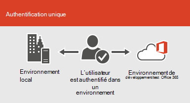

# Intégration de Microsoft 365 aux environnements locaux

*Cet article est valable pour Microsoft 365 Entreprise et Office 365 Entreprise.*

Vous pouvez intégrer Microsoft 365 à vos services d’annuaire existants et à une installation locale d’Exchange Server, Skype entreprise Server 2015 ou SharePoint Server.
  
 - Lorsque vous intégrez des services d’annuaire, vous pouvez synchroniser et gérer les comptes d’utilisateur pour les deux environnements. Vous pouvez également ajouter la synchronisation de hachage de mot de passe ou l’authentification unique (SSO) de sorte que les utilisateurs puissent se connecter aux deux environnements à l’aide de leurs informations d’identification locales.
 - Lorsque vous intégrez des produits serveur sur site, vous créez un environnement hybride. Un environnement hybride peut vous aider lors de la migration des utilisateurs ou des informations vers Microsoft 365, ou vous pouvez continuer à avoir des utilisateurs ou des informations sur site et d’autres dans le Cloud. Pour plus d’informations sur les environnements hybrides, consultez la rubrique [vue d’ensemble du Cloud hybride](https://docs.microsoft.com/Office365/Enterprise/hybrid-cloud-overview).

Vous pouvez également utiliser les conseillers Azure Active Directory (Azure AD) pour obtenir des conseils de configuration personnalisés (vous devez être connecté à Microsoft 365) :

- [Synchroniser les utilisateurs du répertoire de votre organisation](https://aka.ms/aadconnectpwsync)
- [Conseiller de déploiement AD FS](https://aka.ms/adfsguidance)
- [Guide de configuration d’Azure AD](https://aka.ms/aadpguidance)
   
## Avant de commencer

Avant d’intégrer Microsoft 365 et un environnement local, vous devez également participer à la planification du [réseau et au réglage des performances](network-planning-and-performance.md). Vous voudrez également comprendre les modèles d' [identité](about-microsoft-365-identity.md)disponibles. 

Consultez la rubrique [où gérer les comptes microsoft 365](manage-microsoft-365-accounts.md) pour obtenir la liste des outils que vous pouvez utiliser pour gérer les utilisateurs et les comptes Microsoft 365. 
  
## Intégration de Microsoft 365 avec les services d’annuaire
Si vous avez des comptes d’utilisateur existants dans un annuaire local, vous ne souhaitez pas recréer tous ces comptes dans Microsoft 365 et risquez d’introduire des différences ou des erreurs entre les environnements. La synchronisation d’annuaires vous permet de mettre en miroir ces comptes entre vos environnements en ligne et locaux. Avec la synchronisation d’annuaires, vos utilisateurs n’ont pas à se souvenir des nouvelles informations pour chaque environnement, et vous n’avez pas à créer ou mettre à jour les comptes deux fois. Vous devrez [préparer votre annuaire local pour la](prepare-for-directory-synchronization.md) synchronisation d’annuaires.
  

  
Si vous souhaitez que les utilisateurs puissent se connecter à Microsoft 365 avec leurs informations d’identification locales, vous pouvez également configurer l’authentification unique. Avec l’authentification unique, Microsoft 365 est configuré pour approuver l’environnement local pour l’authentification des utilisateurs.
  

  
Différentes techniques de gestion de compte d’utilisateur fournissent différentes expériences pour vos utilisateurs, comme illustré dans le tableau suivant.
 
### Synchronisation d’annuaires avec ou sans synchronisation de hachage de mot de passe ou authentification directe

Un utilisateur se connecte à son environnement local à l’aide de son compte d’utilisateur (DOMAINE\nom d’utilisateur). Lorsque les utilisateurs accèdent à Microsoft 365, ils doivent se reconnecter avec leur compte professionnel ou scolaire (user@domain.com). Le nom d’utilisateur est le même dans les deux environnements. Lorsque vous ajoutez une synchronisation de hachage de mot de passe ou une authentification directe, l’utilisateur a le même mot de passe pour les deux environnements, mais il devra de nouveau fournir ces informations d’identification lors de la connexion à Microsoft 365. La synchronisation d’annuaires avec la synchronisation de hachage de mot de passe est le scénario de synchronisation d’annuaire le plus couramment utilisé.

Pour configurer la synchronisation d’annuaires, utilisez Azure Active Directory Connect. Pour obtenir des instructions, consultez la section [configuration de la synchronisation d’annuaires pour Microsoft 365](set-up-directory-synchronization.md)et [Azure ad Connect with Express Settings](https://go.microsoft.com/fwlink/p/?LinkId=698537).

En savoir plus sur la [préparation de la synchronisation d’annuaires avec Microsoft 365](prepare-for-directory-synchronization.md) et [l’intégration de vos identifications locales à Azure Active Directory](https://go.microsoft.com/fwlink/?LinkId=518101).

### Synchronisation d’annuaires avec SSO

Un utilisateur se connecte à son environnement local à l’aide de son compte d’utilisateur. Lorsque les utilisateurs accèdent à Microsoft 365, ils se connectent automatiquement ou se connectent à l’aide des mêmes informations d’identification qu’ils utilisent pour leur environnement local (DOMAINE\nom d’utilisateur).

Pour configurer l’authentification unique, vous devez également utiliser Azure AD Connect. Pour obtenir des instructions, consultez [l’installation personnalisée d’Azure ad Connect](https://go.microsoft.com/fwlink/p/?LinkID=698430).

En savoir plus sur [l’authentification unique pour les applications dans Azure Active Directory](https://go.microsoft.com/fwlink/p/?LinkId=698604).

## Azure AD Connect

Azure AD Connect remplace les anciennes versions des outils d’intégration des identités telles que DirSync et Azure AD Sync. Pour plus d’informations, voir [qu’est-ce que l’identité hybride avec Azure Active Directory ?](https://go.microsoft.com/fwlink/p/?LinkId=527969). Si vous souhaitez effectuer une mise à jour à partir d’Azure Active Directory Sync vers Azure AD Connect, consultez [les instructions de mise à niveau](https://go.microsoft.com/fwlink/p/?LinkId=733240). 

Consultez également la rubrique [Deploy microsoft 365 Directory Synchronization in Microsoft Azure](https://go.microsoft.com/fwlink/?LinkId=517887).

## Voir aussi

[Vue d’ensemble de Microsoft 365 Entreprise](microsoft-365-overview.md)
