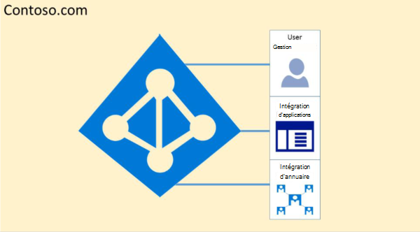
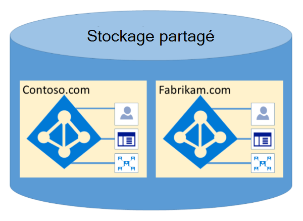

# Microsoft 365 Isolation et contrôle d’accès dans Azure Active Directory

Azure Active Directory (Azure AD) a été conçu pour héberger plusieurs clients de manière hautement sécurisée via l’isolation logique des données. L’accès à Azure AD est limité par une couche d’autorisation. Azure AD isole les clients qui utilisent des conteneurs clients comme limites de sécurité pour protéger le contenu d’un client afin qu’il ne soit pas accessible ou compromis par les co-locataires. Trois vérifications sont effectuées par la couche d’autorisation d’Azure AD :

- Le principal est-il activé pour accéder au client Azure AD ?
- Le principal est-il activé pour l’accès aux données dans ce client ?
- Le rôle du principal dans ce client est-il autorisé pour le type d’accès aux données demandé ?

Aucune application, utilisateur, serveur ou service ne peut accéder à Azure AD sans l’authentification et le jeton ou le certificat appropriés. Les demandes sont rejetées si elles ne sont pas accompagnées d’informations d’identification correctes.

En fait, Azure AD héberge chaque client dans son propre conteneur protégé, avec des stratégies et des autorisations pour et au sein du conteneur, uniquement la propriété et la gestion par le client.
 

Le concept de conteneurs clients est profondément intégré dans le service d’annuaire à toutes les couches, des portails jusqu’au stockage persistant. Même lorsque plusieurs métadonnées du client Azure AD sont stockées sur le même disque physique, il n’existe aucune relation entre les conteneurs autre que celle définie par le service d’annuaire, qui est à son tour dictée par l’administrateur client. Il ne peut y avoir aucune connexion directe au stockage Azure AD à partir d’une application ou d’un service demandeur sans passer au préalable par la couche d’autorisation.

Dans l’exemple ci-dessous, Contoso et Fabrikam ont tous deux des conteneurs distincts et dédiés, et même si ces conteneurs peuvent partager une partie de la même infrastructure sous-jacente, telle que les serveurs et le stockage, ils restent séparés et isolés les uns des autres, et sont sécurisés par des couches d’autorisation et de contrôle d’accès.
 

En outre, aucun composant d’application ne peut s’exécuter à partir d’Azure AD et il n’est pas possible pour un client de forcer l’intégrité d’un autre client, d’accéder aux clés de chiffrement d’un autre client ou de lire des données brutes à partir du serveur.

Par défaut, Azure AD ne permet pas toutes les opérations émises par des identités dans d’autres locataires. Chaque client est logiquement isolé dans Azure AD par le biais de contrôles d’accès basés sur les revendications. Les lectures et écritures de données d’annuaire sont limitées aux conteneurs clients et sont limitées par une couche d’abstraction interne et une couche de contrôle d’accès basé sur un rôle (RBAC), qui appliquent ensemble le client en tant que limite de sécurité. Chaque demande d’accès aux données d’annuaire est traitée par ces couches et chaque demande d’accès dans Microsoft 365 est traitée par la logique ci-dessus.

Azure AD dispose de partitions d’Amérique du Nord, du gouvernement américain, de l’Union européenne, de l’Allemagne et du monde entier. Un client existe dans une partition unique et les partitions peuvent contenir plusieurs locataires. Les informations de partition sont extraites des utilisateurs. Une partition donnée (y compris tous les clients qu’elle comprend) est répliquée dans plusieurs centres de données. La partition d’un client est choisie en fonction des propriétés du client (par exemple, le code pays). Les secrets et autres informations sensibles de chaque partition sont chiffrés avec une clé dédiée. Les clés sont générées automatiquement lors de la création d’une nouvelle partition.

Les fonctionnalités système Azure AD sont une instance unique de chaque session utilisateur. En outre, Azure AD utilise des technologies de chiffrement pour isoler les ressources système partagées au niveau du réseau afin d’empêcher le transfert non autorisé et involontaire d’informations.
