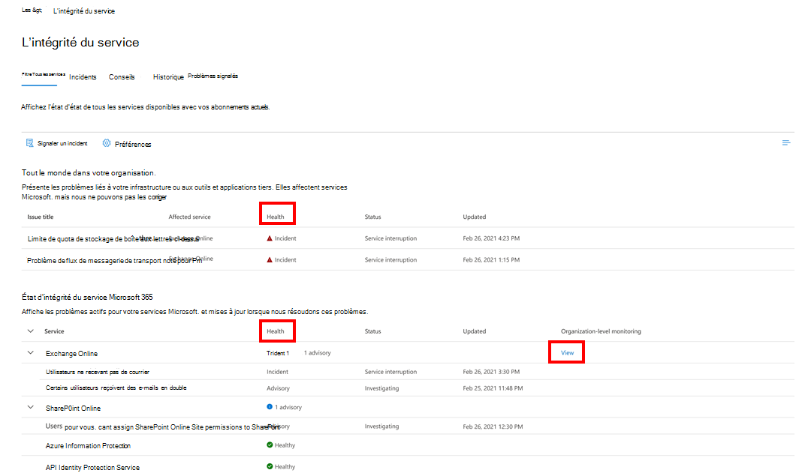

# En savoir plus sur la surveillance de Microsoft 365

Vous pouvez utiliser des tableaux de bord dans le [Centre d'administration Microsoft 365](https://go.microsoft.com/fwlink/p/?linkid=2024339) pour surveiller l’intégrité de différents services Microsoft pour l’abonnement Microsoft 365 de votre organisation. Cette fonctionnalité a été initialement démarrée avec Exchange Online et est maintenant étendue à d’autres services Microsoft tels que Microsoft Teams, Microsoft 365 Apps et d’autres services à l’avenir. La surveillance vous fournit des informations sur les incidents et les avis collectés dans les catégories suivantes :

- **Infrastructure**. Un problème est détecté dans l’infrastructure Microsoft 365 que Microsoft possède pour fournir des mises à jour régulières et résoudre le problème. Par exemple, les utilisateurs ne peuvent pas accéder à Exchange Online en raison de problèmes liés à Exchange ou à une autre infrastructure cloud Microsoft 365.

- **Infrastructure tierce**. Un problème est détecté dans l’infrastructure tierce sur laquelle votre organisation a pris une dépendance et nécessite une action de votre organisation pour la résolution. Par exemple, un fournisseur de services d’émission de jeton de sécurité (STS) tiers limite les transactions d’authentification utilisateur et empêche les utilisateurs de se connecter à Exchange Online.

- **Infrastructure du client**. Le problème est détecté dans l’infrastructure de votre organisation et nécessite une action de votre organisation pour la résolution. Par exemple, les utilisateurs ne peuvent pas accéder à Exchange Online, car ils ne peuvent pas obtenir un jeton d’authentification auprès du fournisseur STS hébergé par votre organisation en raison d’un certificat expiré.

Voici un exemple de la page **État des services** dans le Centre d'administration Microsoft 365, qui est disponible dans **Health** >  **État des services** pour les scénarios d’organisation et les scénarios de [compte prioritaire](../admin/setup/priority-accounts.md).

**Les problèmes au sein de votre organisation** seront identifiés et utilisés par la surveillance au niveau de l’organisation et la surveillance des comptes prioritaires.

La valeur de la colonne **Intégrité** sous **Les problèmes au sein de votre organisation** indique si l’infrastructure de votre organisation ou les logiciels tiers affectent l’expérience d’intégrité des services des utilisateurs et/ou des comptes prioritaires de votre organisation dans Exchange Online. Les conseils ou incidents nécessitent vos actions pour résoudre le problème.

La valeur **de la colonne** d’état sous État du **service Microsoft Corporation** indique que le service est sain ou qu’il a des conseils ou des incidents basés sur les services cloud que Microsoft maintient.

Voici un exemple de la page de surveillance Exchange Online dans le Centre d'administration Microsoft 365 qui montre l’intégrité des scénarios de compte au niveau de l’organisation et de priorité disponibles dans **Health** >  **État des services** > **Exchange Online**.

Avec la page de liste des scénarios, vous pouvez voir si le service Microsoft est sain ou non et s’il existe des incidents ou des avis associés. Par exemple, avec Exchange Online surveillance, vous pouvez examiner l’intégrité du service pour des scénarios de messagerie spécifiques et afficher des signaux en quasi-temps réel pour déterminer l’impact par scénario au niveau de l’organisation. Vous pouvez également voir l’intégrité des scénarios de compte prioritaire, le cas échéant.

## Conditions requises pour la surveillance

Cette préversion est activée pour les clients qui répondent aux exigences suivantes :

- Votre organisation doit avoir un nombre de licences d’au moins 5 000 parmi un ou plusieurs de ces produits : Office 365 E3, Microsoft 365 E3, Office 365 E5 ou Microsoft 365 E5.

   Par exemple, votre organisation peut avoir 3 000 licences Office 365 E3 et 2 500 Microsoft 365 E5, pour un total de 5 500 licences provenant des produits éligibles.

- Votre organisation doit avoir au moins 50 utilisateurs actifs mensuels pour un ou plusieurs services Microsoft 365 principaux, notamment les applications Microsoft Teams, OneDrive Entreprise, SharePoint Online, Exchange Online et Office.

- Tout rôle avec des autorisations de niveau Tableau de bord d’état du service peut accéder Exchange Online surveillance. Pour plus d’informations, consultez [Vérifier l’état du service Microsoft 365](view-service-health.md).

## Surveillance supplémentaire pour les services Microsoft

La surveillance spécifique au service est également activée pour les services Microsoft suivants. Sélectionnez le lien correspondant pour en savoir plus sur la surveillance de ce service.

- [Exchange Online](microsoft-365-exchange-monitoring.md)

- [Microsoft 365 Apps](microsoft-365-apps-monitoring.md)

- [Microsoft Teams](microsoft-365-teams-monitoring.md)

## Nous envoyer des commentaires

Vous pouvez envoyer vos commentaires de deux manières :

- Utilisez l’option **Envoyer des commentaires** disponible sur chaque page du Centre d’administration Microsoft 365.

- Envoyer des commentaires à l’aide de **Ce billet est-il utile ? lien pour un incident ou un avis spécifique.

  

## Foire aux questions

### 1. Pourquoi ne vois-je pas le lien « afficher » sous la colonne Surveillance de l’organisation dans le Centre d'administration Microsoft 365 à l’intérieur de Service Health ?

Tout d’abord, vérifiez que vous avez activé le nouveau Centre d’administration sur la page **Accueil** du Centre d’[administration Microsoft 365](https://go.microsoft.com/fwlink/p/?linkid=2024339).

Vérifiez que vous remplissez les deux conditions suivantes :

- Votre organisation doit avoir un nombre de licences d’au moins 5 000, à partir d’un ou d’une combinaison de ces produits : Office 365 E3, Microsoft 365 E3, Office 365 E5 ou Microsoft 365 E5.

- Votre organisation doit avoir au moins 50 utilisateurs actifs mensuels pour un ou plusieurs services Microsoft 365 principaux, notamment les applications Microsoft Teams, OneDrive Entreprise, SharePoint Online, Exchange Online et Office.

Si le nombre de licences de votre organisation est inférieur à 5 000 utilisateurs et que le nombre d’utilisateurs actifs par mois passe au-dessous de 50 dans les principaux services, la surveillance Exchange Online ne sera pas activée tant que ces conditions ne seront pas remplies.

### 2. Y aura-t-il d’autres scénarios de surveillance pour d’autres services à l’avenir ?

Oui. Nous avons maintenant quelques services supplémentaires en préversion publique. Nous continuerons à travailler sur l’extension de l’empreinte à d’autres services.

### 3. Quel est le plan pour la disponibilité générale de cette expérience ?

Le plan de Microsoft consiste à collecter vos commentaires sur l’expérience en préversion, puis à définir notre plan de disponibilité générale.

### 4. S’agit-il d’une fonctionnalité gratuite (incluse) ou payante (supplémentaire) ?

Cette fonctionnalité est en préversion publique et uniquement disponible pour les clients répondant aux critères de la question 1. Il n’existe aucune option payante pour la réception de ce contenu.

### 5. Comment faire fournir des commentaires ?

Pour obtenir des commentaires généraux, utilisez l’icône **Envoyer des commentaires** dans le coin inférieur droit de la page de surveillance.

Pour obtenir des commentaires sur les incidents ou les avis, utilisez **Ce billet est-il utile ? Lien.

### 6. Y a-t-il des préoccupations en matière de confidentialité?

La surveillance se concentre sur les métadonnées du service et le contenu utilisateur n’est pas surveillé.
