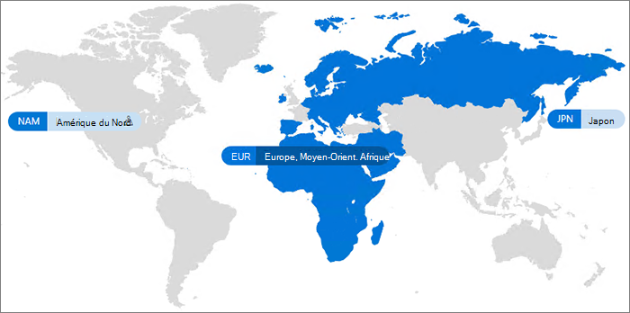

# Microsoft 365 Multi-Geo

Avec Microsoft 365 Multi-Geo, votre organisation peut étendre sa présence Microsoft 365 à plusieurs régions ou pays au sein de votre client existant. Pour inscrire votre entreprise internationale à Microsoft 365 Multi-Geo, contactez votre Équipe des comptes Microsoft.
  
Microsoft 365 Multi-Geo vous permet d’approvisionner et de stocker des données au repos dans les emplacements géographiques de votre choix afin de répondre à des besoins spécifiques en matière de résidence des données, tout en déverrouillant le déploiement global d’expériences de productivité moderne à vos employés.

Pour obtenir une présentation vidéo de Microsoft 365 multi-géo, reportez-vous [à la rubrique SharePoint Online et OneDrive multi-géo pour contrôler l’emplacement de vos données](https://www.youtube.com/watch?v=Do9U3JuROhk).

## Architecture multi-géo

Dans un environnement Multi-Geo, votre client Microsoft 365 se compose d’un emplacement central (où votre abonnement Microsoft 365 d’origine a été approvisionné) et d’un ou plusieurs emplacements satellites. Dans un client multigéographique, les informations concernant les emplacements géographiques, les groupes et les informations utilisateur sont gérées dans Azure Active Directory (Azure AD). Étant donné que les informations de votre client sont gérées de façon centralisée et synchronisées à chaque emplacement géographique, le partage et les expériences concernant tout membre de votre société impliquent une sensibilisation à l’échelle mondiale.

Notez que Microsoft 365 Multi-Geo n’est pas conçu pour optimiser les performances, mais pour répondre aux exigences de résidence des données. Pour plus d’informations sur l’optimisation des performances pour Microsoft 365, voir [Planification réseau et optimisation des performances pour Microsoft 365](https://support.office.com/article/e5f1228c-da3c-4654-bf16-d163daee8848) ou contacter votre groupe de support.

## Terminologie

Voici les principaux termes utilisés dans la description de Microsoft 365 Multi-Geo :

- **Emplacement central** : emplacement géographique où votre client a été approvisionné à l’origine.
- **Administrateur de zone géographique** : un administrateur pouvant administrer un ou plusieurs emplacements satellites spécifiés.
- **Géocode** : code de trois lettres correspondant à un emplacement géographique donné.
- **Emplacement géographique** : emplacement géographique utilisable dans un client multigéographique pour héberger des données, notamment dans des boîtes aux lettres Exchange et des sites OneDrive ou SharePoint.
- **Emplacement par défaut des données** : propriété d’utilisateur définie par l’administrateur, indiquant l’emplacement géographique où la boîte aux lettres Exchange et le OneDrive des utilisateurs doivent être déployés. L’emplacement par défaut des données détermine où sont déployés les sites SharePoint créés par l’utilisateur.
- **Emplacement satellite** : emplacement géographique où les charges de travail Microsoft 365 sensibles à la zone géographique (SharePoint, OneDrive et Exchange) sont activées dans un client multigéographique.
- **Locataire** : représentation d’une organisation dans Microsoft 365 à laquelle sont généralement associés un ou plusieurs domaines (par exemple, contoso.com).

## Licence

Microsoft 365 multi-Geo est disponible sous la forme d’un composant additionnel aux offres d’abonnement Microsoft 365 suivantes pour les clients EA ayant au moins 250 places de Microsoft 365 au sein de leur client, et 5% au minimum de ces sièges utilisant plusieurs Geo. Pour plus d’informations, contactez l’équipe de votre compte Microsoft.

- Microsoft 365 F1, F3, E3 ou E5
- Office 365 F3, E1, E3 ou E5
- Exchange Online (plan 1) ou plan 2
- OneDrive entreprise (plan 1 ou plan 2)
- SharePoint Online Plan 1 ou Plan 2

## Disponibilité de Microsoft 365 Multi-Geo

Microsoft 365 Multi-Geo est actuellement disponible dans les régions et pays suivants :

[!INCLUDE [Microsoft 365 Multi-Geo locations](../includes/microsoft-365-multi-geo-locations.md)]

## Prise en main

Pour commencer à utiliser la fonctionnalité multigéographique, procédez comme suit :

1. Travailler avec votre équipe de compte pour ajouter le plan de services des _fonctionnalités multigéographiques dans Microsoft 365_. Ils vous guident pour ajouter le nombre de licences nécessaires. La fonctionnalité Multi-Geo est actuellement disponible pour les clients Contrat Entreprise avec au moins 250 abonnements Microsoft 365.

   Avant que vous puissiez commencer à utiliser Microsoft 365 Multi-Geo, Microsoft doit configurer votre client Exchange Online afin qu’il bénéficie d’une prise en charge multigéographique. Ce processus de configuration est déclenché lorsque vous commandez le plan de services des *fonctionnalités multigéographiques de Microsoft 365* et que les licences apparaissent dans votre client. Vous recevrez des notifications spécifiques de charge de travail dans le [Centre de messages Microsoft 365](https://support.office.com/article/38FB3333-BFCC-4340-A37B-DEDA509C2093) une fois que votre client aura terminé le processus de configuration pour chaque charge de travail, et vous pouvez commencer à configurer et à utiliser vos fonctionnalités multigéographiques Microsoft 365. Le temps nécessaire à la configuration d’un client pour la prise en charge de plusieurs géo varie d’un client à l’autre, mais la plupart des clients se terminent dans un mois après réception des licences de fonctionnalité. Les clients plus complexes ou plus complexes peuvent avoir besoin de plus de temps pour terminer le processus de configuration. Veuillez contacter votre équipe de compte pour obtenir plus d’informations sur votre client spécifique.

2. Lisez [Planifier votre environnement multigéographique](plan-for-multi-geo.md).

3. Découvrez [comment administrer un environnement multigéographique](administering-a-multi-geo-environment.md) et [comment vos utilisateurs feront l’expérience de cet environnement](multi-geo-user-experience.md).

4. Lorsque vous êtes prêt à configurer Microsoft 365 Multi-Geo, [configurez votre client pour une utilisation multigéographique](multi-geo-tenant-configuration.md).

5. [Configurez la recherche](configure-search-for-multi-geo.md).

## Voir aussi

[Géo multiple dans Exchange Online et OneDrive](https://Aka.ms/GoMultiGeo)

[Fonctionnalités multigéographiques dans OneDrive et SharePoint Online](multi-geo-capabilities-in-onedrive-and-sharepoint-online-in-microsoft-365.md)

[Fonctionnalités multi-localisés dans Exchange Online](multi-geo-capabilities-in-exchange-online.md)

[Expérience Teams dans un environnement multigéographique](https://docs.microsoft.com/microsoftteams/teams-experience-o365odb-spo-multi-geo)
