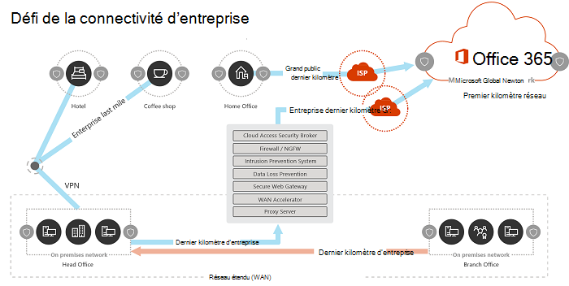
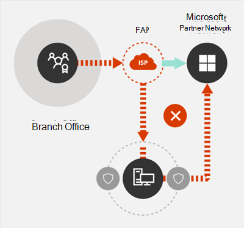

# Principes de connectivité réseau Microsoft 365

*Cet article est valable pour Microsoft 365 Entreprise et Office 365 Entreprise.*

Avant de commencer à planifier votre réseau pour la connectivité réseau de Microsoft 365, il est important de comprendre les principes de connectivité pour gérer en toute sécurité le trafic de Microsoft 365 et obtenir les meilleures performances possibles. Cet article vous aidera à mieux comprendre les instructions les plus récents pour vous permettre d’optimiser en toute sécurité la connectivité réseau de Microsoft 365.
  
Les réseaux d’entreprise traditionnels sont principalement conçus pour fournir aux utilisateurs l’accès aux applications et aux données hébergées dans des centres de données, gérés par l’entreprise avec un périmètre de sécurité renforcé. Le modèle traditionnel suppose que les utilisateurs accéderont aux applications et aux données depuis l’intérieur du périmètre du réseau d’entreprise, via des liaisons WAN depuis les succursales, ou à distance via des connexions VPN.
  
L’adoption d’applications SaaS comme Microsoft 365 déplace une combinaison de services et de données en dehors du périmètre du réseau. Sans optimisation, le trafic entre les utilisateurs et les applications SaaS est soumis à une latence introduite par l’inspection des paquets, les épingles réseau, les connexions accidentelles à des points de terminaison géographiquement distants et d’autres facteurs. Vous pouvez garantir les meilleures performances et fiabilité de Microsoft 365 en comprenant et en mettant en œuvre les principales directives d’optimisation.
  
Dans cet article, vous découvrirez :
  
- L’[architecture de Microsoft 365](microsoft-365-network-connectivity-principles.md#BKMK_Architecture) telle qu’elle s’applique à la connectivité des clients au cloud
- Les [principes de connectivité de Microsoft 365](microsoft-365-network-connectivity-principles.md#BKMK_Principles) et les stratégies mis à jour pour optimiser le trafic réseau et l’expérience de l’utilisateur final
- Le [service web des points de terminaison Office 365](microsoft-365-network-connectivity-principles.md#BKMK_WebSvc), qui permet aux administrateurs réseau de consommer une liste structurée de points de terminaison à utiliser dans l’optimisation du réseau
- Les [nouvelles catégories de points de terminaison Office 365](microsoft-365-network-connectivity-principles.md#BKMK_Categories) et les instructions pour l’optimisation
- La [comparaison de la sécurité du périmètre du réseau et de la sécurité des points de terminaison](microsoft-365-network-connectivity-principles.md#BKMK_SecurityComparison)
- Les options de l’[optimisation incrémentielle](microsoft-365-network-connectivity-principles.md#BKMK_IncOpt) pour le trafic de Microsoft 365
- Le [test de connectivité de Microsoft 365](https://aka.ms/netonboard), un nouvel outil pour tester la connectivité de base à Microsoft 365

## Architecture de Microsoft 365

Microsoft 365 est un cloud SaaS (Software-as-a-Service) distribué qui fournit des scénarios de productivité et de collaboration via un ensemble diversifié de micro-services et d’applications, comme Exchange Online, SharePoint Online, Skype Entreprise Online, Microsoft Teams, Exchange Online Protection, Office dans un navigateur et bien d’autres. Bien que les applications Microsoft 365 spécifiques puissent avoir des fonctionnalités uniques qui s’appliquent au réseau client et à la connectivité au cloud, elles partagent toutes des principes, des objectifs et des modèles d’architecture essentiels. Ces principes et ces modèles d’architecture de connectivité sont caractéristiques de nombreux autres cloud SaaS et sont en même temps différents des modèles de déploiement classiques des services cloud PaaS (Plate-forme en tant que service) et IaaS (Infrastructure en tant que service), comme Microsoft Azure.
  
L’une des caractéristiques architecturales les plus importantes de Microsoft 365 (qui est souvent manquée ou mal interprétée par les architectes de réseau) est le fait qu’il s’agisse d’un service distribué de façon mondiale, dans le contexte de la connexion des utilisateurs à ce service. L’emplacement du client Microsoft 365 cible est important pour comprendre la localité du stockage des données client dans le cloud, mais l’expérience utilisateur avec Microsoft 365 n’implique pas une connexion directe aux disques contenant les données. L’expérience utilisateur avec Microsoft 365 (notamment les performances, la fiabilité et d’autres caractéristiques de qualité importantes) implique une connectivité via des points d’entrée de service hautement distribuées qui sont étendues à des centaines de sites Microsoft dans le monde. Dans la majorité des cas, la meilleure expérience utilisateur est obtenue en permettant au réseau du client d’acheminer les demandes des utilisateurs vers le point d’entrée de service Microsoft 365 le plus proche, plutôt que de se connecter à Microsoft 365 via un point de sortie dans un emplacement central ou une région.
  
Pour la plupart des clients, les utilisateurs de Microsoft 365 sont répartis dans de nombreux emplacements. Pour obtenir les meilleurs résultats, les principes exposés dans ce document doivent être examinés d’un point de vue évolutif (et non linéaire), en se concentrant sur l’optimisation de la connectivité vers le point de présence le plus proche dans le réseau mondial Microsoft, et non vers l’emplacement géographique du client Microsoft 365. En bref, cela signifie que même si les données du locataire Microsoft 365 peuvent être stockées dans un emplacement géographique spécifique, l’expérience Microsoft 365 pour ce locataire reste distribuée et peut être présente à proximité (réseau) de chaque emplacement de l’utilisateur final que possède le locataire.
  
## Principes de connectivité de Microsoft 365

Microsoft recommande les principes suivants pour obtenir une connectivité et des performances Microsoft 365 optimales. Utilisez ces principes de connectivité de Microsoft 365 pour gérer votre trafic et obtenir les meilleures performances lors de la connexion à Microsoft 365.
  
L'objectif principal de la conception du réseau doit être de minimiser la latence en réduisant le temps d'aller-retour (RTT) de votre réseau vers le Microsoft Global Network, l'épine dorsale du réseau public de Microsoft qui interconnecte tous les centres de données de Microsoft avec une faible latence et des points d'entrée d'application cloud répartis autour du monde. Vous pouvez en savoir plus sur le réseau mondial Microsoft sur [Comment Microsoft construit son réseau mondial rapide et fiable](https://azure.microsoft.com/blog/how-microsoft-builds-its-fast-and-reliable-global-network/).
  

### Identifier et différencier le trafic de Microsoft 365

  
L’identification du trafic réseau de Microsoft 365 est la première étape pour pouvoir différencier ce trafic du trafic réseau générique lié à Internet. La connectivité de Microsoft 365 peut être optimisée en mettant en œuvre une combinaison d’approches telles que l’optimisation de l’itinéraire réseau, les règles de pare-feu, les paramètres de proxy du navigateur et le contournement des périphériques d’inspection du réseau pour certains points de terminaison.
  
Les précédents conseils relatifs à l’optimisation de Microsoft 365 divisaient les points de terminaison Microsoft 365 en deux catégories : **Obligatoires** et **Facultatifs**. Les points de terminaison ayant été ajoutés pour prendre en charge les nouveaux services et fonctionnalités Microsoft 365, nous avons réorganisé les points de terminaison Microsoft 365 en trois catégories : **Optimiser**, **Autoriser** et **Par défaut**. Les directives pour chaque catégorie s’appliquent à tous les points de terminaison de la catégorie, ce qui facilite la compréhension et la mise en œuvre des optimisations.
  
Si vous souhaitez obtenir plus d’informations sur les catégories de points de terminaison et les méthodes d’optimisation de Microsoft 365, consultez la section [Nouvelles catégories de points de terminaison Office 365](microsoft-365-network-connectivity-principles.md#BKMK_Categories).
  
Microsoft publie désormais tous les points de terminaison Microsoft 365 en tant que service web et fournit des conseils sur la meilleure façon d’utiliser ces données. Si vous souhaitez obtenir plus d’informations sur la récupération et l’utilisation des points de terminaison Microsoft 365, consultez l’article [URL et plages d’adresses IP Office 365](https://support.office.com/article/office-365-urls-and-ip-address-ranges-8548a211-3fe7-47cb-abb1-355ea5aa88a2?ui=en-US&amp;rs=en-US&amp;ad=US).
  

### Connexions réseau en sortie localement

  
Le DNS local et la sortie Internet sont d’une importance cruciale pour réduire la latence de connexion et garantir que les connexions des utilisateurs s’effectuent au point d’entrée le plus proche des services Microsoft 365. Dans une topologie de réseau complexe, il est important d’implémenter ensemble le DNS local et la sortie Internet locale. Si vous souhaitez obtenir plus d’informations sur la manière dont Microsoft 365 achemine les connexions client vers le point d’entrée le plus proche, consultez l’article [Connectivité client](https://support.office.com/article/client-connectivity-4232abcf-4ae5-43aa-bfa1-9a078a99c78b).
  
Avant l’avènement des services cloud comme Microsoft 365, la connectivité Internet de l’utilisateur final en tant que facteur de conception de l’architecture réseau était relativement simple. Lorsque les services Internet et les sites web sont distribués dans le monde entier, la latence entre les points de sortie de l’entreprise et le point de terminaison de destination donné résulte, en grande partie, de la distance géographique.
  
Dans une architecture de réseau traditionnelle, toutes les connexions Internet sortantes traversent le réseau de l’entreprise et sortent d’un emplacement central. Avec l’évolution des offres cloud de Microsoft, une architecture réseau distribuée orientée Internet est devenue essentielle pour prendre en charge les services cloud sensibles à la latence. Le réseau mondial Microsoft a été conçu pour répondre aux exigences de latence avec l’infrastructure de point d’entrée du service distribué, une structure dynamique de points d’entrée mondiaux qui achemine les connexions de service cloud entrantes vers le point d’entrée le plus proche. Cela vise à réduire la longueur du « dernier kilomètre » pour les clients du cloud Microsoft en raccourcissant efficacement la route entre le client et le cloud.
  
Les WAN d’entreprise sont souvent conçus pour acheminer le trafic réseau vers un siège social central de l’entreprise pour inspection avant la sortie vers Internet, généralement via un ou plusieurs serveurs proxy. Le schéma ci-dessous illustre une telle topologie de réseau.
  

  
Comme Microsoft 365 s’exécute sur le réseau mondial Microsoft, qui comprend des serveurs frontaux dans le monde entier, il y aura souvent un serveur frontal à proximité de l’emplacement de l’utilisateur. En fournissant une sortie Internet locale et en configurant des serveurs DNS internes afin d’offrir une résolution de nom local pour les points de terminaison Microsoft 365, le trafic réseau destiné à Microsoft 365 peut se connecter aux serveurs frontaux Microsoft 365 le plus près possible de l’utilisateur. Le diagramme ci-dessous montre un exemple de topologie de réseau qui permet aux utilisateurs se connectant depuis le siège social, la succursale et les sites distants, de suivre l’itinéraire le plus court vers le point d’entrée Microsoft 365 le plus proche.
  

  
La réduction du chemin d’accès du réseau vers les points d’entrée Microsoft 365 de cette manière peut améliorer les performances de connectivité et l’expérience de l’utilisateur final dans Microsoft 365, et peut également aider à réduire l’impact des futures modifications de l’architecture réseau sur les performances et la fiabilité de Microsoft 365.
  
De plus, les requêtes DNS peuvent introduire une latence si le serveur DNS répondant est distant ou occupé. Vous pouvez réduire la latence de résolution de noms en provisionnant des serveurs DNS locaux dans les succursales et en vous assurant qu’ils sont configurés pour mettre en cache les enregistrements DNS de manière appropriée.
  
Bien que la sortie régionale puisse fonctionner correctement pour Microsoft 365, le modèle de connectivité optimal consisterait à toujours fournir une sortie réseau à l’emplacement de l’utilisateur, que ce soit sur le réseau de l’entreprise ou sur des sites distants comme les domiciles, les hôtels, les cafés et les aéroports. Ce modèle d'évacuation directe locale est représenté dans le diagramme ci-dessous.
  

  
Les entreprises qui ont adopté Microsoft 365 peuvent profiter de l’architecture de point d’entrée du service distribué du réseau mondial Microsoft en s’assurant que les connexions des utilisateurs à Microsoft 365 empruntent l’itinéraire le plus court possible vers le point d’entrée du réseau mondial Microsoft le plus proche. Pour ce faire, l’architecture du réseau de sortie local permet au trafic Microsoft 365 d’être acheminé vers la sortie la plus proche, quel que soit l’emplacement de l’utilisateur.
  
L’architecture de sortie locale présente les avantages suivants par rapport au modèle traditionnel :
  
- Fournit des performances Microsoft 365 optimales en optimisant la longueur de l’itinéraire. Les connexions des utilisateurs finaux sont acheminées de manière dynamique vers le point d’entrée Microsoft 365 le plus proche par l’infrastructure de point de service distribué.
- Réduit la charge sur l’infrastructure réseau de l’entreprise en autorisant la sortie locale.
- Sécurise les connexions aux deux extrémités en profitant de la sécurité des points de terminaison du client et des fonctionnalités de sécurité cloud.

### Éviter les épingles de réseau

  
En règle générale, l’itinéraire le plus court et le plus direct entre l’utilisateur et le point de terminaison Microsoft 365 le plus proche offrira les meilleures performances. Une épingle de réseau se produit lorsque le trafic WAN ou VPN, lié à une destination particulière, est d’abord dirigé vers un autre emplacement intermédiaire (comme la pile de sécurité, le courtier d’accès au cloud, d’une passerelle web basée sur le cloud), introduisant une latence et une redirection potentielle vers un point de terminaison géographiquement éloigné. Les épingles de réseau peuvent également être causées par des inefficacités de routage/apparaige ou des recherches DNS sous-optimales (à distance).
  
Pour vous assurer que la connectivité Microsoft 365 n’est pas soumise aux épingles du réseau, même dans le cas d’une sortie locale, vérifiez si le FAI utilisé pour fournir une sortie Internet pour l’emplacement de l’utilisateur a une relation d’appairage directe avec le réseau mondial Microsoft à proximité de cet emplacement. Vous pouvez également configurer le routage de sortie pour envoyer directement le trafic Microsoft 365 approuvé, par opposition au proxy ou au tunneling via un fournisseur tiers de sécurité réseau cloud ou basé sur le cloud qui traite votre trafic Internet. La résolution de noms DNS locale des points de terminaison Microsoft 365 permet de garantir qu’en plus du routage direct, les points d’entrée Microsoft 365 les plus proches sont utilisés pour les connexions utilisateur.
  
Si vous utilisez un réseau ou des services de sécurité cloud pour votre trafic Microsoft 365, assurez-vous que le résultat de l’épingle est évalué et que son impact sur les performances de Microsoft 365 est compris. Pour ce faire, vous pouvez examiner le nombre et l’emplacement des fournisseurs de services par lesquels le trafic est transmis par rapport au nombre de vos succursales et aux points d’appairage du réseau mondial Microsoft, la qualité de la relation d’appairage de réseau du fournisseur de services avec votre FAI et Microsoft et l’impact sur les performances du réseau backhaul dans l’infrastructure du fournisseur de services.
  
En raison du grand nombre d’emplacements distribués avec des points d’entrée Microsoft 365 et de leur proximité avec les utilisateurs finaux, le routage du trafic Microsoft 365 vers n’importe quel réseau tiers ou fournisseur de sécurité peut avoir un impact négatif sur les connexions Microsoft 365 si le réseau du fournisseur n’est pas configuré pour un appairage Microsoft 365 optimal.
  

### Évaluer les proxys de contournement, les dispositifs d’inspection du trafic et les technologies de sécurité en double

  
Les clients d’entreprise doivent examiner leurs méthodes de sécurité réseau et de réduction des risques spécifiquement pour le trafic lié à Microsoft 365 et utiliser les fonctionnalités de sécurité Microsoft 365 pour réduire leur dépendance à l’égard des technologies de sécurité réseau intrusives, qui impactent les performances et sont coûteuses pour le trafic réseau Microsoft 365.
  
La plupart des réseaux d’entreprise appliquent la sécurité du réseau pour le trafic Internet à l’aide de technologies telles que les proxys, l’inspection SSL, l’inspection des paquets et les systèmes de protection contre la perte de données. Ces technologies fournissent une atténuation importante des risques pour les demandes Internet génériques, mais peuvent réduire considérablement les performances, l’évolutivité et la qualité de l’expérience de l’utilisateur final lorsqu’elles sont appliquées aux points de terminaison Microsoft 365.
  

#### Service web de points de terminaison Office 365

Les administrateurs Microsoft 365 peuvent utiliser un script ou un appel REST pour consommer une liste structurée de points de terminaison à partir du service web de points de terminaison Office 365 et mettre à jour les configurations des pare-feu de périmètre et d’autres périphériques réseau. Cela garantit que le trafic à destination de Microsoft 365 est identifié, traité de manière appropriée et géré différemment du trafic réseau à destination de sites web génériques et souvent inconnus. Si vous souhaitez obtenir plus d’informations sur l’utilisation du service web de points de terminaison Office 365, consultez l’article [URL et plages d’adresses IP Office 365](https://support.office.com/article/office-365-urls-and-ip-address-ranges-8548a211-3fe7-47cb-abb1-355ea5aa88a2?ui=en-US&amp;rs=en-US&amp;ad=US).
  
#### Scripts PAC (Configuration automatique du proxy)

Les administrateurs Microsoft 365 peuvent créer des scripts PAC (Configuration automatique du proxy) qui peuvent être livrés aux ordinateurs des utilisateurs via WPAD ou GPO. Les scripts PAC peuvent être utilisés pour contourner les proxys pour les demandes Microsoft 365 des utilisateurs WAN ou VPN, permettant au trafic Microsoft 365 d’utiliser des connexions Internet directes plutôt que de traverser le réseau d’entreprise.
  
#### Fonctionnalités de sécurité Microsoft 365

Microsoft est transparent sur la sécurité du centre de données, la sécurité opérationnelle et la réduction des risques autour des serveurs Microsoft 365 et des points de terminaison réseau qu’ils représentent. Les fonctionnalités de sécurité intégrées à Microsoft 365 sont disponibles pour réduire les risques de sécurité du réseau, notamment via une protection contre la perte de données, des antivirus, un système d’authentification multifacteur, Customer Lockbox, Defender pour Office 365, Microsoft 365 Threat Intelligence, Niveau de sécurité Microsoft 365, Exchange Online Protection et la protection contre la perte de données du réseau contre les attaques DDOS.
  
Si vous souhaitez en savoir plus sur le centre de données Microsoft et la sécurité du réseau mondial, consultez le [Centre de gestion de la confidentialité Microsoft](https://www.microsoft.com/trustcenter/security).
  
## Nouvelles catégories de points de terminaison Office 365

Les points de terminaison Office 365 représentent un ensemble varié d’adresses réseau et de sous-réseaux. Les points de terminaison peuvent être des URL, des adresses IP ou des plages IP, et certains points de terminaison sont répertoriés avec des ports TCP/UDP spécifiques. Les URL peuvent être un nom de domaine complet comme *account.office.net* ou une URL générique comme *\*.office365.com*.
  
> [!NOTE]
> Les emplacements des points de terminaison Office 365 au sein du réseau ne sont pas directement liés à l’emplacement des données du client Microsoft 365. Pour cette raison, les clients doivent considérer Microsoft 365 comme un service distribué et mondial et ne doivent pas tenter de bloquer les connexions réseau aux points de terminaison Office 365 en fonction des critères géographiques.
  
Dans nos précédents conseils sur la gestion du trafic Microsoft 365, les points de terminaison étaient organisés en deux catégories, **Obligatoire** et **Facultatif**. Les points de terminaison de chaque catégorie nécessitaient différentes optimisations en fonction de la criticité du service, et de nombreux clients ont rencontré des difficultés pour justifier l'application des mêmes optimisations de réseau à la liste complète des URL et adresses IP Office 365.
  
Dans le nouveau modèle, les points de terminaison sont séparés en trois catégories : **Optimiser**, **Autoriser** et **Par défaut**, ce qui permet de concentrer les efforts d’optimisation du réseau pour réaliser les meilleures améliorations de performances et le meilleur retour sur investissement. Les points de terminaison sont consolidés dans les catégories ci-dessus en fonction de la sensibilité de l’expérience utilisateur effective à la qualité du réseau, au volume et à l’enveloppe de performances des scénarios et à la facilité de mise en œuvre. Les optimisations recommandées peuvent être appliquées de la même manière à tous les points de terminaison d’une catégorie donnée.
  
- Les points de terminaison **Optimiser** sont nécessaires pour la connectivité à chaque service Office 365 et représentent plus de 75 % de la bande passante, des connexions et du volume de données Office 365. Ces points de terminaison représentent les scénarios Office 365 les plus sensibles aux performances, à la latence et à la disponibilité du réseau. Tous les points de terminaison sont hébergés dans des centres de données Microsoft. Le taux de changement des paramètres de cette catégorie devrait être bien inférieur à celui des paramètres des deux autres catégories. Cette catégorie comprend un petit (environ 10) ensemble d’URL clés et un ensemble défini de sous-réseaux IP dédiés aux charges de travail principales de Office 365 comme Exchange Online, SharePoint Online, Skype Entreprise Online et Microsoft Teams.

    Une liste condensée des points de terminaison essentiels bien définis devrait vous aider à planifier et à mettre en œuvre plus rapidement et plus facilement des optimisations de réseau de grande valeur pour ces destinations.

    Les exemples de points de terminaison *Optimiser* incluent *https://outlook.office365.com*, *https://\<tenant\>.sharepoint.com* et *https://\<tenant\>-my.sharepoint.com*.

    Les méthodes d’optimisation sont les suivantes :

  - Contourner les points de terminaison  *Optimiser*  sur les périphériques réseau et les services qui effectuent l’interception du trafic, le décryptage SSL, l’inspection approfondie des paquets et le filtrage de contenu.
  - Contourner les périphériques proxy locaux et les services proxy basés sur le cloud couramment utilisés pour la navigation Internet générique.
  - Donner la priorité à l’évaluation de ces points de terminaison comme étant pleinement approuvés par votre infrastructure réseau et vos systèmes de périmètre.
  - Donner la priorité à la réduction ou à l’élimination du réseau backhaul WAN et faciliter la sortie Internet distribuée directe pour ces terminaux aussi près que possible des utilisateurs/succursales.
  - Faciliter la connectivité directe à ces points de terminaison cloud pour les utilisateurs VPN en mettant en œuvre la segmentation de tunnel.
  - Assurez-vous que les adresses IP renvoyées par la résolution de noms DNS correspondent au chemin d’accès de sortie de routage pour ces points de terminaison.
  - Donnez la priorité à ces points de terminaison pour l’intégration SD-WAN pour un routage direct et à latence minimale vers le point d’appairage Internet le plus proche du réseau mondial Microsoft.

- Les point de terminaison **Autoriser** sont requis pour la connectivité à des services et fonctionnalités Office 365 spécifiques, mais ne sont pas aussi sensibles aux performances et à la latence du réseau que ceux de la catégorie *Optimiser*. L’empreinte globale de ces points de terminaison du point de vue de la bande passante et du nombre de connexions est également plus petite. Ces points de terminaison sont dédiés à Office 365 et sont hébergés dans des centres de données Microsoft. Ils représentent un large ensemble de micro-services Office 365 et leurs dépendances (environ 100 URL) et devraient évoluer à un rythme plus élevé que ceux de la catégorie *Optimiser*. Tous les points de terminaison de cette catégorie ne sont pas associés à des sous-réseaux IP dédiés définis.

    Les optimisations réseau pour les points de terminaison *Autoriser* peuvent améliorer l’expérience utilisateur de Office 365, mais certains clients peuvent choisir de définir ces optimisations de façon plus étroite pour minimiser les modifications apportées à leur réseau.

    Les exemples de points de terminaison *Autoriser* incluent *https://\*.protection.outlook.com* et *https://accounts.accesscontrol.windows.net*.

    Les méthodes d’optimisation sont les suivantes :

  - Contourner les points de terminaison *Autoriser* sur les périphériques et services réseau qui effectuent l’interception du trafic, le décryptage SSL, l’inspection approfondie des paquets et le filtrage de contenu.
  - Donner la priorité à l’évaluation de ces points de terminaison comme étant pleinement approuvés par votre infrastructure réseau et vos systèmes de périmètre.
  - Donner la priorité à la réduction ou à l’élimination du réseau backhaul WAN et faciliter la sortie Internet distribuée directe pour ces terminaux aussi près que possible des utilisateurs/succursales.
  - Assurez-vous que les adresses IP renvoyées par la résolution de noms DNS correspondent au chemin d’accès de sortie de routage pour ces points de terminaison.
  - Donnez la priorité à ces points de terminaison pour l’intégration SD-WAN pour un routage direct et à latence minimale vers le point d’appairage Internet le plus proche du réseau mondial Microsoft.

- Les points de terminaison **par défaut** représentent les services et dépendances Office 365 qui ne nécessitent aucune optimisation et peuvent être traités par les réseaux des clients comme un trafic Internet normal. Certains points de terminaison de cette catégorie peuvent ne pas être hébergés dans des centres de données Microsoft. Les exemples incluent  *https://odc.officeapps.live.com*  and  *https://appexsin.stb.s-msn.com*.

Si vous souhaitez en savoir plus sur les techniques d’optimisation du réseau Office 365, consultez l’article [Gestion des points de terminaison Office 365](managing-office-365-endpoints.md).
  
## Comparaison de la sécurité du périmètre du réseau et de la sécurité des points de terminaison

L’objectif de la sécurité réseau traditionnelle est de renforcer le périmètre du réseau de l’entreprise contre les intrusions et les logiciels malveillants. Les organisations adoptant Microsoft 365, certains services réseau et données sont partiellement ou complètement migrés vers le cloud. Comme pour tout changement fondamental de l’architecture du réseau, ce processus nécessite une réévaluation de la sécurité du réseau qui prend en compte les facteurs émergents :
  
- À mesure que les services cloud sont adoptés, les services réseau et les données sont distribués entre les centres de données locaux et sur le cloud, et la sécurité du périmètre n’est plus appropriée.
- Les utilisateurs distants se connectent aux ressources de l’entreprise à la fois dans les centres de données locaux et dans le cloud à partir d’emplacements non contrôlés comme les domiciles, les hôtels et les cafés.
- Des fonctionnalités de sécurité spécialement conçues sont de plus en plus intégrées aux services cloud et peuvent potentiellement compléter ou remplacer les systèmes de sécurité existants.

Microsoft propose une large gamme de fonctionnalités de sécurité Microsoft 365 et fournit des directives concernant l’utilisation des meilleures pratiques de sécurité qui peuvent vous aider à garantir la sécurité des données et du réseau pour Microsoft 365. Les meilleures pratiques recommandées sont les suivantes :
  
- **Utiliser l’authentification multifacteur (MFA)** ajoute une couche de protection supplémentaire à une stratégie de mot de passe fort en obligeant les utilisateurs à accuser réception d’un appel téléphonique, d’un SMS ou d’une notification d’application sur leur smartphone après avoir entré correctement leur mot de passe.

- **Utilisez les stratégies Microsoft Defender for Cloud Apps** Configure pour suivre les activités irrégulières et agir en conséquence. Configurez des alertes avec Microsoft Cloud App Security afin que les administrateurs puissent examiner les activités utilisateur inhabituelles ou risquées, telles que le téléchargement de grandes quantités de données, plusieurs tentatives de connexion infructueuses ou les connexions à partir d'adresses IP inconnues ou dangereuses.

- **Configurer la prévention de la perte de données (DLP)** DLP vous permet d’identifier les données sensibles et de créer des stratégies qui permettent d’empêcher vos utilisateurs de partager accidentellement ou intentionnellement les données. DLP fonctionne dans Microsoft 365, y compris dans Exchange Online, SharePoint Online et OneDrive afin que vos utilisateurs puissent rester conformes sans interrompre leur flux de travail.

- **Utiliser Customer Lockbox** En tant qu’administrateur Microsoft 365, vous pouvez utiliser Customer Lockbox pour contrôler la façon dont un ingénieur du support technique Microsoft accède à vos données pendant une assistance. Dans le cas où l'ingénieur requiert l'accès à vos données pour résoudre un problème, le référentiel sécurisé vous permet d'approuver ou de rejeter la demande d'accès.

- **Utiliser le score de sécurité Office 365** Un outil d’analyse de la sécurité qui recommande les actions à effectuer pour réduire davantage les risques. Le score de sécurité examine vos paramètres et activités Microsoft 365 et les compare à une base de référence établie par Microsoft. Vous obtiendrez un score basé sur votre niveau de respect des meilleures pratiques de sécurité.

Une approche holistique de la sécurité renforcée doit prendre en compte les éléments suivants :
  
- Mettre l’accent sur la sécurité des points de terminaison plutôt que sur la sécurité du périmètre, en appliquant des fonctionnalités de sécurité client basées sur le cloud et Office.
  - Réduire le périmètre de sécurité au centre de données
  - Autoriser de la même manière les appareils des utilisateurs à l’intérieur du bureau ou sur des sites distants
  - Se concentrer sur la sécurisation de l’emplacement des données et de l’utilisateur
  - Les machines utilisateur gérées bénéficient d’une plus grande confiance avec la sécurité des poins de terminaison
- Gérer la sécurité de toutes les informations de manière globale, sans se concentrer uniquement sur le périmètre
  - Redéfinir le WAN et renforcer la sécurité du réseau de périmètre en permettant au trafic approuvé de contourner les périphériques de sécurité et en séparant les périphériques non gérés vers les réseaux Wi-Fi invités
  - Réduire les exigences de sécurité réseau du périmètre WAN de l’entreprise
  - Certains appareils de sécurité du périmètre du réseau, tels que les pare-feu, sont toujours nécessaires, mais la charge est réduite
  - Assurer la sortie locale du trafic Microsoft 365
- Les améliorations peuvent être traitées de manière incrémentielle, comme décrit dans la section [Optimisation incrémentielle](microsoft-365-network-connectivity-principles.md#BKMK_IncOpt). Certaines techniques d'optimisation peuvent offrir de meilleurs rapports coût/bénéfice en fonction de votre architecture réseau, et vous devez choisir les optimisations les plus judicieuses pour votre organisation.

Si vous souhaitez en savoir plus sur la sécurité et la conformité de Microsoft 365, consultez l’article [Sécurité Microsoft 365](../security/index.yml) et [Conformité Microsoft 365](../compliance/index.yml).
  
## Optimisation incrémentielle

Nous avons représenté le modèle de connectivité réseau idéal pour SaaS plus tôt dans cet article, mais pour de nombreuses grandes organisations avec des architectures réseau historiquement complexes, il n’est pas possible d’effectuer directement toutes ces modifications. Dans cette section, nous abordons un certain nombre de modifications incrémentielles qui peuvent contribuer à améliorer les performances et la fiabilité de Microsoft 365.
  
Les méthodes que vous utiliserez pour optimiser le trafic Microsoft 365 varient en fonction de la topologie de votre réseau et des périphériques réseau que vous avez implémentés. Les grandes entreprises avec de nombreux emplacements et des pratiques de sécurité réseau complexes devront développer une stratégie qui inclut la plupart ou la totalité des principes énumérés dans la section sur les [Principes de connectivité Microsoft 365](microsoft-365-network-connectivity-principles.md#BKMK_Principles), tandis que les petites organisations n’auront peut-être besoin que d’un ou deux de ces principes.
  
Vous pouvez aborder l’optimisation comme un processus incrémentiel, appliquant chaque méthode successivement. Le tableau suivant répertorie les principales méthodes d’optimisation par ordre d’impact sur la latence et la fiabilité pour le plus grand nombre d’utilisateurs.
  
|**Méthode d’optimisation**|**Description**|**Impact**|
|:-----|:-----|:-----|
|Résolution DNS locale et sortie Internet    |Provisionnez des serveurs DNS locaux dans chaque emplacement et assurez-vous que les connexions Microsoft 365 sortent vers Internet aussi près que possible de l’emplacement de l’utilisateur.    | Réduire la latence     Améliorer la connectivité fiable avec le point d’entrée Microsoft 365 le plus proche    |
|Ajouter des points de sortie régionaux    |Si votre réseau d’entreprise a plusieurs emplacements mais un seul point de sortie, ajoutez des points de sortie régionaux pour permettre aux utilisateurs de se connecter au point d’entrée Microsoft 365 le plus proche.    | Réduire la latence     Améliorer la connectivité fiable avec le point d’entrée Microsoft 365 le plus proche    |
|Contourner les proxys et les dispositifs d’inspection    |Configurer les navigateurs avec des fichiers PAC qui envoient des requêtes Microsoft 365 directement aux points de sortie.    Configurer les routeurs de périphérie et les pare-feu pour autoriser le trafic Microsoft 365 sans inspection.    | Réduire la latence     Réduire la charge sur les périphériques réseau    |
|Activer la connexion directe pour les utilisateurs VPN    |Pour les utilisateurs VPN, activez les connexions Microsoft 365 pour se connecter directement à partir du réseau de l’utilisateur plutôt que via le tunnel VPN en implémentant la segmentation de tunnel.    | Réduire la latence     Améliorer la connectivité fiable avec le point d’entrée Microsoft 365 le plus proche    |
|Effectuer une migration du WAN traditionnel vers le SD-WAN    |Les SD-WAN (Software Defined Wide Area Networks) simplifient la gestion WAN et améliorent les performances en remplaçant les routeurs WAN traditionnels par des appliances virtuelles, comme la virtualisation des ressources de calcul à l’aide de machines virtuelles.    | Améliorer les performances et la facilité de gestion du trafic WAN     Réduire la charge sur les périphériques réseau    |

## Rubriques connexes

[Vue d’ensemble de la connectivité réseau Microsoft 365](microsoft-365-networking-overview.md)

[Gestion des points de terminaison Office 365](managing-office-365-endpoints.md)

[URL et plages d’adresses IP Office 365](urls-and-ip-address-ranges.md)

[Service web URL et adresses IP Office 365](microsoft-365-ip-web-service.md)

[Évaluation de la connectivité réseau Microsoft 365](assessing-network-connectivity.md)

[Planification réseau et optimisation des performances pour Microsoft 365](network-planning-and-performance.md)

[Réglage des performances Office 365 à l’aide du planning de référence et de l’historique des performances](performance-tuning-using-baselines-and-history.md)

[Plan de résolution des problèmes de performances pour Office 365](performance-troubleshooting-plan.md)

[Réseaux de distribution de contenu](content-delivery-networks.md)

[Test de connectivité Microsoft 365](https://aka.ms/netonboard)

[Comment Microsoft construit son réseau mondial rapide et fiable](https://azure.microsoft.com/blog/how-microsoft-builds-its-fast-and-reliable-global-network/)

[Blog sur la mise en réseau Office 365](https://techcommunity.microsoft.com/t5/Office-365-Networking/bd-p/Office365Networking)
