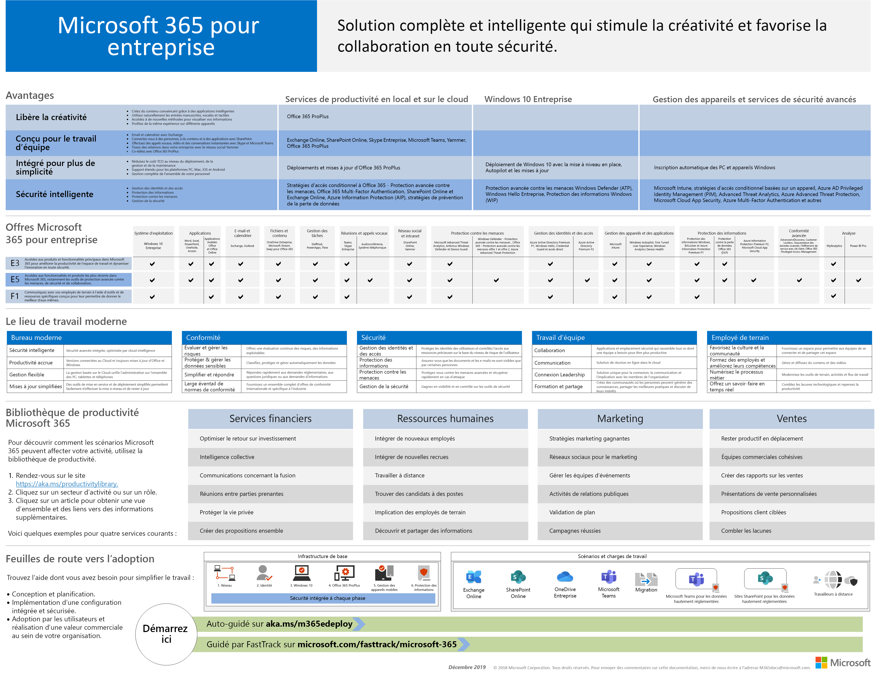
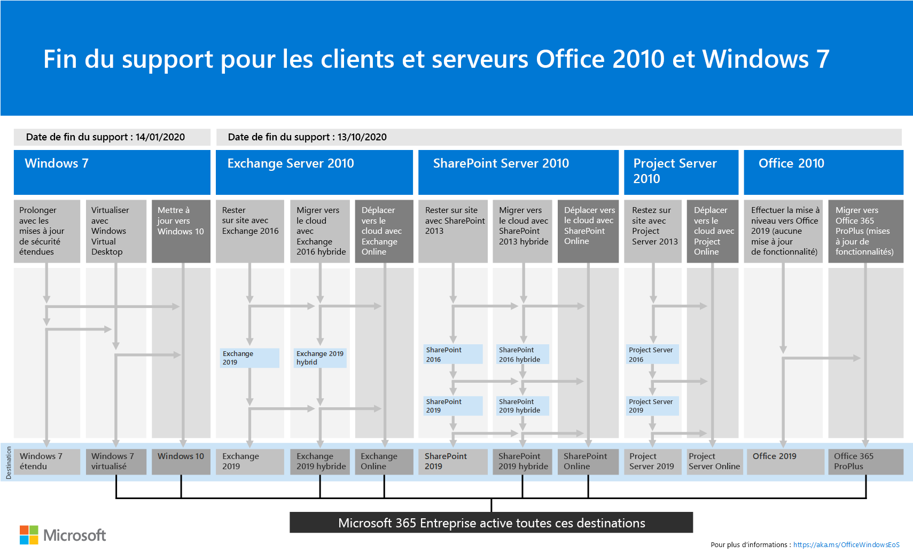

# Vue d’ensemble de Microsoft 365 Entreprise

Microsoft 365 Enterprise est une solution complète et intelligente qui permet à chacun d’être créatif et de collaborer en toute sécurité. 

Bien que conçu pour les grandes entreprises, Microsoft 365 Enterprise peut également être utilisé pour les petites et moyennes entreprises qui ont besoin des fonctionnalités de sécurité et de productivité les plus avancées. 

## Composants

Microsoft 365 Enterprise se compose des éléments suivants :

|||
|:-------|:-----|
| Services de productivité et applications locales et en nuage | Inclut Office 365 ProPlus, les dernières applications Office pour votre PC et Mac (par exemple, Word, Excel, PowerPoint, Outlook, etc.) et une suite complète de services en ligne pour la messagerie, le stockage de fichiers et la collaboration, les réunions et bien plus encore. |
| Windows 10 Entreprise | Répond aux besoins des organisations de grande et moyenne envergure, offrant aux utilisateurs la version de Windows et des professionnels de l’informatique la plus productive et la plus sécurisée avec un déploiement complet, des appareils et la gestion des applications. |
| Services de gestion des appareils et de sécurité avancée | Inclut Microsoft Intune, un service de gestion de la mobilité d’entreprise (EMM) basé sur le Cloud qui permet à vos employés d’être productifs tout en maintenant la protection des données de votre entreprise. |
|||

## Plans

Microsoft 365 Enterprise est disponible en trois plans.

|||
|:-------|:-----|
| E3 | Accédez aux produits et fonctionnalités principaux dans Microsoft 365 afin d’améliorer la productivité de l’espace de travail et de favoriser l’innovation, en toute sécurité. |
| E5 | Accédez aux derniers produits et fonctionnalités de Microsoft 365, y compris les outils de protection avancée contre les menaces, de sécurité et de collaboration.. Comprend toutes les fonctionnalités E3's, ainsi que les outils de sécurité, vocaux et d’analyse de données avancés. |
| F1 | Connectez-vous à vos collaborateurs terrain par le biais d’outils et de ressources spécialisés qui leur permettent d’effectuer leur travail. |
|||

Si vous avez Microsoft 365 Enterprise E3, vous pouvez également obtenir ces [offres](https://www.microsoft.com/microsoft-365/blog/2019/01/02/introducing-new-advanced-security-and-compliance-offerings-for-microsoft-365/):

- Identité & protection contre les menaces
- Protection des informations & conformité

Ces offres contiennent des fonctionnalités supplémentaires incluses dans Microsoft 365 entreprise E5.

Pour plus d’informations, reportez-vous à la rubrique [features and Capabilities for each plan](https://www.microsoft.com/microsoft-365/compare-all-microsoft-365-plans).

## Obtenir une vue d’ensemble

L' [affiche de Microsoft 365 entreprise](media/Microsoft365Enterprise.pdf) est un emplacement central où vous pouvez voir :

- Avantages de Microsoft 365 Enterprise et mode de correspondance entre les applications et les services et leur valeur pilier
- Plans d’entreprise Microsoft 365 et les composants qu’ils contiennent 
- Les principaux composants de l’espace de travail moderne, que Microsoft 365 entreprise active.
- La [bibliothèque de productivité Microsoft 365](https://www.microsoft.com/microsoft-365/success/) et les scénarios représentatifs pour certains services d’organisation courants
- Feuille de route d’adoption qui met en évidence le [Guide de déploiement](deploy-microsoft-365-enterprise.md) d’entreprise Microsoft 365

Pour télécharger une copie de l’affiche, cliquez [ici](https://github.com/MicrosoftDocs/microsoft-365-docs/raw/public/microsoft-365/enterprise/media/Microsoft365Enterprise.pdf).

## Transition de l’ensemble de votre organisation

Pour obtenir une meilleure idée de la façon de déplacer l’intégralité de votre organisation vers les produits et services de Microsoft 365 Enterprise, téléchargez l' [affiche de transition](media/deploy-microsoft-365-enterprise/transition-org-to-m365.pdf).

Cette affiche de deux pages est un moyen rapide d’inventorier votre infrastructure existante et d’accéder aux conseils pour passer au produit ou service correspondant dans Microsoft 365 entreprise. Elle inclut des produits Windows et Office, ainsi que d’autres éléments d’infrastructure et de sécurité, tels que la gestion des appareils, l’identité, la protection des informations et des menaces.

Vous pouvez également [Télécharger cette affiche](https://github.com/MicrosoftDocs/microsoft-365-docs/raw/public/microsoft-365/enterprise/media/deploy-microsoft-365-enterprise/transition-org-to-m365.pdf) et l’imprimer au format Letter, Legal ou tabloïd (11 x 17).

## Éviter la fin de la prise en charge pour les clients et serveurs Windows 7 et Office 2010

Les produits suivants ont atteint la fin du support le **14 janvier 2020**:

- [Windows 7](https://aka.ms/win7upgrade)

Les produits suivants ont atteint la fin du support le **13 octobre 2020**:

- [Office 2010](https://docs.microsoft.com/DeployOffice/office-2010-end-support-roadmap)
- [Exchange Server 2010](https://docs.microsoft.com/office365/enterprise/exchange-2010-end-of-support)
- [SharePoint Server 2010](https://docs.microsoft.com/office365/enterprise/upgrade-from-sharepoint-2010)

Pour obtenir un résumé visuel des options de mise à niveau, de migration et de déplacement sur le Cloud de ces produits, consultez l' [affiche de fin de support](media/migration-microsoft-365-enterprise-workload/Office2010Windows7EndOfSupport.pdf).

Cette affiche de page unique constitue un moyen rapide de comprendre les différents chemins que vous pouvez suivre pour empêcher les produits client et serveur Windows 7 et Office 2010 d’atteindre la fin du support, avec les chemins d’accès et le support préférés dans Microsoft 365 entreprise en surbrillance.

Vous pouvez également [Télécharger cette affiche](https://github.com/MicrosoftDocs/microsoft-365-docs/raw/public/microsoft-365/enterprise/media/migration-microsoft-365-enterprise-workload/Office2010Windows7EndOfSupport.pdf) et l’imprimer au format Letter, Legal ou tabloïd (11 x 17).

## Déployer

Il existe trois façons de déployer les produits, les fonctionnalités et les composants de Microsoft 365 Enterprise :

1. En partenariat avec FastTrack
  
   Avec FastTrack, les ingénieurs Microsoft vous aident à passer au Cloud à votre rythme. Voir [FastTrack pour Microsoft 365](https://fasttrack.microsoft.com/microsoft365).
  
2. À l’aide de Microsoft Consulting Services ou d’un [partenaire Microsoft](https://partner.microsoft.com/).

   Les consultants peuvent analyser votre infrastructure actuelle et vous aider à développer un plan d’incorporation de tous les logiciels et services de Microsoft 365 Enterprise.

3. Le faire vous-même

   Le [Guide de déploiement de Microsoft 365 Enterprise vous guide](deploy-microsoft-365-enterprise.md) pas à pas tout au long de la création des charges de travail de l’infrastructure et de la productivité. 

Pour plus d’informations sur le déploiement, voir How :

- [Les clients](deploy-microsoft-365-enterprise.md#how-customers-use-microsoft-365-enterprise) utilisent Microsoft 365 Enterprise.
- [Microsoft](deploy-microsoft-365-enterprise.md#how-microsoft-uses-microsoft-365-enterprise) utilise Microsoft 365 entreprise.
- [La société Contoso Corporation](contoso-overview.md), une organisation multinationale fictive mais représentative, a déployé Microsoft 365 entreprise.

## Autres solutions Microsoft 365

- [Microsoft 365 Business](https://docs.microsoft.com/microsoft-365/business/)
 
  Rassemblez les performances de pointe d’Office 365 en matière de productivité et de collaboration avec des solutions de sécurité et de gestion des appareils pour protéger les données professionnelles dans les petites et moyennes entreprises (SMB).

- [Microsoft 365 Éducation](https://docs.microsoft.com/education)
 
  Permet aux instructeurs de révéler leur créativité, promouvoir le travail en équipe et offrir une expérience simple et sécurisée dans une solution unique et abordable, conçue pour l’éducation.

- [Microsoft 365 Government](https://www.microsoft.com/microsoft-365/government)
 
  Permettre aux employés du secteur public américain de collaborer en toute sécurité.

## Formation Microsoft 365

|||
|:-------|:-----|
| Demandez-vous et travaillez sur une certification Microsoft 365.   Commencez par [Microsoft 365 Fundamentals](https://docs.microsoft.com/learn/paths/m365-fundamentals/).
|||

## Étape suivante

Si vous effectuez le déploiement vous-même, commencez votre [déploiement Microsoft 365 Enterprise](deploy-microsoft-365-enterprise.md).

## Voir aussi

[Page du produit Microsoft 365 Enterprise](https://www.microsoft.com/microsoft-365/enterprise)
