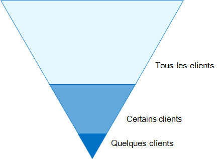
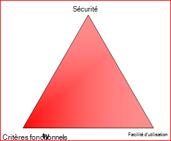

# Configurations des identités et de l’accès aux appareils

Le périmètre de sécurité moderne de votre organisation s’étend désormais au-delà de votre réseau pour inclure les utilisateurs qui accèdent aux applications Cloud à partir de n’importe quel emplacement avec un grand nombre d’appareils. Votre infrastructure de sécurité doit déterminer si une demande d’accès donnée doit être accordée et dans quelles conditions. 

Cette détermination doit être basée sur la connexion au compte d’utilisateur, l’appareil utilisé, les applications auxquelles l’utilisateur tente d’accéder, l’emplacement à partir duquel la demande d’accès est effectuée et une évaluation du risque de la demande. Cette fonctionnalité permet de s’assurer que seuls les utilisateurs et les appareils approuvés peuvent accéder à vos ressources critiques.

Cette série d’articles décrit un ensemble de configurations prérequises d’accès aux identités et aux appareils et un ensemble d’accès conditionnel Azure Active Directory (Azure AD), Microsoft Intune et d’autres stratégies pour sécuriser l’accès à Microsoft 365 pour les applications et les services Cloud d’entreprise, d’autres services SaaS et les applications locales publiées avec le proxy d’application Azure AD.

Les stratégies et les paramètres d’accès aux identités et aux appareils sont recommandés dans trois niveaux : protection de base, protection sensible et protection des environnements avec des données hautement réglementées ou classifiées. Ces niveaux, ainsi que leurs configurations correspondantes, fournissent des niveaux de protection cohérents entre les données, les identités et les appareils.

Ces fonctionnalités et leurs recommandations :

- Sont pris en charge dans Microsoft 365 E3 et Microsoft 365 E5.
- Sont alignés avec le [score de sécurité Microsoft](https://docs.microsoft.com/microsoft-365/security/mtp/microsoft-secure-score) ainsi que le [score d’identité dans Azure ad](https://docs.microsoft.com/azure/active-directory/fundamentals/identity-secure-score)et augmenteront ces scores pour votre organisation.
- Vous aidera à implémenter ces [cinq étapes pour sécuriser votre infrastructure d’identité](https://docs.microsoft.com/azure/security/azure-ad-secure-steps).

Si votre organisation a des besoins ou des complexités d’environnement uniques, utilisez ces recommandations comme point de départ. Toutefois, la plupart des organisations peuvent mettre en œuvre ces recommandations comme indiqué.

>[!Note]
>Microsoft vend également des licences Enterprise Mobility + Security (EMS) pour les abonnements Office 365. Les fonctionnalités d’EMS E3 et EMS E5 sont équivalentes à celles de Microsoft 365 E3 et Microsoft 365 E5. Pour plus d’informations, consultez la rubrique [forfaits EMS](https://www.microsoft.com/en-us/microsoft-365/enterprise-mobility-security/compare-plans-and-pricing) .
>

## Public cible

Ces recommandations sont destinées aux architectes d’entreprise et aux professionnels de l’informatique qui sont familiarisés avec les services de productivité et de sécurité en nuage Microsoft 365, qui incluent Azure AD (Identity), Microsoft Intune (gestion des périphériques) et Azure information protection (protection des données).

### Environnement du client

Les stratégies recommandées sont applicables aux organisations d’entreprise opérant entièrement dans le Cloud Microsoft et pour les clients ayant une infrastructure d’identité hybride, qui est une forêt de services de domaine Active Directory (AD DS) locale synchronisée avec un client Azure AD.

La plupart des recommandations fournies s’appuient sur les services disponibles uniquement avec Microsoft 365 E5, Microsoft 365 E3 avec l’identité & les licences de module complémentaire Threat Protection, EMS E5 ou Azure Premium P2.

Pour les organisations qui ne disposent pas de ces licences, Microsoft vous recommande au moins d’implémenter les [paramètres de sécurité par défaut](https://docs.microsoft.com/azure/active-directory/fundamentals/concept-fundamentals-security-defaults), inclus dans tous les plans Microsoft 365. 

### Observer lors

Votre organisation peut être soumise à des exigences réglementaires ou autres en matière de conformité, notamment des recommandations spécifiques pouvant nécessiter l’application de stratégies qui divergent de ces configurations recommandées. Ces configurations recommandent des contrôles de l’utilisation qui n’étaient pas disponibles par le passé. Nous recommandons ces contrôles car nous pensons qu’ils représentent un équilibre entre la sécurité et la productivité.  

Nous avons fait de notre mieux pour prendre en compte un grand nombre de besoins en matière de protection de l’organisation, mais nous ne sommes pas en mesure de tenir compte de toutes les exigences possibles ou de tous les aspects spécifiques de votre organisation.

## Trois niveaux de protection

La plupart des organisations ont des besoins spécifiques en matière de sécurité et de protection des données. Ces besoins varient selon leur secteur d’activité et selon les postes de travail en leur sein. Par exemple, votre service juridique et les administrateurs peuvent exiger des contrôles de sécurité et de protection des informations supplémentaires concernant la correspondance de leur courrier électronique qui ne sont pas requis pour d’autres divisions. 

Chaque secteur d’activité possède aussi sa propre réglementation spécialisée. Au lieu de fournir une liste de toutes les options de sécurité possibles ou une recommandation par segment d’industrie ou fonction, des recommandations ont été fournies pour trois niveaux différents de sécurité et de protection pouvant être appliqués en fonction de la granularité de vos besoins.

- **Baseline protection**: nous vous recommandons de définir une norme minimale pour la protection des données, ainsi que les identités et les appareils qui accèdent à vos données. Vous pouvez suivre ces recommandations de base pour fournir une protection par défaut efficace qui répond aux besoins de nombreuses organisations.
- **Protection sensible**: certains clients disposent d’un sous-ensemble de données qui doivent être protégées à des niveaux supérieurs, ou nécessitent que toutes les données soient protégées à un niveau supérieur. Vous pouvez renforcer la protection de l’ensemble ou des ensembles de données spécifiques dans votre environnement Microsoft 365. Nous vous recommandons de protéger les identités et les appareils qui accèdent à des données sensibles avec des niveaux de sécurité comparables.  
- **Hautement réglementé**: certaines organisations peuvent avoir une petite quantité de données qui est hautement classée, qui constituent des secrets commerciaux ou des données réglementées. Microsoft fournit des fonctionnalités pour aider les organisations à respecter de telles exigences, notamment de protection renforcée des appareils et des identités.

Ce guide vous montre comment implémenter la protection des identités et des périphériques pour chacune de ces niveaux de protection. Utilisez ces conseils comme point de départ pour votre organisation et ajustez les stratégies pour répondre aux besoins spécifiques de votre organisation.

Il est important d'utiliser des niveaux de protection cohérents pour l'ensemble de vos données, de vos identités et de vos appareils. Par exemple, si vous implémentez ces instructions, veillez à protéger vos données à des niveaux comparables. 

Le modèle **d’architecture Identity and Device protection for Microsoft 365** indique les fonctionnalités qui sont comparables.

    [Afficher en tant que PDF](../downloads/MSFT_cloud_architecture_identity&device_protection.pdf) \| [Télécharger en tant que fichier PDF](https://github.com/MicrosoftDocs/microsoft-365-docs/raw/public/microsoft-365/downloads/MSFT_cloud_architecture_identity&device_protection.pdf) \| [Télécharger en tant que Visio](https://github.com/MicrosoftDocs/microsoft-365-docs/raw/public/microsoft-365/downloads/MSFT_cloud_architecture_identity&device_protection.vsdx)  

De plus, consultez la solution « [déployer la protection des données pour la confidentialité des données](../solutions/information-protection-deploy.md) » pour protéger les informations stockées dans Microsoft 365.

## Compromis entre sécurité et productivité

L’implémentation d’une stratégie de sécurité nécessite des compromis entre la sécurité et la productivité. Il est utile d’évaluer la façon dont chaque décision influe sur l’équilibre de la sécurité, des fonctionnalités et de la convivialité.

Les recommandations fournies sont basées sur les principes suivants :

- Connaître vos utilisateurs et répondre à leurs besoins en matière de sécurité et de fonctionnement.
- Appliquer une stratégie de sécurité juste à temps et s’assurer qu’elle est significative.

## Services et concepts relatifs à la protection de l’accès aux identités et aux appareils

Microsoft 365 pour Enterprise est conçu pour les grandes organisations afin de permettre à chacun d’être créatif et de collaborer en toute sécurité.

Cette section fournit une vue d’ensemble des services et des fonctionnalités Microsoft 365 qui sont importants pour l’accès aux identités et aux appareils.

### Azure AD

Azure AD fournit une suite complète de fonctionnalités de gestion des identités. Nous vous recommandons d’utiliser ces fonctionnalités pour sécuriser l’accès.

| Fonctionnalité | Description | Licence |
|:-------|:-----|:-------|
| [Authentification multifacteur (MFA)](/azure/active-directory/authentication/concept-mfa-howitworks) | L’authentification multifacteur exige que les utilisateurs fournissent deux formes de vérification, telles qu’un mot de passe utilisateur, ainsi qu’une notification de l’application Microsoft Authenticator ou d’un appel téléphonique. MFA réduit considérablement le risque que des informations d’identification volées puissent être utilisées pour accéder à votre environnement. Microsoft 365 utilise le service d’authentification multifacteur Azure pour les connexions MFA. | Microsoft 365 E3 ou E5 |
| [Accès conditionnel](/azure/active-directory/conditional-access/overview) | Azure AD évalue les conditions de connexion de l’utilisateur et utilise des stratégies d’accès conditionnel pour déterminer l’accès autorisé. Par exemple, dans ce guide, nous vous montrons comment créer une stratégie d’accès conditionnel pour exiger la conformité de l’appareil pour l’accès aux données sensibles. Cela réduit considérablement le risque qu’un pirate avec son propre appareil et des informations d’identification dérobées puisse accéder à vos données sensibles. Il protège également les données sensibles sur les appareils, car les appareils doivent répondre à des exigences spécifiques en matière d’intégrité et de sécurité. | Microsoft 365 E3 ou E5 |
| [Groupes Azure AD](/azure/active-directory/fundamentals/active-directory-manage-groups) | Les stratégies d’accès conditionnel, la gestion des appareils avec Intune, et même les autorisations sur les fichiers et les sites de votre organisation, dépendent de l’affectation à des comptes d’utilisateurs ou à des groupes Azure AD. Nous vous recommandons de créer des groupes Azure AD qui correspondent aux niveaux de protection que vous implémentez. Par exemple, votre personnel exécutif est probablement plus à même de cibler des pirates. Par conséquent, il est logique d’ajouter les comptes d’utilisateur de ces employés à un groupe Azure AD et d’affecter ce groupe aux stratégies d’accès conditionnelles et à d’autres stratégies qui appliquent un niveau de protection plus élevé pour l’accès. | Microsoft 365 E3 ou E5 |
| [Enregistrement de l’appareil](/azure/active-directory/devices/overview) | Vous inscrivez un appareil dans Azure AD pour créer une identité pour l’appareil. Cette identité est utilisée pour authentifier l’appareil lorsqu’un utilisateur se connecte et pour appliquer des stratégies d’accès conditionnel qui nécessitent des PC joints à un domaine ou des PC conformes. Pour ce guide, nous utilisons l’inscription d’appareil pour inscrire automatiquement des ordinateurs Windows associés à un domaine. L’enregistrement d’appareil est une condition préalable à la gestion des appareils avec Intune. | Microsoft 365 E3 ou E5 |
| [Azure AD Identity Protection](/azure/active-directory/identity-protection/overview) | Vous permet de détecter les vulnérabilités potentielles affectant les identités de votre organisation et de configurer la stratégie de correction automatisée sur un risque de connexion faible, moyen et élevé, ainsi que sur un risque utilisateur. Ces instructions s’appuient sur cette évaluation des risques pour appliquer des stratégies d’accès conditionnel pour l’authentification multifacteur. Ce guide inclut également une stratégie d’accès conditionnel qui exige que les utilisateurs modifient leur mot de passe si l’activité à haut risque est détectée pour leur compte. | Microsoft 365 E5, Microsoft 365 E3 avec l’identité & les licences de module complémentaire Threat Protection, EMS E5 ou Azure Premium P2 |
| [Réinitialisation du mot de passe en libre-service (SSPR)](/azure/active-directory/authentication/concept-sspr-howitworks) | Autorisez vos utilisateurs à réinitialiser leur mot de passe en toute sécurité et sans intervention de l’assistance, en fournissant la vérification de plusieurs méthodes d’authentification que l’administrateur peut contrôler. | Microsoft 365 E3 ou E5 |
| [Protection par mot de passe Azure ad](https://docs.microsoft.com/azure/active-directory/authentication/concept-password-ban-bad). Détectez et bloquez les mots de passe faibles connus et leurs variantes, ainsi que les termes faibles supplémentaires propres à votre organisation. Les listes de mots de passe interdites globaux par défaut sont automatiquement appliquées à tous les utilisateurs d’un client Azure AD. Vous pouvez définir des entrées supplémentaires dans une liste de mots de passe interdits personnalisés. Lorsque les utilisateurs modifient ou réinitialisent leur mot de passe, ces listes de mots de passe bannis sont vérifiées pour appliquer l’utilisation de mots de passe forts. |  Microsoft 365 E3 ou E5 |
||||

### Microsoft Intune

[Intune](https://docs.microsoft.com/intune/introduction-intune) est le service de gestion des appareils mobiles de Microsoft basé sur le Cloud. Ce guide recommande la gestion des périphériques Windows avec Intune et recommande des configurations de stratégie de conformité des appareils. Intune détermine si les appareils sont conformes et envoie ces données à Azure AD pour les utiliser lors de l’application de stratégies d’accès conditionnel.

#### Protection des applications Intune

Les stratégies [Intune App protection](https://docs.microsoft.com/intune/app-protection-policy) peuvent être utilisées pour protéger les données de votre organisation dans les applications mobiles, avec ou sans l’enregistrement d’appareils dans la gestion. Intune contribue à protéger les informations, en veillant à ce que vos employés puissent toujours être productifs et empêcher la perte de données. En implémentant des stratégies au niveau de l’application, vous pouvez restreindre l’accès aux ressources de l’entreprise et conserver les données dans le contrôle de votre service informatique.

Ce guide vous montre comment créer des stratégies recommandées pour appliquer l’utilisation des applications approuvées et déterminer comment ces applications peuvent être utilisées avec vos données métiers.

### Microsoft 365

Ce guide vous montre comment implémenter un ensemble de stratégies pour protéger l’accès aux services Cloud de Microsoft 365, notamment Microsoft Teams, Exchange Online, SharePoint Online et OneDrive entreprise. En plus de mettre en œuvre ces stratégies, nous vous recommandons d’augmenter également le niveau de protection de votre client à l’aide de ces ressources :

- [Configurer votre locataire pour une sécurité accrue](../security/office-365-security/tenant-wide-setup-for-increased-security.md)

  Recommandations qui s’appliquent à la sécurité de base pour votre client.

- [Feuille de route de sécurité : principales priorités des 30 premiers jours, 90 jours et au-delà](../security/office-365-security/security-roadmap.md)

  Les recommandations qui incluent la journalisation, la gouvernance des données, l’accès administrateur et la protection contre les menaces.

### Windows 10 et Microsoft 365 Apps for enterprise

Windows 10 avec Microsoft 365 apps pour entreprises est l’environnement client recommandé pour les PC. Nous vous recommandons d’utiliser Windows 10 car Azure est conçu pour offrir l’expérience la plus facile possible pour les versions locale et Azure AD. Windows 10 inclut également des fonctionnalités de sécurité avancées qui peuvent être gérées via Intune. Microsoft 365 Apps for Enterprise inclut les versions les plus récentes des applications Office. Ces éléments utilisent l’authentification moderne, qui est plus sécurisée et nécessite un accès conditionnel. Ces applications incluent également des outils de sécurité et de conformité améliorés.

## Application de ces fonctionnalités aux trois niveaux de protection

Le tableau suivant résume nos recommandations pour l’utilisation de ces fonctionnalités dans les trois niveaux de protection.

|Mécanisme de protection|Baseline|Sensible|Hautement réglementé|
|:-------------------|:-------|:--------|:---------------|
|**Appliquer une authentification multifacteur**|En cas de risque de connexion moyen ou supérieur|En cas de risque de connexion faible ou supérieur|Pour toutes les nouvelles sessions|
|**Appliquer la modification du mot de passe**|Pour les utilisateurs à haut risque|Pour les utilisateurs à haut risque|Pour les utilisateurs à haut risque|
|**Appliquer la protection des applications Intune**|Oui|Oui|Oui|
|**Appliquer l’enregistrement Intune pour l’appareil appartenant à l’Organisation**|Exiger un PC conforme ou joint à un domaine, mais autoriser les téléphones et les tablettes BYOD|Exiger un appareil compatible ou joint à un domaine|Exiger un appareil compatible ou joint à un domaine|

## Propriété des appareils

Le tableau ci-dessus reflète la tendance pour de nombreuses organisations à prendre en charge un mélange d’appareils appartenant à une organisation, ainsi que des périphériques personnels ou BYODs pour permettre une productivité mobile au sein du personnel. Les stratégies de protection des applications Intune garantissent que les messages électroniques sont protégés contre les exfiltrating de l’application mobile Outlook et d’autres applications mobiles Office, sur les appareils appartenant à une organisation et BYODs.  

Nous recommandons que les appareils appartenant à une organisation soient gérés par Intune ou par un domaine joint pour appliquer des protections et des contrôles supplémentaires. En fonction de la sensibilité des données, votre organisation peut choisir de ne pas autoriser BYODs pour des populations d’utilisateurs spécifiques ou des applications spécifiques.

## Étapes du processus de configuration de l’accès aux identités et aux appareils

1. Configurez les fonctionnalités d’identité prérequises et leurs paramètres.
2. Configurez les stratégies d’identité et d’accès conditionnel d’accès courantes.
3. Configurez les stratégies d’accès conditionnel pour les utilisateurs invités et externes.
4. Configurez des stratégies d’accès conditionnel pour les applications Cloud Microsoft 365, telles que Microsoft Teams, Exchange Online et SharePoint.

## Étape suivante

[Tâches préalables à l’implémentation de stratégies d’accès aux identités et aux appareils](identity-access-prerequisites.md)
