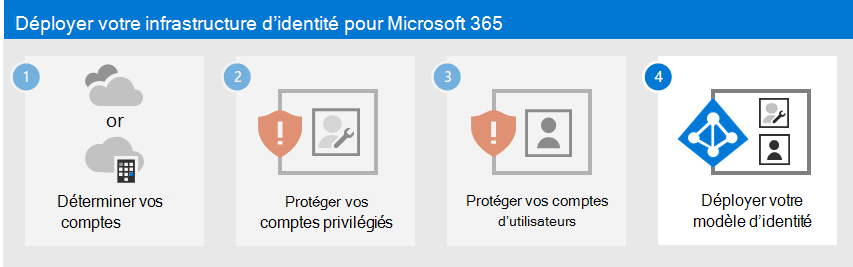

# Étape 3 : Protéger vos comptes d’utilisateur Microsoft 365

Pour renforcer la sécurité des connexions des utilisateurs :

- Utiliser Windows Hello Entreprise
- Utilisez la protection par mot de passe Azure Active Directory (Azure AD).
- Utilisez l’authentification multifacteur (MFA)
- Déployer les configurations des identités et de l’accès aux appareils
- Protégez-vous contre la compromission d’informations d’identification avec Azure AD protection des identités

## Windows Hello Entreprise

Windows Hello Entreprise dans Windows 10 Entreprise remplace les mots de passe par une authentification à deux facteurs forte lors de la connexion à un appareil Windows. Les deux facteurs sont un nouveau type d’informations d’identification d’utilisateur qui est lié à un appareil et à un code biométrique ou PIN.

Pour plus d’informations, consultez [Vue d’ensemble de Windows Hello Entreprise](/windows/security/identity-protection/hello-for-business/hello-overview).

## Protection par mot de passe Azure AD.

La protection par mot de passe Azure AD détecte et bloque les mots de passe faibles connus et leurs variantes, et peut également bloquer d’autres termes faibles définis par votre organisation. Les listes générales par défaut de mots de passe interdits sont automatiquement appliquées à tous les utilisateurs d’un client Azure AD. Vous pouvez définir d’autres entrées dans une liste personnalisée de mots de passe interdits. Lorsque les utilisateurs modifient ou réinitialisent leurs mots de passe, ces listes sont vérifiées de façon à garantir l’utilisation de mots de passe forts.

Pour plus d’informations, voir [Configurer la protection par mot de passe Azure AD](/azure/active-directory/authentication/concept-password-ban-bad).

## Authentification multifacteur

L’authentification multifacteur exige que les connexions des utilisateurs fassent l’objet d’une vérification supplémentaire, au-delà du mot de passe du compte d’utilisateur. Même si un utilisateur malveillant détermine un mot de passe de compte d’utilisateur, il doit également répondre à une vérification supplémentaire, par exemple, un message texte envoyé vers un smartphone, avant que l’accès ne lui soit accordé.

La première étape de l’utilisation de l’authentification multifacteur est de [l’imposer à tous les comptes d’administrateurs](protect-your-global-administrator-accounts.md), également appelés comptes privilégiés. Une fois cette première étape effectuée, Microsoft recommande l’authentification multifacteur pour tous les utilisateurs.

Trois méthodes s’offrent à vous pour obliger vos utilisateurs à utiliser l’authentification multifacteur basée sur votre offre Microsoft 365.

| Planification | Recommandation |
|---------|---------|
|Toutes les offres Microsoft 365 (sans licence Azure AD Premium P1 ou P2)     |[Activer les paramètres de sécurité par défaut dans Azure AD](/azure/active-directory/fundamentals/concept-fundamentals-security-defaults). La sécurité par défaut d’Azure AD inclut l’authentification multifacteur pour les utilisateurs et les administrateurs.   |
|Microsoft 365 E3 (inclut les licences Azure AD Premium P1)     | Utilisez les [stratégies d’accès conditionnel courantes](/azure/active-directory/conditional-access/concept-conditional-access-policy-common) pour configurer les stratégies suivantes :  - [Exiger l’authentification multifacteur pour les administrateurs](/azure/active-directory/conditional-access/howto-conditional-access-policy-admin-mfa)  - [Exiger l’authentification multifacteur pour tous les utilisateurs](/azure/active-directory/conditional-access/howto-conditional-access-policy-all-users-mfa)   - [Bloquer l’authentification héritée](/azure/active-directory/conditional-access/howto-conditional-access-policy-block-legacy)       |
|Microsoft 365 E5 (inclut les licences Azure AD Premium P2)     | Pour tirer parti de la protection d’identité Azure AD Identity Protection, commencez par implémenter la série recommandée par Microsoft concernant l’accès conditionnel et les stratégies associées en créant les deux stratégies suivantes :  - [Exiger l’authentification multifacteur lorsque le risque de connexion est moyen ou élevé](/azure/active-directory/conditional-access/howto-conditional-access-policy-risk)  - [Les utilisateurs à risque élevé doivent modifier leur mot de passe](/azure/active-directory/conditional-access/howto-conditional-access-policy-risk-user)       |
| | |

### Paramètres de sécurité par défaut

Les paramètres de sécurité par défaut sont une nouvelle fonctionnalité pour Microsoft 365 et les abonnements Office 365 payants ou en version d’évaluation créés après le 21 octobre 2019. Les paramètres de sécurité par défaut de ces abonnements sont activés, ce qui ***nécessite que tous vos utilisateurs utilisent l’authentification multifacteur à l’aide de l’application Microsoft Authenticator***.
 
Les utilisateurs disposent de 14 jours pour s’inscrire à l’authentification multifacteur de l’application Microsoft Authenticator sur leur smartphone, un délai qui commence dès la première connexion suivant l’activation des paramètres de sécurité par défaut. Lorsque les 14 jours sont écoulés, l’utilisateur ne peut pas se connecter tant que son inscription à l’authentification multifacteur n’est pas terminée.

Les paramètres de sécurité par défaut garantissent que toutes les organisations ont un niveau de sécurité de base qui est activé par défaut pour la connexion des utilisateurs. Vous pouvez désactiver les paramètres de sécurité par défaut en faveur de l’authentification multifacteur avec des stratégies d’accès conditionnel ou pour des comptes individuels.

Pour plus d’informations, consultez [Vue d’ensemble des paramètres de sécurité par défaut](/azure/active-directory/fundamentals/concept-fundamentals-security-defaults).

### Stratégies d’accès conditionnel

Les stratégies d’accès conditionnel sont un groupe de règles qui spécifient les conditions dans lesquelles les connexions sont évaluées et l’accès autorisé. Par exemple, vous pouvez créer une stratégie d’accès conditionnel qui indique :

- Si le nom du compte d’utilisateur est membre d’un groupe pour les utilisateurs qui se voit attribuer les rôles d’administrateur Exchange, utilisateur, mot de passe, sécurité, SharePoint, **administrateur Exchange,** **administrateur SharePoint** ou **administrateur global**, exigez l’authentification multifacteur avant d’autoriser l’accès.

Cette stratégie vous permet de demander une authentification multifacteur basée sur l’appartenance au groupe, plutôt que d’essayer de configurer des comptes d’utilisateur individuels pour l’authentification multifacteur lorsqu’ils sont attribués ou non à des rôles d’administrateur.

Vous pouvez également utiliser les stratégies d’accès conditionnel pour des fonctionnalités plus avancées, telles que la nécessité de se connecter à partir d’un appareil compatible, tel que votre ordinateur portable fonctionnant sous Windows 10.

Les licences d’accès conditionnel exige Azure AD Premium P1, lesquelles sont incluses dans Microsoft 365 E3 et E5.

Si vous souhaitez en savoir plus, consultez la [Présentation de l’accès conditionnel](/azure/active-directory/conditional-access/overview).

### Utilisation combinée des méthodes

Gardez les éléments suivants à l’esprit :

- Vous ne pouvez pas activer les paramètres de sécurité par défaut si vous avez activé des stratégies d’accès conditionnel.
- Vous ne pouvez pas activer de stratégie d’accès conditionnel si les paramètres de sécurité par défaut sont activés.

Si les paramètres de sécurité par défaut sont activés, les nouveaux utilisateurs sont invités à s’inscrire pour l’authentification multifacteur et à utiliser l’application Microsoft Authenticator. 

Ce tableau présente les résultats de l’activation de l’authentification multifacteur avec les paramètres de sécurité par défaut et les stratégies d’accès conditionnel.

| Méthode | Activé | Désactivé | Méthode d'authentification supplémentaire |
|:-------|:-----|:-------|:-------|
| **Paramètres de sécurité par défaut**  | Ne peut pas utiliser les stratégies d’accès conditionnel | Peut utiliser les stratégies d’accès conditionnel | Application Microsoft Authenticator |
| **Stratégies d’accès conditionnel** | Si l’une d’elles est activée, vous ne pouvez pas activer les paramètres de sécurité par défaut | Si tous ces éléments sont désactivés, vous pouvez activer les paramètres de sécurité par défaut  | Utilisateur spécifié lors de l’inscription à l’authentification multifacteur  |
||||

## Configurations des identités Zéro confiance et de l’accès aux appareils

Les paramètres et stratégies d’accès aux appareils et aux identités de confiance zéro sont des fonctionnalités préalables recommandées et leurs paramètres combinés avec l’accès conditionnel, Intune et les stratégies de Azure AD Identity Protection qui déterminent si une demande d’accès donnée doit être accordée et dans quelles conditions. La décision se fonde sur le compte d’utilisateur utilisé pour la connexion, l’appareil utilisé, l’application utilisée par l’utilisateur pour l’accès, l’emplacement depuis lequel la demande d’accès est émise et l’évaluation du risque lié à la demande. Cela permet de s’assurer que seuls les utilisateurs et les appareils approuvés ont accès aux ressources critiques de l’entreprise.

>[!Note]
>Azure AD Identity Protection requiert des licences Azure AD Premium P2, incluses dans Microsoft 365 E5.
>

Les stratégies d’identité et d’accès aux appareils sont définies pour une utilisation à trois niveaux : 

- La protection de base constitue un niveau de sécurité minimal pour les identités et appareils qui accèdent à vos applications et données.
- La protection sensible propose une sécurité supplémentaire pour les données spécifiques. Les identités et les appareils doivent démontrer des niveaux de sécurité et d’intégrité des appareils plus élevés.
- La protection des environnements comportant des données hautement réglementées ou classifiées est généralement limitée à de petites quantités de données hautement classifiées, comportant des secrets commerciaux ou soumises à des réglementations sur les données. Les identités et les appareils doivent démontrer des niveaux de sécurité et d’intégrité des appareils bien plus élevés. 

Ces niveaux de protection et les configurations correspondantes apportent des niveaux de protection cohérents selon les données, les identités et les appareils.

Microsoft recommande vivement de configurer et de déployer des stratégies d’identité et d’appareil de confiance zéro dans votre organisation, notamment des paramètres spécifiques pour Microsoft Teams, Exchange Online et SharePoint. Pour plus d’informations, consultez [Configurations d'identités et d'accès aux appareils de confiance zéro](../security/office-365-security/microsoft-365-policies-configurations.md).

## Azure AD Identity Protection

Dans cette section, vous allez découvrir comment configurer des stratégies qui protègent contre la compromission des informations d’identification, où un attaquant détermine le nom de compte et le mot de passe d’un utilisateur pour accéder aux données et services cloud d’une organisation. Azure AD Identity Protection fournit plusieurs moyens d’empêcher un attaquant de compromettre les informations d’identification d’un compte d’utilisateur.

Azure AD Identity Protection vous permet de :

|Fonctionnalité|Description|
|:---------|:---------|
| déterminer et résoudre les vulnérabilités potentielles dans les identités de votre organisation ; | Azure AD utilise le Machine Learning pour détecter les anomalies et les activités suspectes, telles que les connexions et les activités de post-connexion. À l’aide de ces données, Azure AD Identity Protection génère des rapports et des alertes qui vous aident à évaluer les problèmes et à prendre des mesures.|
|Détecter des actions douteuses qui sont liées aux identités de votre organisation et y répondre automatiquement|Vous pouvez configurer des stratégies basées sur les risques qui répondent automatiquement aux problèmes détectés lorsqu’un niveau de risque spécifié a été atteint. Ces stratégies, en plus d’autres contrôles d’accès conditionnel fournis par Azure AD et Microsoft Intune, peuvent bloquer automatiquement l’accès ou prendre des mesures correctives, y compris les réinitialisations de mot de passe et exiger Azure AD Multi-Factor Authentication pour les connexions ultérieures. |
| Examiner les incidents suspects et les résoudre avec des actions d’administration | Vous pouvez examiner des événements à risque en utilisant les informations sur l’incident de sécurité. Des flux de travail de base sont disponibles pour effectuer le suivi des enquêtes et lancer des actions de correction, telles que des réinitialisations du mot de passe. |
|||

[Plus d’informations sur Azure AD Identity Protection](/azure/active-directory/identity-protection/overview-identity-protection).

Reportez-vous à la rubrique des [étapes pour activer Azure AD Identity Protection](/azure/active-directory/identity-protection/howto-identity-protection-configure-risk-policies).

## Ressources techniques pour l’administrateur pour l’authentification multifacteur et la connexion sécurisée

- [Authentification multifacteur pour Microsoft 365](../admin/security-and-compliance/multi-factor-authentication-microsoft-365.md)
- [Déployer l’identité pour Microsoft 365](deploy-identity-solution-overview.md)
- [Vidéos de formation d’Azure Academy Azure AD](https://www.youtube.com/watch?v=pN8o0owHfI0&list=PL-V4YVm6AmwUFpC3rXr2i2piRQ708q_ia)
- [Configurer la stratégie d’inscription Azure AD Multi-Factor Authentication](/azure/active-directory/identity-protection/howto-identity-protection-configure-mfa-policy)
- [Configurations des identités et de l’accès aux appareils](../security/office-365-security/microsoft-365-policies-configurations.md)

## Étape suivante

Poursuivez avec l’étape 4 pour déployer l’infrastructure d’identité en fonction du modèle d’identité que vous avez choisi :

- [Identité cloud uniquement](cloud-only-identities.md)
- [Identité hybride](prepare-for-directory-synchronization.md)
