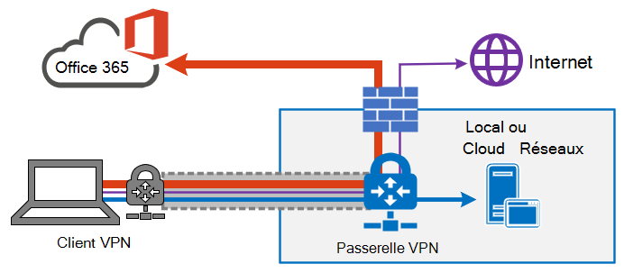
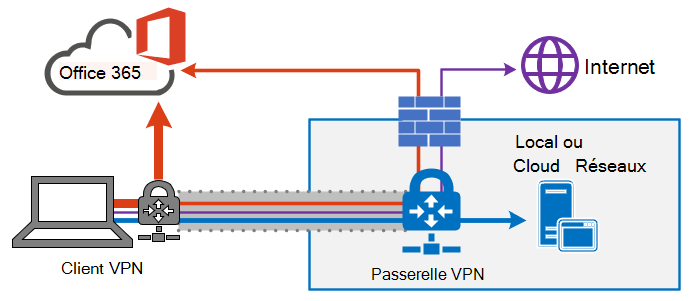
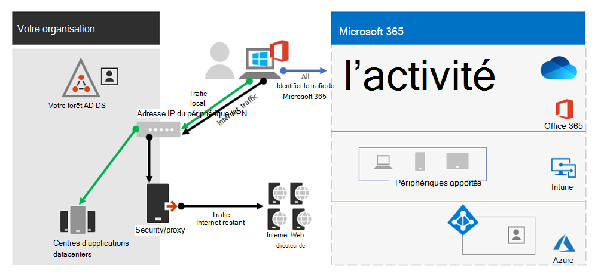
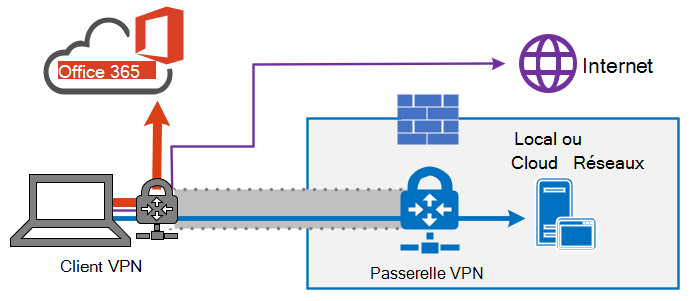
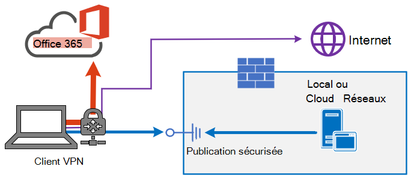
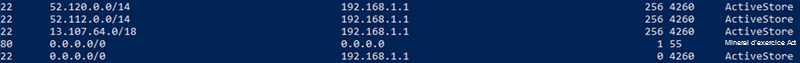

# <a name="implementing-vpn-split-tunneling-for-office-365"></a>Implémentation d'un tunnel VPN partagé pour Office 365

>[!NOTE]
>Cette rubrique fait partie d’un groupe de rubriques qui traitent de l’optimisation d’Office 365 pour les utilisateurs distants.
>- Pour obtenir une vue d’ensemble de l’utilisation d’un tunnel VPN partagé pour optimiser la connectivité Office 365 pour les utilisateurs distants, voir [vue d’ensemble : tunnel VPN partagé pour Office 365](microsoft-365-vpn-split-tunnel.md).
>- Pour plus d’informations sur l’optimisation des performances du locataire Office 365 dans le monde pour les utilisateurs résidant en Chine, consultez [Optimisation des performances de Microsoft Office 365 pour les utilisateurs résidant en Chine](microsoft-365-networking-china.md).

Depuis de nombreuses années, les entreprises utilisent des VPN pour prendre en charge les expériences à distance pour leurs utilisateurs. Bien que les charges de travail principales soient restées en local, un réseau privé virtuel (VPN) du client distant routé via un centre de données sur le réseau d’entreprise constituait la méthode principale permettant aux utilisateurs distants d’accéder aux ressources de l’entreprise. Pour protéger ces connexions, les entreprises construisent des couches de solutions de sécurité réseau sur les chemins VPN. Cette sécurité a été conçue pour protéger l’infrastructure interne et pour protéger la navigation mobile des sites web externes en réroutant le trafic vers le VPN, puis via le périmètre Internet local. Les VPN, les périmètres réseau et l’infrastructure de sécurité associée ont souvent été conçus et mis à l’échelle pour un volume de trafic défini, généralement avec la plupart de la connectivité initiée à partir du réseau d’entreprise et la plupart d’entre elles restant dans les limites du réseau interne.

Pendant un certain temps, les modèles VPN où toutes les connexions à partir de l’appareil utilisateur distant sont routés vers le réseau local (appelées _tunnel imposé_) étaient très durables tant que l’échelle simultanée des utilisateurs distants était modeste et que les volumes de trafic qui traversent le réseau privé (VPN) étaient faibles.  Certains clients ont continué à utiliser le tunnel de force VPN comme état de fait, même après que leurs applications soient déplacées de l'intérieur du périmètre de l'entreprise vers des clouds SaaS publics, Office 365 étant un excellent exemple.

L’utilisation de VPN tunnelés forcés pour la connexion à des applications cloud distribuées et sensibles aux performances est sous-optimale, mais l’effet négatif de cette opération a peut-être été accepté par certaines entreprises afin de maintenir le quo du point de vue de la sécurité. Un exemple de diagramme de ce scénario est illustré ci-dessous :


This problem has been growing for many years, with many customers reporting a significant shift of network traffic patterns. Le trafic qui était utilisé pour rester sur site se connecte désormais aux points de terminaison cloud externes. De nombreux clients Microsoft signalaient qu’auparavant, environ 80% du trafic réseau était une source interne (représentée par une ligne pointillée dans le diagramme ci-dessus). En 2020, ce nombre est à présent environ 20% ou plus, car les charges de travail majeures ont été déplacées vers le cloud, mais ces tendances ne sont pas rares pour les autres entreprises. Au fil du temps, au fur et à mesure de l’avancement du projet, le modèle ci-dessus devient de plus en plus encombrant et peu viable, empêchant une organisation d'être flexible au fur et à mesure de son déplacement dans un premier monde de cloud.

La crise mondiale de grippe COVID-19 a aggravé ce problème et exige des mesures correctives immédiates. La nécessité d'assurer la sécurité des employés a généré des demandes sans précédent en matière de technologies de l'information pour prendre en charge la productivité du travail à domicile à une échelle massive. Microsoft Office 365 est bien positionnée pour aider les clients à répondre à cette demande, mais la forte concurrence des utilisateurs travaillant à domicile génère un volume important de trafic Office 365 qui, s’il est acheminé via un tunnel forcé VPN et des périmètres réseau locaux, entraîne une saturation rapide et exécute l’infrastructure VPN hors capacité. Dans cette nouvelle réalité, l’utilisation du VPN pour accéder à Office 365 n’est plus seulement un obstacle aux performances, mais un mur dur qui non seulement a un impact sur les Office 365 mais également sur les opérations d’entreprise critiques qui doivent encore s’appuyer sur le VPN pour fonctionner.

Microsoft travaille en étroite collaboration avec des clients et une grande industrie depuis de nombreuses années afin d’offrir des solutions efficaces et modernes à ces problèmes à partir de nos propres services et de s’adapter aux meilleures pratiques industrielles. Les [principes de connectivité](./microsoft-365-network-connectivity-principles.md) du service Office 365 ont été conçus pour fonctionner de manière efficace pour les utilisateurs distants tout en permettant à une organisation de maintenir la sécurité et le contrôle de leur connectivité. Ces solutions peuvent également être implémentées rapidement avec un travail limité tout en ayant un impact positif significatif sur les problèmes décrits ci-dessus.

La stratégie recommandée par Microsoft pour optimiser la connectivité des travailleurs distants vise à atténuer rapidement les problèmes liés à l'approche classique et à fournir des performances élevées en quelques étapes simples. Ces étapes ajustent l’approche VPN héritée pour quelques points de terminaison définis qui contournent les serveurs VPN en goulot d’étranglement. Un modèle de sécurité équivalent, voire supérieur, peut être appliqué dans différentes couches pour supprimer la nécessité de sécuriser tout le trafic à la sortie du réseau d’entreprise. Dans la plupart des cas, cela peut être réalisé de façon efficace en quelques heures, et est ensuite évolutif vers d’autres charges de travail en cas de besoin.

## <a name="common-vpn-scenarios"></a>Scénarios VPN courants

Dans la liste ci-dessous, vous verrez les scénarios VPN les plus courants dans les environnements d’entreprise. La plupart des clients utilisent généralement le modèle 1 (tunnel imposé VPN). Cette section vous aidera à passer rapidement et en toute sécurité au modèle **2,** qui est réalisable avec un effort relativement faible et qui présente d’importants avantages en terme de performances réseau et d’expérience utilisateur.

| Modèle | Description |
| --- | --- |
| [1. Tunnel imposé VPN](#1-vpn-forced-tunnel) | 100 % du trafic passe dans le tunnel VPN, y compris sur site, Internet et tout O365/M365 |
| [2. Tunnel imposé VPN avec quelques exceptions](#2-vpn-forced-tunnel-with-a-small-number-of-trusted-exceptions) | Le tunnel VPN est utilisé par défaut (point d’itinéraire par défaut vers VPN), avec peu de scénarios d’exemption les plus importants autorisés à passer directement |
| [3. Tunnel imposé VPN avec de larges exceptions](#3-vpn-forced-tunnel-with-broad-exceptions) | Le tunnel VPN est utilisé par défaut (point d’itinéraire par défaut vers VPN), avec de larges exceptions qui sont autorisées à être acheminées directement (par exemple, tous les Office 365, tous les Salesforce, tous les Zoom). |
| [4. Tunnel sélectif VPN](#4-vpn-selective-tunnel) | Le tunnel VPN est utilisé uniquement pour les services basés sur un réseau d’entreprise. L’itinéraire par défaut (Internet et tous les services Internet) est directement acheminé. |
| [5. Pas de VPN](#5-no-vpn) | Variante de #2, où au lieu du VPN hérité, tous les services de réseau d’entreprise sont publiés par le biais d’approches de sécurité modernes (comme Zscaler ZPA, Azure Active Directory (Azure AD) Proxy/MCAS, etc.) |

### <a name="1-vpn-forced-tunnel"></a>1. Tunnel imposé VPN

Il s’agit du scénario de départ le plus courant pour la plupart des clients professionnels. Un VPN forcé est utilisé, ce qui signifie que 100 % du trafic est dirigé vers le réseau d’entreprise, que le point de terminaison réside ou non dans le réseau d’entreprise. Tout trafic externe (Internet) tel que Office 365 ou la navigation Internet est ensuite épinglé à l’extérieur de l’équipement de sécurité local, tel que les proxies. Dans le monde actuel où près de 100 % des utilisateurs travaillent à distance, ce modèle met donc une charge élevée sur l’infrastructure VPN et est susceptible d’entraver considérablement les performances de l’ensemble du trafic d’entreprise et donc de l’entreprise pour fonctionner efficacement en temps de crise.



### <a name="2-vpn-forced-tunnel-with-a-small-number-of-trusted-exceptions"></a>2. Tunnel imposé VPN avec un petit nombre d’exceptions approuvées

Ce modèle est beaucoup plus efficace pour qu’une entreprise fonctionne sous, car il permet à quelques points de terminaison contrôlés et définis qui sont très sensibles à la charge et à la latence de contourner le tunnel VPN et d’aller directement au service Office 365 dans cet exemple. Cela améliore considérablement les performances des services déchargés et réduit également la charge sur l’infrastructure VPN, ce qui permet aux éléments qui en ont encore besoin de fonctionner avec une contention moindre des ressources. C’est sur ce modèle que cet article se concentre sur l’assistance à la transition, car il permet d’agir rapidement sur des actions simples et définies avec de nombreux résultats positifs.



### <a name="3-vpn-forced-tunnel-with-broad-exceptions"></a>3. Tunnel imposé VPN avec de larges exceptions

Le troisième modèle élargit l’étendue du modèle 2 au lieu d’envoyer directement un petit groupe de points de terminaison définis, il envoie tout le trafic directement aux services de confiance tels que Office 365 et SalesForce. Cela permet de réduire davantage la charge sur l’infrastructure VPN d’entreprise et d’améliorer les performances des services définis. Comme ce modèle est susceptible de prendre plus de temps pour évaluer la faisabilité et l’implémenter, il s’agit probablement d’une étape qui peut être prise de manière itérative à une date ultérieure une fois que le modèle 2 est correctement mis en place.



### <a name="4-vpn-selective-tunnel"></a>4. Tunnel sélectif VPN

Ce modèle contrepasse le troisième modèle de sorte que seul le trafic identifié comme possédant une adresse IP d’entreprise soit envoyé dans le tunnel VPN, par conséquent, le chemin d’accès Internet constitue l’itinéraire par défaut pour tous les autres éléments. Ce modèle nécessite qu’une organisation se trouve bien sur le chemin d’accès [Approbation zéro](https://www.microsoft.com/security/zero-trust?rtc=1) pour pouvoir implémenter ce modèle en toute sécurité. Il convient de noter que ce modèle ou une variante de celui-ci deviendra probablement la valeur par défaut nécessaire au fil du temps, car de plus en plus de services s'éloignent du réseau de l'entreprise pour se retrouver dans le cloud. Microsoft utilise ce modèle en interne ; pour plus d’informations sur l’implémentation Microsoft de la segmentation de tunnel par VPN en consultant l’article [Fonctionnement sur VPN : comment Microsoft maintient les employés travaillant à distance connectés](https://www.microsoft.com/itshowcase/blog/running-on-vpn-how-microsoft-is-keeping-its-remote-workforce-connected/?elevate-lv).



### <a name="5-no-vpn"></a>5. Pas de VPN

Version plus avancée du modèle numéro 2, dans laquelle tous les services internes sont publiés via une approche de sécurité moderne ou une solution SDWAN telle qu’Azure AD Proxy, MCAS, Zscaler ZPA, etc.



## <a name="implement-vpn-split-tunneling"></a>Implémenter un tunnel partagé VPN

Dans cette section, vous trouverez les étapes simples nécessaires pour migrer votre architecture de client VPN d’un _tunnel imposé VPN_ vers un tunnel imposé VPN avec un petit nombre d’exceptions de confiance , des #2 de modèle de tunnel partagé [VPN](#2-vpn-forced-tunnel-with-a-small-number-of-trusted-exceptions) dans les  [scénarios VPN courants.](#common-vpn-scenarios)

Le diagramme ci-dessous montre comment fonctionne la solution tunnel partagé VPN recommandée :


### <a name="1-identify-the-endpoints-to-optimize"></a>1. Identifier les points de terminaison à optimiser

Dans la rubrique [URL et plages d’adresses IP Office 365](urls-and-ip-address-ranges.md), Microsoft identifie clairement les points de terminaison clés dont vous avez besoin pour optimiser et les classer en tant que **Optimiser**. Il n’existe actuellement que quatre URL et 20 sous-réseaux IP qui doivent être optimisés. Ce petit groupe de points de terminaison compte environ 70 à 80 % du volume du trafic vers le service Office 365, y compris les points de terminaison sensibles sur la latence, tels que ceux destinés aux médias Teams. Il s’agit essentiellement du trafic que nous devons prendre en charge de manière particulière et c’est également le trafic qui met une pression incroyable sur les chemins d’accès réseau traditionnels et l’infrastructure VPN.

Les URL dans cette catégorie présentent les caractéristiques suivantes :

- Les points de terminaison détenus et gérés par Microsoft sont-ils hébergés sur une infrastructure Microsoft
- Ont-ils des adresses IP fournies
- Faible taux de modifications et qui devraient rester de taille réduite (actuellement 20 sous-réseaux IP)
- Sont-ils sensibles au bande passante et/ou à la latence
- Sont-ils en mesure d'avoir les éléments de sécurité requis fournis dans le service plutôt qu'en ligne sur le réseau
- Représente environ 70 à 80% du volume de trafic vers le service Office 365

Pour plus d’informations Office 365 points de terminaison et la façon dont ils sont catégorisés et [gérés, voir Gestion Office 365 de terminaison.](managing-office-365-endpoints.md)

#### <a name="optimize-urls"></a>Optimiser les URL

Les URL optimisées actuelles sont accessibles dans le tableau ci-dessous. Dans la plupart des cas, vous devez uniquement utiliser les points de terminaison d’URL dans un [fichier PAC de navigateur](managing-office-365-endpoints.md#use-a-pac-file-for-direct-routing-of-vital-office-365-traffic) où les points de terminaison sont configurés pour être envoyés directement, plutôt que vers le proxy.

| Optimiser les URL | Port/Protocol | Objectif |
| --- | --- | --- |
| <https://outlook.office365.com> | TCP 443 | Il s’agit de l’une des principales URL qu’Outlook utilise pour se connecter à son serveur Exchange Online et qui présente un volume élevé d’utilisation de la bande passante et de nombre de connexions. Une latence de réseau faible est requise pour les fonctionnalités en ligne telles que la recherche instantanée, les autres calendriers de boîte aux lettres, la recherche de disponibilités, la gestion des règles et alertes, l’archivage Exchange Online, les courriers électroniques faisant partie de la boîte d’envoi. |
| <https://outlook.office.com> | TCP 443 | Cette URL est utilisée par Outlook Online Web Access pour se connecter au serveur Exchange Online, et est sensible à la latence du réseau. La connectivité est particulièrement nécessaire pour le chargement et le téléchargement de fichiers volumineux avec SharePoint Online. |
| https:// \<tenant\> .sharepoint.com | TCP 443 | Il s’agit de l’URL principale pour SharePoint Online avec une utilisation à bande passante élevée. |
| https:// \<tenant\> -my.sharepoint.com | TCP 443 | Il s’agit de l’URL principale de OneDrive Entreprise et de l’utilisation de la bande passante élevée et éventuellement d’un nombre élevé de connexions à partir de l’outil de synchronisation OneDrive Entreprise. |
| Adresses IP des médias Teams (aucune URL) | UDP 3478, 3479, 3480, et 3481 | Allocation de découverte de relais et trafic en temps réel (3478), audio (3479), vidéo (3480) et partage d’écran vidéo (3481). Voici les points de terminaison utilisés pour Skype Entreprise trafic Microsoft Teams multimédia (appels, réunions, etc.). La plupart des points de terminaison sont fournis lorsque le client Microsoft Teams établit un appel (et est inclus dans les adresses IP requises répertoriées pour le service). L’utilisation du protocole UDP est nécessaire pour optimiser la qualité des médias.   |

Dans les exemples ci-dessus, **locataire** doit être remplacé par le nom de votre locataire Office 365. Par exemple, **contoso.onmicrosoft.com** utilise _contoso.sharepoint.com_ et _constoso-my.sharepoint.com_.

#### <a name="optimize-ip-address-ranges"></a>Optimiser les plages d’adresses IP

Au moment d’écrire les plages d’adresses IP correspondant à ces points de terminaison sont les suivantes. Il  est vivement recommandé d’utiliser un [script](https://github.com/microsoft/Office365NetworkTools/tree/master/Scripts/Display%20URL-IPs-Ports%20per%20Category) tel que cet exemple, le [service web OFFICE 365 IP](microsoft-365-ip-web-service.md) et URL ou la [page URL/IP](urls-and-ip-address-ranges.md) pour vérifier les mises à jour lors de l’application de la configuration et mettre en place une stratégie pour le faire régulièrement.

```
104.146.128.0/17
13.107.128.0/22
13.107.136.0/22
13.107.18.10/31
13.107.6.152/31
13.107.64.0/18
131.253.33.215/32
132.245.0.0/16
150.171.32.0/22
150.171.40.0/22
204.79.197.215/32
23.103.160.0/20
40.104.0.0/15
40.108.128.0/17
40.96.0.0/13
52.104.0.0/14
52.112.0.0/14
52.96.0.0/14
52.120.0.0/14
```

### <a name="2-optimize-access-to-these-endpoints-via-the-vpn"></a>2. Optimiser l’accès à ces points de terminaison via le VPN

Maintenant que nous avons identifié ces points de terminaison critiques, nous devons les détourner du tunnel VPN et leur permettre d’utiliser la connexion Internet locale de l’utilisateur pour se connecter directement au service. La façon dont cette opération peut être effectuée varie en fonction du produit VPN et de la plateforme de l’ordinateur utilisés, mais la plupart des solutions VPN autorisent une configuration simple de la stratégie pour appliquer cette logique. Pour plus d’informations sur les recommandations de tunnels partagés spécifiques à la plateforme VPN, consultez [Comment utiliser les guides d’utilisation pour les plateformes VPN courantes](#howto-guides-for-common-vpn-platforms).

Si vous souhaitez tester la solution manuellement, vous pouvez exécuter l’exemple PowerShell suivant pour émuler la solution au niveau de la table d’itinéraires. Cet exemple ajoute un itinéraire pour chacun des sous-réseaux IP de média Teams dans la table des itinéraires. Vous pouvez tester les performances des médias Teams avant et après, et observer la différence dans les itinéraires pour les points de terminaison spécifiés.

#### <a name="example-add-teams-media-ip-subnets-into-the-route-table"></a>Exemple : ajouter des sous-réseaux IP de média Teams dans la table des itinéraires

```powershell
$intIndex = "" # index of the interface connected to the internet
$gateway = "" # default gateway of that interface
$destPrefix = "52.120.0.0/14", "52.112.0.0/14", "13.107.64.0/18" # Teams Media endpoints
# Add routes to the route table
foreach ($prefix in $destPrefix) {New-NetRoute -DestinationPrefix $prefix -InterfaceIndex $intIndex -NextHop $gateway}
```

Dans le script ci-dessus, _$intIndex_ est l’index de l’interface connectée à Internet (trouver en exécutant **get-netadapter** dans PowerShell ; recherchez la valeur de _ifIndex_) et _$gateway_ est la passerelle par défaut de cette interface (trouver en exécutant **ipconfig** dans une invite de commandes ou **(Get-NetIPConfiguration | Foreach IPv4DefaultGateway).NextHop** dans PowerShell).

Une fois que vous avez ajouté les itinéraires, vous pouvez vérifier que la table d’itinéraires est correcte en exécutant **impression d'itinéraire** dans une invite de commandes ou dans PowerShell. La sortie doit contenir les itinéraires que vous avez ajoutés, affichant l’index d’interface (_22_ dans cet exemple) et la passerelle pour cette interface (_192.168.1.1_ dans cet exemple) :



Pour ajouter des itinéraires pour _tous_ les plages d’adresses IP actuelles dans la catégorie Optimiser, vous pouvez utiliser la variante de script suivante pour interroger le [Service web Office 365 IP et URL](microsoft-365-ip-web-service.md) pour l’ensemble actuel de sous-réseaux IP et les ajouter à la table d’itinéraires.

#### <a name="example-add-all-optimize-subnets-into-the-route-table"></a>Exemple : ajouter des sous-réseaux Optimiser dans la table des itinéraires

```powershell
$intIndex = "" # index of the interface connected to the internet
$gateway = "" # default gateway of that interface
# Query the web service for IPs in the Optimize category
$ep = Invoke-RestMethod ("https://endpoints.office.com/endpoints/worldwide?clientrequestid=" + ([GUID]::NewGuid()).Guid)
# Output only IPv4 Optimize IPs to $optimizeIps
$destPrefix = $ep | where {$_.category -eq "Optimize"} | Select-Object -ExpandProperty ips | Where-Object { $_ -like '*.*' }
# Add routes to the route table
foreach ($prefix in $destPrefix) {New-NetRoute -DestinationPrefix $prefix -InterfaceIndex $intIndex -NextHop $gateway}
```

Si vous avez ajouté par inadvertance des itinéraires avec des paramètres incorrects ou si vous souhaitez simplement annuler vos modifications, vous pouvez supprimer les itinéraires que vous venez d'ajouter avec la commande suivante :

```powershell
foreach ($prefix in $destPrefix) {Remove-NetRoute -DestinationPrefix $prefix -InterfaceIndex $intIndex -NextHop $gateway}
```

<!--- remmed until we add more reliable interface selection logic
#### Example script to add Teams Media subnets to the route table

```powershell
$adapter = get-netadapter | ? {$_.Status -eq "Up"}
$adapterIndex = $adapter.ifIndex
$gateway = (Get-NetIPConfiguration | Foreach IPv4DefaultGateway).NextHop

$destPrefix = "52.120.0.0/14", "52.112.0.0/14", "13.107.64.0/18"
foreach ($prefix in $destPrefix) {New-NetRoute -DestinationPrefix $prefix -InterfaceIndex $intIndex -NextHop $gateway}
```
-->

Le client VPN doit être configuré de sorte que le trafic vers le **Optimiser** IPs soient acheminés de cette façon. Cela permet au trafic d’utiliser les ressources Microsoft locales telles que les portails frontaux du service Office 365, telles que [azure Front Door,](https://azure.microsoft.com/blog/azure-front-door-service-is-now-generally-available/) qui offrent des services Office 365 et des points de terminaison de connectivité aussi proches que possible de vos utilisateurs. Cela nous permet de fournir des niveaux de performances élevés aux utilisateurs où [qu’ils](https://azure.microsoft.com/blog/how-microsoft-builds-its-fast-and-reliable-global-network/)soient dans le monde et de tirer pleinement parti du réseau mondial de Microsoft, qui se trouve probablement à quelques millisecondes de la sortie directe de vos utilisateurs.

## <a name="configuring-and-securing-teams-media-traffic"></a>Configuration et sécurisation du trafic multimédia Teams

Certains administrateurs peuvent avoir besoin d'informations plus détaillées sur le fonctionnement des flux d'appels dans Teams à l'aide d'un modèle de tunnel partagé et sur la manière dont les connexions sont sécurisées.

### <a name="configuration"></a>Configuration

Pour les appels et les réunions, tant que les sous-réseaux IP Optimiser pour un support Teams sont correctement en place dans la table d’itinéraires, lorsque Teams appelle la fonction [GetBestRoute](/windows/win32/api/iphlpapi/nf-iphlpapi-getbestroute) pour déterminer l’interface locale qui correspond à l’itinéraire qu’il doit utiliser pour une destination particulière, l’interface locale est renvoyée pour les destinations Microsoft dans les blocs IP Microsoft répertoriés ci-dessus.

Certains logiciels clients VPN autorisent la manipulation des itinéraires sur la base de l’URL. Cependant, le trafic médiatique de Teams n'est pas associé à une URL, le contrôle du routage de ce trafic doit donc être effectué à l'aide de sous-réseaux IP.

Dans certains scénarios, souvent non liés à la configuration du client Teams, le trafic multimédia traverse également le tunnel VPN, même lorsque les itinéraires corrects sont en place. Si vous rencontrez ce scénario, l’utilisation d’une règle de pare-feu pour empêcher les sous-réseaux IP Teams ou les ports d’utiliser le VPN devrait suffire.

>[!IMPORTANT]
>Pour vous assurer que Teams trafic multimédia est acheminé via la méthode souhaitée dans tous les scénarios VPN, assurez-vous que les utilisateurs exécutent Microsoft Teams client version **1.3.00.13565** ou supérieure. Cette version inclut des améliorations dans la façon dont le client détecte les chemins d’accès réseau disponibles.

Le trafic de signalisation est effectué sur HTTPS et n’est pas  aussi sensible à la latence que le trafic multimédia et est marqué comme Autoriser dans les données URL/IP et peut donc être acheminé en toute sécurité via le client VPN si vous le souhaitez.

### <a name="security"></a>Sécurité

L’un des arguments courants permettant d’éviter les tunnels partagés est qu’elle est moins sécurisée, par exemple, tout trafic qui n’utilise pas le tunnel VPN ne bénéficiera d’aucune autre méthode de chiffrement appliquée au tunnel VPN, et est donc moins sécurisé.

L’argument de compteur principal permet de faire en sorte que le trafic multimédia soit déjà chiffré via _SRTP (Protocole de transport sécurisé en temps réel)_, un profil de protocole RTP (Protocole de transport en temps réel) qui assure la confidentialité, l’authentification et la protection contre les attaques contre le trafic RTP. SRTP lui-même utilise une clé de session générée de façon aléatoire, qui est échangée via le canal de signalement sécurisé TLS. Celui-ci sont décrites en détail dans [Ce guide de sécurité](/skypeforbusiness/optimizing-your-network/security-guide-for-skype-for-business-online), mais la section principale est consacrée au chiffrement de médias.

Le trafic multimédia est chiffré à l’aide de SRTP, qui utilise une clé de session générée par un générateur de nombres aléatoires sécurisés et échangées à l’aide du canal TLS de signalisation. De plus, le flux de contenu entrant dans les deux directions entre le serveur de médiation et son saut interne suivant est également chiffré à l’aide de SRTP.

Skype Entreprise Online génère les noms d’utilisateur et les mots de passe pour sécuriser l’accès aux relais de contenu par le biais de _Traverser à l’aide de relais autour de NAT (TURN)_. Les relais de média échangent le nom d’utilisateur/mot de passe sur un canal SIP sécurisé par TLS. Il est important de noter que, même si un tunnel VPN peut être utilisé pour connecter le client au réseau d’entreprise, le trafic doit toujours circuler dans sa forme SRTP lorsqu’il quitte le réseau d’entreprise pour atteindre le service.

Des informations sur la façon dont Teams atténue les problèmes de sécurité courants tels que les utilitaires de voix ou de traversée de session pour les attaques d’amplification _NAT (STUN)_ sont disponibles dans [5.1 Security Considerations for Implementers](/openspecs/office_protocols/ms-ice2/69525351-8c68-4864-b8a6-04bfbc87785c).

Vous pouvez également consulter des informations sur les contrôles de sécurité modernes dans les scénarios de travail à distance sur [Autres méthodes pour les professionnels de la sécurité et l’informatique pour optimiser les contrôles de sécurité modernes dans les scénarios de travail à distance uniques d’aujourd’hui (blog de l’équipe de sécurité Microsoft)](https://www.microsoft.com/security/blog/2020/03/26/alternative-security-professionals-it-achieve-modern-security-controls-todays-unique-remote-work-scenarios/).

## <a name="testing"></a>Tests

Une fois la stratégie en place, vous devez vérifier qu’elle fonctionne comme prévu. Plusieurs méthodes s’offrent à vous pour tester que le chemin d’accès est correctement configuré pour utiliser la connexion Internet locale :

- Exécutez le [test Microsoft 365 de](https://aka.ms/netonboard) connectivité qui exécutera pour vous des tests de connectivité, y compris des itinéraires de suivi comme ci-dessus. Nous ajoutons également dans cet outil des tests VPN qui doivent également fournir des informations supplémentaires.

- Un simple **tracert vers un** point de terminaison dans l’étendue du tunnel partagé doit afficher le chemin d’accès pris, par exemple :

  ```powershell
  tracert worldaz.tr.teams.microsoft.com
  ```

  Vous devez ensuite voir un chemin d’accès via le isp local à ce point de terminaison qui doit résoudre une adresse IP dans les plages Teams que nous avons configurées pour la tunnellation fractionner.

- Prenez une capture réseau à l’aide d’un outil tel que Wireshark. Filtrez sur le protocole UDP pendant un appel et le trafic s'acheminera vers une adresse IP dans la plage **Optimiser** Teams. Si le tunnel VPN est utilisé pour ce trafic, le trafic de média ne sera pas visible dans la trace.

### <a name="additional-support-logs"></a>Journaux de support supplémentaires

Si vous avez besoin de données supplémentaires pour résoudre les problèmes, ou si vous demandez l’aide du support technique Microsoft, vous pouvez obtenir les informations suivantes afin de vous permettre d’accélérer la recherche d’une solution. Le jeu d’outils **TSS Windows script** de dépannage universel basé sur CMD du support Microsoft peut vous aider à collecter les journaux pertinents de manière simple. L’outil et les instructions d’utilisation sont disponibles sur <https://aka.ms/TssTools.>

## <a name="howto-guides-for-common-vpn-platforms"></a>Guides d’utilisation pour les plateformes VPN courantes

Cette section fournit des liens vers des guides détaillés pour l’implémentation du tunnel partagée pour le trafic Office 365 des partenaires les plus courants dans cet espace. Nous ajouterons des guides à mesure qu’ils seront disponibles.

- **Client VPN Windows 10** : [optimiser le trafic Office 365 pour les travailleurs distants avec le client VPN Windows 10 natif](/windows/security/identity-protection/vpn/vpn-office-365-optimization)
- **Cisco AnyConnect**: [Optimiser le tunnel mixte AnyConnect pour Office 365](https://www.cisco.com/c/en/us/support/docs/security/anyconnect-secure-mobility-client/215343-optimize-anyconnect-split-tunnel-for-off.html)
- **Palo Alto GlobalProtect** : [optimisation du trafic Office 365 par tunnel VPN fractionné via exclusion d’accès](https://live.paloaltonetworks.com/t5/Prisma-Access-Articles/GlobalProtect-Optimizing-Office-365-Traffic/ta-p/319669)
- **F5 Networks BIG-IP APM** : [optimiser le trafic Office 365 sur un accès à distance via des réseaux VPN lors de l’utilisation de BIG-IP APM](https://devcentral.f5.com/s/articles/SSL-VPN-Split-Tunneling-and-Office-365)
- **Passerelle Citrix** : [optimisation du tunnel fractionné VPN de la passerelle Citrix pour Office 365](https://docs.citrix.com/en-us/citrix-gateway/13/optimizing-citrix-gateway-vpn-split-tunnel-for-office365.html)
- **Pulse Secure**: Tunneling VPN : [comment configurer la tunnelisation fractionner](https://kb.pulsesecure.net/articles/Pulse_Secure_Article/KB44417) pour exclure Office 365 applications
- **VPN de point** de contrôle : [comment configurer split Tunnel pour Office 365 et d’autres applications SaaS](https://supportcenter.checkpoint.com/supportcenter/portal?eventSubmit_doGoviewsolutiondetails=&solutionid=sk167000)

## <a name="faq"></a>FAQ

L’équipe de sécurité Microsoft a publié d’autres méthodes pour les professionnels de la sécurité et les services informatiques afin d’obtenir des contrôles de sécurité modernes dans les scénarios de travail à distance uniques [d’aujourd’hui,](https://www.microsoft.com/security/blog/2020/03/26/alternative-security-professionals-it-achieve-modern-security-controls-todays-unique-remote-work-scenarios/)un billet de blog qui décrit les principales façons pour les professionnels de la sécurité et les services informatiques d’obtenir des contrôles de sécurité modernes dans les scénarios de travail à distance uniques d’aujourd’hui. De plus, vous trouverez ci-dessous quelques-unes des questions et réponses les plus fréquemment posées à ce sujet.

### <a name="how-do-i-stop-users-accessing-other-tenants-i-do-not-trust-where-they-could-exfiltrate-data"></a>Comment empêcher les utilisateurs d'accéder à d'autres locataires en qui je n'ai pas confiance et où ils pourraient exfiltrer des données ?

La réponse est une [fonctionnalité de appelée restrictions de locataire](/azure/active-directory/manage-apps/tenant-restrictions). Le trafic d'authentification n'est pas très volumineux ni particulièrement sensible à la latence. Il peut donc être envoyé par la solution VPN au proxy sur site où la fonction est appliquée. Une liste d’autorisation des clients de confiance est conservée ici et si le client tente d’obtenir un jeton à un client qui n’est pas approuvé, le proxy refuse simplement la demande. Si le locataire est digne de confiance, un jeton est accessible si l'utilisateur a les informations d'identification et les droits appropriés.

Ainsi, même si un utilisateur peut établir une connexion TCP/UDP aux points de terminaison marqués Optimiser ci-dessus, sans jeton valide pour accéder au client en question, il ne peut simplement pas se connecter et accéder à des données ou les déplacer.

### <a name="does-this-model-allow-access-to-consumer-services-such-as-personal-onedrive-accounts"></a>Ce modèle autorise-t-il l’accès aux services grand public tels que les comptes OneDrive personnels ?

Non, ce n’est pas le cas, car les points de terminaison Office 365 ne sont pas les mêmes que les services grand public (Onedrive.live.com comme exemple), de sorte que le tunnel partagé ne permet pas à un utilisateur d’accéder directement aux services grand public. Le trafic vers les points de terminaison consommateurs continuera à utiliser le tunnel VPN et les stratégies existantes continueront à s’appliquer.

### <a name="how-do-i-apply-dlp-and-protect-my-sensitive-data-when-the-traffic-no-longer-flows-through-my-on-premises-solution"></a>Comment appliquer le DLP et protéger mes données sensibles lorsque le trafic ne passe plus par ma solution locale ?

Pour vous aider à empêcher la divulgation accidentelle d’informations sensibles, Office 365 offre un ensemble complet d’[outils intégrés](../compliance/information-protection.md). Vous pouvez utiliser les [fonctionnalités DLP](../compliance/dlp-learn-about-dlp.md) intégrées de Teams et de SharePoint pour détecter des informations sensibles stockées ou partagées de manière inappropriée. Si une partie de votre stratégie de travail à distance implique une stratégie BYOD (Bring-your-own-device), vous pouvez utiliser l’accès conditionnel basé sur l’application pour empêcher le téléchargement de données sensibles sur les appareils personnels des utilisateurs [](/azure/active-directory/conditional-access/app-based-conditional-access)

### <a name="how-do-i-evaluate-and-maintain-control-of-the-users-authentication-when-they-are-connecting-directly"></a>Comment évaluer et maintenir le contrôle de l’authentification de l’utilisateur lorsqu’il se connecte directement ?

En plus de la fonctionnalité restrictions de locataire signalée au T1, les [stratégies d’accès conditionnel](/azure/active-directory/conditional-access/overview) peuvent être appliquées pour évaluer de façon dynamique le risque d’une demande d’authentification et réagir de façon appropriée. Microsoft recommande le [modèle de confiance zéro](https://www.microsoft.com/security/zero-trust?rtc=1) est implémenté au fil du temps, et nous pouvons utiliser les stratégies d’accès conditionnel Azure AD pour garder le contrôle dans un premier monde mobile et cloud. Les stratégies d'accès conditionnel peuvent être utilisées pour décider en temps réel si une demande d'authentification est acceptée ou non, en fonction de nombreux facteurs tels que :

- Appareil, l’appareil est-il connu/approuvé/lié au domaine ?
- IP : la demande d’authentification provient-elle d’une adresse IP d’entreprise connue ? Ou d’un pays dans lequel nous ne sommes pas dignes de confiance ?
- Application : l’utilisateur est-il autorisé à utiliser cette application ?

Nous pouvons ensuite déclencher une stratégie telle que approuver, déclencher l’authentification multifacteur ou bloquer l’authentification en fonction de ces stratégies.

### <a name="how-do-i-protect-against-viruses-and-malware"></a>Comment puis-je me protéger contre les virus et les programmes malveillants ?

Une fois encore, Office 365 offre une protection pour l’option optimiser les points de terminaison marqués dans les différentes couches du service, [décrites dans ce document](/office365/Enterprise/office-365-malware-and-ransomware-protection). Comme indiqué, il est beaucoup plus efficace de fournir ces éléments de sécurité dans le service lui-même plutôt que d’essayer de le faire en ligne avec des appareils qui ne comprennent peut-être pas complètement les protocoles/trafic. Par défaut, SharePoint Online analyse automatiquement les téléchargements de fichiers pour les programmes [malveillants](../security/office-365-security/virus-detection-in-spo.md) connus

Pour les Exchange de terminaison répertoriés ci-dessus, [Exchange Online Protection](/office365/servicedescriptions/exchange-online-protection-service-description/exchange-online-protection-service-description) et [Microsoft Defender pour Office 365](/office365/servicedescriptions/office-365-advanced-threat-protection-service-description) font un excellent travail de sécurité du trafic vers le service.

### <a name="can-i-send-more-than-just-the-optimize-traffic-direct"></a>Puis-je envoyer plus que le message direct Optimiser le trafic ?

Une priorité doit être accordée au points de terminaison marqués **Optimiser**, car ceux-ci vous permettront de bénéficier d’un niveau de travail optimal. Toutefois, si vous le souhaitez, les points de terminaison autoriser marqués sont requis pour que le service fonctionne et que des adresses IP soient fournies pour les points de terminaison qui peuvent être utilisés si nécessaire.

Plusieurs fournisseurs proposent également des solutions de proxy/sécurité basées sur le cloud, _appelées passerelles web sécurisées,_ qui fournissent une application centrale de sécurité, de contrôle et de stratégie d’entreprise pour la navigation web générale. Ces solutions peuvent fonctionner bien dans un premier monde cloud, s’il est hautement disponible, performant et mis en service près de vos utilisateurs en permettant à un accès Internet sécurisé d’être remis à partir d’un emplacement basé sur le cloud à proximité de l’utilisateur. Cela supprime la nécessité d'une épingle à cheveux à travers le réseau VPN/d'entreprise pour le trafic de navigation général, tout en permettant un contrôle central de la sécurité.

Cependant, même avec ces solutions en place, Microsoft recommande fortement que le trafic Office 365 marqué Optimiser soit envoyé directement au service.

Pour obtenir des instructions sur l’accès direct à un réseau virtuel Azure, voir Travail à distance à l’aide de la passerelle [VPN Azure point à site.](/azure/vpn-gateway/work-remotely-support)

### <a name="why-is-port-80-required-is-traffic-sent-in-the-clear"></a>Pourquoi le port 80 est-il obligatoire ? Le trafic est-il envoyé en clair ?

Le port 80 est uniquement utilisé pour les opérations telles que la redirection vers une session de port 443, les données client ne sont pas envoyées ou sont accessibles via le port 80. [Le](../compliance/encryption.md) chiffrement décrit le chiffrement pour les données en transit et au repos pour Office 365, et [Les types](/microsoftteams/microsoft-teams-online-call-flows#types-of-traffic) de trafic indiquent comment nous utilisons SRTP pour protéger Teams trafic multimédia.

### <a name="does-this-advice-apply-to-users-in-china-using-a-worldwide-instance-of-office-365"></a>Ces recommandations s’appliquent-ils aux utilisateurs résidant en Chine à l’aide d’une instance internationale d’Office 365 ?

**Pas de**, ce n’est pas le cas. L’inconvénient des recommandations ci-dessus est que les utilisateurs résidant en Chine se connectent à une instance mondiale d’Office 365. En raison de l'encombrement fréquent des réseaux transfrontaliers dans la région, les performances de la sortie directe d'Internet peuvent être variables. La plupart des clients dans la région utilisent un réseau privé virtuel (VPN) pour transférer le trafic vers le réseau d’entreprise et utiliser leur circuit MPLS autorisé ou similaires à des sortir du pays via un chemin optimisé. Cette opération est décrite plus loin dans l’article [Optimisation des performances de Microsoft Office 365 pour les utilisateurs résidant en Chine](microsoft-365-networking-china.md).

### <a name="does-split-tunnel-configuration-work-for-teams-running-in-a-browser"></a>La configuration en tunnel partagé fonctionne-t-elle Teams’exécution dans un navigateur ?

Oui, via les navigateurs pris en charge, qui sont répertoriés dans [Obtenir des clients pour Microsoft Teams](/microsoftteams/get-clients#web-client).

## <a name="related-topics"></a>Voir aussi

[Présentation : tunnel VPN partagé pour Office 365](microsoft-365-vpn-split-tunnel.md)

[Optimisation des performances de Microsoft Office 365 pour les utilisateurs résidant en Chine](microsoft-365-networking-china.md)

[D'autres méthodes pour les professionnels de la sécurité et de l’informatique pour optimiser les contrôles de sécurité modernes dans les scénarios de travail à distance d’aujourd’hui (blog de l'équipe de sécurité Microsoft)](https://www.microsoft.com/security/blog/2020/03/26/alternative-security-professionals-it-achieve-modern-security-controls-todays-unique-remote-work-scenarios/)

[Améliorer les performances de VPN chez Microsoft : utiliser les profils VPN Windows 10 pour autoriser les connexions automatiques](https://www.microsoft.com/itshowcase/enhancing-remote-access-in-windows-10-with-an-automatic-vpn-profile)

[Fonctionnement sur VPN : comment Microsoft maintient les employés travaillant à distance connectés](https://www.microsoft.com/itshowcase/blog/running-on-vpn-how-microsoft-is-keeping-its-remote-workforce-connected/?elevate-lv)

[Principes de connectivité réseau Office 365](microsoft-365-network-connectivity-principles.md)

[Évaluation de la connectivité réseau Office 365](assessing-network-connectivity.md)

[Paramétrage des performances et du réseau Office 365](network-planning-and-performance.md)
