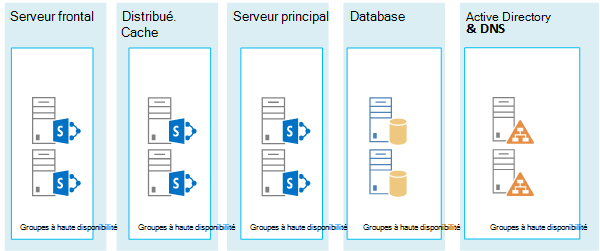
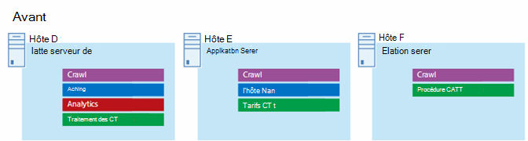

# Architectures Microsoft Azure pour SharePoint 2013

Azure est un environnement propice à l'hébergement d'une solution SharePoint Server 2013. Dans la plupart des cas, nous recommandons Microsoft 365, mais une batterie de serveurs SharePoint Server hébergée dans Azure peut être une bonne option pour des solutions spécifiques. Cet article explique comment créer des solutions SharePoint adaptées à la plateforme Azure. Les deux solutions spécifiques suivantes sont utilisées comme exemples :
  
- [Récupération d'urgence SharePoint Server 2013 dans Microsoft Azure](sharepoint-server-2013-disaster-recovery-in-microsoft-azure.md)
    
- [Sites Internet dans Microsoft Azure qui utilisent SharePoint Server 2013](internet-sites-in-microsoft-azure-using-sharepoint-server-2013.md)
    
## Solutions SharePoint recommandées pour la solution Azure Infrastructure Services

Les services d'infrastructure Azure sont une option intéressante pour l'hébergement de solutions SharePoint. Certaines solutions sont plus adaptées à cette plateforme que d'autres. Le tableau suivant présente les solutions recommandées.
  
|**Solution**|**Pourquoi cette solution est recommandée pour Azure**|
|:-----|:-----|
|Environnements de test et de développement    |Il est facile de créer et de gérer ces environnements.    |
|Récupération d'urgence de batteries de serveurs SharePoint locales sur Azure    |**Centre de données secondaire hébergé** Utilisez Azure au lieu d'investir dans un centre de données secondaire dans une autre région.   **Environnements de récupération d'urgence à moindre coût** Tenez à jour et payez pour moins de ressources qu'un environnement de récupération d'urgence local. Le nombre de ressources dépend de l'environnement de récupération d'urgence choisi : reprise progressive, secours semi-automatique ou serveur de secours.  **Plateforme plus flexible** En cas d'incident, augmentez facilement la taille des instances de votre batterie SharePoint de récupération pour répondre aux exigences de charge. Diminuez la taille des instances lorsque vous n'avez plus besoin des ressources.  Voir [Récupération d'urgence SharePoint Server 2013 dans Microsoft Azure](sharepoint-server-2013-disaster-recovery-in-microsoft-azure.md).    |
|Sites accessibles sur Internet qui utilisent des fonctionnalités et une mise à l’échelle non disponibles dans Microsoft 365    |**Concentrez vos efforts** Concentrez-vous sur le développement d'un site de qualité plutôt que sur la construction d'une infrastructure.   **Tirez parti de l'élasticité dans Azure** Redimensionnez la batterie de serveurs pour qu'elle soit adaptée à la demande en ajoutant de nouveaux serveurs et payez uniquement pour les ressources dont vous avez besoin. L'allocation de machine dynamique n'est pas prise en charge (mise à l'échelle automatique).  **Utilisez Azure Active Directory (AD)** Tirez parti d'Azure AD pour les comptes client.   **Ajouter des fonctionnalités SharePoint non disponibles dans Microsoft 365** Ajoutez des rapports approfondis et des analyses web.   Voir [Sites Internet dans Microsoft Azure qui utilisent SharePoint Server 2013](internet-sites-in-microsoft-azure-using-sharepoint-server-2013.md).    |
|Batteries de serveurs d’applications pour prendre en charge les environnements Microsoft 365 ou locaux    |**Créez, testez et hébergez des applications** dans Azure pour prendre en charge à la fois les environnements locaux et cloud.   **Hébergez ce rôle** dans Azure au lieu d'acheter du nouveau matériel pour les environnements locaux.   |
   
Pour des solutions et des charges de travail de collaboration et intranet, envisagez les options suivantes :
  
- Déterminez si Microsoft 365 répond aux besoins de votre entreprise ou peut faire partie de la solution. Microsoft 365 fournit un ensemble complet de fonctionnalités toujours à jour.
    
- Si Microsoft 365 ne répond pas à toutes les exigences de votre entreprise, envisagez une implémentation standard de SharePoint 2013 localement à partir de Microsoft Consulting Services (MCS). Une architecture standard peut représenter pour vous une solution plus rapide, moins onéreuse et plus simple à prendre en charge qu'une architecture personnalisée. 
    
- Si une implémentation standard ne répond pas aux besoins de votre entreprise, envisagez une solution locale personnalisée.
    
- Si l'utilisation d'une plateforme cloud est importante pour les besoins de votre entreprise, envisagez une implémentation standard ou personnalisée de SharePoint 2013 hébergé dans les services d'infrastructure Azure. Les solutions SharePoint sont beaucoup plus faciles à prendre en charge dans Azure que les autres plateformes cloud publiques Microsoft non natives.
    
## Avant de concevoir l’environnement Azure

Bien que cet article utilise des exemples de topologies SharePoint, vous pouvez utiliser ces concepts de conception avec n'importe quelle topologie de batterie de serveurs SharePoint. Avant de concevoir l'environnement Azure, suivez les instructions suivantes en matière de topologie, d'architecture, de capacité et de performances pour concevoir la batterie de serveurs SharePoint :
  
- [Conception de l'architecture pour les professionnels de l'informatique SharePoint 2013](/SharePoint/technical-reference/technical-diagrams)
    
- [Plan for performance and capacity management in SharePoint Server 2013](/SharePoint/administration/performance-planning-in-sharepoint-server-2013)
    
## Déterminer le type de domaine Active Directory

Chaque batterie de serveurs SharePoint Server s'appuie sur Active Directory pour fournir des comptes d'administration pour la configuration de batterie de serveurs. Pour le moment, deux options sont disponibles pour les solutions SharePoint dans Azure. Celles-ci sont décrites dans le tableau suivant.
  
|**Option**|**Description**|
|:-----|:-----|
|Domaine dédié    |Vous pouvez déployer un domaine Active Directory dédié et isolé vers Azure pour prendre en charge votre batterie de serveurs SharePoint. Il s'agit d'un bon choix pour les sites Internet destinés au public.    |
|Étendre le domaine local via une connexion entre différents locaux    |Lorsque vous étendez le domaine local via une connexion entre différents locaux, les utilisateurs accèdent à la batterie de serveurs SharePoint via votre intranet comme si elle était hébergée en local. Vous pouvez profiter de votre implémentation Active Directory et DNS locale.    Une connexion entre différents locaux est requise pour la création d'un environnement de récupération d'urgence dans Azure vers lequel basculer à partir de votre batterie de serveurs locale.    |
   
Cet article comprend des concepts de conception pour l'extension du domaine local via une connexion entre différents locaux. Si votre solution utilise un domaine dédié, vous n'avez pas besoin d'une connexion entre différents locaux.
  
## Concevoir le réseau virtuel

Vous avez tout d'abord besoin d'un réseau virtuel dans Azure, qui inclut des sous-réseaux sur lesquels placer vos machines virtuelles. Le réseau virtuel a besoin d'un espace d'adressage IP privé, dont vous affectez certaines parties aux sous-réseaux.
  
Si vous étendez votre réseau local à Azure via une connexion entre différents locaux (requise pour un environnement de récupération d'urgence), vous devez choisir un espace d'adressage privé qui ne soit pas déjà utilisé dans le réseau de votre organisation. Il peut inclure votre environnement local et d'autres réseaux virtuels Azure. 
  
**Figure 1 : environnement local avec un réseau virtuel dans Azure**

  
Dans ce schéma :
  
- Un réseau virtuel dans Azure et l'environnement local sont illustrés côte à côte. Les deux environnements ne sont pas encore connectés par une connexion entre différents locaux, qui peut être une connexion VPN de site à site ou ExpressRoute.
    
- À ce stade, le réseau virtuel inclut uniquement les sous-réseaux, mais pas d’autres éléments architecturaux. Un sous-réseau héberge la passerelle Azure et d’autres hébergent les niveaux de la batterie de serveurs SharePoint, avec un sous-réseau supplémentaire pour Active Directory et le DNS.
    
## Ajouter une connectivité entre différents locaux

L'étape de déploiement suivante consiste à créer la connexion entre différents locaux (si cela s'applique à votre solution). Pour les connexions entre différents locaux, une passerelle Azure réside dans un sous-réseau de passerelle distinct que vous devez créer et auquel vous devez affecter un espace d'adressage. 
  
Lorsque vous planifiez une connexion entre différents locaux, vous définissez et créez une passerelle Azure et la connexion à un périphérique de passerelle local.
  
**Figure 2 : utilisation d'une passerelle Azure et d'un périphérique de passerelle local pour fournir une connectivité de site à site entre l'environnement local et Azure**

  
Dans ce schéma :
  
- Par rapport au schéma précédent, l’environnement local est connecté au réseau virtuel Azure via une connexion entre les différents locaux, qui peut être une connexion VPN de site à site ou ExpressRoute.
    
- Une passerelle Azure se trouve sur un sous-réseau de passerelle.
    
- L’environnement local inclut un périphérique de passerelle, tel qu’un routeur ou un serveur VPN.
    
Pour plus d'informations sur la planification et la création d'un réseau virtuel entre différents locaux, voir [Connecter un réseau local à Microsoft Azure Virtual Network](connect-an-on-premises-network-to-a-microsoft-azure-virtual-network.md).
  
## Ajouter services de domaine Active Directory (AD DS) et DNS

Pour une récupération d'urgence dans Azure, déployez Windows Server AD et un DNS dans une configuration hybride où Windows Server AD est déployé à la fois en local et sur des machines virtuelles Azure.
  
**Figure 3 : configuration de domaine Active Directory hybride**

  
Ce schéma, qui s’appuie sur les schémas précédents, ajoute deux machines virtuelles à un sous-réseau Windows Server AD et DNS. Ces machines virtuelles sont des serveurs DNS et des contrôleurs de domaine répliqués. Elles constituent une extension de l’environnement Windows Server AD local. 
  
Le tableau suivant fournit des recommandations concernant la configuration de ces machines virtuelles dans Azure. Utilisez-les comme point de départ pour la conception de votre propre environnement, même pour un domaine dédié où votre environnement Azure ne communique pas avec votre environnement local.
  
|**Élément**|**Configuration**|
|:-----|:-----|
|Taille de machine virtuelle dans Azure    |Taille A1 ou A2 du niveau Standard    |
|Système d’exploitation    |Windows Server 2012 R2    |
|Rôle Active Directory    |Contrôleur de domaine AD DS désigné comme serveur de catalogue global. Cette configuration réduit le trafic sortant sur la connexion entre différents locaux.    Dans un environnement multidomaine avec des taux élevés de changement (cela n'est pas courant), configurez les contrôleurs de domaine en local pour qu'ils ne se synchronisent pas avec les serveurs de catalogue global dans Azure, afin de réduire le trafic de réplication.    |
|Rôle DNS    |Installez et configurez le service Serveur DNS sur les contrôleurs de domaine.    |
|Disques de données    |Placez SYSVOL, les journaux et la base de données Active Directory sur les disques de données Azure supplémentaires. Ne les placez pas sur le disque du système d'exploitation ou sur les disques temporaires fournis par Azure.    |
|Adresses IP    |Utilisez des adresses IP statiques et configurez le réseau virtuel pour affecter ces adresses aux machines virtuelles du réseau virtuel une fois que les contrôleurs de domaine ont été configurés.    |
   
> [!IMPORTANT]
> Avant de déployer Active Directory dans Azure, consultez la rubrique [Recommandations en matière de déploiement de Windows Server Active Directory sur des machines virtuelles Azure](/windows-server/identity/ad-ds/introduction-to-active-directory-domain-services-ad-ds-virtualization-level-100). Ces recommandations vous aideront à déterminer si une architecture différente ou des paramètres de configuration différents sont nécessaires pour votre solution. 
  
## Ajouter la batterie de serveurs SharePoint

Placez les machines virtuelles de la batterie de serveurs SharePoint dans des niveaux des sous-réseaux appropriés.
  
**Figure 4 : placement des machines virtuelles SharePoint**

  
Ce schéma, qui s’appuie sur les schémas précédents, ajoute les rôles de serveur de batterie de serveurs SharePoint dans leurs niveaux respectifs.
  
- Deux machines virtuelles de base de données exécutant SQL Server créent le niveau de base de données.
    
- Deux machines virtuelles exécutant SharePoint Server 2013 pour chacun des niveaux suivants : serveurs frontaux, serveurs de cache distribué et serveurs principaux.
    
## Concevoir et ajuster les rôles serveur pour les groupes à haute disponibilité et les domaines d’erreur

Un domaine d'erreur est un regroupement de matériel dans lequel les instances de rôle s'exécutent. Les machines virtuelles d'un même domaine d'erreur peuvent être mises à jour par l'infrastructure Azure en même temps. Elles peuvent également échouer en même temps, car elles partagent le même rack. Pour éviter d'avoir deux machines virtuelles sur le même domaine d'erreur, vous pouvez configurer vos machines virtuelles en tant que groupe à haute disponibilité, ce qui garantit que chaque machine virtuelle se trouve dans un domaine d'erreur différent. Si trois machines virtuelles sont configurées en tant que groupe à haute disponibilité, Azure garantit qu'un maximum de deux machines virtuelles sont situées dans le même domaine d'erreur.
  
Lorsque vous concevez l'architecture Azure pour une batterie de serveurs SharePoint, configurez des rôles serveur identiques pour qu'ils fassent partie d'un groupe à haute disponibilité. Ceci garantit que vos machines virtuelles sont réparties sur plusieurs domaines d'erreur.
  
**Figure 5 : utilisation de groupes à haute disponibilité Azure pour fournir une haute disponibilité aux niveaux de batterie de serveurs SharePoint**

  
Ce schéma appelle la configuration des groupes à haute disponibilité au sein de l'infrastructure Azure. Chacun des rôles suivants partage un groupe à haute disponibilité distinct :
  
- Active Directory et DNS
    
- Base de données
    
- Serveur principal
    
- Cache distribué
    
- Serveur frontal
    
La batterie de serveurs SharePoint doit peut-être être ajustée dans la plateforme Azure. Pour assurer la haute disponibilité de tous les composants, assurez-vous que les rôles serveur sont configurés de manière identique.
  
Voici un exemple qui montre une architecture de sites Internet standard remplissant les objectifs spécifiques de performances et de capacité. Cet exemple est inclus dans le modèle d'architecture suivant : [Architectures de recherche de sites Internet pour SharePoint Server 2013](https://go.microsoft.com/fwlink/p/?LinkId=261519).
  
**Figure 6 : exemple de planification pour les objectifs de capacité et de performances dans une batterie de serveurs à trois niveaux**

  
Dans ce schéma :
  
- Une batterie de serveurs à trois niveaux est représentée : serveurs web, serveurs d’applications et serveurs de base de données.
    
- Les trois serveurs web sont configurés de manière identique avec plusieurs composants.
    
- Les deux serveurs de base de données sont configurés de manière identique.
    
- Les trois serveurs d'applications ne sont pas configurés de manière identique. Ces rôles serveur exigent un ajustement pour les groupes à haute disponibilité dans Azure.
    
Examinons de plus près le niveau Serveur d'applications.
  
**Figure 7 : niveau Serveur d'applications avant ajustement**

  
Dans ce schéma :
  
- Trois serveurs sont inclus dans le niveau Application.
    
- Le premier serveur inclut quatre composants.
    
- Le deuxième serveur inclut trois composants.
    
- Le troisième serveur inclut deux composants.
    
Vous déterminez le nombre de composants d'après les cibles de performances et de capacité de la batterie de serveurs. Pour adapter cette architecture à Azure, nous allons répliquer quatre composants sur les trois serveurs. Ceci augmente le nombre de composants au-delà de ce qui est nécessaire pour atteindre les objectifs de performances et de capacité. En échange, cette conception garantit la haute disponibilité des quatre composants dans la plateforme Azure lorsque ces trois machines virtuelles sont affectées à un groupe à haute disponibilité.
  
**Figure 8 : niveau Serveur d'applications après ajustement**

  
Ce schéma montre les trois serveurs d’applications configurés de façon identique avec les quatre mêmes composants.
  
Lorsque nous ajoutons des groupes à haute disponibilité aux niveaux de la batterie de serveurs SharePoint, l’implémentation est terminée.
  
**Figure 9 : batterie de serveurs SharePoint terminée dans les services d'infrastructure Azure**

  
Ce schéma illustre la batterie de serveurs SharePoint implémentée dans les services d’infrastructure Azure, avec des groupes à haute disponibilité pour fournir des domaines d’erreur pour les serveurs de chaque niveau.
  
## Voir aussi

[Centre de solutions et d'architecture Microsoft 365](../solutions/index.yml)
  
[Sites Internet dans Microsoft Azure qui utilisent SharePoint Server 2013](internet-sites-in-microsoft-azure-using-sharepoint-server-2013.md)
  
[Récupération d'urgence SharePoint Server 2013 dans Microsoft Azure](sharepoint-server-2013-disaster-recovery-in-microsoft-azure.md)