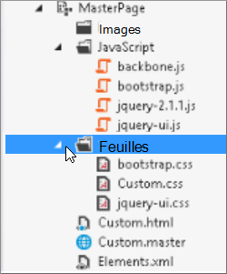
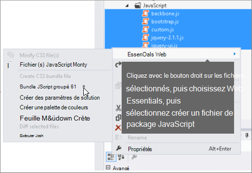
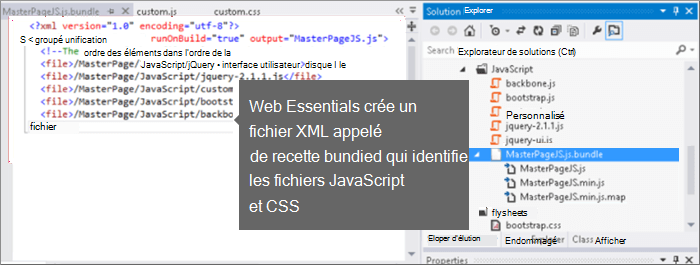
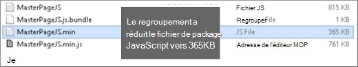

# Minimisation et regroupement dans SharePoint Online

Cet article explique comment utiliser des techniques de minification et de regroupement avec Web Essentials pour réduire le nombre de requêtes HTTP et réduire le temps nécessaire au chargement des pages dans SharePoint Online.
  
Lorsque vous personnalisez votre site web, vous pouvez ajouter un grand nombre de fichiers supplémentaires au serveur pour prendre en charge la personnalisation. L’ajout d’images javaScript, CSS et supplémentaires augmente le nombre de requêtes HTTP adressées au serveur, ce qui augmente le temps nécessaire à l’affichage d’une page web. Si vous avez plusieurs fichiers du même type, vous pouvez regrouper ces fichiers pour accélérer le téléchargement de ces fichiers.
  
Pour les fichiers JavaScript et CSS, vous pouvez également utiliser une approche appelée minification, où vous réduisez la taille totale des fichiers en supprimant les espaces blancs et autres caractères qui ne sont pas nécessaires.
  
## Minification et regroupement de fichiers JavaScript et CSS avec Web Essentials

Vous pouvez utiliser des logiciels tiers tels que Web Essentials pour regrouper des fichiers CSS et JavaScript.
  
> [!IMPORTANT]
> Web Essentials est un projet tiers, open source et communautaire. Le logiciel est une extension de Visual Studio 2012 et Visual Studio 2013 et n’est pas pris en charge par Microsoft. Pour télécharger Web Essentials, visitez le site Web [Essentials 2012](https://marketplace.visualstudio.com/items?itemName=MadsKristensen.WebEssentials2012).
  
Web Essentials offre deux formes de regroupement :
 
- .bundle : pour les fichiers CSS et JavaScript
- .sprite : pour les images (disponibles uniquement dans Visual Studio 2013)

Vous pouvez utiliser Web Essentials si vous disposez d’une fonctionnalité existante avec certains éléments de personnalisation référencés dans une page maître personnalisée, par exemple :
  

  
### Pour créer un bundle TE000127218 et CSS dans Web Essentials
  
1. Dans Visual Studio, dans Explorateur de solutions, sélectionnez les fichiers que vous souhaitez inclure dans le bundle.
2. Cliquez avec le bouton droit sur les fichiers sélectionnés, puis sélectionnez **Web Essentials** \> **Créer un fichier groupé JavaScript** dans le menu contextuel. Par exemple :

    
  
## Affichage des résultats du regroupement de fichiers JavaScript et CSS

Lorsque vous créez un bundle JavaScript et CSS, Web Essentials crée un fichier XML appelé fichier recette qui identifie les fichiers JavaScript et CSS, ainsi que d’autres informations de configuration :
  

  
En outre, si l’indicateur minify est défini sur true dans la recette de regroupement, les fichiers sont réduits en taille et regroupés. Cela signifie que de nouvelles versions minifiées des fichiers JavaScript ont été créées que vous pouvez référencer dans votre page maître.
  

  
Lorsque vous chargez une page à partir de votre site web, vous pouvez utiliser les outils de développement de votre navigateur web, tels qu’Internet Explorer 11, pour voir le nombre de demandes envoyées au serveur et la durée de chargement de chaque fichier.
  
La figure suivante est le résultat du chargement des fichiers JavaScript et CSS avant la minification.
  

  
Après avoir regroupé les fichiers CSS et JavaScript, le nombre de demandes est passé à 74 et chaque fichier a pris un peu plus de temps que les fichiers d’origine à télécharger individuellement :
  

  
Après le regroupement, le fichier bundle JavaScript est considérablement réduit, passant de 815 Ko à 365 Ko :
  

  
## Regrouper des images en créant un sprite d’image

De la même façon que vous regroupez des fichiers JavaScript et CSS, vous pouvez combiner de nombreuses petites icônes et d’autres images courantes dans une feuille sprite plus grande, puis utiliser CSS pour révéler les images individuelles. Au lieu de télécharger chaque image individuelle, le navigateur web de l’utilisateur télécharge la feuille sprite une seule fois, puis la met en cache sur l’ordinateur local. Cela améliore les performances de chargement de page en réduisant le nombre de téléchargements et d’allers-retours vers le serveur web.
  
### Pour créer un sprite d’image dans Web Essentials**
  
1. Dans Visual Studio, dans Explorateur de solutions, sélectionnez les fichiers que vous souhaitez inclure dans le bundle.
2. Cliquez avec le bouton droit sur les fichiers sélectionnés, puis sélectionnez **Web Essentials** \> **Créer un sprite d’image** dans le menu contextuel. Par exemple :

    
  
3. Choisissez un emplacement pour enregistrer le fichier sprite. Le fichier .sprite est un fichier XML qui décrit les paramètres et les fichiers dans le sprite. Les figures suivantes montrent un exemple de fichier PNG sprite et son fichier XML .sprite correspondant.

    
  
    
