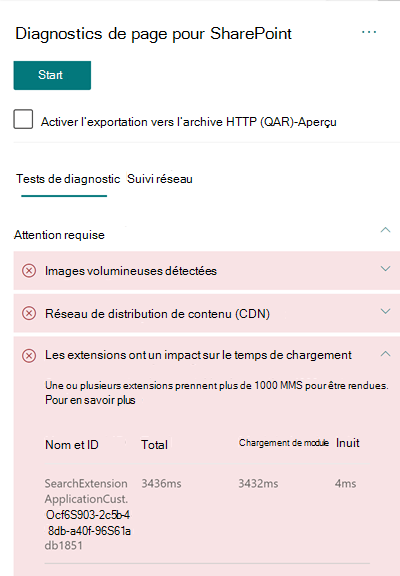

# Optimiser les performances des extensions personnalisées dans les pages de sites modernes SharePoint Online

Cet article vous permet de comprendre comment déterminer la façon dont les extensions personnalisées affectent la latence perçue par l’utilisateur et comment résoudre les problèmes courants.

## Utiliser l’Outil Diagnostic de page pour SharePoint pour analyser les extensions personnalisées

L’Outil Diagnostic de page pour SharePoint est une extension de navigateur pour le nouveau Microsoft Edge (les navigateurs https://www.microsoft.com/edge) et Chrome que vous pouvez utiliser pour analyser les pages de sites de publication SharePoint classiques et les portails modernes. L’outil fournit un rapport pour chaque page analysée montrant comment la page se comporte par rapport à un ensemble défini de critères de performance. Pour installer et découvrir l’outil Diagnostic de page pour SharePoint, consultez [Utiliser l’outil Diagnostic de page pour SharePoint Online](page-diagnostics-for-spo.md).

>[!NOTE]
>L’Outil Diagnostic de page fonctionne uniquement pour SharePoint Online et ne peut pas être utilisé sur une page système SharePoint.

Lorsque vous analysez une page de site SharePoint avec l’outil Diagnostics de page pour SharePoint, vous pouvez voir des informations sur les extensions personnalisées qui dépassent la métrique de référence dans **les extensions qui ont un impact sur le temps de chargement** et/ou le nombre **trop important d’extensions utilisées** dans le volet _Tests de diagnostic_ 

Les résultats possibles sont les suivants :

- **Attention requise** (en rouge) : une extension _personnalisée_ qui prend plus de **une** seconde pour charger. Le temps de chargement total tel qu’il apparaît dans les résultats des tests est subdivisé en : chargement de module, chargement différé, initialisation et rendu. En outre, s’il y a trop d’extensions sur une page, elles peuvent avoir un impact sur l’heure de chargement de la page et cela sera mis en surbrillance si **sept** extensions ou plus sont utilisées sur la page.
- **Possibilités d’amélioration** (jaune) Si **cinq** extensions ou plus sont utilisées, elles sont mises en surbrillance dans cette section en tant qu’avertissement jusqu’à ce que sept ou plusieurs extensions soient utilisées, qui seront ensuite mises en surbrillance en tant qu’attention requise.
- **Aucune action requise** (en vert) : aucune extension ne prend plus d’une seconde pour charger.

Si une extension affecte le temps de chargement de la page ou s’il y a trop d’extensions sur la page, le résultat apparaît dans la section **Attention requise** des résultats. Cliquez sur le résultat pour afficher des détails sur l’extension qui se charge lentement ou si un trop grand nombre d’extensions a été mis en surbrillance. Les mises à jour ultérieures de l’outil Diagnostic de page pour SharePoint peuvent inclure des mises à jour des règles d’analyse. Vérifiez donc que vous disposez toujours de la dernière version de l’outil.

Les informations disponibles dans les résultats incluent les éléments suivants :

- **Nom et ID** affiche les informations d’identification qui peuvent vous aider à trouver l'extension sur la page
- **Total** indique la durée totale de chargement et d’initialisation de l’extension pour le module. Il s’agit du temps relatif total nécessaire à l’exécution de l’extension sur la page, du début à la fin.
- **La charge du module** indique le temps nécessaire pour télécharger, évaluer et charger les fichiers JavaScript et CSS des extensions. Il démarre ensuite le processus Init.
- **Init** indique le temps nécessaire à l’extension pour initialiser les données.

  Il s’agit d’un appel asynchrone et l’heure d’initialisation est le calcul de l’heure de la fonction onInit lorsque la promesse retournée est résolue.

Ces informations sont fournies pour aider les concepteurs et les développeurs à résoudre les problèmes. Ces informations doivent être fournies à votre équipe de conception et de développement.

## Vue d’ensemble des extensions

Les extensions SharePoint Framework (SPFx) peuvent être utilisées pour étendre l’expérience utilisateur de SharePoint. Avec les Extensions SharePoint Framework, vous pouvez personnaliser plusieurs aspects de l’expérience SharePoint, y compris les zones de notification, les barres d’outils et les vues de données de liste.

Les extensions peuvent avoir une mauvaise influence sur les performances d’une page SharePoint, car elles font également appel aux ressources de CPU et de réseau pour effectuer l'action requise.

Il existe quatre types d’extension :

- Les **Personnalisateurs d'application** permettent d’ajouter des scripts à la page, accède aux espaces réservés d’éléments HTML connus et les étend avec des rendus personnalisés.
- Les **Personnalisateurs de champs** permettent de modifier le mode d’affichage des données dans les champs d’une liste.
- Les **Ensembles de commandes** étendent les surfaces de commande SharePoint afin d’ajouter de nouvelles actions et fournit du code côté client que vous pouvez utiliser pour appliquer certains comportements.
- Le **Modificateur de requête de recherche (version d’évaluation uniquement)** est appelé juste avant l’exécution de la requête de recherche.

## Résoudre les problèmes de performance liées aux extensions

Suivez les instructions décrites dans cette section pour identifier et corriger les problèmes de performances liés aux extensions répertoriées dans les résultats **Les extensions ont un impact sur le temps de chargement de la page**.

>[!NOTE]
>Les personnalisateurs d’applications peuvent être exécutés au début du cycle de vie d’une page et peuvent influencer les performances d’autres extensions sur la page.

Les résultats d’audit dans l’Outil Diagnostic de page présentent deux étapes d’exécution d’une extension vous permettant d'identifier l’impact potentiel des performances.

- Le **Chargement de module** est le temps nécessaire au chargement de l’extension, lequel est influencé par la taille d’une extension. Il est recommandé de regrouper uniquement les bibliothèques nécessaires dans l’extension et de choisir des bibliothèques peu volumineuses.
- L'**Initialisation** est le moment d’initialisation de l’extension et les développeurs d’extension doivent déterminer si l’extension effectue un travail inutile ou exécute un trop grand nombre de commandes pendant l’étape d'initialisation.

Les auteurs de pages peuvent également utiliser le résultat d’audit pour déterminer si une page possède un trop grand nombre d’extensions, car un nombre trop important d’extensions aura un effet négatif sur les performances d’une page.

- **Taille d’extension et dépendances**
  - L’utilisation du réseau de distribution de contenu Office 365 est requise pour un téléchargement optimal des ressources statiques. Les origines du réseau de distribution de contenu public sont préférables pour les fichiers _js/css_. Pour plus d’informations sur l’utilisation du réseau de distribution de contenu Office 365, consultez [Utilisation du réseau de distribution de contenu (CDN) Office 365 avec SharePoint Online](use-microsoft-365-cdn-with-spo.md).
  - Réutilisez les infrastructures telles que _React_ et _Fabric imports_ incluses dans SharePoint Framework (SPFx). Pour obtenir plus d’informations, consultez l’article [Vue d’ensemble de SharePoint Framework](/sharepoint/dev/spfx/sharepoint-framework-overview).
  - Assurez-vous que vous utilisez la version la plus récente de SharePoint Framework et effectuez une mise à niveau vers de nouvelles versions dès qu’elles sont disponibles.
- **Récupération/mise en cache de données**
  - Si l'extension s’appuie sur des appels serveur supplémentaires pour extraire des données à afficher, assurez-vous que les API serveur sont rapides et/ou implémentent la mise en cache côté client (par exemple, _localStorage_ ou _IndexDB_ pour les ensembles plus grands).
  - Si plusieurs appels sont nécessaires pour afficher les données critiques, pensez à effectuer un traitement par lots sur le serveur ou à utiliser d’autres méthodes de consolidation des requêtes en un seul appel.
  - De même, si certains éléments de données nécessitent une API plus lente, mais ne sont pas essentiels au rendu initial, découplez-les à un appel séparé exécuté après le rendu des données critiques.
  - Si plusieurs parties utilisent les mêmes données, utilisez une couche de données commune pour éviter les appels en double.
- **Temps de rendu**
  - Toutes les sources de contenu multimédia, telles que les images et vidéos, doivent être dimensionnées aux limites du conteneur, de l’appareil et/ou du réseau afin d’éviter le téléchargement de ressources volumineuses inutiles. Pour plus d’informations sur les dépendances de contenu, consultez [Utilisation du réseau de distribution de contenu Office 365 avec SharePoint Online](use-microsoft-365-cdn-with-spo.md).
  - Évitez les appels d’API qui provoquent une réorientation, des règles CSS complexes ou des animations compliquées. Pour plus d’informations, consultez [Réduction de la réorientation du navigateur](https://developers.google.com/speed/docs/insights/browser-reflow).
  - Évitez d’utiliser des tâches enchaînées de longue durée. Il est préférable de diviser les longues tâches en files d’attente distinctes. Pour plus d’informations, voir [Optimiser l'exécution JavaScript](https://developers.google.com/web/fundamentals/performance/rendering/optimize-javascript-execution).
  - Réservez l’espace nécessaire pour le rendu asynchrone des éléments multimédias ou visuels afin d’éviter les trames ignorées et les interruptions (également appelées « jank »).
  - Si un certain navigateur ne prend pas en charge une fonctionnalité utilisée dans le rendu, vous pouvez charger un polyfill ou empêcher l’exécution des codes dépendants. Si les fonctionnalités ne sont pas essentielles, supprimez des ressources telles que les gestionnaires d’événements afin d’éviter les fuites de mémoire.

Avant d’apporter des révisions de page pour résoudre les problèmes de performances, notez le temps de chargement des pages dans les résultats de l’analyse. Exécutez à nouveau l’outil après votre révision pour déterminer si le nouveau résultat est inclus dans la norme de référence et vérifier le nouveau temps de chargement des pages pour voir s’il y a eu une amélioration.

>[!NOTE]
>Le temps de chargement des pages peut varier en fonction de nombreux facteurs tels que la charge réseau, l’heure de la journée et d’autres conditions transitoires. Vous devez tester le temps de chargement des pages plusieurs fois avant et après avoir apporté des modifications pour vous aider à faire la moyenne des résultats.

## Voir aussi

[Optimisation des performances SharePoint Online](tune-sharepoint-online-performance.md)

[Optimisation des performances Office 365](tune-microsoft-365-performance.md)

[Performances offertes par l’expérience moderne de SharePoint](/sharepoint/modern-experience-performance)

[Réseaux de distribution de contenu](content-delivery-networks.md)

[Utilisation du réseau de distribution de contenu Office 365 avec SharePoint Online](use-microsoft-365-cdn-with-spo.md)