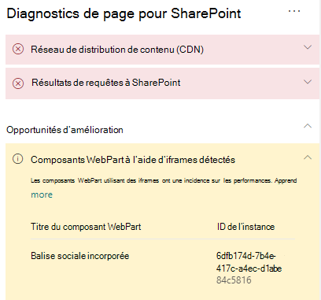

# Optimiser les IFrames dans les pages de sites de publication modernes et classiques SharePoint Online

Les IFrames peuvent s’avérer utiles pour afficher un aperçu d’un contenu riche, par exemple, des vidéos ou d’autres éléments multimédias. Toutefois, étant donné que les IFrames chargent une page distincte dans la page du site SharePoint, le contenu chargé dans l’IFrame peut contenir des images, des vidéos ou d’autres éléments volumineux pouvant contribuer au temps de chargement général de la page et que vous ne pouvez pas contrôler sur la page. Cet article vous permet de comprendre comment déterminer la façon dont les IFrames présentes dans vos pages affectent la latence perçue par l’utilisateur et comment résoudre les problèmes courants.

>[!NOTE]
>Pour plus d’informations sur les performances dans les sites modernes SharePoint Online, consultez [Performances offertes par l’expérience moderne de SharePoint](/sharepoint/modern-experience-performance).

## Utiliser l’outil Diagnostic de page pour SharePoint pour analyser les composants WebPart utilisant les IFrames

L’Outil Diagnostic de page pour SharePoint est une extension de navigateur pour le nouveau Microsoft Edge (les navigateurs https://www.microsoft.com/edge) et Chrome que vous pouvez utiliser pour analyser les pages de sites de publication SharePoint classiques et les portails modernes. L’outil fournit un rapport pour chaque page analysée montrant comment la page se comporte par rapport à un ensemble défini de critères de performance. Pour installer et découvrir l’outil Diagnostic de page pour SharePoint, consultez [Utiliser l’outil Diagnostic de page pour SharePoint Online](page-diagnostics-for-spo.md).

>[!NOTE]
>L’Outil Diagnostic de page fonctionne uniquement pour SharePoint Online et ne peut pas être utilisé sur une page système SharePoint.

Lorsque vous analysez une page de site SharePoint avec l’outil Diagnostic de page pour SharePoint, vous pouvez voir des informations sur les composants WebPart contenant des IFrames dans le volet _Tests de diagnostic_. La métrique de référence est identique pour les pages classiques et modernes.

Les résultats possibles sont les suivants :

- **Attention requise** (rouge) : la page contient **trois composants WebPart ou plus** utilisant des IFrames
- **Possibilités d’amélioration** (jaune) : la page contient **un ou deux** composants WebPart utilisant des IFrames
- **Aucune action requise** (vert) : la page ne contient pas de composants WebPart utilisant des IFrames

Si le résultat **Composants WebPart détectés utilisant des IFrames** apparaît dans la section des résultats **Possibilités d’amélioration** ou **Attention requise**, vous pouvez cliquer sur le résultat pour afficher les composants WebPart qui contiennent des IFrames.

## Résoudre les problèmes de performance liées aux IFrames

Utilisez le résultat **Composants WebPart détectés utilisant des IFrames** dans l’outil Diagnostic de page pour identifier les composants WebPart qui contiennent des IFrames et qui peuvent contribuer au chargement lent des pages.

les IFrames sont lents par nature, car ils chargent une page externe distincte incluant tout le contenu associé (par exemple, JavaScript, CSS et les éléments d’infrastructure), augmentant ainsi la surcharge de la page du site par un facteur de deux ou plus.

Suivez les instructions ci-dessous pour optimiser l’utilisation des IFrames.

- Dans la mesure du possible, utilisez des images au lieu d’IFrames si l’aperçu est initialement petit ou non interactif.
- Si vous devez utiliser des IFrames, réduisez-en le nombre et/ou éloignez-les de la fenêtre d’affichage.
- Les fichiers Office incorporés tels que Word, Excel et PowerPoint sont interactifs, mais leur chargement est lent. Les miniatures d’images contenant un lien vers le document complet fonctionnent souvent mieux.
- Les vidéos YouTube incorporées et les flux Twitter sont généralement plus performants dans des IFrames, mais utilisez judicieusement ce type d’éléments incorporés.
- Les composants WebPart isolés sont une exception raisonnable, mais réduisez leur nombre et leur insertion dans la fenêtre d’affichage.
- Si un IFrame est placé hors de la fenêtre d’affichage, songez à utiliser une fonction _IntersectionObserver_ pour retarder le rendu de l’IFrame jusqu’à ce qu’il s’affiche.

Avant d’apporter des révisions de page pour résoudre les problèmes de performances, notez le temps de chargement des pages dans les résultats de l’analyse. Exécutez à nouveau l’outil après votre révision pour déterminer si le nouveau résultat est inclus dans la norme de référence et vérifier le nouveau temps de chargement des pages pour voir s’il y a eu une amélioration.

>[!NOTE]
>Le temps de chargement des pages peut varier en fonction de nombreux facteurs tels que la charge réseau, l’heure de la journée et d’autres conditions transitoires. Vous devez tester le temps de chargement des pages plusieurs fois avant et après avoir apporté des modifications pour vous aider à faire la moyenne des résultats.

## Voir aussi

[Optimisation des performances SharePoint Online](tune-sharepoint-online-performance.md)

[Optimisation des performances Office 365](tune-microsoft-365-performance.md)

[Performances offertes par l’expérience moderne de SharePoint](/sharepoint/modern-experience-performance)