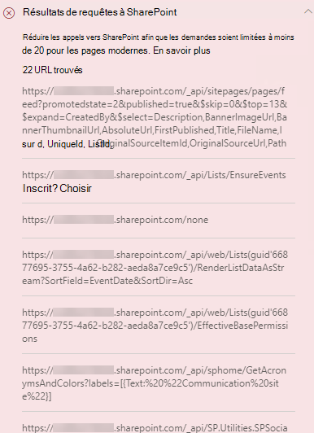

# Optimiser les appels de page dans les pages de sites de publication modernes et classiques SharePoint Online

Les sites de publication modernes et classiques SharePoint Online contiennent des liens qui chargent des données à partir des fonctionnalités SharePoint et des réseaux de distribution de contenu (ou qui font appel à ceux-ci). Plus le nombre d’appels effectués par une page est grand, plus la page prend de temps à charger. Il s’agit de la **latence perçue par l’utilisateur final** ou **EUPL**.

Cet article vous permet de comprendre comment déterminer le nombre et l’impact des appels vers des points de terminaison externes à partir de vos pages de sites de publications modernes et classiques et comment limiter leur effet sur la latence perçue par l’utilisateur final.

>[!NOTE]
>Pour plus d’informations sur les performances dans les portails modernes SharePoint Online, consultez [Performances offertes par l’expérience moderne de SharePoint](/sharepoint/modern-experience-performance).

## Utiliser l’outil Diagnostic de page pour SharePoint pour analyser les appels de page

L’outil Diagnostic de page pour SharePoint est une extension de navigateur pour le nouveau Microsoft Edge (https://www.microsoft.com/edge) et les navigateurs Chrome que vous pouvez utiliser pour analyser les pages de sites de publication SharePoint classiques et les portails modernes. L’outil fournit un rapport pour chaque page analysée montrant comment la page se comporte par rapport à un ensemble défini de critères de performance. Pour installer et découvrir l’outil Diagnostic de page pour SharePoint, consultez [Utiliser l’outil Diagnostic de page pour SharePoint Online](page-diagnostics-for-spo.md).

>[!NOTE]
>L’outil Diagnostic de page fonctionne uniquement pour SharePoint Online et ne peut pas être utilisé sur une page système SharePoint.

Lorsque vous analysez une page de site SharePoint avec l’outil Diagnostic de page pour SharePoint, vous pouvez voir des informations sur les appels externes dans les résultats **Requêtes à SharePoint** dans le volet _Tests de diagnostic_. La ligne s’affiche en vert si la page du site contient moins que le nombre d’appels de référence, et en rouge si la page dépasse le nombre d’appels de référence. Le nombre de référence est différent pour les pages modernes et classiques car les pages de sites classiques utilisent HTTP1.1 et les pages modernes utilisent HTTP2.0 :

- Les pages de sites modernes ne doivent pas contenir plus de **25** appels
- Les pages de publication classiques ne doivent pas contenir plus de **6** appels

Les résultats possibles sont les suivants :

- **Attention requise** (rouge) : la page dépasse le nombre d’appels de référence
- **Aucune action requise** (vert) : la page contient moins d’appels que le nombre d’appels de référence

Si le résultat **Requêtes à SharePoint** apparaît dans la section **Attention requise**, vous pouvez cliquer sur le résultat pour obtenir des détails, notamment le nombre total d’appels sur la page et une liste d’URL.

## Résoudre les problèmes de performances liés à un trop grand nombre d’appels sur une page

Si une page contient trop d’appels, vous pouvez utiliser la liste des URL dans les résultats Demandes à **SharePoint** pour déterminer s’il existe des appels répétés, des appels qui doivent être distribués par lots ou des appels qui retournent des données qui doivent être mises en cache.

**Le traitement par lots des appels REST** permet de réduire la dégradation des performances. Pour plus d’informations sur le traitement par lots d’appels d’API, consultez [Effectuer des requêtes de lot avec les API REST](/sharepoint/dev/sp-add-ins/make-batch-requests-with-the-rest-apis).

**L’utilisation d’un cache** pour stocker les résultats d’un appel d’API peut améliorer les performances d’une demande d’urgence en permettant au client d’utiliser les données mises en cache au lieu d’effectuer un appel supplémentaire pour chaque chargement de page suivant. Il existe de multiples façons d'aborder cette solution en fonction des besoins de l'entreprise. En règle générale, si les données sont identiques pour tous les utilisateurs, l’utilisation d’un service de mise en cache de niveau intermédiaire comme [_Cache_ Azure Redis](https://azure.microsoft.com/services/cache/) constitue une option idéale pour réduire considérablement le trafic d’API sur un site, car les utilisateurs demandent les données du service de mise en cache plutôt que directement à partir de SPO. Les seuls appels SPO nécessaires sont pour actualiser le cache du niveau intermédiaire. Si les données fluctuent en fonction de chaque utilisateur individuel, il peut être préférable d’implémenter un cache côté client, tel que LocalStorage ou même un cookie. Cela a pour but de réduire encore les volumes d’appels en éliminant les demandes subséquentes effectuées par le même utilisateur pour la durée du cache, mais sera moins efficace qu’un service de mise en cache dédié. PnP vous permet d’utiliser LocalStorage en ne nécessitant que peu de développement supplémentaire.

Avant d’apporter des révisions de page pour résoudre les problèmes de performances, notez le temps de chargement des pages dans les résultats de l’analyse. Exécutez à nouveau l’outil après votre révision pour déterminer si le nouveau résultat est inclus dans la norme de référence et vérifier le nouveau temps de chargement des pages pour voir s’il y a eu une amélioration.

>[!NOTE]
>Le temps de chargement des pages peut varier en fonction de nombreux facteurs tels que la charge réseau, l’heure de la journée et d’autres conditions transitoires. Vous devez tester le temps de chargement des pages plusieurs fois avant et après avoir apporté des modifications pour vous aider à faire la moyenne des résultats.

## Voir aussi

[Optimisation des performances SharePoint Online](tune-sharepoint-online-performance.md)

[Optimisation des performances Office 365](tune-microsoft-365-performance.md)

[Performances offertes par l’expérience moderne de SharePoint](/sharepoint/modern-experience-performance)

[Réseaux de distribution de contenu](content-delivery-networks.md)

[Utilisation du réseau de distribution de contenu Office 365 avec SharePoint Online](use-microsoft-365-cdn-with-spo.md)