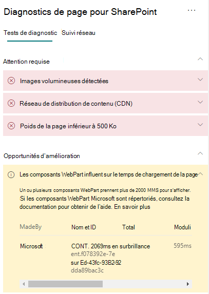

# Optimiser les performances des composants WebPart dans les pages de sites modernes SharePoint Online

Les pages de sites modernes SharePoint Online contiennent des composants WebPart qui peuvent augmenter le temps de chargement général de la page. Cet article vous permet de comprendre comment déterminer la façon dont les composants WebPart présents dans vos pages affectent la latence perçue par l’utilisateur et comment résoudre les problèmes courants.

> [!NOTE]
> Pour plus d’informations sur les performances dans les portails modernes SharePoint Online, consultez [Performances offertes par l’expérience moderne de SharePoint](/sharepoint/modern-experience-performance).

## Utiliser l’outil Diagnostic de page pour SharePoint pour analyser les composants WebPart

L’outil Diagnostic de page pour SharePoint est une extension de navigateur pour le nouveau Microsoft Edge (les navigateurs https://www.microsoft.com/edge) et Chrome que vous pouvez utiliser pour analyser les pages de sites de publication SharePoint classiques et les portails modernes. L’outil fournit un rapport pour chaque page analysée montrant comment la page se comporte par rapport à un ensemble défini de critères de performance. Pour installer et découvrir l’outil Diagnostic de page pour SharePoint, consultez [Utiliser l’outil Diagnostic de page pour SharePoint Online](page-diagnostics-for-spo.md).

> [!NOTE]
> L’outil Diagnostic de page fonctionne uniquement pour SharePoint Online et ne peut pas être utilisé sur une page système SharePoint.

Lorsque vous analysez une page de site SharePoint avec l’outil Diagnostic de page pour SharePoint, vous pouvez voir des informations sur les composants WebPart qui dépassent la métrique de référence dans le résultat _Les composants WebPart ont un impact sur le temps de chargement de la page_ dans le volet **Tests de diagnostic**.

Les résultats possibles sont les suivants :

- **Attention requise** (rouge) : n’importe quel composant WebPart _personnalisé_ visible dans la fenêtre d’affichage (partie visible de la page qui est chargée en premier) dont le chargement prend plus de **deux** secondes. Les composants WebPart _personnalisés_ à l'extérieur de la fenêtre d’affichage dont le chargement dure plus de **quatre** secondes. Le temps de chargement total tel qu’il apparaît dans les résultats de tests est subdivisé en : chargement de module, chargement différé, initialisation et rendu.
- **Possibilités d’amélioration** (jaune) : les éléments susceptibles d’avoir un impact sur le temps de chargement des pages sont présentés dans cette section et doivent être examinés et analysés. Il peut s’agir de composants WebPart Microsoft « prêts à l’emploi » (OOTB). Les résultats de tous les composants WebPart Microsoft présentés dans cette section sont automatiquement signalés à Microsoft, donc **aucune action n’est requise**. Vous devez uniquement enregistrer un ticket de support pour investigation si vous rencontrez des performances très ralenties sur la page et si **tous les composants WebPart Microsoft** sur la page apparaissent dans les résultats dans la section **Possibilités d’amélioration**. Notez qu’une prochaine mise à jour de l’outil Diagnostic de page pour SharePoint permettra de décomposer les résultats en fonction de la configuration spécifique du composant WebPart Microsoft.
- **Aucune action requise** (vert) : aucun composant WebPart ne prend plus de **deux** secondes pour renvoyer les données.

Si le résultat **Les composants WebPart ont un impact sur le temps de chargement de la page** s’affiche dans la section des résultats **Attention requise** ou **Possibilités d’amélioration**, cliquez sur le résultat pour afficher les détails sur les composants WebPart qui chargent lentement. Les mises à jour ultérieures de l’outil Diagnostic de page pour SharePoint peuvent inclure des mises à jour des règles d’analyse. Vérifiez donc que vous disposez toujours de la dernière version de l’outil.

Les informations disponibles dans les résultats incluent les éléments suivants :

- **L’élément «** Made by » indique si le partie Web Est personnalisé ou Microsoft OOTB.
- **Le nom et l’ID** indiquent les informations d’identification qui peuvent vous aider à trouver le partie Web Sur la page.
- **Total** indique la durée totale du chargement, de l’initialisation et du rendu du module par le partie Web. Il s’agit du temps relatif total pris par le partie Web Pour restituer sur la page, du début à la fin.
- **La charge du** module indique le temps de téléchargement, d’évaluation et de chargement des fichiers JavaScript et CSS des extensions. Il démarre ensuite le processus Init.
- **La charge différée** indique le temps de chargement différé des composants Web Parts qui ne sont pas visibles dans la section principale de la page. Dans certaines conditions, il y a trop de composants Web Parts à restituer, et ils sont mis en file d’attente pour être restituer afin de réduire le temps de chargement de la page.
- **Init indique** le temps qu’a pris le partie Web Pour initialiser les données.

  Il s’agit d’un appel asynchrone et le temps d’init est le calcul du temps pour la fonction onInit lorsque la promesse renvoyée est résolue.

- **Le** rendu indique le temps de rendu de l’interface utilisateur (interface utilisateur) une fois le chargement du module et Init terminés.

  Il est temps d’exécution JavaScript pour monter le DOM dans le document (page).
  Le rendu des ressources asynchrones, par exemple les images, peut prendre plus de temps.

Ces informations sont fournies pour aider les concepteurs et les développeurs à résoudre les problèmes. Ces informations doivent être fournies à votre équipe de conception et de développement.

## Résoudre les problèmes de performance liées aux composants WebPart

Suivez les instructions décrites dans cette section pour identifier et corriger les problèmes de performances liés aux composants WebPart répertoriés dans les résultats **Les composants WebPart ont un impact sur le temps de chargement de la page**.

Il existe trois catégories de causes possibles pour expliquer les faibles performances des composants WebPart. Utilisez les informations ci-dessous pour identifier les problèmes qui s’appliquent à votre scénario et pour les corriger.

- Taille de script et dépendances des composants WebPart
  - Optimisez le script initial qui affiche le scénario principal pour le _mode d’affichage uniquement_.
  - Déplacez les scénarios moins fréquents et le code de mode d’édition (comme le volet de propriétés) pour séparer les blocs à l’aide de l’instruction _import()_.
  - Passez en revue les dépendances du fichier _package.json_ pour supprimer complètement tout code mort. Déplacez les dépendances test/build uniquement vers devDependencies.
  - L’utilisation du réseau de distribution de contenu Office 365 est requise pour un téléchargement optimal des ressources statiques. Les origines du réseau de distribution de contenu public sont préférables pour les fichiers _js/css_. Pour plus d’informations sur l’utilisation du réseau de distribution de contenu Office 365, consultez [Utilisation du réseau de distribution de contenu (CDN) Office 365 avec SharePoint Online](use-microsoft-365-cdn-with-spo.md).
  - Réutilisez les infrastructures telles que _React_ et _Fabric imports_ incluses dans SharePoint Framework (SPFx). Pour obtenir plus d’informations, consultez l’article [Vue d’ensemble de SharePoint Framework](/sharepoint/dev/spfx/sharepoint-framework-overview).
  - Assurez-vous que vous utilisez la version la plus récente de SharePoint Framework et effectuez une mise à niveau vers de nouvelles versions dès qu’elles sont disponibles.
- Extraction/mise en cache de données
  - Si le partie Web Part s’appuie sur des appels serveur supplémentaires pour extraire des données à afficher, assurez-vous que ces API serveur sont rapides et/ou implémentent la mise en cache côté client (par exemple, en utilisant _localStorage_ ou _IndexedDB_ pour des ensembles plus volumineux).
  - Si plusieurs appels sont nécessaires pour afficher les données critiques, pensez à effectuer un traitement par lots sur le serveur ou à utiliser d’autres méthodes de consolidation des requêtes en un seul appel.
  - De même, si certains éléments de données nécessitent une API plus lente, mais ne sont pas essentiels au rendu initial, découplez-les à un appel séparé exécuté après le rendu des données critiques.
  - Si plusieurs parties utilisent les mêmes données, utilisez une couche de données commune pour éviter les appels en double.
- Temps de rendu
  - Toutes les sources de contenu multimédia, telles que les images et vidéos, doivent être dimensionnées aux limites du conteneur, de l’appareil et/ou du réseau afin d’éviter le téléchargement de ressources volumineuses inutiles. Pour plus d’informations sur les dépendances de contenu, consultez [Utilisation du réseau de distribution de contenu Office 365 avec SharePoint Online](use-microsoft-365-cdn-with-spo.md).
  - Évitez les appels d’API qui provoquent une réorientation, des règles CSS complexes ou des animations compliquées. Pour plus d’informations, consultez [Réduction de la réorientation du navigateur](https://developers.google.com/speed/docs/insights/browser-reflow).
  - Évitez d’utiliser des tâches enchaînées de longue durée. Il est préférable de diviser les longues tâches en files d’attente distinctes. Pour plus d’informations, voir [Optimiser l'exécution JavaScript](https://developers.google.com/web/fundamentals/performance/rendering/optimize-javascript-execution).
  - Réservez l’espace nécessaire pour le rendu asynchrone des éléments multimédias ou visuels afin d’éviter les trames ignorées et les interruptions (également appelées « jank »).
  - Si un certain navigateur ne prend pas en charge une fonctionnalité utilisée dans le rendu, vous pouvez charger un polyfill ou empêcher l’exécution des codes dépendants. Si les fonctionnalités ne sont pas essentielles, supprimez des ressources telles que les gestionnaires d’événements afin d’éviter les fuites de mémoire.

Avant d’apporter des révisions de page pour résoudre les problèmes de performances, notez le temps de chargement des pages dans les résultats de l’analyse. Exécutez à nouveau l’outil après votre révision pour déterminer si le nouveau résultat est inclus dans la norme de référence et vérifier le nouveau temps de chargement des pages pour voir s’il y a eu une amélioration.

>[!NOTE]
>Le temps de chargement des pages peut varier en fonction de nombreux facteurs tels que la charge réseau, l’heure de la journée et d’autres conditions transitoires. Vous devez tester le temps de chargement des pages plusieurs fois avant et après avoir apporté des modifications pour vous aider à faire la moyenne des résultats.

## Voir aussi

[Optimisation des performances SharePoint Online](tune-sharepoint-online-performance.md)

[Optimisation des performances Office 365](tune-microsoft-365-performance.md)

[Performances offertes par l’expérience moderne de SharePoint](/sharepoint/modern-experience-performance)

[Réseaux de distribution de contenu](content-delivery-networks.md)

[Utilisation du réseau de distribution de contenu Office 365 avec SharePoint Online](use-microsoft-365-cdn-with-spo.md)
