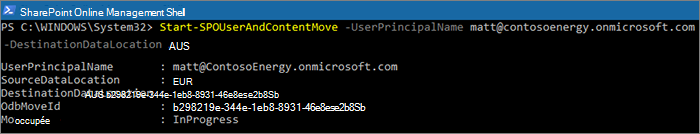

# Déplacer un site OneDrive vers un autre emplacement géographique 

Avec OneDrive géolocalisation, vous pouvez déplacer les données d’un OneDrive vers un autre emplacement géographique. OneDrive le déplacement géographique est effectué par l’administrateur SharePoint Online ou l’administrateur Microsoft 365 général. Avant de commencer un déplacement géographique OneDrive, n’oubliez pas d’avertir l’utilisateur dont le OneDrive est déplacé et de lui recommander de fermer tous les fichiers pendant toute la durée du déplacement. (Si un document est ouvert par l’utilisateur à l’aide du client Office pendant le déplacement, le document doit être enregistré au nouvel emplacement une fois le déplacement terminé.) Le déplacement peut être programmé ultérieurement, si vous le souhaitez.

Le service OneDrive utilise Azure Blob Stockage pour stocker du contenu. Le blob Stockage associé au OneDrive de l’utilisateur sera déplacé de la source vers l’emplacement géographique de destination dans les 40 jours suivant la OneDrive de destination disponible pour l’utilisateur. L’accès à la OneDrive de l’utilisateur est restauré dès que la OneDrive de destination est disponible.

Pendant OneDrive de déplacement géographique (environ 2 à 6 heures), le OneDrive utilisateur est en lecture seule. L’utilisateur peut toujours accéder à ses fichiers via l’application Synchronisation OneDrive ou son site OneDrive dans SharePoint Online. Une fois OneDrive le déplacement géographique est terminé, l’utilisateur est automatiquement connecté à son OneDrive à l’emplacement géographique de destination lorsqu’il navigue vers OneDrive dans le lanceur d’applications Microsoft 365. L’application de synchronisation commence automatiquement la synchronisation à partir du nouvel emplacement.

Les procédures décrites dans cet article nécessitent le [module Microsoft SharePoint Online PowerShell](https://www.microsoft.com/download/details.aspx?id=35588).

## Communication avec vos utilisateurs

Lors du déplacement de sites OneDrive entre différents emplacements géographiques, il est important de communiquer à vos utilisateurs ce à quoi ils doivent s’attendre. Cela peut vous aider à réduire la confusion des utilisateurs et diminuer le nombre d’appels à votre support technique. Prévenez vos utilisateurs par courriel avant le déplacement et faites-leur part des informations suivantes :

- La date de début prévue du déplacement et la durée attendue de l’opération.
- L’emplacement géographique vers lequel est déplacé leur espace OneDrive et l’URL permettant d’accéder au nouvel emplacement.
- Conseillez-leur de fermer leurs fichiers et de ne pas y apporter de modifications lors du déplacement.
- Le partage et les autorisations de fichiers ne sont modifiés par la migration.
- Présentez-leur l’[expérience utilisateur dans un environnement multigéographique](multi-geo-user-experience.md).

N’oubliez pas d’envoyer un courrier électronique à vos utilisateurs une fois le déplacement terminé pour les avertir qu’ils peuvent reprendre leur travail dans OneDrive.

## Planification de déplacements de site OneDrive

Vous pouvez planifier les déplacements de site OneDrive à l’avance (décrit plus loin dans cet article). Nous vous recommandons de commencer avec un petit nombre d’utilisateurs pour valider vos stratégies de communication et de flux de travail. Une fois que vous êtes habitué au processus, vous pouvez planifier des déplacements comme suit :

- Vous pouvez planifier jusqu’à 4 000 déplacements à la fois.
- Lorsque les déplacements commencent, vous pouvez planifier plus d’informations, avec un maximum de 4 000 déplacements dans la file d’attente et à un moment donné.
- La taille maximale d’un élément pouvant être déplacé par OneDrive est de 1 téraoctet (1 to).

## Déplacement d’un site OneDrive

Pour effectuer un OneDrive géographique, l’administrateur client doit d’abord définir l’emplacement par choix par utilisateur (PDL) sur l’emplacement géographique approprié. Une fois la PDL définie, attendez au moins 24 heures que la mise à jour PDL soit synchronisée entre les emplacements géographiques avant de commencer le OneDrive géo.

Lorsque vous utilisez les cmdlets de déplacement géographique, connectez-vous au service SPO à l’emplacement OneDrive l’emplacement géographique actuel de l’utilisateur, à l’aide de la syntaxe suivante :

`Connect-SPOService -url https://<tenantName>-admin.sharepoint.com`

Par exemple : pour déplacer OneDrive de l’utilisateur « Matt@contosoenergy.onmicrosoft.com » , connectez-vous au Centre d’administration EUR SharePoint car le OneDrive de l’utilisateur se trouve dans l’emplacement géographique EUR :

`Connect-SPOSservice -url https://contosoenergyeur-admin.sharepoint.com`

## Validation de l’environnement

Avant de commencer un déplacement géographique OneDrive, nous vous recommandons de valider l’environnement.

Pour vous assurer que tous les emplacements géographiques sont compatibles, exécutez :

`Get-SPOGeoMoveCrossCompatibilityStatus`

Une liste de vos emplacements géographiques s’affichera et le contenu que vous pourrez déplacer entre ces emplacements sera marqué « Compatible ». Si la commande renvoie « Incompatible », réessayez de valider l’état plus tard.

Si un OneDrive contient, par exemple, un sous-site, il ne peut pas être déplacé. Vous pouvez utiliser la cmdlet Start-SPOUserAndContentMove avec le paramètre -ValidationOnly pour contrôler si le site OneDrive peut être déplacé :

`Start-SPOUserAndContentMove -UserPrincipalName <UPN> -DestinationDataLocation <DestinationDataLocation> -ValidationOnly`

Ceci renvoie Opération réussie si le site OneDrive est prêt à être déplacé ou Échec s’il existe une conservation légale ou un sous-site qui empêche le déplacement. Une fois que vous avez contrôlé que le site OneDrive est prêt à être déplacé, vous pouvez commencer le déplacement.

## Démarrer un déplacement géographique OneDrive

Pour démarrer le déplacement, exécutez :  

`Start-SPOUserAndContentMove -UserPrincipalName <UserPrincipalName> -DestinationDataLocation <DestinationDataLocation>`

À l’aide de ces paramètres :

-   _UserPrincipalName_ : UPN de l’utilisateur dont le site OneDrive est déplacé.

-   _DestinationDataLocation_ : Geo-Location où le OneDrive doit être déplacé. Il doit être identique à l’emplacement de données préféré de l’utilisateur.

Par exemple, pour déplacer le site OneDrive de matt@contosoenergy.onmicrosoft.com de l’emplacement EUR à AUS, exécutez :

`Start-SPOUserAndContentMove -UserPrincipalName matt@contosoenergy.onmicrosoft.com -DestinationDataLocation AUS`

Pour planifier un déplacement géographique à un autre moment, utilisez l’un des paramètres suivants :

-   _PreferredMoveBeginDate_ : le déplacement commencera probablement à l’heure spécifiée. L’heure doit être spécifiée en Temps universel coordonné (UTC).

-   _PreferredMoveEndDate_ : le déplacement se terminera probablement d’ici l’heure spécifiée, dans la mesure du possible. L’heure doit être spécifiée en Temps universel coordonné (UTC). 

## Annuler un déplacement géographique OneDrive 

Vous pouvez arrêter le déplacement géographique du OneDrive d’un utilisateur, à condition que le déplacement ne soit pas en cours ou terminé à l’aide de la cmdlet :

`Stop-SPOUserAndContentMove – UserPrincipalName <UserPrincipalName>`

où _UserPrincipalName_ est l’UPN de l’utilisateur dont vous souhaitez arrêter le déplacement du site OneDrive.

## Déterminer l’état actuel

Vous pouvez vérifier l’état d’une OneDrive géographique à l’entrée ou à la sortie de la géo à qui vous êtes connecté à l’aide de l'Get-SPOUserAndContentMoveState de données.

Les états de déplacement sont décrits dans le tableau suivant.

<table>
<thead>
<tr class="header">
<th align="left">Statut</th>
<th align="left">Description</th>
</tr>
</thead>
<tbody>
<tr class="odd">
<td align="left">NotStarted</td>
<td align="left">Le déplacement n’a pas commencé.</td>
</tr>
<tr class="even">
<td align="left">InProgress (<em>n</em>/4)</td>
<td align="left">Le déplacement est en cours dans l’un des états suivants : Validation (1/4), Sauvegarde (2/4), Restauration (3/4), Nettoyage (4/4).</td>
</tr>
<tr class="odd">
<td align="left">Opération réussie</td>
<td align="left">Le déplacement a réussi.</td>
</tr>
<tr class="even">
<td align="left">Échec</td>
<td align="left">Le déplacement a échoué.</td>
</tr>
</tbody>
</table>

Pour rechercher l’état du déplacement d’un utilisateur spécifique, utilisez le paramètre UserPrincipalName :

`Get-SPOUserAndContentMoveState -UserPrincipalName <UPN>`

Pour rechercher l’état de tous les déplacements à l’intérieur ou à l’écart de l’emplacement géographique à qui vous êtes connecté, utilisez le paramètre MoveState avec l’une des valeurs suivantes : NotStarted, InProgress, Success, Failed, All.

`Get-SPOUserAndContentMoveState -MoveState <value>`

Vous pouvez également ajouter le paramètre `-Verbose` pour des descriptions plus détaillées de l’état de déplacement.

## Expérience de l’utilisateur

Les utilisateurs de OneDrive devraient observer des perturbations minimales si leur site OneDrive est déplacé vers un autre emplacement géographique. Excepté un état de lecture seule bref lors du déplacement, les autorisations et liens existants continueront à fonctionner comme prévu une fois le déplacement terminé.

### Lecteur OneDrive d’un utilisateur

Lorsque le déplacement est en cours, la OneDrive de l’utilisateur est définie en lecture seule. Une fois le déplacement terminé, l’utilisateur est dirigé vers son OneDrive dans le nouvel emplacement géographique lorsqu’il navigue vers OneDrive le lanceur d’applications Microsoft 365 ou un navigateur web.

### Autorisations sur le contenu OneDrive

Les utilisateurs autorisé à OneDrive contenu continueront d’avoir accès au contenu pendant le déplacement et une fois qu’il est terminé.

### Synchronisation OneDrive application 

L Synchronisation OneDrive’application détecte et transfère automatiquement la synchronisation de façon transparente vers le nouvel emplacement OneDrive une fois le déplacement OneDrive géo terminé. L’utilisateur n’a pas besoin de se connecter à nouveau ou d’agir autrement.  (Version 17.3.6943.0625 ou ultérieure de l’application de synchronisation requise.)

Si un utilisateur met à jour un fichier alors que le déplacement géographique OneDrive est en cours, l’application de synchronisation l’informe que les téléchargements de fichiers sont en attente pendant le déplacement.

### Liens de partage 

Lorsque le déplacement géographique de OneDrive est terminé, les liens partagés existants pour les fichiers qui ont été déplacés redirigent automatiquement vers le nouvel emplacement géographique.

### Expérience OneNote 

Le client OneNote win32 client et l’application UWP (universelle) détecteront automatiquement et synchroniseront en toute transparence les blocs-notes avec le nouvel emplacement OneDrive à la fin du déplacement géographique de OneDrive. L’utilisateur n’a pas besoin de se connecter à nouveau ou d’effectuer une autre action. Le seul indicateur visible pour l’utilisateur est l’échec de la synchronisation des blocs-notes lorsque le déplacement géographique de OneDrive est en cours. Cette expérience est disponible sur les versions de client OneNote suivantes :

-   OneNote win32 – Version 16.0.8326.2096 (et versions ultérieures)

-   OneNote UWP – Version 16.0.8431.1006 (et versions ultérieures)

-   Application mobile OneNote : Version 16.0.8431.1011 (et versions ultérieures)

### Application Teams

Lorsque le déplacement géographique de OneDrive est terminé, les utilisateurs ont accès à leurs fichiers OneDrive sur l’application Teams. En outre, les fichiers partagés via la conversation Teams de leur site OneDrive avant le déplacement géographique continuent à fonctionner après le déplacement.

### OneDrive Application mobile (iOS) 

Lorsque le déplacement géographique de OneDrive est terminé, l’utilisateur doit se déconnecter et se reconnecter sur l’application mobile iOS pour réaliser la synchronisation avec le nouvel emplacement OneDrive.

### Sites et groupes suivis existants

Les sites et les groupes suivis s’afficheront dans l’OneDrive de l’utilisateur, quel que soit son emplacement géographique. Les sites et groupes hébergés dans un autre emplacement géographique s’ouvrent dans un onglet distinct.

### Delve Mises à jour de l’URL géographique

Les utilisateurs sont envoyés vers la Delve géographique correspondant à leur PDL uniquement après que leur OneDrive a été déplacée vers la nouvelle géographique.
