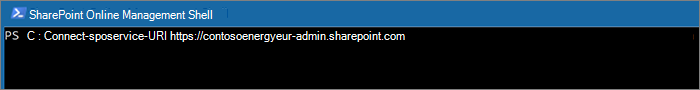

# <a name="move-a-sharepoint-site-to-a-different-geo-location"></a>Déplacer un site SharePoint vers un autre emplacement géographique

La fonctionnalité de déplacement géographique de site de SharePoint vous permet de déplacer des sites SharePoint sur d’autres emplacements géographiques au sein de votre environnement multigéographique.

Les types de sites pouvant être déplacés entre emplacements géographiques sont les suivants :

- Sites connectés au groupe Microsoft 365, y compris les sites associés à Microsoft Teams
- Sites modernes sans association de groupe Microsoft 365
- Sites SharePoint classiques
- Sites de communication

Pour pouvoir déplacer un site, vous devez être un administrateur général ou un administrateur SharePoint.

Il existe une fenêtre en lecture seule pendant le déplacement géographique du site SharePoint d’environ 4 à 6 heures, en fonction du contenu du site.

## <a name="best-practices"></a>Meilleures pratiques

- Essayez d’effectuer un déplacement de site SharePoint sur un site de test pour vous familiariser avec la procédure.
- Avant de planifier ou d’effectuer le déplacement, vérifiez si le site peut être déplacé.
- Autant que possible, planifiez les déplacements intersites en dehors des heures d’ouverture afin de réduire l’impact sur les utilisateurs.
- Avant de déplacer des sites, communiquez avec les utilisateurs concernés.

## <a name="communicating-to-your-users"></a>Communication avec vos utilisateurs

Lors du déplacement géographique de sites SharePoint, il est important d’indiquer aux utilisateurs des sites (généralement, toute personne ayant la possibilité de modifier le site) à quoi ils doivent s’attendre. Cela peut vous aider à atténuer la confusion des utilisateurs et les appels à votre support technique. Avant de déplacer des sites, envoyez un courrier électronique à leurs utilisateurs pour leur communiquer les informations suivantes :

- date de début et durée prévues du déplacement ;
- emplacement géographique cible du déplacement et URL permettant d’accéder à ce nouvel emplacement ;
- nécessité de fermer les fichiers et de ne pas y apporter de modifications durant le déplacement ;
- absence de modification des autorisations et des partages de fichiers en raison du déplacement ;
- changement d’expérience utilisateur dans un environnement multigéographique.

Une fois le déplacement terminé, n’oubliez pas d’envoyer un courrier aux utilisateurs de vos sites pour les avertir qu’ils peuvent reprendre leur travail.

## <a name="scheduling-sharepoint-site-moves"></a>Planification des déplacements de sites SharePoint

Vous pouvez planifier les déplacements de sites SharePoint (voir plus loin dans cet article). Vous pouvez planifier les déplacements comme suit :

- Vous pouvez planifier jusqu’à 4 000 déplacements à la fois.
- Lorsque les déplacements commencent, vous pouvez planifier plus d’informations, avec un maximum de 4 000 déplacements dans la file d’attente et à un moment donné.
- La taille maximale d’un site SharePoint qui peut être déplacé est de 1 téraoctet (1 To).

Pour planifier un déplacement géographique de site SharePoint, lorsque vous commencez le déplacement, incluez parmi l’un des paramètres suivants :

- `PreferredMoveBeginDate` – Le déplacement commencera probablement à l’heure indiquée.
- `PreferredMoveEndDate` – Le déplacement devrait être terminé à l’heure indiquée.

L’heure doit être exprimée en Temps universel coordonné (UTC) pour les deux paramètres.

## <a name="moving-the-site"></a>Déplacement du site

Un déplacement géographique de site SharePoint nécessite que vous vous connectiez et opériez le déplacement de l’URL d’administration SharePoint vers l’emplacement géographique du site.

Par exemple, si l’URL du site est `https://contosohealthcare.sharepoint.com/sites/Turbines`, connectez-vous à l’URL Administration SharePoint à l’adresse `https://contosohealthcare-admin.sharepoint.com`suivante :

```powershell
Connect-SPOService -Url https://contosohealthcare-admin.sharepoint.com
```



### <a name="validating-the-environment"></a>Validation de l’environnement

Avant de planifier le déplacement d’un site, nous vous recommandons de vérifier que celui-ci peut être déplacé.

Il n’est pas possible de déplacer des sites avec :

- Business Connectivity Services
- InfoPath Forms
- Modèles d’IRM (Gestion des Droits relatifs à l’Information) appliqués

Pour vous assurer que tous les emplacements géographiques sont compatibles, exécutez la cmdlet `Get-SPOGeoMoveCrossCompatibilityStatus`. Cela a pour effet d’afficher les emplacements géographiques et d’indiquer si leur environnement est compatible avec l’emplacement géographique cible.

Pour vérifier si votre site peut être déplacé, utilisez la cmdlet `Start-SPOSiteContentMove` avec le paramètre `-ValidationOnly`. Par exemple :

```PowerShell
Start-SPOSiteContentMove -SourceSiteUrl <SourceSiteUrl> -ValidationOnly -DestinationDataLocation <DestinationLocation>
```

Cette cmdlet retourne *Success* si le site peut être déplacé, ou *Fail* en cas de blocage du déplacement.

### <a name="start-a-sharepoint-site-geo-move-for-a-site-with-no-associated-microsoft-365-group"></a>Démarrer un déplacement géographique de site SharePoint pour un site sans groupe Microsoft 365 associé

Par défaut, l’URL initiale du site est remplacée par l’URL de l’emplacement géographique cible. Par exemple :

`https://Contoso.sharepoint.com/sites/projectx` devient `https://ContosoEUR.sharepoint.com/sites/projectx`

Pour les sites sans association de groupe Microsoft 365, vous pouvez également renommer le site à l’aide du `-DestinationUrl` paramètre. Par exemple :

<https://Contoso.sharepoint.com/sites/projectx> devient `https://ContosoEUR.sharepoint.com/sites/projecty`

Pour commencer à déplacer le site, exécutez la cmdlet suivante :

```powershell
Start-SPOSiteContentMove -SourceSiteUrl <siteURL> -DestinationDataLocation <DestinationDataLocation> -DestinationUrl <DestinationSiteURL>
```


### <a name="start-a-sharepoint-site-geo-move-for-a-microsoft-365-group-connected-site"></a>Démarrer un déplacement géographique de site SharePoint pour un site connecté à un groupe Microsoft 365

Pour déplacer un site connecté à un groupe Microsoft 365, l’administrateur général ou l’administrateur SharePoint doit d’abord modifier l’attribut PDL (Preferred Data Location) pour le groupe Microsoft 365.

Pour définir le fichier PDL d’un groupe Microsoft 365 :

```PowerShell
Set-SPOUnifiedGroup -PreferredDataLocation <PDL> -GroupAlias <GroupAlias>
Get-SPOUnifiedGroup -GroupAlias <GroupAlias>
```

Une fois l’emplacement par défaut des données mis à jour, vous pouvez commencer à déplacer le site :

```PowerShell
Start-SPOUnifiedGroupMove -GroupAlias <GroupAlias> -DestinationDataLocation <DestinationDataLocation>
```

## <a name="cancel-a-sharepoint-site-geo-move"></a>Annuler un déplacement géographique de site SharePoint

Vous pouvez arrêter un déplacement géographique de site OneDrive, à la condition que ce déplacement ne soit pas en cours ou terminé, en utilisant la cmdlet `Stop-SPOSiteContentMove` :

## <a name="determining-the-status-of-a-sharepoint-site-geo-move"></a>Détermination de l’état d’un déplacement géographique de site SharePoint

Vous pouvez déterminer l’état d’un déplacement de site hors de la zone géographique à laquelle vous êtes connecté à l’aide des cmdlets suivantes :

- [Get-SPOSiteContentMoveState](/powershell/module/sharepoint-online/get-spositecontentmovestate) (sites non connectés à un groupe)
- [Get-SPOUnifiedGroupMoveState](/powershell/module/sharepoint-online/get-spounifiedgroupmovestate) (sites connectés au groupe)

Pour spécifier le site dont vous voulez voir l’état de déplacement, utilisez le paramètre `-SourceSiteUrl`.

Les états de déplacement sont décrits dans le tableau suivant.

****

|Statut|Description|
|---|---|
|Ready to Trigger|Le déplacement n’a pas commencé.|
|Scheduled|Le déplacement est en file d’attente mais n’a pas encore commencé.|
|InProgress (n/4)|Le déplacement est en cours dans l’un des états suivants : Validation (1/4), Sauvegarde (2/4), Restauration (3/4), Nettoyage (4/4).|
|Opération réussie|Le déplacement a réussi.|
|Échec|Le déplacement a échoué.|
|

Vous pouvez également appliquer l’option `-Verbose` pour voir des informations supplémentaires sur le déplacement.

## <a name="user-experience"></a>Expérience utilisateur

Les utilisateurs du site devraient constater une perturbation minimale lors du déplacement géographique du site. À l’exception d’un bref état en lecture seule lors du déplacement, les liens et autorisations existants continuent de fonctionner comme prévu après le déplacement.

### <a name="site"></a>Site

Pendant que le déplacement est en cours, le site est défini sur lecture seule. Une fois le déplacement terminé, l’utilisateur est redirigé vers le nouveau site dans le nouvel emplacement géographique quand il clique sur des signets ou d’autres liens pointant sur le site.

### <a name="permissions"></a>Autorisations

Les utilisateurs disposant d’autorisations d’accès au site continuent de pouvoir y accéder durant et après le déplacement.

### <a name="sync-app"></a>Synchroniser l’application

L’application de synchronisation détecte et transfère automatiquement la synchronisation vers le nouvel emplacement du site une fois le déplacement du site terminé. L’utilisateur n’a pas besoin de se reconnecter ou d’effectuer un autre action. (Version 17.3.6943.0625 ou ultérieure de l’application de synchronisation requise.)

Si un utilisateur met à jour un fichier pendant le déplacement, l’application de synchronisation l’informe que les chargements de fichiers sont en attente pendant le déplacement.

### <a name="sharing-links"></a>Partage des liens

Une fois le déplacement géographique de site OneDrive terminé, les liens partagés existants vers les fichiers déplacés redirigent automatiquement vers le nouvel emplacement géographique.

### <a name="most-recently-used-files-in-office-mru"></a>Fichiers récents dans Office

Une fois le déplacement terminé, le service Fichiers récents est mis à jour avec l’URL du site et les URL de son contenu. Cela vaut pour Word, Excel et PowerPoint.

### <a name="onenote-experience"></a>Expérience OneNote

Le client OneNote Win32 et l’application UWP (plateforme Windows universelle) détectent et synchronisent automatiquement et sans difficulté les blocs-notes sur le nouvel emplacement du site une fois celui-ci déplacé. L’utilisateur n’a pas besoin de se reconnecter ou d’effectuer un autre action. Le seul indicateur pour l’utilisateur est un échec éventuel de synchronisation de bloc-notes durant le déplacement du site. Cette expérience est disponible sur les versions suivantes du client OneNote :

- OneNote win32 – Version 16.0.8326.2096 (et versions ultérieures)
- OneNote UWP – Version 16.0.8431.1006 (et versions ultérieures)
- Application mobile OneNote : Version 16.0.8431.1011 (et versions ultérieures)

### <a name="teams-applicable-to-microsoft-365-group-connected-sites"></a>Teams (applicable aux sites connectés au groupe Microsoft 365)

Une fois le déplacement géographique du site SharePoint terminé, les utilisateurs ont accès à leurs fichiers de site de groupe Microsoft 365 sur l’application Teams. Par ailleurs, les fichiers partagés via une conversation Teams à partir de leur site avant le déplacement géographique continuent également de fonctionner après le déplacement.

Le déplacement géographique de site SharePoint ne prend pas en charge le déplacement de canaux privés d’une zone géographique à une autre. Les canaux privés restent dans la zone géographique d’origine.
  

### <a name="sharepoint-mobile-app-iosandroid"></a>Application SharePoint Mobile (iOS/Android)

L’application SharePoint Mobile étant inter-géographique, elle est capable de détecter le nouvel emplacement géographique du site.

### <a name="sharepoint-workflows"></a>Flux de travail SharePoint

Les flux de travail SharePoint 2013 doivent être republiés après le déplacement du site. Les flux de travail SharePoint 2010 devraient continuer de fonctionner normalement.

### <a name="apps"></a>Applications

Si vous déplacez un site avec des applications, vous devez réinstaller l’application dans le nouvel emplacement géographique du site, car l’application et ses connexions peuvent ne pas être disponibles dans l’emplacement géographique de destination.

### <a name="power-automate"></a>Power Automate

Dans la plupart des cas, les flux Power Automate continueront de fonctionner après un déplacement géographique de site SharePoint. Nous vous conseillons de les tester une fois le déplacement terminé.

### <a name="power-apps"></a>Power Apps

Power Apps doit être recréé à l’emplacement de destination.

### <a name="data-movement-between-geo-locations"></a>Déplacement de données entre emplacements géographiques

SharePoint utilise Stockage Blob Azure pour son contenu, tandis que les métadonnées associées aux sites et à ses fichiers sont stockées dans SharePoint. Le déplacement du site de son emplacement géographique source vers son emplacement géographique cible implique également le déplacement de son Stockage Blob. Le déplacement du Stockage Blob prend environ 40 jours. Cela n’aura aucun impact sur l’interaction des utilisateurs avec les données. 

Vous pouvez vérifier l’état de déplacement du Stockage Blob à l’aide de l’applet de commande [Get-SPOCrossGeoMoveReport](/powershell/module/sharepoint-online/get-spocrossgeomovereport) . 
