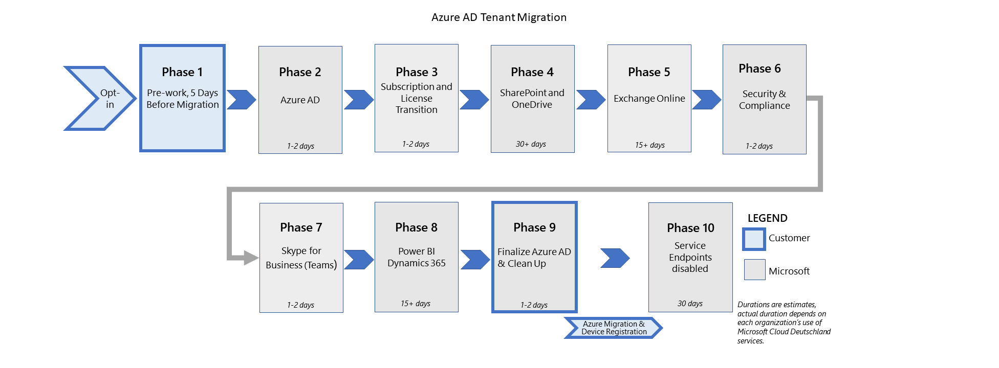

# <a name="migration-phases-actions-and-impacts-for-the-migration-from-microsoft-cloud-deutschland"></a>Actions et impacts des phases de migration pour la migration à partir de Microsoft Cloud Deutschland

Les migrations de clients de Microsoft Cloud Deutschland (MCD) vers la région « Allemagne » des services globaux Office 365 de Microsoft sont exécutées sous la forme d’un ensemble de phases et de leurs actions configurées pour chaque charge de travail. Cette figure montre les dix phases de migration vers les nouveaux centres de données allemands.

[](../media/ms-cloud-germany-migration-opt-in/migration-organization.png#lightbox)

Le processus de migration s’achèvera sur plusieurs semaines en fonction de la taille et de la complexité globales de l’organisation. Pendant la migration, les utilisateurs et les administrateurs peuvent continuer à utiliser les services avec des modifications notables détaillées dans cette documentation. Le graphique et le tableau définissent les phases et les étapes de la migration.

> [!NOTE]
> La migration des services Azure ne fait pas partie de cette documentation. Pour ces informations, consultez les [instructions de migration pour Azure Germany.](/azure/germany/germany-migration-main)

|Étape|Durée|Partie responsable|Description|
|:--------|:--------|:--------|:--------|
|Opt-In|Heures|Client|Choisissez votre organisation pour la migration.|
|Pré-travail|Jours|Client|Effectuer le travail nécessaire pour préparer les utilisateurs, les stations de travail et le réseau pour la migration.|
|Azure Active Directory (Azure AD)|1 à 2 jours|Microsoft|Migrez l’organisation Azure AD vers le monde entier.|
|Azure|Semaines|Client|Créez des abonnements Azure dans le monde entier et [transition des services Azure.](/azure/azure-resource-manager/management/move-resource-group-and-subscription)|
|Transition de licence & abonnement|1 à 2 jours|Microsoft|Acheter des abonnements dans le monde entier, annuler des abonnements Microsoft Cloud Deutschland et passer des licences utilisateur.|
|SharePoint et OneDrive|15+ jours|Microsoft|Migrez SharePoint et OneDrive Entreprise contenu, en sharepoint.de URL.|
|Exchange Online|15+ jours|Microsoft|Migrez Exchange Online contenu et migrez vers des URL dans le monde entier.|
|Sécurité et conformité|1 à 2 jours|Microsoft|Transition de la sécurité & stratégies de conformité et du contenu.|
|Skype Entreprise|1 à 2 jours|Microsoft|Passer d’Skype Entreprise à Microsoft Teams.|
|Power BI & Dynamics 365|15+ jours|Microsoft|Migrez Power BI contenu Dynamics 365.|
|Finaliser Azure AD|1 à 2 jours|Microsoft|Effectuer un cutover client dans le monde entier.|
|Clean-Up|1 à 2 jours|Client|Nettoyez les connexions héritées à Microsoft Cloud Deutschland, telles que l’confiance de partie de confiance des services AD FS (Active Directory Federation Services), azure AD Connecter et le client Office redémarrage.|
|Points de terminaison désactivés|30 jours|Microsoft|30 jours après la finalisation d’Azure AD, le service Microsoft Cloud Deutschland Azure AD arrêtera l’accès au point de terminaison pour l’organisation en transition. Les demandes de point de terminaison telles que l’authentification échoueront à partir de là par rapport au service Microsoft Cloud Deutschland. Les clients exécutant des charges de travail Azure dans l’instance liée aux services Office 365 Microsoft Cloud Deutschland seront déplacés ultérieurement vers la phase de migration finale. |

Les phases et leurs actions garantissent que les données et expériences critiques sont migrées vers Office 365 services globaux. Une fois que votre client est ajouté à la file d’attente de migration, chaque charge de travail est exécutée en tant qu’ensemble d’étapes exécutées sur le service backend. Certaines charges de travail peuvent nécessiter des actions de l’administrateur (ou de l’utilisateur) ou la migration peut affecter l’utilisation des phases exécutées et abordées dans Comment la migration est-elle [organisée ?](ms-cloud-germany-transition.md#how-is-the-migration-organized)

Les sections suivantes contiennent des actions et des effets pour les charges de travail au fil de différentes phases de la migration. Examinez les tableaux et déterminez les actions ou effets applicables à votre organisation. Assurez-vous que vous êtes prêt à exécuter les étapes des phases respectives, le cas échéant. L’échec de la réalisation des étapes nécessaires peut entraîner une panne du service et retarder l’achèvement de la migration vers les services Office 365 services.

## <a name="phase-opt-in"></a>Phase : Opt-In

S’applique à **:** tous les clients avec un client Office 365 hébergé dans Microsoft Cloud Deutschland (MCD) Microsoft ne peuvent pas migrer les clients Office 365 hébergés dans mcd sans consentement.

| Étapes | Description | Impact |
|:-------|:-----|:-------|
|**Tâche du client**: accorder le consentement pour la migration| Le client donne son consentement pour la migration afin que Microsoft obtient le droit de migrer et d’orchestrer la transition des données et des services vers l’instance Office 365 services globaux. Il existe deux façons <ol><li>L Office 365 de client choisit la migration pilotée par Microsoft. </li><li> Les clients ont renouvelé tous les abonnements dans leur Office 365 client MCD après le 1er mai 2020. Microsoft informe ces clients du droit de migration chaque mois, attend 30 jours pour donner aux clients la possibilité d’annuler, puis d’y opter directement.</li></ol> | <ul><li>Le client est marqué comme étant accepté pour la migration et le Centre d’administration affiche la confirmation. </li><li>L’accusé de réception est publié dans Office 365 de messages du client. La configuration du service se poursuit à partir des points de terminaison Microsoft Cloud Deutschland. </li><li> </li></ul>
|**Administrateur client :** surveiller les messages|L’administrateur client doit surveiller le centre Office 365 messages pour les mises à jour sur l’état de la phase de migration à partir de cette heure.|Le client peut exécuter les tâches nécessaires dans le temps.
||||

## <a name="phase-1-before-the-migration-starts"></a>Phase 1 : Avant le début de la migration

Assurez-vous que vous êtes familiarisé avec les étapes de préparation de [la migration qui s’appliquent à tous les clients.](ms-cloud-germany-transition-add-pre-work.md)

Si vous avez définie un DNS CNAME appelé _msoid_ dans un ou plusieurs espaces de noms DNS que vous possédez, vous devez supprimer le CNAME jusqu’à la fin de la phase 8 au plus tard. Vous pouvez supprimer le _msoid_ CNAME à tout moment avant la fin de la phase 8. Consultez [les prétravails pour DNS.](ms-cloud-germany-transition-add-pre-work.md#dns-entries-for-custom-domains)

Si vous utilisez l' sign on unique pour Office 365 et Azure dans l’instance Microsoft Cloud Deutschland, vous devez préparer et planifier votre migration d’abonnement Azure en conséquence. Assurez-vous que vous comprenez [les prétravails pour Microsoft Azure](ms-cloud-germany-transition-add-pre-work.md#microsoft-azure).

### <a name="azure-ad-connect-with-ad-fs-federation"></a>Azure AD Connecter fédération AD FS
**S’applique** à : Clients avec fédération AD FS

**Lorsqu’elle est** appliquée : avant le démarrage de la phase 2

Si vous utilisez les services AD FS (Active Directory Federation Services), veillez à la back up votre [configuration ADFS](ms-cloud-germany-transition-add-adfs.md) avant et après avoir ajouté l’confiance de partie de confiance pour le **service** global Office 365 avant le début de la phase 2.

## <a name="phase-2-azure-ad-migration"></a>Phase 2 : Migration Azure AD
Dans cette phase, le Azure Active Directory sera migré vers la nouvelle région de centres de données et deviendra actif. Les anciens points de terminaison Azure AD seront toujours disponibles.

### <a name="exchange-online-hybrid---modify-authserver-on-premises"></a>Exchange Online Hybride : modifier AuthServer en local
**S’applique à :** Tous les clients utilisant une configuration hybride Exchange active avec Exchange serveurs locaux

**Lorsqu’elle est** appliquée : après la fin de la phase 2

AuthServer local doit pointer vers le service d’jeton de sécurité global (STS) pour l’authentification une fois la migration d’Azure AD terminée.
Cela garantit que les demandes d’authentification pour les demandes de disponibilité Exchange des utilisateurs en état de migration qui ciblent l’environnement local hybride sont authentifiées pour accéder au service local. De même, cela garantit l’authentification des demandes provenant de l’environnement local Office 365 des points de terminaison des services globaux. Une fois la migration Azure AD (phase 2) terminée, l’administrateur de la topologie Exchange (hybride) sur site doit ajouter un nouveau point de terminaison du service d’authentification pour les services globaux Office 365. Avec cette commande de Exchange PowerShell, remplacez l’ID de locataire de votre organisation dans le portail `<TenantID>` Azure sur Azure Active Directory.

```powershell
New-AuthServer GlobalMicrosoftSts -AuthMetadataUrl https://accounts.accesscontrol.windows.net/<TenantID>/metadata/json/1
```

Si vous ne parvient pas à effectuer cette tâche, les demandes de libre-service hybrides risquent de ne pas fournir d’informations aux utilisateurs de boîtes aux lettres qui ont été migrés de Microsoft Cloud Deutschland vers Office 365 services.

## <a name="phase-3-subscription-transfer"></a>Phase 3 : Transfert d’abonnement

**S’applique** à : Tous les clients avec un client Office 365 hébergé dans Microsoft Cloud Deutschland (MCD)

| Étapes | Description | Impact |
|:-------|:-------|:-------|
| Les abonnements sont transférés| L’abonnement Microsoft Cloud Deutschland sera migré vers l’abonnement Office 365 services globaux. <ul><li>Le Office 365 de services globaux de cet abonnement est défini par Microsoft (également appelé _mappage des offres)._</li><li> Les Office 365 services globaux correspondants sont achetés dans l’instance Office 365 global pour les abonnements Microsoft Cloud Deutschland transférés.</li><li>Les abonnements Microsoft Cloud Deutschland hérités sont supprimés du client Office 365 services à la fin.</li></ul>| <ul><li>Les modifications apportées aux abonnements existants seront bloquées (par exemple, aucun nouvel achat d’abonnement ou changement de nombre de sièges) au cours de cette phase.</li><li>Les modifications d’attribution de licence seront bloquées.</li><li>Lorsque la migration des abonnements est terminée, les services Office 365 et les abonnements Microsoft Cloud Deutschland sont visibles dans le portail Office 365 Admin, avec l’état des abonnements Microsoft Cloud Deutschland comme supprimés. </li><li>Les processus clients qui ont des dépendances sur les abonnements Microsoft Cloud Deutschland ou les GUID SKU sont rompus et doivent être révisés avec l’offre Office 365 services. </li><li>Les nouveaux abonnements dans les services Office 365 seront achetés avec la nouvelle période (mensuelle/trimestrielle/annuel), et le client recevra un remboursement au pro total pour le solde inutilisé de l’abonnement Microsoft Cloud Deutschland. </li></ul> |
|Les licences sont réassignés|Les utilisateurs ayant des licences Microsoft Cloud Deutschland se voit attribuer des licences dans l Office 365 instance globale.|<ul><li>Les utilisateurs seront réassignés avec des licences liées aux nouveaux abonnements Office 365 services. Les licences utilisateur de tous les utilisateurs seront automatiquement attribuées aux nouvelles fonctionnalités.</li><li>Le nombre de fonctionnalités (plans de service) proposées par Office 365 services peut être supérieur à celui de l’offre Microsoft Cloud Deutschland d’origine. Les licences utilisateur dans Office 365 services seront affectées de manière équivalente à des fonctionnalités Microsoft Cloud Deutschland similaires (plans de service). </li></ul> 
|**Tâche d’administration** Désactiver les fonctionnalités|L’administrateur doit prendre une action explicite pour désactiver ces fonctionnalités, si nécessaire. |<ul><li>Les utilisateurs voient de nouveaux services inconnus dans le portail</li><li>Des fonctionnalités supplémentaires sont disponibles (par exemple, Planificateur Microsoft et Microsoft Flow), sauf si désactivée par l’administrateur client. Pour plus d’informations sur la désactivation des plans de service affectés aux licences des utilisateurs, voir Désactiver l’accès aux services Microsoft 365 tout en attribuant des [licences utilisateur.](disable-access-to-services-while-assigning-user-licenses.md)</li></ul>
|**Tâche d’administration**|Réviser les processus clients qui ont des dépendances sur les abonnements Microsoft Cloud Deutschland ou les GUID SKU avec l’offre Office 365 services|Les processus clients continuent de fonctionner.
||||

**S’applique** à : Partenaires Microsoft qui utilisent le portail Office 365 microsoft

Entre les phases 2 et 3, le Portail partenaires n’est peut-être pas accessible. Pendant ce temps, il se peut que le partenaire ne puisse pas accéder aux informations du client sur le portail partenaire. Étant donné que chaque migration est différente, la durée de l’accessibilité peut être en heures.

Des informations supplémentaires pour les fournisseurs de solutions Cloud sont disponibles dans [la migration des locataires partenaires.](ms-cloud-germany-transition-add-csp.md#partner-tenant-migration)


## <a name="phase-4-sharepoint-online"></a>Phase 4 : SharePoint Online

**S’applique à**: Tous les clients utilisant SharePoint Online

Si vous utilisez toujours des flux de travail SharePoint 2013, limitez l’utilisation des flux de travail SharePoint 2013 pendant la migration SharePoint Online.

| Étapes | Description | Impact |
|:-------|:-----|:-------|
| SharePoint et OneDrive transition sont | SharePoint Les serveurs en OneDrive Entreprise sont migrés de Microsoft Cloud Deutschland vers Office 365 services globaux au cours de cette phase.<br><ul><li>Les URL Microsoft Cloud Deutschland existantes sont conservées (par exemple, `contoso.sharepoint.de` ).</li><li>Les sites existants sont conservés.</li><li>Les jetons d’authentification côté client qui ont été émis par le service d’émission de jeton de sécurité (STS) dans l’instance des services globaux Microsoft Cloud Deutschland ou Office 365 sont valides pendant la transition.</li></ul>|<ul><li>Le contenu sera en lecture seule pendant deux brèves périodes pendant la migration. Pendant ce temps, attendez-vous à ce qu’une bannière « Vous ne pouvez pas modifier le contenu » soit SharePoint.</li><li>L’index de recherche ne sera pas conservé et peut prendre jusqu’à 10 jours pour être reconstruit.</li><li>SharePoint En ligne et OneDrive Entreprise contenu sera en lecture seule pendant deux brèves périodes pendant la migration. Les utilisateurs voient une bannière « Vous ne pouvez pas modifier le contenu » brièvement pendant cette période.</li><li>À la fin de la migration SharePoint Online, les résultats de recherche pour le contenu SharePoint Online et OneDrive Entreprise peuvent être indisponibles pendant la reconstruction de l’index. Pendant cette période, les requêtes de recherche peuvent ne pas renvoyer de résultats complets. Les fonctionnalités qui dépendent des index de recherche, telles que SharePoint Online News, peuvent être affectées pendant la réindexation.</li><li>SharePoint flux de travail 2013 seront rompus lors de la migration et doivent être republiés après la migration.</li></ul>
|**Administrateur SPO :** republier SharePoint flux de travail 2013| Un administrateur SharePoint Online republiera les flux SharePoint 2013 après la migration.| Il s’agit d’une action obligatoire. Si vous ne le faites pas, les utilisateurs risquent de semer la confusion, d’appeler le service d’aide et de diminuer la productivité.
|**Utilisateur PowerShell :** mise à jour vers le nouveau module| Tous les utilisateurs du module SharePoint Online PowerShell doivent mettre à jour le module/Microsoft.SharePointOnline.CSOM vers la version 16.0.20717.12000 ou supérieure une fois la migration SharePoint Online terminée. L’achèvement est communiqué dans le centre de messages.| SharePoint En ligne via PowerShell ou le modèle objet côté client n’échoue plus.
||||

Considérations supplémentaires :

- Si votre organisation utilise toujours SharePoint flux de travail 2010, ils ne fonctionneront plus après le 31 décembre 2021. SharePoint flux de travail 2013 restent pris en charge, bien qu’ils restent désactivés par défaut pour les nouveaux locataires à compter du 1er novembre 2020. Une fois la migration vers le service SharePoint Online terminée, nous vous recommandons de passer à Power Automate solutions ou à d’autres solutions pris en charge.
 - Les clients Microsoft Cloud Deutschland dont l’instance SharePoint Online n’est pas encore migrée doivent rester sur le module SharePoint Online PowerShell/Microsoft.SharePointOnline.CSOM version 16.0.20616.12000 ou une version inférieure. Sinon, les connexions à SharePoint Online via PowerShell ou le modèle objet côté client échoueront.
- Au cours de cette phase, les adresses IP sous-SharePoint URL changeront. Après la transition vers les services globaux Office 365, les adresses des URL de client conservées (par exemple, et ) sont modifiées en URL et plages d’adresses IP Microsoft 365 dans le monde entier (SharePoint Online et `contoso.sharepoint.de` `contoso-my.sharepoint.de` [OneDrive Entreprise).](/microsoft-365/enterprise/urls-and-ip-address-ranges#sharepoint-online-and-onedrive-for-business)
- Bien que SharePoint et OneDrive services soient en transition, Office Online peut ne pas fonctionner comme prévu. 

> [!NOTE]
> Dans le cas où vous utilisez eDiscovery, assurez-vous de connaître l’expérience de [migration eDiscovery.](ms-cloud-germany-transition-add-scc.md)

## <a name="phase-5-exchange-online"></a>Phase 5 : Exchange Online 
À partir de la phase 5, Exchange Online boîtes aux lettres sont déplacées de Microsoft Cloud Deutschland vers Office 365 services globaux.

La Office 365 services globaux est définie par défaut, ce qui permet au service d’équilibrage de charge interne de redistribuer les boîtes aux lettres vers la région par défaut appropriée dans les services Office 365 services. Dans cette transition, les utilisateurs des deux côtés (MCD ou services globaux) sont dans la même organisation et peuvent utiliser l’un ou l’autre point de terminaison d’URL.

La nouvelle région « Allemagne » est ajoutée à la configuration de l’organisation. Exchange Online configuration ajoute la nouvelle région allemande locale à l’organisation en transition.

- Transition d’utilisateurs et de services à partir de vos URL MCD héritées ( ) vers les nouvelles `https://outlook.office.de` OFFICE 365 services ( `https://outlook.office365.com` ).
-  Les services Exchange Online (Outlook Web Access et Exchange Admin Center) pour la nouvelle région de centre de données allemand seront disponibles à partir de cette phase, mais ils ne le seront pas auparavant.
- Les utilisateurs peuvent continuer à accéder au service via les URL MCD héritées pendant la migration, mais ils doivent arrêter d’utiliser les URL héritées à la fin de la migration.
- Les utilisateurs doivent passer à l’utilisation du portail Office dans le monde entier pour Office online (Calendrier, Courrier, Personnes). La navigation vers les services qui ne sont pas encore migrés vers Office 365 services ne fonctionne pas tant qu’ils ne sont pas migrés. 
- Cette limitation s’applique également aux services en arrière-plan tels que « Mon compte ». Mon compte pour les services globaux sera disponible à la fin de la phase 9. En attendant, les utilisateurs doivent utiliser le portail MCD pour gérer leurs paramètres de compte.
- L Outlook Web App ne fournit pas l’expérience de dossier public pendant la migration.

Si vous souhaitez modifier des photos utilisateur au cours de la phase 5, voir Exchange Online [PowerShell - Set-UserPhoto phase 5](#exchange-online-powershell).

### <a name="dns-record-for-autodiscover-in-exchange-online"></a>Enregistrement DNS pour la découverte automatique dans Exchange Online
**S’applique à :** Clients utilisant Exchange Online avec un domaine personnalisé

Les paramètres DNS gérés par le client pour la découverte automatique qui pointent actuellement vers Microsoft Cloud Deutschland doivent être mis à jour pour faire référence au point de terminaison global Office 365 à la fin de la phase Exchange Online (phase 5). <br> Les entrées DNS existantes avec CNAME pointant vers autodiscover-outlook.office.de doivent être mises à jour pour pointer vers **autodiscover.outlook.com**.

Les clients qui n’effectuent pas ces mises à jour DNS à la fin de la **phase de migration 9** peuvent être en situation de problèmes de service lors de la finalisation de la migration.

> [!NOTE]
> Les erreurs de validation dans le Centre d’administration pour les domaines personnalisés pour l’entrée de découverte automatique peuvent être ignorées. Les services fonctionnent correctement uniquement lorsque l’enregistrement CNAME a été modifié en autodiscover.outlook.com.

### <a name="exchange-online-powershell"></a>Exchange Online PowerShell
**S’applique à :** Exchange Online administrateurs à l’aide Exchange Online PowerShell

Pendant la phase de migration, l’utilisation des cmdlets **PowerShell New-MigrationEndpoint,** **Set-MigrationEndpoint** et **Test-MigrationsServerAvailability** peut entraîner des erreurs (erreur sur le proxy). Cela se produit lorsque la boîte aux lettres d’arbitrage a migré vers le monde entier, mais pas la boîte aux lettres d’administration, et inversement. Pour résoudre ce problème, lors de la création de la session PowerShell du client, utilisez la boîte aux lettres d’arbitrage comme conseil de routage dans **connectionUri**. Par exemple :

```powershell
New-PSSession 
    -ConfigurationName Microsoft.Exchange 
    -ConnectionUri "https://outlook.office365.com/powershell-liveid?email=Migration.8f3e7716-2011-43e4-96b1-aba62d229136@<tenant>.onmicrosoft.de"
    -Credential $UserCredential
    -Authentication Basic
    -AllowRedirection
```
L’utilisation de la cmdlet PowerShell **Set-UserPhoto** entraîne une erreur si une boîte aux lettres utilisateur a été miggrée, mais pas une boîte aux lettres d’administrateur, ou inversement. Dans ce cas, un administrateur doit transmettre l’ID de messagerie de l’utilisateur dont la photo doit être modifiée lors de la création de la `ConnectionUri` session PowerShell du client : 
```powershell
-ConnectionUri "https://outlook.office.de/powershell-liveid?email=<user_email>" 
```
 où `<user_email>` se trouve l’espace réservé pour l’ID de messagerie de la boîte aux lettres de l’utilisateur. 

Considérations supplémentaires :
- Les utilisateurs de Outlook Web App qui accèdent à une boîte aux lettres partagée dans l’autre environnement (par exemple, un utilisateur de l’environnement MCD accède à une boîte aux lettres partagée dans l’environnement global) sont invités à s’authentifier une deuxième fois. L’utilisateur doit d’abord s’authentifier et accéder à sa boîte aux lettres dans, puis ouvrir la boîte aux lettres `outlook.office.de` partagée qui se trouve dans `outlook.office365.com` . Ils devront s’authentifier une deuxième fois lors de l’accès aux ressources partagées hébergées dans l’autre service.
- Pour les clients Microsoft Cloud Deutschland existants ou ceux en transition, lorsqu’une boîte aux lettres partagée est ajoutée à Outlook à l’aide de File **> Info > Ajouter** un compte, l’affichage des autorisations de calendrier peut échouer (le client Outlook tente d’utiliser l’API `https://outlook.office.de/api/v2.0/Me/Calendars` Rest). Les clients qui souhaitent ajouter un compte pour afficher les autorisations de calendrier peuvent ajouter la clé de Registre comme décrit dans les modifications de l’expérience utilisateur pour le partage d’un calendrier dans [Outlook](https://support.microsoft.com/office/user-experience-changes-for-sharing-a-calendar-in-outlook-5978620a-fe6c-422a-93b2-8f80e488fdec) afin de garantir la réussite de cette action. Cette clé de Registre peut être déployée à l’échelle de l’organisation à l’aide de la stratégie de groupe.
- Tous les clients utilisant une configuration hybride Exchange active ne sont pas en mesure de déplacer des boîtes aux lettres de Exchange Server local vers Exchange Online, ni vers Microsoft Cloud Deutschland, ni vers la nouvelle région de centres de données en Allemagne. Les clients doivent s’assurer que les déplacements de boîtes aux lettres en cours ont été effectués avant la phase 5 et qu’ils reprendront après cette phase.
- L’exécution , une cmdlet PowerShell, pendant la migration de Exchange de `Test-MigrationServerAvailabiilty` Microsoft Cloud Deutschland vers Office 365 services peuvent ne pas fonctionner. Toutefois, elle fonctionne correctement une fois la migration terminée.
- Si des clients ont des problèmes avec les informations d’identification ou l’autorisation après la migration des boîtes aux lettres, repérez les informations d’identification de l’administrateur local dans le point de terminaison de migration en exécutant ou en le déliérant à l’aide du Panneau de configuration `Set-MigrationEndpoint -Identity <endpointName> -Credential $(Get-Credential)` Exchange (ECP).
- [Assurez-vous](ms-cloud-germany-transition-add-pre-work.md#exchange-online)que tous les utilisateurs utilisant des protocoles hérités (POP3/IMAP4/SMTP) pour leurs appareils sont prêts à modifier les points de terminaison dans leur client une fois que leur boîte aux lettres Exchange a été déplacée vers la nouvelle région de centres de données allemande, comme décrit dans les étapes préalables à la migration pour Exchange Online .
- La planification Skype Entreprise réunions dans Outlook Web App n’est plus disponible après la migration de la boîte aux lettres. Si nécessaire, les utilisateurs doivent utiliser Outlook à la place.

Pour en savoir plus sur les différences entre les organisations lors de la migration et après la migration des ressources Exchange Online, examinez les informations relatives à l’expérience client pendant la migration vers [les services Office 365](ms-cloud-germany-transition-experience.md)dans les nouvelles régions de centres de données allemandes.

## <a name="phase-6-exchange-online-protection--security-and-compliance"></a>Phase 6 : Exchange Online Protection / Sécurité et conformité

**S’applique à :** Tous les clients utilisant Exchange Online<br>

Les fonctionnalités Exchange Online Protection (EOP) principales sont copiées dans la nouvelle région « Allemagne ». Exchange Online permet le routage des hôtes externes vers Office 365 et les détails du client historique sont migrés, ce qui inclut également les services de sécurité et de conformité.

Les clients qui Exchange Online uniquement des fonctionnalités (non hybrides) n’ont pas besoin d’être attentifs à ce stade.

### <a name="exchange-online-hybrid-deployments"></a>Exchange Online Déploiements hybrides
**S’applique à :** Tous les clients utilisant une configuration hybride Exchange active avec Exchange serveurs locaux

Assurez-vous que [Exchange prétravail](ms-cloud-germany-transition-add-pre-work.md#exchange-online-hybrid-customers) ont été appliqués avant le début de l’étape **de migration 5.** Exchange Online clients hybrides doivent exécuter la dernière version de l’Assistant Configuration hybride Exchange (HCW) en mode « Office 365 Germany » pour préparer la configuration sur site pour la migration vers Office 365 services globaux.

**Actions de l’administrateur :**
- Entre le début de la phase de migration 6 et la fin de la phase de migration 9 (lors de la publication de l’avis du Centre de messages), vous devez exécuter à nouveau le HCW à l’aide des paramètres Office 365 Worldwide pour faire pointer vos systèmes locaux vers les services globaux Office 365. Si vous ne parvient pas à effectuer cette tâche avant la phase 9 [migration terminée], des messages d’échec de non-Exchange peuvent être acheminés entre votre déploiement local Office 365.
- Arrêtez ou supprimez les déplacements de boîtes aux lettres d’intégration ou de suppression, c’est-à-dire ne pas déplacer de boîtes aux lettres entre Exchange local et Exchange Online.  Cela permet de s’assurer que les demandes de déplacement de boîte aux lettres n’échouent pas avec une erreur. Si vous ne le faites pas, cela peut entraîner l’échec du service ou Office clients.
- Les Send-Connectors supplémentaires qui ont été créées en plus du connecteur créé par le HCW et qui ciblent Exchange Online doivent être mises à jour dans cette phase immédiatement après l’exécution de l’exécution du HCW, sans quoi elles cesseront de fonctionner. Le domaine TLS doit être mis à jour pour ces connecteurs d’envoi. <br> Pour mettre à jour le domaine TLS, utilisez la commande PowerShell suivante dans Exchange Server environnement de travail :
```powershell
Set-SendConnector -Identity <SendConnectorName> -TlsDomain "mail.protection.outlook.com"
```

## <a name="phase-7-skype-for-business-online---transition-to-microsoft-teams"></a>Phase 7 : Skype Entreprise Online - Transition vers Microsoft Teams
**S’applique à :** Tous les clients utilisant Skype Entreprise Online

Examinez les [étapes préalables à la migration pour Skype Entreprise Online et](ms-cloud-germany-transition-add-pre-work.md#skype-for-business-online) assurez-vous que vous avez effectué toutes les étapes.
Dans cette phase, Skype Entreprise seront migrés vers Microsoft Teams. Les clients Skype Entreprise existants sont migrés vers Office 365 Services globaux en Europe, puis migrés vers Microsoft Teams dans la région « Allemagne » des services Office 365.

- Les utilisateurs ne pourront pas se Skype Entreprise à la date de migration. Dix jours avant la migration, le client reçoit un message dans le Centre d’administration qui vous annonce à quel moment la migration aura lieu, puis à nouveau au début de la migration.
- La configuration de la stratégie est miggrée.
- Les utilisateurs seront migrés vers Teams et n’auront plus accès aux Skype Entreprise après la migration.
- Les utilisateurs doivent avoir installé Microsoft Teams client de bureau. L’installation aura lieu au cours des 10 jours via la stratégie sur l’infrastructure Skype Entreprise, mais en cas d’échec, les utilisateurs devront toujours télécharger le client ou se connecter à un navigateur pris en charge.
- Les contacts et les réunions sont migrés vers Microsoft Teams.
- Les utilisateurs ne pourront pas se Skype Entreprise entre les transitions de service de temps vers les services Office 365, et pas tant que les entrées DNS client ne seront pas terminées.
- Les contacts et les réunions existantes continueront de fonctionner comme Skype Entreprise réunions.

Lorsqu’un domaine privé a été configuré pour Skype Entreprise, les entrées DNS doivent être mises à jour. Reportez-vous [aux domaines dans le Centre d’administration Microsoft 365](https://admin.microsoft.com/Adminportal/Home#/Domains) et appliquez les modifications apportées à votre configuration DNS. 

Si vous devez vous connecter à Skype Entreprise Online avec PowerShell une fois la phase de migration 9 terminée, utilisez le code PowerShell suivant pour vous connecter :

```powershell
Import-Module MicrosoftTeams
$userCredential = Get-Credential
Connect-MicrosoftTeams -Credential $userCredential
```

### <a name="known-limitations-until-finalizing-azure-ad-migration"></a>Limitations connues jusqu’à la finalisation de la migration Azure AD
Microsoft Teams utilise les fonctionnalités d’Azure AD. Alors que la migration d’Azure AD n’est pas terminée, certaines fonctionnalités de Microsoft Teams ne sont pas entièrement disponibles. Après la phase 9, une fois la migration d’Azure AD finalisée, les fonctionnalités suivantes deviennent entièrement disponibles :

- Les applications ne peuvent pas être gérées dans Microsoft Teams’administration centrale.
- De nouvelles équipes peuvent être créées dans le client Microsoft Teams, sauf si l’administrateur Teams a limité les autorisations aux utilisateurs pour créer de nouvelles équipes. Les nouvelles équipes ne peuvent pas être créées dans Microsoft Teams’administration centrale. 
- La version web de Microsoft Teams n’est pas disponible.

## <a name="phase-8-dynamics-365"></a>Phase 8 : Dynamics 365

**S’applique à :** Tous les clients utilisant Microsoft Dynamics 365

Assurez-vous que vous êtes familiarisé avec les [prétravails de votre procédure d’installation de Microsoft Dynamics 365.](ms-cloud-germany-transition-add-pre-work.md#dynamics365)

Les clients avec Dynamics 365 ont besoin d’un engagement supplémentaire pour migrer les organisations Dynamics de l’organisation indépendamment.

| Étapes | Description | Impact |
|:-------|:-------|:-------|
| Ressources Microsoft Dynamics | Les clients avec Microsoft Dynamics seront engagés par Microsoft Engineering ou Microsoft FastTrack pour la transition de Microsoft Dynamics 365 vers l’instance Office 365 services globaux.* |<ul><li>Après la migration, l’administrateur valide l’organisation. </li><li>L’administrateur modifie les flux de travail, si nécessaire. </li><li>L’administrateur désessonne le mode AdminOnly selon le cas.</li><li>L’administrateur modifie le type d’organisation à partir _du bac_ à sable , selon le cas</li><li>Informer les utilisateurs finaux de la nouvelle URL pour accéder à l’instance (org).</li><li>Mettez à jour les connexions entrantes vers la nouvelle URL de point de terminaison. </li><li>Le service Dynamics n’est pas disponible pour les utilisateurs pendant la transition. </li><li>Les utilisateurs doivent valider l’état et les fonctionnalités de l’organisation après la migration de chaque organisation.</li></ul>|
||||

\* (i) Les clients avec Microsoft Dynamics 365 doivent prendre des mesures dans ce scénario de migration, comme défini par le processus de migration fourni. (ii) Si le client ne parvient pas à prendre des mesures, Microsoft ne pourra pas terminer la migration. (iii) Lorsque Microsoft ne parvient pas à terminer la migration en raison de l’inaction du client, l’abonnement du client expirera le 29 octobre 2021.

## <a name="phase-8-power-bi"></a>Phase 8 : Power BI

**S’applique à :** Tous les clients utilisant Microsoft Power BI (PBI)

| Étapes | Description | Impact |
|:-------|:-------|:-------|
| Migration des ressources Power BI de gestion | Les clients avec Microsoft Power BI (PBI) seront engagés par Microsoft Engineering ou Microsoft FastTrack après avoir déclenché manuellement un outil de migration PBI existant pour migrer Power BI vers l’instance des services globaux Office 365.\*\* |<ul><li>Les éléments Power BI _suivants_ ne seront pas transitionn et devront être re-créés : <</li><li>Jeux de données en temps réel (par exemple, jeux de données de diffusion en continu ou push). </li><li>Power BI la configuration et la source de données de la passerelle de données sur site. </li><li>Les rapports créés en plus des jeux de données en temps réel ne seront pas disponibles après la migration et doivent être recréés. </li><li>Power BI services seront indisponibles pour les utilisateurs pendant la transition. L’indisponibilité du service ne doit pas être plus de 24 heures.</li><li>Les utilisateurs doivent reconfigurer les sources de données et leurs passerelles de données locales avec le service Power BI après la migration.  Tant qu’ils ne le feront pas, les utilisateurs ne pourront pas utiliser ces sources de données pour effectuer une actualisation programmée et/ou des requêtes directes sur ces sources de données. </li><li>Les capacités et les espaces de travail premium ne peuvent pas être migrés. Les clients doivent supprimer toutes les capacités avant la migration et les re-créer après la migration. Déplacez les espaces de travail vers les capacités comme vous le souhaitez.</li></ul>  |
||||

\*\*(i) Les clients avec Microsoft Power BI prendre des mesures dans ce scénario de migration, comme défini par le processus de migration fourni. (ii) Si le client ne parvient pas à prendre des mesures, Microsoft ne pourra pas terminer la migration. (iii) Lorsque Microsoft ne parvient pas à terminer la migration en raison de l’inaction du client, l’abonnement du client expirera le 29 octobre 2021.

## <a name="phase-9-office-apps"></a>Phase 9 : Office applications

**S’applique à :** Tous les clients utilisant Office applications de bureau (Word, Excel, PowerPoint, Outlook, OneDrive ...)

Dans cette phase, toutes les applications clientes et Office Online effectuent le cutover client. Azure AD finalise l’étendue du client pour pointer vers les services Office 365 et les points de terminaison associés.

Office 365 clients qui migrent vers la région « Allemagne » exigent que tous les utilisateurs se ferment, se connectent depuis Office 365 et se connectent à toutes les applications de bureau Office (Word, Excel, PowerPoint, Outlook, etc.) et au client OneDrive Entreprise une fois que la migration des clients a atteint la phase 9. La signature et la signature permettent aux services Office d’obtenir de nouveaux jetons d’authentification à partir du service Azure AD global.

Dans le cas où les applications de bureau Office ne fonctionneront pas après l’exécution de la signature et de la signature à partir des applications, nous vous recommandons vivement d’exécuter l’outil de Office Client [Cutover Tool (OCCT)](https://github.com/microsoft/OCCT) sur l’ordinateur concerné pour résoudre le problème.

Si l’outil [Office Client Cutover Tool (OCCT)](https://github.com/microsoft/OCCT) a été déployé et programmé sur les clients Windows à l’avance, la procédure de se connectez/se connecte n’est pas requise.

La meilleure expérience utilisateur peut être assurée à l’aide des applications Office plus récentes. Les entreprises doivent envisager d’utiliser le Canal Enterprise mensuel.

Assurez-vous que vous avez terminé la [procédure de prétravail pour les appareils](ms-cloud-germany-transition-add-pre-work.md#mobile-device-management) mobiles.

Considérations supplémentaires :
- Informez les utilisateurs de fermer toutes les applications Office, puis de se ré-inscrire (ou de forcer le redémarrage des clients et les utilisateurs à se connecter) pour permettre aux clients Office de récupérer la modification.
- Informez les utilisateurs et le personnel du service d’aide que les utilisateurs peuvent voir une bannière Office qui les invite à réactiver les applications Office dans les 72 heures qui s’activaient.
- Toutes Office applications sur des ordinateurs personnels doivent être fermées, et les utilisateurs doivent se fermer, puis se connectent à nouveau. Dans la barre d’activation jaune, connectez-vous pour vous réactiver contre Office 365 services.
- Les ordinateurs partagés nécessitent des actions similaires à des ordinateurs personnels et ne nécessitent pas de procédure spéciale.
- Sur les appareils mobiles, les utilisateurs doivent se fermer des applications, les fermer, puis se connecter à nouveau.

## <a name="phase-9-line-of-business-apps"></a>Phase 9 : Applications métier

**S’applique à :** Tous les clients utilisant des applications métier connectées à Office 365

Si vous avez des applications métier, [assurez-vous](ms-cloud-germany-transition-add-pre-work.md#line-of-business-apps) que vous avez terminé la procédure de prétravail pour les applications métier.

## <a name="phase-9--10-azure-ad-finalization"></a>Phase 9 & 10 : Finalisation d’Azure AD

**S’applique à :** Tous les clients

Lorsque le Office 365 termine l’étape finale de la migration (phase 9 : finalisation d’Azure AD), tous les services sont transitionn s vers le monde entier. Aucune application ou utilisateur ne doit accéder aux ressources du client par rapport aux points de terminaison Microsoft Cloud Deutschland. Automatiquement, 30 jours après la fin de la finalisation, le service Microsoft Cloud Deutschland Azure AD arrête l’accès au point de terminaison pour le client transitionn. Les demandes de point de terminaison telles que l’authentification échoueront à partir de là par rapport au service Microsoft Cloud Deutschland.  

Microsoft Azure clients doivent migrer leurs charges de travail Azure en suivant les étapes décrites dans le manuel de [migration Azure](/azure/germany/germany-migration-main) dès que leur client termine la migration vers le monde entier (phase 9).  

| Étapes | Description | Impact |
|:-------|:-------|:-------|
| Mettre à jour les points de terminaison utilisateur | Vérifier que tous les utilisateurs accèdent au service à l’aide des points de terminaison Microsoft dans le monde entier appropriés |30 jours après la finalisation de la migration, les points de terminaison Microsoft Cloud Deutschland cesseront d’honorer les demandes . le trafic client ou d’application échouera.  |
| Mettre à jour les points de terminaison de l’application Azure AD | Vous devez mettre à jour les points de terminaison d’authentification, Azure Active Directory (Azure AD Graph) et MS Graph pour vos applications vers ceux du service Microsoft Worldwide. | 30 jours après la finalisation de la migration, les points de terminaison Microsoft Cloud Deutschland cesseront d’honorer les demandes . le trafic client ou d’application échouera. |
| Migrer les charges de travail Azure | Les clients des services Azure doivent fournir de nouveaux abonnements internationaux pour les services Azure et exécuter la migration selon le manuel de [migration Azure.](/azure/germany/germany-migration-main) | Lorsqu’ils passeront entièrement au service mondial (phase 10), les clients ne pourront plus accéder aux charges de travail Azure présentes dans le portail Microsoft Cloud Deutschland Azure. |
||||

**S’applique à :** Clients avec des appareils inscrits ou joints à Azure AD

Une fois la phase 9 terminée, les appareils inscrits et joints à Azure AD doivent être connectés à l’instance Azure AD transitionée dans la nouvelle région de centres de données allemande.
Les appareils qui ne sont pas joints à Azure AD peuvent ne plus fonctionner à la fin de la phase 10. Pour obtenir des instructions détaillées et d’autres informations, reportez-vous aux [informations supplémentaires sur les appareils.](ms-cloud-germany-transition-add-devices.md)

### <a name="azure-ad-connect"></a>Azure AD Connect
**S’applique à :** Tous les clients synchronisant les identités avec Azure AD Connect

| Étapes | Description | Impact |
|:-------|:-------|:-------|
| Mettez à jour les Connecter Azure AD. | Une fois la connexion à Azure AD terminée, l’organisation utilise entièrement les services Office 365 et n’est plus connectée à Microsoft Cloud Deutschland. À ce stade, le client doit s’assurer que le processus de synchronisation delta a été finalisé et, après cela, modifier la valeur de chaîne de 3 (Microsoft Cloud Deutschland) à 0 dans le chemin d’accès du Registre `AzureInstance` `Computer\HKEY_LOCAL_MACHINE\SOFTWARE\Microsoft\Azure AD Connect` . | Modifiez la valeur `AzureInstance` de , la clé de Registre. Si vous ne le faites pas, les objets ne seront plus synchronisés une fois que les points de terminaison Microsoft Cloud Deutschland ne seront plus disponibles. |
|||||

## <a name="post-migration"></a>Après la migration

Veillez à lire l’article sur les activités [post-migration](ms-cloud-germany-transition-add-experience.md) et à les exécuter en conséquence.
