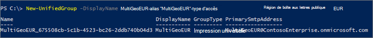

# <a name="create-a-microsoft-365-group-with-a-specific-preferred-data-location"></a>Créer un groupe Microsoft 365 avec un emplacement de données préféré spécifique

Lorsque les utilisateurs d’un environnement multigéogéal créent un groupe Microsoft 365, l’emplacement de données par favori du groupe (PDL) est automatiquement réglé sur celui de l’utilisateur. Les administrateurs Exchange, SharePoint et généraux peuvent créer des groupes dans n’importe quelle région sélectionnée. 

Si vous devez créer un groupe avec un emplacement par défaut des données spécifique, vous le faire à l’aide de l’applet de commande Microsoft PowerShell New-UnifiedGroup d’Exchange Online ou à partir du Centre d’administration SharePoint. Lorsque vous procédez de la sorte, la boîte aux lettres de groupe et le site SharePoint associé à celui-ci sont configurés dans l’emplacement par défaut des données spécifié.

Pour créer un groupe Microsoft 365 avec la PDL que vous spécifiez, allez au Centre d’administration SharePoint dans l’emplacement géographique où vous souhaitez créer le site de groupe.

Par exemple :

Si vous souhaitez créer un site de groupe à partir de votre emplacement en Australie, vous pouvez aller à https://ContosoAUS-admin.sharepoint.com/_layouts/15/online/AdminHome.aspx#/siteManagement

1. Sélectionnez **+ Créer**.
2. Suivez le processus pour créer un site de groupe.

Votre site de groupe est configuré dans l’emplacement géographique correspondant au Centre d’administration SharePoint à partir duquel vous avez initié la demande de création de site. 

Utilisation d’Exchange PowerShell 

Connectez-vous à Exchange Online PowerShell en transmettant le paramètre *-MailBoxRegion* avec le code d’emplacement géographique.

Par exemple : 

```PowerShell
New-UnifiedGroup -DisplayName MultiGeoEUR -Alias "MultiGeoEUR" -AccessType Public -MailboxRegion EUR 
```



Notez que l’approvisionnement du site du groupe SharePoint est à la demande. Le site est approvisionné la première fois qu’un propriétaire ou un membre du groupe tente d’y accéder.

## <a name="geo-location-codes"></a>Codes d’emplacement géographique

[!INCLUDE [Microsoft 365 Multi-Geo locations](../includes/microsoft-365-multi-geo-locations.md)]

## <a name="related-topics"></a>Sujets connexes

[Connexion à Exchange Online PowerShell](/powershell/exchange/connect-to-exchange-online-powershell)
