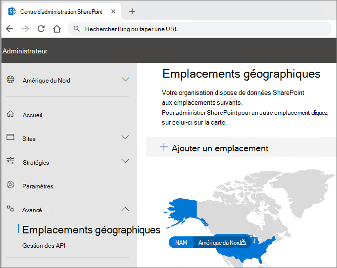

# Fonctionnalités multi-géographiques OneDrive et SharePoint Online

Les fonctionnalités Multi-Géo dans OneDrive et SharePoint Online permettent de contrôler les ressources partagées telles que les sites d’équipe SharePoint et les boîtes aux lettres de groupe Microsoft 365 stockées au repos dans un emplacement géographique spécifié.

Chaque utilisateur, une boîte aux lettres de groupe et un site SharePoint ont un emplacement recommandé de données (PDL) qui indique l’emplacement géographique où les données connexes sont stockées. Les donnée personnelle des utilisateurs (boîte aux lettres Exchange et OneDrive), ainsi que les sites de Groupes Microsoft 365 ou SharePoint qu’ils créent peuvent être stockées dans l’emplacement spécifié géographique pour répondre aux exigences de résidence de données. Vous pouvez[spécifier des différents administrateurs pour chaque emplacement géo](add-a-sharepoint-geo-admin.md).

Les utilisateurs profitent d’une expérience transparente lors de l’utilisation des services Microsoft 365, y compris les applications Office, OneDrive et Recherche. Voir [Expérience utilisateur dans un environnement multigéographique](multi-geo-user-experience.md) pour plus de détails.

## OneDrive

Le OneDrive de chaque utilisateur peut être configuré dans ou [déplacé par un administrateur](move-onedrive-between-geo-locations.md) vers un emplacement satellite conformément aux PDL de l’utilisateur. Les fichiers personnels sont alors conservés dans cet emplacement géo, même s’ils peuvent être partagés avec des utilisateurs dans d’autres emplacements géo.

## Sites et groupes SharePoint

La gestion de la fonctionnalité géo multiple est disponible via le Centre d’administration SharePoint. Vous trouverez des informations détaillées dans le [ billet de blog correspondant](https://techcommunity.microsoft.com/t5/Office-365-Blog/Now-available-Multi-Geo-in-SharePoint-and-Office-365-Groups/ba-p/263302).

Lorsqu’un utilisateur crée un site connecté à un groupe SharePoint dans un environnement multigéographique, leur PDL permet de déterminer l’emplacement géo où le site et sa boîte aux lettres de groupe associés sont créés. (Si une valeur PDL de l’utilisateur n’a pas été définie ou a été définie sur l’emplacement géo qui n’a pas été configuré comme un emplacement satellite, puis le site et la boîte aux lettres sont créés dans l’emplacement central.)

Microsoft 365 autres services que Exchange, OneDrive, SharePoint et Teams ne sont pas multigéo géographiques. Toutefois, les groupes Microsoft 365 créés par ces services seront configurés avec la PDL du créateur et leur boîte aux lettres de groupe Exchange, le site SharePoint est configuré dans la géo correspondante. 

## Gestion de l’environnement multi-Géo

Configurer et gérer votre environnement multi-géographique sont effectués via le Centre d’Administration SharePoint. 

(Certaines actions, telles que le déplacement d’un site SharePoint ou un site OneDrive nécessitent Microsoft PowerShell).

## Voir aussi

[Multi-Geo dans les groupes SharePoint et Microsoft 365](https://techcommunity.microsoft.com/t5/Office-365-Blog/Now-available-Multi-Geo-in-SharePoint-and-Office-365-Groups/ba-p/263302)

[Administration d’un environnement multi-géographique](administering-a-multi-geo-environment.md)

[Quotas de stockage SharePoint dans des environnements multi-géographiques](sharepoint-multi-geo-storage-quota.md)

[Administration des boîtes aux lettres Exchange Online dans un environnement multi-géographique](administering-exchange-online-multi-geo.md)
