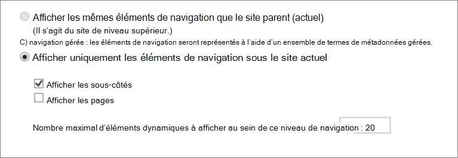
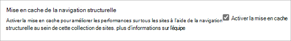
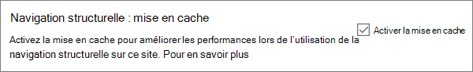
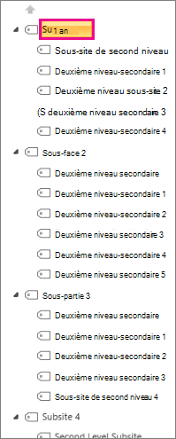
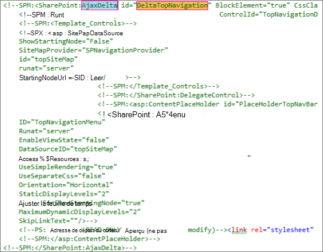

# <a name="navigation-options-for-sharepoint-online"></a>Options de navigation pour SharePoint Online

Cet article décrit les sites d’options de navigation avec la publication SharePoint activée dans SharePoint Online. Le choix et la configuration de la navigation ont un impact significatif sur les performances et l’extensibilité des sites dans SharePoint Online. Le modèle de site de publication SharePoint ne doit être utilisé que si nécessaire pour un portail centralisé, et la fonctionnalité de publication ne doit être activée que sur des sites spécifiques et uniquement si nécessaire, car elle peut avoir un impact sur les performances lorsqu’elle est utilisée de manière incorrecte.

>[!NOTE]
>Si vous utilisez des options de navigation SharePoint modernes telles que le menu méga, la navigation en cascade ou la navigation hub, cet article ne s’applique pas à votre site. Les architectures de site SharePoint modernes tirent parti d’une hiérarchie de site plus aplatie et d’un modèle hub-and-spoke. Cela permet de réaliser de nombreux scénarios qui ne nécessitent PAS l’utilisation de la fonctionnalité de publication SharePoint.

## <a name="overview-of-navigation-options"></a>Vue d’ensemble des options de navigation

La configuration du fournisseur de navigation peut avoir un impact significatif sur les performances de l’ensemble du site, et une attention particulière doit être prise en compte pour choisir un fournisseur de navigation et une configuration qui s’adapte efficacement aux exigences d’un site SharePoint. Il existe deux fournisseurs de navigation out-of-the-box, ainsi que des implémentations de navigation personnalisées.

La première option, [**la navigation structurelle**](#using-structural-navigation-in-sharepoint-online), est l’option de navigation recommandée dans SharePoint Online pour les sites SharePoint classiques, **si vous activez la mise en cache de navigation structurelle pour votre site**. Ce fournisseur de navigation affiche les éléments de navigation sous le site actuel, et éventuellement le site actuel et ses frères et sœurs. Il fournit des fonctionnalités supplémentaires telles que le découpage de sécurité et l’énumération de structure de site. Si la mise en cache est désactivée, cela aura un impact négatif sur les performances et l’extensibilité, et peut être soumise à une limitation.

La deuxième option, [**la navigation gérée (métadonnées),**](#using-managed-navigation-and-metadata-in-sharepoint-online) représente les éléments de navigation à l’aide d’un ensemble de termes métadonnées managées. Nous vous recommandons de désactiver le découpage de sécurité, sauf si nécessaire. Le filtrage de sécurité est activé en tant que paramètre sécurisé par défaut pour ce fournisseur de navigation ; toutefois, de nombreux sites ne nécessitent pas de surcharge de filtrage de sécurité, car les éléments de navigation sont souvent cohérents pour tous les utilisateurs du site. Avec la configuration recommandée pour désactiver le découpage de sécurité, ce fournisseur de navigation ne nécessite pas d’énumération de la structure du site et est hautement scalable avec un impact acceptable sur les performances.

Outre les fournisseurs de navigation à l’avant-première, de nombreux clients ont correctement implémenté d’autres implémentations de navigation personnalisées. Consultez les [scripts côté client pilotés par la recherche](#using-search-driven-client-side-scripting) dans cet article.
  
## <a name="pros-and-cons-of-sharepoint-online-navigation-options"></a>Avantages et inconvénients des options de navigation SharePoint Online

Le tableau suivant récapitule les avantages et les inconvénients de chaque option.

|Navigation structurelle  |Navigation gérée  |Navigation pilotée par la recherche  |Fournisseur de navigation personnalisée  |
|---------|---------|---------|---------|
|Avantages:<br/><br/>Facile à gérer<br/>Sécurité tronquée<br/>Mise à jour automatique dans les 24 heures suivant la modification du contenu<br/>     |Avantages:<br/><br/>Facile à gérer<br/>|Avantages:<br/><br/>Sécurité tronquée<br/>Mises à jour automatiques à mesure que des sites sont ajoutés<br/>Temps de chargement rapide et structure de navigation mise en cache localement<br/>|Avantages:<br/><br/>Choix plus large d’options disponibles<br/>Chargement rapide lors de l’utilisation correcte de la mise en cache<br/>De nombreuses options fonctionnent bien avec la conception de page réactive<br/>|
|Contre:<br/><br/>**Impact sur les performances si la mise en cache est désactivée**<br/>Soumis à la limitation<br/>|Contre:<br/><br/>Non mis à jour automatiquement pour refléter la structure du site<br/>**Impact sur les performances si le filtrage de sécurité est activé** ou lorsque la structure de navigation est complexe<br/>|Contre:<br/><br/>Impossible de commander facilement des sites<br/>Nécessite la personnalisation de la page maître (compétences techniques requises)<br/>|Contre:<br/><br/>Un développement personnalisé est requis<br/>La source de données externe/le cache stocké est nécessaire, par exemple Azure<br/>|

L’option la plus appropriée pour votre site dépend des exigences de votre site et de votre capacité technique. Si vous souhaitez un fournisseur de navigation facile à configurer qui se met automatiquement à jour lorsque le contenu est modifié, la navigation structurelle [avec mise en cache activée](https://support.office.com/article/structural-navigation-and-performance-f163053f-8eca-4b9c-b973-36b395093b43) est une bonne option.

>[!NOTE]
>L’application du même principe que les sites SharePoint modernes en simplifiant la structure globale du site à une structure plus plate et non hiérarchique améliore les performances et simplifie le déplacement vers des sites SharePoint modernes. Cela signifie qu’au lieu d’avoir une collection de sites unique avec des centaines de sites (sous-sites), une meilleure approche consiste à avoir de nombreuses collections de sites avec très peu de sous-sites (sous-sites).

## <a name="analyzing-navigation-performance-in-sharepoint-online"></a>Analyse des performances de navigation dans SharePoint Online

[L’outil Diagnostics de page pour SharePoint](./page-diagnostics-for-spo.md) est une extension de navigateur pour les navigateurs Microsoft Edge et Chrome qui analyse à la fois le portail moderne SharePoint Online et les pages de site de publication classiques. Cet outil fonctionne uniquement pour SharePoint Online et ne peut pas être utilisé sur une page système SharePoint.

L’outil génère un rapport pour chaque page analysée montrant comment la page fonctionne par rapport à un ensemble prédéfini de règles et affiche des informations détaillées lorsque les résultats d’un test se trouvent en dehors de la valeur de référence. Les administrateurs et concepteurs SharePoint Online peuvent utiliser l’outil pour résoudre les problèmes de performances afin de s’assurer que les nouvelles pages sont optimisées avant la publication.

**SPRequestDuration** en particulier est le temps nécessaire à SharePoint pour traiter la page. Une navigation intensive (comme l’inclusion de pages dans la navigation), des hiérarchies de sites complexes et d’autres options de configuration et de topologie peuvent toutes contribuer considérablement à des durées plus longues.

## <a name="using-structural-navigation-in-sharepoint-online"></a>Utilisation de la navigation structurelle dans SharePoint Online

Il s’agit de la navigation prêt à l’emploi utilisée par défaut et qui est la solution la plus simple. Il ne nécessite aucune personnalisation et un utilisateur non technique peut également facilement ajouter des éléments, masquer des éléments et gérer la navigation à partir de la page des paramètres. Nous vous recommandons [d’activer la mise en cache](https://support.office.com/article/structural-navigation-and-performance-f163053f-8eca-4b9c-b973-36b395093b43), sinon il y a un compromis coûteux en matière de performances.

### <a name="how-to-implement-structural-navigation-caching"></a>Guide pratique pour implémenter la mise en cache de la navigation structurelle

Sous **Navigation d’apparence et de sensation** >  **des paramètres** >  de site **, vous** pouvez vérifier si la navigation structurelle est sélectionnée pour la navigation globale ou la navigation actuelle. La sélection de **Afficher les pages** aura un impact négatif sur les performances.



La mise en cache peut être activée ou désactivée au niveau de la collection de sites et au niveau du site, et est activée pour les deux par défaut. Pour activer au niveau de la collection de sites, sous Site **Settings** > **Site Collection Administration** > **Site Collection Collection Navigation**, cochez la case **Activer la mise en cache**.



Pour l’activer au niveau du site, sous **Navigation** **des paramètres** >  de site, cochez la case **Activer la mise en cache**.



## <a name="using-managed-navigation-and-metadata-in-sharepoint-online"></a>Utilisation de la navigation managée et des métadonnées dans SharePoint Online

La navigation managée est une autre option qui vous permet de recréer la plupart des mêmes fonctionnalités que la navigation structurelle. Les métadonnées managées peuvent être configurées pour que le découpage de sécurité soit activé ou désactivé. Lorsqu’elle est configurée avec le filtrage de sécurité désactivé, la navigation managée est assez efficace, car elle charge tous les liens de navigation avec un nombre constant d’appels de serveur. Toutefois, l’activation du filtrage de sécurité annule certains des avantages en termes de performances de la navigation managée.

Si vous devez activer le filtrage de sécurité, nous vous recommandons d’effectuer les opérations suivantes :

- Mettre à jour tous les liens d’URL conviviales vers des liens simples
- Ajouter les nœuds de découpage de sécurité requis en tant qu’URL conviviales
- Limiter le nombre d’éléments de navigation à 100 au maximum et à 3 niveaux maximum

De nombreux sites ne nécessitent pas de filtrage de sécurité, car la structure de navigation est souvent cohérente pour tous les utilisateurs du site. Si le filtrage de sécurité est désactivé et qu’un lien est ajouté à la navigation auquel tous les utilisateurs n’ont pas accès, le lien s’affiche toujours, mais entraîne un message d’accès refusé. Il n’existe aucun risque d’accès par inadvertance au contenu.

### <a name="how-to-implement-managed-navigation-and-the-results"></a>Comment implémenter la navigation managée et les résultats

Il existe plusieurs articles sur Microsoft Docs sur les détails de la navigation managée. Par exemple, consultez [Vue d’ensemble de la navigation managée dans SharePoint Server](/sharepoint/administration/overview-of-managed-navigation).

Pour implémenter la navigation managée, vous configurez des termes avec des URL correspondant à la structure de navigation du site. La navigation managée peut même être organisée manuellement pour remplacer la navigation structurelle dans de nombreux cas. Par exemple :

)

## <a name="using-search-driven-client-side-scripting"></a>Utilisation de scripts côté client pilotés par la recherche

Une classe courante d’implémentations de navigation personnalisées englobe les modèles de conception rendus par le client qui stockent un cache local de nœuds de navigation.

Ces fournisseurs de navigation présentent deux avantages clés :

- Ils fonctionnent généralement bien avec les conceptions de page réactives.
- Ils sont extrêmement évolutifs et performants, car ils peuvent s’afficher sans coût de ressource (et les actualiser en arrière-plan après un délai d’expiration).
- Ces fournisseurs de navigation peuvent récupérer des données de navigation à l’aide de différentes stratégies, allant des configurations statiques simples aux différents fournisseurs de données dynamiques.

Un exemple de fournisseur de données consiste à utiliser une **navigation pilotée par la recherche**, qui offre une flexibilité permettant d’énumérer les nœuds de navigation et de gérer efficacement le filtrage de sécurité.

Il existe d’autres options populaires pour créer des **fournisseurs de navigation personnalisés**. Consultez [les solutions de navigation pour les portails SharePoint Online](/sharepoint/dev/solution-guidance/portal-navigation) pour obtenir des conseils supplémentaires sur la création d’un fournisseur de navigation personnalisé.

À l’aide de la recherche, vous pouvez tirer parti des index qui sont générés en arrière-plan à l’aide de l’analyse continue. Les résultats de la recherche sont extraits de l’index de recherche et les résultats sont supprimés de la sécurité. Cela est généralement plus rapide que les fournisseurs de navigation out-of-the-box lorsque le filtrage de sécurité est requis. L’utilisation de la recherche pour la navigation structurelle, en particulier si vous avez une structure de site complexe, accélère considérablement le temps de chargement des pages. Le principal avantage de cette navigation par rapport à la navigation managée est que vous bénéficiez d’un filtrage de sécurité.

Cette approche implique la création d’une page maître personnalisée et le remplacement du code de navigation out-of-the-box par du code HTML personnalisé. Suivez cette procédure décrite dans l’exemple suivant pour remplacer le code de navigation dans le fichier `seattle.html`. Dans cet exemple, vous allez ouvrir le `seattle.html` fichier et remplacer l’élément `id="DeltaTopNavigation"` entier par du code HTML personnalisé.

### <a name="example-replace-the-out-of-the-box-navigation-code-in-a-master-page"></a>Exemple : Remplacer le code de navigation out-of-the-box dans une page maître

1. Accédez à la page Paramètres du site.
2. Ouvrez la galerie de pages maîtres en cliquant sur **Pages maîtres**.
3. À partir de là, vous pouvez parcourir la bibliothèque et télécharger le fichier `seattle.master`.
4. Modifiez le code à l’aide d’un éditeur de texte et supprimez le bloc de code dans la capture d’écran suivante.<br/><br/>
5. Supprimez le code entre les balises et `<\SharePoint:AjaxDelta>` remplacez-le `<SharePoint:AjaxDelta id="DeltaTopNavigation">` par l’extrait de code suivant :<br/>

```javascript
<div id="loading">
  <!--Replace with path to loading image.-->
  <div style="background-image: url(''); height: 22px; width: 22px; ">
  </div>
</div>
<!-- Main Content-->
<div id="navContainer" style="display:none">
    <div data-bind="foreach: hierarchy" class="noindex ms-core-listMenu-horizontalBox">
        <a class="dynamic menu-item ms-core-listMenu-item ms-displayInline ms-navedit-linkNode" data-bind="attr: { href: item.Url, title: item.Title }">
            <span class="menu-item-text" data-bind="text: item.Title">
            </span>
        </a>
        <ul id="menu" data-bind="foreach: $data.children" style="padding-left:20px">
            <li class="static dynamic-children level1">
                <a class="static dynamic-children menu-item ms-core-listMenu-item ms-displayInline ms-navedit-linkNode" data-bind="attr: { href: item.Url, title: item.Title }">

                 <!-- ko if: children.length > 0-->
                    <span aria-haspopup="true" class="additional-background ms-navedit-flyoutArrow dynamic-children">
                        <span class="menu-item-text" data-bind="text: item.Title">
                        </span>
                    </span>
                <!-- /ko -->
                <!-- ko if: children.length == 0-->
                    <span aria-haspopup="true" class="ms-navedit-flyoutArrow dynamic-children">
                        <span class="menu-item-text" data-bind="text: item.Title">
                        </span>
                    </span>
                <!-- /ko -->
                </a>

                <!-- ko if: children.length > 0-->
                <ul id="menu"  data-bind="foreach: children;" class="dynamic  level2" >
                    <li class="dynamic level2">
                        <a class="dynamic menu-item ms-core-listMenu-item ms-displayInline  ms-navedit-linkNode" data-bind="attr: { href: item.Url, title: item.Title }">

          <!-- ko if: children.length > 0-->
          <span aria-haspopup="true" class="additional-background ms-navedit-flyoutArrow dynamic-children">
           <span class="menu-item-text" data-bind="text: item.Title">
           </span>
          </span>
           <!-- /ko -->
          <!-- ko if: children.length == 0-->
          <span aria-haspopup="true" class="ms-navedit-flyoutArrow dynamic-children">
           <span class="menu-item-text" data-bind="text: item.Title">
           </span>
          </span>
          <!-- /ko -->
                        </a>
          <!-- ko if: children.length > 0-->
         <ul id="menu" data-bind="foreach: children;" class="dynamic level3" >
          <li class="dynamic level3">
           <a class="dynamic menu-item ms-core-listMenu-item ms-displayInline ms-navedit-linkNode" data-bind="attr: { href: item.Url, title: item.Title }">
            <span class="menu-item-text" data-bind="text: item.Title">
            </span>
           </a>
          </li>
         </ul>
           <!-- /ko -->
                    </li>
                </ul>
                <!-- /ko -->
            </li>
        </ul>
    </div>
</div>
```

<br/>
6. Remplacez l’URL dans la balise d’ancrage d’image de chargement au début, par un lien vers une image de chargement dans votre collection de sites. Après avoir apporté les modifications, renommez le fichier, puis chargez-le dans la galerie de pages maîtres. Cela génère un nouveau fichier .master.<br/>
7. Ce code HTML est le balisage de base qui sera rempli par les résultats de recherche retournés à partir du code JavaScript. Vous devez modifier le code pour modifier la valeur de var root = « URL de collection de sites », comme illustré dans l’extrait de code suivant :<br/>

```javascript
var root = "https://spperformance.sharepoint.com/sites/NavigationBySearch";
```

<br/>
8. Les résultats sont affectés au tableau self.nodes et une hiérarchie est créée à partir des objets à l’aide de linq.js l’affectation de la sortie à une auto-hiérarchie de tableau. Ce tableau est l’objet lié au code HTML. Cette opération est effectuée dans la fonction toggleView() en passant l’objet auto à la fonction ko.applyBinding().<br/>Le tableau de hiérarchies est alors lié au code HTML suivant :<br/>

```javascript
<div data-bind="foreach: hierarchy" class="noindex ms-core-listMenu-horizontalBox">
```

Les gestionnaires d’événements pour `mouseenter` et `mouseexit` sont ajoutés à la navigation de niveau supérieur pour gérer les menus déroulants de sous-site qui sont effectués dans la `addEventsToElements()` fonction.

Dans notre exemple de navigation complexe, une nouvelle charge de page sans mise en cache locale indique que le temps passé sur le serveur a été réduit par rapport à la navigation structurelle de référence pour obtenir un résultat similaire à l’approche de navigation managée.

### <a name="about-the-javascript-file"></a>À propos du fichier JavaScript...

>[!NOTE]
>Si vous utilisez javaScript personnalisé, vérifiez que le CDN public est activé et que le fichier se trouve dans un emplacement CDN.

L’intégralité du fichier JavaScript est la suivante :

```javascript
//Models and Namespaces
var SPOCustom = SPOCustom || {};
SPOCustom.Models = SPOCustom.Models || {}
SPOCustom.Models.NavigationNode = function () {

    this.Url = ko.observable("");
    this.Title = ko.observable("");
    this.Parent = ko.observable("");

};

var root = "https://spperformance.sharepoint.com/sites/NavigationBySearch";
var baseUrl = root + "/_api/search/query?querytext=";
var query = baseUrl + "'contentClass=\"STS_Web\"+path:" + root + "'&trimduplicates=false&rowlimit=300";

var baseRequest = {
    url: "",
    type: ""
};


//Parses a local object from JSON search result.
function getNavigationFromDto(dto) {
    var item = new SPOCustom.Models.NavigationNode();
    if (dto != undefined) {

        var webTemplate = getSearchResultsValue(dto.Cells.results, 'WebTemplate');

        if (webTemplate != "APP") {
            item.Title(getSearchResultsValue(dto.Cells.results, 'Title')); //Key = Title
            item.Url(getSearchResultsValue(dto.Cells.results, 'Path')); //Key = Path
            item.Parent(getSearchResultsValue(dto.Cells.results, 'ParentLink')); //Key = ParentLink
        }

    }
    return item;
}

function getSearchResultsValue(results, key) {

    for (i = 0; i < results.length; i++) {
        if (results[i].Key == key) {
            return results[i].Value;
        }
    }
    return null;
}

//Parse a local object from the serialized cache.
function getNavigationFromCache(dto) {
    var item = new SPOCustom.Models.NavigationNode();

    if (dto != undefined) {

        item.Title(dto.Title);
        item.Url(dto.Url);
        item.Parent(dto.Parent);
    }

    return item;
}

/* create a new OData request for JSON response */
function getRequest(endpoint) {
    var request = baseRequest;
    request.type = "GET";
    request.url = endpoint;
    request.headers = { ACCEPT: "application/json;odata=verbose" };
    return request;
};

/* Navigation Module*/
function NavigationViewModel() {
    "use strict";
    var self = this;
    self.nodes = ko.observableArray([]);
    self.hierarchy = ko.observableArray([]);;
    self.loadNavigatioNodes = function () {
        //Check local storage for cached navigation datasource.
        var fromStorage = localStorage["nodesCache"];
        if (false) {
            var cachedNodes = JSON.parse(localStorage["nodesCache"]);

            if (cachedNodes && timeStamp) {
                //Check for cache expiration. Currently set to 3 hrs.
                var now = new Date();
                var diff = now.getTime() - timeStamp;
                if (Math.round(diff / (1000 * 60 * 60)) < 3) {

                    //return from cache.
                    var cacheResults = [];
                    $.each(cachedNodes, function (i, item) {
                        var nodeitem = getNavigationFromCache(item, true);
                        cacheResults.push(nodeitem);
                    });

                    self.buildHierarchy(cacheResults);
                    self.toggleView();
                    addEventsToElements();
                    return;
                }
            }
        }
        //No cache hit, REST call required.
        self.queryRemoteInterface();
    };

    //Executes a REST call and builds the navigation hierarchy.
    self.queryRemoteInterface = function () {
        var oDataRequest = getRequest(query);
        $.ajax(oDataRequest).done(function (data) {
            var results = [];
            $.each(data.d.query.PrimaryQueryResult.RelevantResults.Table.Rows.results, function (i, item) {

                if (i == 0) {
                    //Add root element.
                    var rootItem = new SPOCustom.Models.NavigationNode();
                    rootItem.Title("Root");
                    rootItem.Url(root);
                    rootItem.Parent(null);
                    results.push(rootItem);
                }
                var navItem = getNavigationFromDto(item);
                results.push(navItem);
            });
            //Add to local cache
            localStorage["nodesCache"] = ko.toJSON(results);

            localStorage["nodesCachedAt"] = new Date().getTime();
            self.nodes(results);
            if (self.nodes().length > 0) {
                var unsortedArray = self.nodes();
                var sortedArray = unsortedArray.sort(self.sortObjectsInArray);

                self.buildHierarchy(sortedArray);
                self.toggleView();
                addEventsToElements();
            }
        }).fail(function () {
            //Handle error here!!
            $("#loading").hide();
            $("#error").show();
        });
    };
    self.toggleView = function () {
        var navContainer = document.getElementById("navContainer");
        ko.applyBindings(self, navContainer);
        $("#loading").hide();
        $("#navContainer").show();

    };
    //Uses linq.js to build the navigation tree.
    self.buildHierarchy = function (enumerable) {
        self.hierarchy(Enumerable.From(enumerable).ByHierarchy(function (d) {
            return d.Parent() == null;
        }, function (parent, child) {
            if (parent.Url() == null || child.Parent() == null)
                return false;
            return parent.Url().toUpperCase() == child.Parent().toUpperCase();
        }).ToArray());

        self.sortChildren(self.hierarchy()[0]);
    };


    self.sortChildren = function (parent) {

        // sjip processing if no children
        if (!parent || !parent.children || parent.children.length === 0) {
            return;
        }

        parent.children = parent.children.sort(self.sortObjectsInArray2);

        for (var i = 0; i < parent.children.length; i++) {
            var elem = parent.children[i];

            if (elem.children && elem.children.length > 0) {
                self.sortChildren(elem);
            }
        }
    };

    // ByHierarchy method breaks the sorting in chrome and firefox
    // we need to resort  as ascending
    self.sortObjectsInArray2 = function (a, b) {
        if (a.item.Title() > b.item.Title())
            return 1;
        if (a.item.Title() < b.item.Title())
            return -1;
        return 0;
    };


    self.sortObjectsInArray = function (a, b) {
        if (a.Title() > b.Title())
            return -1;
        if (a.Title() < b.Title())
            return 1;
        return 0;
    }
}

//Loads the navigation on load and binds the event handlers for mouse interaction.
function InitCustomNav() {
    var viewModel = new NavigationViewModel();
    viewModel.loadNavigatioNodes();
}

function addEventsToElements() {
    //events.
      $("li.level1").mouseover(function () {
          var position = $(this).position();
          $(this).find("ul.level2").css({ width: 100, left: position.left + 10, top: 50 });
      })
   .mouseout(function () {
     $(this).find("ul.level2").css({  left: -99999, top: 0 });
   
    });
   
     $("li.level2").mouseover(function () {
          var position = $(this).position();
          console.log(JSON.stringify(position));
          $(this).find("ul.level3").css({ width: 100, left: position.left + 95, top:  position.top});
      })
   .mouseout(function () {
     $(this).find("ul.level3").css({  left: -99999, top: 0 });
    });
} _spBodyOnLoadFunctionNames.push("InitCustomNav");

```

Pour résumer le code indiqué ci-dessus dans la `jQuery $(document).ready` fonction, une `viewModel object` fonction est créée, puis la `loadNavigationNodes()` fonction sur cet objet est appelée. Cette fonction charge la hiérarchie de navigation précédemment générée stockée dans le stockage local HTML5 du navigateur client, ou elle appelle la fonction `queryRemoteInterface()`.

`QueryRemoteInterface()` génère une requête à l’aide de la `getRequest()` fonction avec le paramètre de requête défini précédemment dans le script, puis retourne des données à partir du serveur. Ces données sont essentiellement un tableau de tous les sites de la collection de sites représentés en tant qu’objets de transfert de données avec différentes propriétés.

Ces données sont ensuite analysées dans les objets précédemment définis `SPO.Models.NavigationNode` qui permettent `Knockout.js` de créer des propriétés observables à utiliser en liant les valeurs dans le code HTML que nous avons défini précédemment.

Les objets sont ensuite placés dans un tableau de résultats. Ce tableau est analysé en JSON à l’aide de Knock-in et stocké dans le stockage du navigateur local pour améliorer les performances sur les chargements de pages futurs.

### <a name="benefits-of-this-approach"></a>Avantages de cette approche

L’un des principaux avantages de [cette approche](#example-replace-the-out-of-the-box-navigation-code-in-a-master-page) est qu’à l’aide du stockage local HTML5, la navigation est stockée localement pour l’utilisateur lors du prochain chargement de la page. Nous obtenons des améliorations majeures des performances grâce à l’utilisation de l’API de recherche pour la navigation structurelle ; toutefois, il faut une certaine capacité technique pour exécuter et personnaliser cette fonctionnalité.

Dans [l’exemple d’implémentation](#example-replace-the-out-of-the-box-navigation-code-in-a-master-page), les sites sont classés de la même façon que la navigation structurelle hors norme ; ordre alphabétique. Si vous vouliez vous écarter de cet ordre, il serait plus compliqué de développer et de maintenir. En outre, cette approche vous oblige à vous écarter des pages maîtres prises en charge. Si la page maître personnalisée n’est pas conservée, votre site manquera les mises à jour et les améliorations apportées par Microsoft aux pages maîtres.

Le [code ci-dessus](#about-the-javascript-file) a les dépendances suivantes :

- jQuery - https://jquery.com/
- KnockoutJS - https://knockoutjs.com/
- Linq.js - `https://linqjs.codeplex.com/`ou github.com/neuecc/linq.js

La version actuelle de LinqJS ne contient pas la méthode ByHierarchy utilisée dans le code ci-dessus et interrompt le code de navigation. Pour résoudre ce problème, ajoutez la méthode suivante au fichier Linq.js avant la ligne `Flatten: function ()`.

```javascript
ByHierarchy: function(firstLevel, connectBy, orderBy, ascending, parent) {
     ascending = ascending == undefined ? true : ascending;
     var orderMethod = ascending == true ? 'OrderBy' : 'OrderByDescending';
     var source = this;
     firstLevel = Utils.CreateLambda(firstLevel);
     connectBy = Utils.CreateLambda(connectBy);
     orderBy = Utils.CreateLambda(orderBy);

     //Initiate or increase level
     var level = parent === undefined ? 1 : parent.level + 1;

    return new Enumerable(function() {
         var enumerator;
         var index = 0;

        var createLevel = function() {
                 var obj = {
                     item: enumerator.Current(),
                     level : level
                 };
                 obj.children = Enumerable.From(source).ByHierarchy(firstLevel, connectBy, orderBy, ascending, obj);
                 if (orderBy !== undefined) {
                     obj.children = obj.children[orderMethod](function(d) {
                         return orderBy(d.item); //unwrap the actual item for sort to work
                     });
                 }
                 obj.children = obj.children.ToArray();
                 Enumerable.From(obj.children).ForEach(function(child) {
                     child.getParent = function() {
                         return obj;
                     };
                 });
                 return obj;
             };

        return new IEnumerator(

        function() {
             enumerator = source.GetEnumerator();
         }, function() {
             while (enumerator.MoveNext()) {
                 var returnArr;
                 if (!parent) {
                     if (firstLevel(enumerator.Current(), index++)) {
                         return this.Yield(createLevel());
                     }

                } else {
                     if (connectBy(parent.item, enumerator.Current(), index++)) {
                         return this.Yield(createLevel());
                     }
                 }
             }
             return false;
         }, function() {
             Utils.Dispose(enumerator);
         })
     });
 },

```
  
## <a name="related-topics"></a>Voir aussi

[Vue d’ensemble de la navigation gérée dans SharePoint Server](/sharepoint/administration/overview-of-managed-navigation)

[Mise en cache et performances de la navigation structurelle](https://support.office.com/article/structural-navigation-and-performance-f163053f-8eca-4b9c-b973-36b395093b43)
