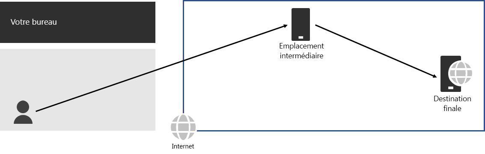
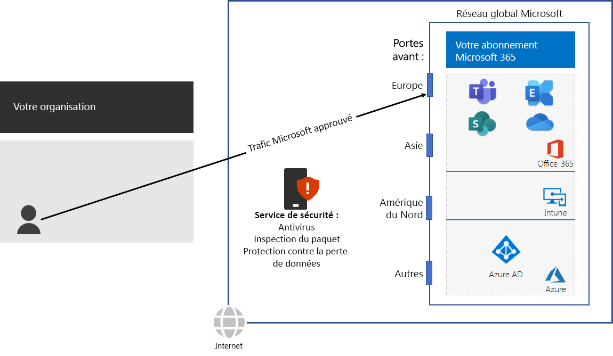

# Étape 3 : Éviter les épingles de réseau

*Cette étape est requise et s’applique aux versions E3 et E5 de Microsoft 365 Entreprise*

Une [épingle de réseau](https://docs.microsoft.com/office365/enterprise/office-365-network-connectivity-principles#BKMK_P3) se produit lorsque le trafic vers une destination est d’abord dirigé vers un autre emplacement intermédiaire, comme une pile de sécurité locale, un courtier d’accès au cloud ou une passerelle web basée sur le cloud. Voici un exemple.

Une épingle de réseau peut également se produire à cause d’un routage médiocre sur Internet dû à des fournisseurs de services réseau. 

Une épingle ajoute une latence et peut potentiellement rediriger le trafic vers un emplacement distant géographiquement.

Pour optimiser les performances pour le trafic vers les services basés sur le cloud de Microsoft 365, vérifiez si l’ISP qui fournit la connexion Internet locale a une relation d’homologation directe avec le réseau global de Microsoft à proximité immédiate de cet emplacement. Ces connexions n’ont pas d’épingles.

Si vous utilisez les services de sécurité ou de réseau basés sur le cloud pour votre trafic Microsoft 365, assurez-vous que l’effet des épingles est évalué et que leur impact sur les performances est compris. Examinez les éléments suivants :

- le nombre et les emplacements des fournisseurs de services par lesquels le trafic est transféré par rapport à vos succursales et points d’homologation du réseau global de Microsoft ; 
- la qualité de la relation d’homologation du réseau du fournisseur de services avec votre ISP et Microsoft ; 
- l’impact sur les performances de la transmission dans l’infrastructure du fournisseur de services.

Dès que possible, configurez vos routeurs périphériques pour envoyer le trafic Microsoft 365 approuvé directement, au lieu d’utiliser la transmission par proxy ou le tunneling via un cloud tiers ou un fournisseur de sécurité réseau basé sur le cloud qui traite votre trafic Internet. 

Pour tester l’approche de la fermeture de votre réseau par le biais d’un point d’entrée pour le réseau mondial de Microsoft et de la proximité de la connexion de votre réseau d’entreprise à votre fournisseur de services Internet, utilisez l’ [Outil d’intégration réseau Office 365](https://connectivity.office.com/).

Comme point de vérification intermédiaire, vous pouvez consulter les [critères de sortie](networking-exit-criteria.md#crit-networking-step3) pour cette étape.

## Étape suivante

|||
|:-------|:-----|
||[Configurer le trafic de contournement](networking-configure-proxies-firewalls.md)|
