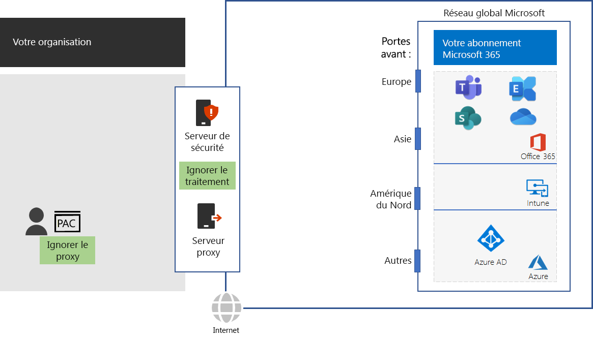

# Étape 4 : configurer le trafic de contournement

*Cette étape est facultative et s’applique aux versions E3 et E5 de Microsoft 365 Entreprise*

Étant donné que le trafic Internet général peut être risqué, les réseaux d’organisation appliquent généralement la sécurité avec des équipements de périmètre tels que des serveurs proxy, le SSL Break and Inspect, des appareils d’inspection des paquets et des systèmes de protection contre la perte de données. Pour en savoir plus sur certains problèmes avec les périphériques d’interception réseau, reportez-vous à l’article [Utilisation de périphériques réseau tiers ou de solutions sur le trafic Office 365](https://support.microsoft.com/help/2690045/using-third-party-network-devices-or-solutions-with-office-365).

Toutefois, les noms de domaine DNS et les adresses IP utilisées par les services cloud Microsoft 365 sont connus. Par ailleurs, le trafic et les services eux-mêmes sont protégés avec de nombreuses fonctionnalités de sécurité. Étant donné que cette protection et cette sécurité sont déjà en place, vos équipements de périmètre n’ont pas besoin de les dupliquer. Les destinations intermédiaires et le traitement de la sécurité dupliqué pour le trafic Microsoft 365 peuvent réduire les performances de façon considérable.

La première chose à faire lorsque vous éliminez les destinations intermédiaires et le traitement de la sécurité dupliqué consiste à identifier le trafic Microsoft 365. Microsoft a défini les types de noms de domaine DNS et les plages d’adresses IP suivants, appelés points de terminaison :

- **Optimiser** : obligatoires pour la connectivité à chaque service Office 365 ; représentent plus de 75 % de la bande passante, des connexions et du volume de données de Microsoft 365. Ces points de terminaison représentent les scénarios de Microsoft 365 les plus sensibles aux performances, à la latence et à la disponibilité du réseau.
- **Autoriser** : obligatoires pour la connectivité à des services et fonctionnalités Microsoft 365 spécifiques, mais ne sont pas sensibles aux performances et à la latence du réseau comme ceux de la catégorie Optimiser.
 - **Par défaut** : représentent des services et dépendances de Microsoft 365 qui ne nécessitent pas d’optimisation. Vous pouvez considérer les points de terminaison de la catégorie Par défaut comme du trafic Internet normal.

Vous pouvez trouver les noms de domaine DNS et les plages d’adresses IP sur la page [https://aka.ms/o365endpoints](https://aka.ms/o365endpoints).

Microsoft vous recommande les points suivants :

- Utiliser des scripts PAC (Proxy Automatic Configuration) sur les navigateurs Internet de vos ordinateurs locaux pour contourner vos serveurs proxy pour les noms de domaine DNS des services cloud Microsoft 365. Pour le dernier script PAC de Microsoft 365, reportez-vous au [script PowerShell Get-Pacfile](https://docs.microsoft.com/office365/enterprise/managing-office-365-endpoints#use-a-pac-file-for-direct-routing-of-vital-office-365-traffic).

- Analyser vos équipements de périmètre pour déterminer le traitement dupliqué, puis les configurer pour transférer le trafic vers les points de terminaison Optimiser et Autoriser sans traitement. Ceci s’appelle le trafic de contournement. 

Voici quelques recommandations au sein de votre infrastructure réseau.

Les équipements de périmètre incluent les pare-feux, le SSL Break and Inspect, les appareils d’inspection des paquets et les systèmes protection contre la perte de données. Pour configurer et mettre à jour les configurations d’équipements de périmètre, vous pouvez utiliser un script ou un appel REST pour utiliser une liste structurée de points de terminaison du service web Office 365 Endpoints. Pour plus d’informations, voir [Service web d’URL et d’adresses IP Office 365](https://docs.microsoft.com/office365/enterprise/office-365-ip-web-service).

Vous ne faites que contourner le traitement de sécurité réseau et de proxy normal pour le trafic vers les points de terminaison des catégories Optimiser et Autoriser de Microsoft 365. Tout autre trafic Internet général sera en proxy et soumis au traitement de sécurité de votre réseau existant.

## Optimisation du trafic pour les travailleurs à distance utilisant des connexions VPN

Les connexions de réseau privé virtuel (VPN) sont généralement utilisées par les travailleurs à distance pour accéder aux ressources sur l’intranet d’une organisation. Une connexion VPN classique achemine TOUT le trafic, y compris le trafic Internet, vers l’intranet de l’organisation. Le trafic Internet est routé vers le réseau de périmètre de l’organisation et les dispositifs de traitement des paquets. Ce trafic est soumis à des retards de déplacement et de traitement qui peuvent réduire considérablement les performances et influer sur la productivité de vos travailleurs à distance. 

La tunnellisation fractionnée est la capacité d’une connexion VPN à acheminer le trafic spécifié sur Internet plutôt que de l’envoyer à votre intranet via la connexion VPN. Afin de garantir aux travailleurs à distance des performances optimales des services Microsoft 365 critiques tels que Teams, SharePoint Online et Exchange Online, configurez vos connexions VPN par tunnellisation fractionnée pour envoyer le trafic vers les points de terminaison Office 365 de catégorie Optimiser directement via Internet. 

Pour plus d’informations, voir [Optimiser la connectivité d’Office 365 pour les utilisateurs à distance à l’aide de la tunnellisation fragmentée de VPN](https://docs.microsoft.com/office365/enterprise/office-365-vpn-split-tunnel).

Pour tester la proximité du point d’entrée pour le réseau mondial de Microsoft et la proximité du point de connexion de votre réseau d'entreprise à votre FAI, utilisez l’ [Outil d’intégration réseau Office 365](https://connectivity.office.com/).

Comme point de vérification intermédiaire, vous pouvez consulter les [critères de sortie](networking-exit-criteria.md#crit-networking-step4) pour cette étape.

## Étape suivante

|||
|:-------|:-----|
||[Optimiser les performances du service Office 365 et du client](networking-optimize-tcp-performance.md) |

