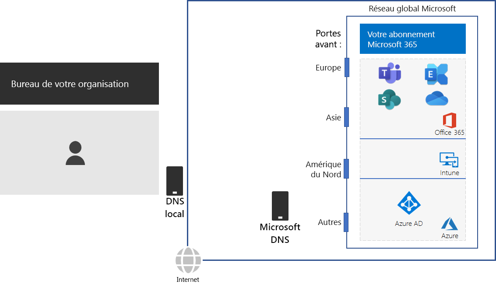
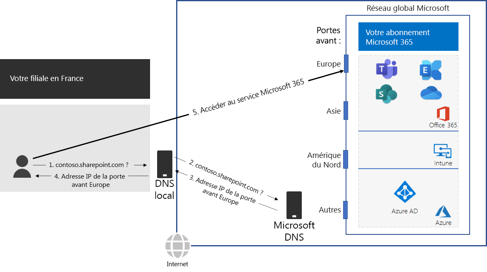

# Étape 2 : Configurer les connexions Internet locales pour chaque bureau

*Cette étape est requise et s’applique aux versions E3 et E5 de Microsoft 365 Entreprise*

À l’Étape 2, vous vérifiez que chacun de vos bureaux est équipé de connexions Internet locales et utilise des serveurs DNS locaux. Ces deux éléments sont requis pour réduire la latence de connexion et garantir que les ordinateurs clients locaux établissent des connexions avec le point d’entrée le plus proche aux services services cloud Microsoft 365.

Dans les réseaux classiques pour les grandes organisations, le trafic Internet circule sur la structure fondamentale du réseau jusqu'à une connexion Internet centrale. Cela ne fonctionne pas bien pour optimiser les performances d’une infrastructure de logiciel en tant que service (SaaS) distribuée dans le monde entier, qui inclut les produits Office 365 et Intune dans Microsoft 365.

Le réseau mondial Microsoft inclut une infrastructure *de porte service distribuée*, une périphérie de réseau hautement disponible et évolutive avec des emplacements géographiquement répartis. Il met fin aux connexions des utilisateurs finaux sur un serveur frontal et achemine efficacement le trafic des utilisateurs finaux au sein du réseau mondial Microsoft.

Pour de meilleures performances, les clients locaux doivent accéder à la porte principale la plus proche géographiquement, plutôt que d’envoyer le trafic sur une structure fondamentale du réseau et sur l’emplacement principal qui est le plus proche de la connexion Internet centrale de l’organisation.

Voici un exemple.

Lorsqu’un utilisateur de la succursale de Paris souhaite accéder à un site SharePoint Online :

1. Il envoie une requête DNS pour résoudre un nom, tel que contoso.sharepoint.com. 
2. Le serveur DNS fourni par le fournisseur de services Internet transfère cette requête à un serveur DNS Microsoft.
3. Les serveurs DNS de Microsoft font correspondre l'adresse IP source de la requête DNS transférée à la région du monde à laquelle cette adresse est attribuée. Le serveur DNS Microsoft répond à l’aide de l’adresse IP de la porte principale du réseau Microsoft la plus proche en Europe.
4. Le serveur DNS du fournisseur de services Internet envoie cette adresse IP à l’utilisateur.
5. L’utilisateur établit une connexion au serveur SharePoint via la porte principale de l’Europe.

Pour diriger la demande d’un client vers la porte principale la plus proche géographiquement, les serveurs DNS de Microsoft utilisent des requêtes DNS correspondant à la demande de connexion initiale du client. Par conséquent, pour la latence de réseau la plus faible :

- Tous les bureaux de votre organisation doivent avoir des connexions Internet locales pour le trafic réseau de catégorie [Optimiser](https://docs.microsoft.com/office365/enterprise/office-365-network-connectivity-principles#new-office-365-endpoint-categories).
- Chaque connexion Internet locale doit utiliser un serveur DNS régional local pour le trafic Internet sortant de cet emplacement.

Pour plus d’informations, reportez-vous à [Sortir les connexions réseau localement](https://docs.microsoft.com/office365/enterprise/office-365-network-connectivity-principles#egress-network-connections-locally). 

Comme point de vérification intermédiaire, vous pouvez consulter les [critères de sortie](networking-exit-criteria.md#crit-networking-step2) pour cette étape.

## Étape suivante

|||
|:-------|:-----|
||[Éviter les épingles de réseau](networking-avoid-network-hairpins.md)|
