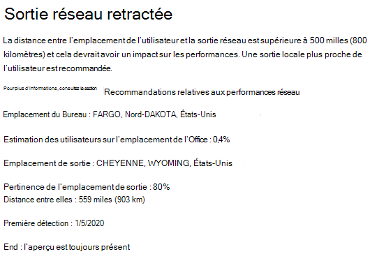
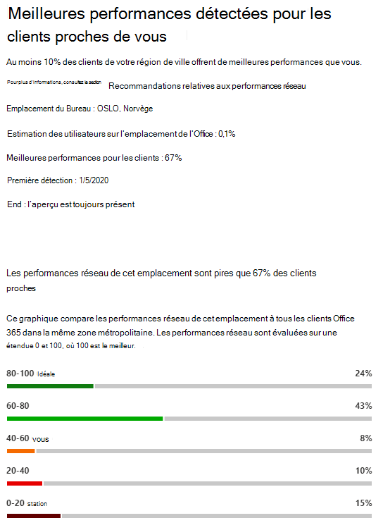
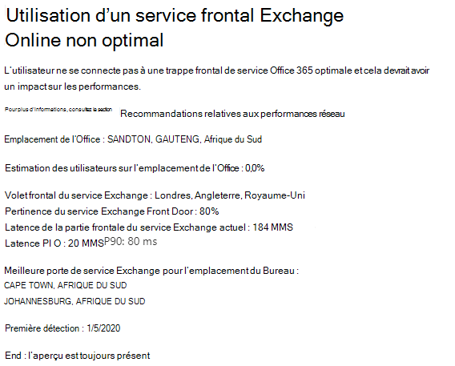
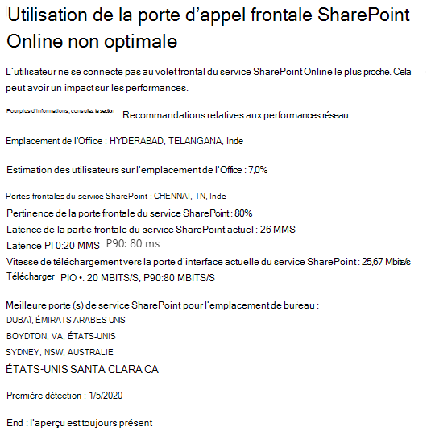

# Microsoft 365 Réseau Informations

**Les informations réseau sont** des mesures de performances collectées à partir de votre client Microsoft 365 et disponibles uniquement pour les utilisateurs administratifs de votre client. Informations sont affichés dans le centre Administration Microsoft 365 à <https://portal.microsoft.com/adminportal/home#/networkperformance> l’écran.

Informations sont conçus pour vous aider à concevoir des périmètres réseau pour vos bureaux. Chaque insight fournit des détails en direct sur les caractéristiques de performances d’un problème courant spécifique pour chaque emplacement géographique où les utilisateurs accèdent à votre client.

Il existe six informations réseau spécifiques qui peuvent être affichées pour chaque emplacement de bureau :

- [Sortie réseau backhauled](#backhauled-network-egress)
- [Périphérique intermédiaire réseau](#network-intermediary-device)
- [Meilleures performances détectées pour les clients proches de chez vous](#better-performance-detected-for-customers-near-you)
- [Utilisation d’une porte d’Exchange Online service non optimale](#use-of-a-non-optimal-exchange-online-service-front-door)
- [Utilisation d’une porte d’entrée du service SharePoint Online non optimale](#use-of-a-non-optimal-sharepoint-online-service-front-door)
- [Faible vitesse de téléchargement à partir SharePoint première ligne](#low-download-speed-from-sharepoint-front-door)
- [Sortie réseau optimale de l’utilisateur chinois](#china-user-optimal-network-egress)

Il existe deux informations réseau au niveau du client qui peuvent être affichées pour le client. Ceux-ci apparaissent également dans les pages de score de productivité :

- [Exchange exemples de connexions touchés par des problèmes de connectivité](#exchange-sampled-connections-impacted-by-connectivity-issues)
- [SharePoint exemples de connexions touchés par des problèmes de connectivité](#sharepoint-sampled-connections-impacted-by-connectivity-issues)

>[!IMPORTANT]
>Les informations sur le réseau, les recommandations en matière de performances et les évaluations dans le Centre Administration Microsoft 365 sont actuellement en état de prévisualisation et sont uniquement disponibles pour les locataires Microsoft 365 qui ont été inscrits au programme d’aperçu des fonctionnalités.

## Sortie réseau backhauled

Cette information s’affiche si le service d’informations réseau détecte que la distance entre un emplacement d’utilisateur donné et la sortie réseau est supérieure à 500 km (800 kilomètres), ce qui indique que le trafic Microsoft 365 est rétrogradé vers un périphérique edge Internet ou un proxy commun.

Cette information est abrégée en « Egress » dans certains affichages récapitulatifs.

> [!div class="mx-imgBorder"]
> 

### Qu’est-ce que cela signifie ?

Cela indique que la distance entre l’emplacement du bureau et la sortie réseau est de plus de 500 km (800 kilomètres). L’emplacement du bureau est identifié par un emplacement d’ordinateur client obscurci et l’emplacement de sortie réseau est identifié à l’aide de l’adresse IP inversée pour les bases de données d’emplacements. L’emplacement du bureau peut être incorrect si Windows services de localisation sont désactivés sur les ordinateurs. L’emplacement de sortie réseau peut être incorrect si les informations de la base de données d’adresses IP inverses sont inexactes.

Ces informations incluent l’emplacement du bureau, le pourcentage estimé du nombre total d’utilisateurs locataires sur l’emplacement, l’emplacement de sortie du réseau actuel, la pertinence de l’emplacement de sortie, la distance entre l’emplacement et le point de sortie actuel, la date à laquelle la condition a été détectée pour la première fois et la date à laquelle la condition a été résolue.

### Que dois-je faire ?

Pour ce faire, nous vous recommandons d’utiliser une sortie réseau plus proche de l’emplacement du bureau afin que la connectivité puisse être acheminée de manière optimale vers le réseau global de Microsoft et vers la porte d’entrée du service Microsoft 365 la plus proche. Une sortie étroite du réseau vers les emplacements de bureau des utilisateurs permet également d’améliorer les performances à l’avenir, car Microsoft étend les points de présence réseau et les portes avant du service Microsoft 365 à l’avenir.

Pour plus d’informations sur la résolution de ce problème, voir Egress [connexions](microsoft-365-network-connectivity-principles.md#egress-network-connections-locally) réseau localement dans Office 365 principes de [connectivité réseau.](microsoft-365-network-connectivity-principles.md)

## Périphérique intermédiaire réseau

Cette information s’affiche si nous avons détecté des appareils entre vos utilisateurs et le réseau de Microsoft, ce qui peut avoir un impact sur Office 365 l’expérience utilisateur. Il est recommandé de les contourner pour des Microsoft 365 réseau spécifiques destinés aux centres de données Microsoft. Cette recommandation est également décrite dans Microsoft 365 [principes de connectivité réseau.](microsoft-365-network-connectivity-principles.md) 

L’une des informations intermédiaires du réseau que nous montrons est la coupure SSL et l’inspection lorsque des points de terminaison réseau Office 365 critiques pour les Exchange, SharePoint et Teams sont interceptés et déchiffrés par des périphériques intermédiaires réseau.

### Qu’est-ce que cela signifie ?

Les périphériques intermédiaires réseau tels que les serveurs proxy, les VPN et les périphériques de protection contre la perte de données peuvent affecter les performances et la stabilité des clients Microsoft 365 où le trafic est intermédiaire.

### Que dois-je faire ?

Configurez le périphérique intermédiaire réseau détecté pour contourner le traitement du trafic Microsoft 365 réseau.

## Meilleures performances détectées pour les clients proches de chez vous

Cette information s’affiche si le service d’informations réseau détecte qu’un nombre significatif de clients dans votre zone d’information offrent de meilleures performances que les utilisateurs de votre organisation à cet emplacement de bureau.

Cette information est abrégée en « Homologues » dans certains affichages récapitulatifs.

> [!div class="mx-imgBorder"]
> 

### Qu’est-ce que cela signifie ?

Cette vue d’ensemble examine les performances globales Microsoft 365 clients dans la même ville que cet emplacement de bureau. Cette information s’affiche si la latence moyenne de vos utilisateurs est supérieure de 10 % à la latence moyenne des locataires voisins.

### Que dois-je faire ?

Il peut y avoir de nombreuses raisons à cette condition, notamment la latence dans votre réseau d’entreprise ou votre isp isp, les goulots d’étranglement ou les problèmes de conception de l’architecture. Examinez la latence entre chaque saut de l’itinéraire entre votre réseau de bureau et la Microsoft 365 frontale actuelle. Pour plus d’informations, [Microsoft 365 principes de connectivité réseau.](microsoft-365-network-connectivity-principles.md)

## Utilisation d’une porte d’Exchange Online service non optimale

Cette information s’affiche si le service d’informations réseau détecte que les utilisateurs situés à un emplacement spécifique ne se connectent pas à une porte d’entrée Exchange Online service optimale.

Cette information est abrégée en « Routage » dans certains affichages récapitulatifs.

> [!div class="mx-imgBorder"]
> 

### Qu’est-ce que cela signifie ?

Nous listons Exchange Online porte d’entrée du service qui conviennent à une utilisation à partir de la ville de l’emplacement du bureau avec de bonnes performances. Si le test actuel indique l’utilisation d’un Exchange Online service frontal qui ne figure pas dans cette liste, nous appelons cette recommandation.

### Que dois-je faire ?

L’utilisation d’une porte frontale de service Exchange Online non optimale peut être causée par une rétrograder du réseau avant la sortie du réseau d’entreprise, auquel cas nous recommandons une sortie locale et directe du réseau. Cela peut également être dû à l’utilisation d’un serveur récursif DNS distant, auquel cas nous vous recommandons d’aligner le serveur de résolution récursive DNS avec la sortie réseau.

## Utilisation d’une porte d’entrée du service SharePoint Online non optimale

Cette information s’affiche si le service d’informations réseau détecte que les utilisateurs situés à un emplacement spécifique ne se connectent pas à la porte d’entrée du service SharePoint Online la plus proche.

Cette information est abrégée en « Afd » dans certains affichages récapitulatifs.

> [!div class="mx-imgBorder"]
> 

### Qu’est-ce que cela signifie ?

Nous identifions la SharePoint frontale du service en ligne à qui le client de test se connecte. Ensuite, pour la ville de l’emplacement du bureau, nous comparons cela à la SharePoint service en ligne prévue pour cette ville. Si ce n’est pas le cas, nous vous en faisons la recommandation.

### Que dois-je faire ?

L’utilisation d’une porte d’entrée du service SharePoint Online non optimale peut être causée par une rétrograder du réseau avant la sortie du réseau d’entreprise, auquel cas nous recommandons la sortie locale et directe du réseau. Cela peut également être dû à l’utilisation d’un serveur récursif DNS distant, auquel cas nous vous recommandons d’aligner le serveur de résolution récursive DNS avec la sortie réseau.

## Faible vitesse de téléchargement à partir SharePoint première ligne

Cette information s’affiche si le service d’informations réseau détecte que la bande passante entre l’emplacement de bureau spécifique et SharePoint Online est inférieure à 1 Mbits/s.

Cette information est abrégée « Débit » dans certains affichages récapitulatifs.

### Qu’est-ce que cela signifie ?

La vitesse de téléchargement qu’un utilisateur peut obtenir à partir de SharePoint Online et des OneDrive Entreprise frontales du service est mesurée en mégaoctets par seconde (MBits/s). Si cette valeur est inférieure à 1 Mbits/s, nous fournissons cette information.

### Que dois-je faire ?

Pour améliorer les vitesses de téléchargement, vous devrez peut-être augmenter la bande passante. Sinon, il peut y avoir une congestion du réseau entre les ordinateurs des utilisateurs à l’emplacement du bureau et le SharePoint du service en ligne. Cette perte est parfois appelée perte congestive et limite la vitesse de téléchargement disponible pour les utilisateurs, même si une bande passante suffisante est disponible.

## Sortie réseau optimale de l’utilisateur chinois

Cette information s’affiche si des utilisateurs de votre organisation en Chine se connectent à votre client Microsoft 365 dans d’autres emplacements géographiques. 

### Qu’est-ce que cela signifie ?

Si votre organisation dispose d’une connectivité WAN privée, nous vous recommandons de configurer un circuit réseau WAN à partir de vos bureaux en Chine qui dispose d’une sortie réseau vers Internet dans l’un des emplacements suivants :

- Hong Kong
- Japon
- Taïwan
- Corée du Sud
- Singapour
- Malaisie

Une sortie d’Internet plus éloignée des utilisateurs que ces emplacements réduit les performances et la sortie en Chine peut entraîner des problèmes de latence et de connectivité élevés en raison d’une congestion croisée.

### Que dois-je faire ?

Pour plus d’informations sur la façon d’atténuer les problèmes de performances liés à cette information, voir Microsoft 365 optimisation globale des performances des clients pour les [utilisateurs chinois.](microsoft-365-networking-china.md)

## Exchange exemples de connexions touchés par des problèmes de connectivité

Cette information indique quand 50 % ou plus des connexions échantillonées sont impactées. L’impact est défini par l Exchange évaluation inférieure à 60 % pour chaque échantillon.

### Qu’est-ce que cela signifie ?

Il s’agit d’une indication que la majorité de vos utilisateurs sont susceptibles de rencontre des problèmes d’expérience utilisateur avec Outlook connexion à Exchange Online. Le pourcentage d’échantillons représente probablement le pourcentage d’utilisateurs qui indiquent moins de 60 points.  

### Que dois-je faire ?

Activez la visibilité de la connectivité réseau de l’emplacement du bureau si vous ne l’avez pas déjà fait. Vous souhaitez identifier les bureaux qui sont touchés par une connectivité réseau médiocre qui a un impact sur Exchange et trouver des moyens d’améliorer le périmètre réseau à chaque bureau qui connecte les utilisateurs au réseau de Microsoft.

## SharePoint exemples de connexions touchés par des problèmes de connectivité

Cette information indique quand 50 % ou plus des connexions échantillonées sont impactées. L’impact est défini par l’évaluation SharePoint inférieure à 40 % pour chaque échantillon.

### Qu’est-ce que cela signifie ?

Cela indique que la majorité de vos utilisateurs rencontreront probablement des problèmes d’expérience utilisateur avec SharePoint et OneDrive. Le pourcentage d’échantillons représente probablement le pourcentage d’utilisateurs qui indiquent moins de 40 points.  

### Que dois-je faire ?

Activez la visibilité de la connectivité réseau de l’emplacement du bureau si vous ne l’avez pas déjà fait. Vous souhaitez identifier les bureaux qui sont touchés par une connectivité réseau médiocre qui a un impact sur SharePoint et trouver des moyens d’améliorer le périmètre réseau à chaque bureau qui connecte les utilisateurs au réseau de Microsoft.

## Rubriques connexes

[Connectivité réseau dans le centre de Administration Microsoft 365 (aperçu)](office-365-network-mac-perf-overview.md)

[Microsoft 365'évaluation réseau (prévisualisation)](office-365-network-mac-perf-score.md)

[Microsoft 365 de test de connectivité réseau (aperçu)](office-365-network-mac-perf-onboarding-tool.md)

[Microsoft 365 Services de localisation de connectivité réseau (prévisualisation)](office-365-network-mac-location-services.md)
