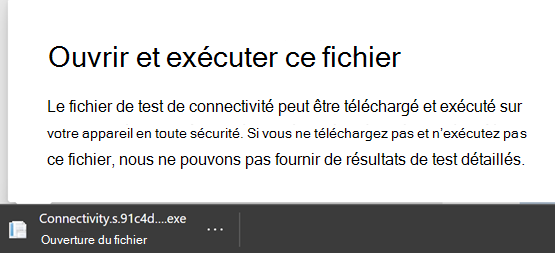
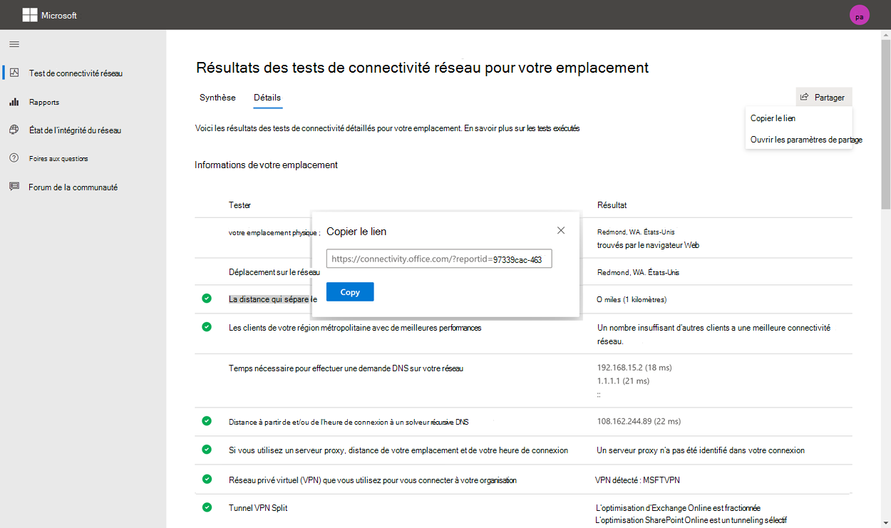
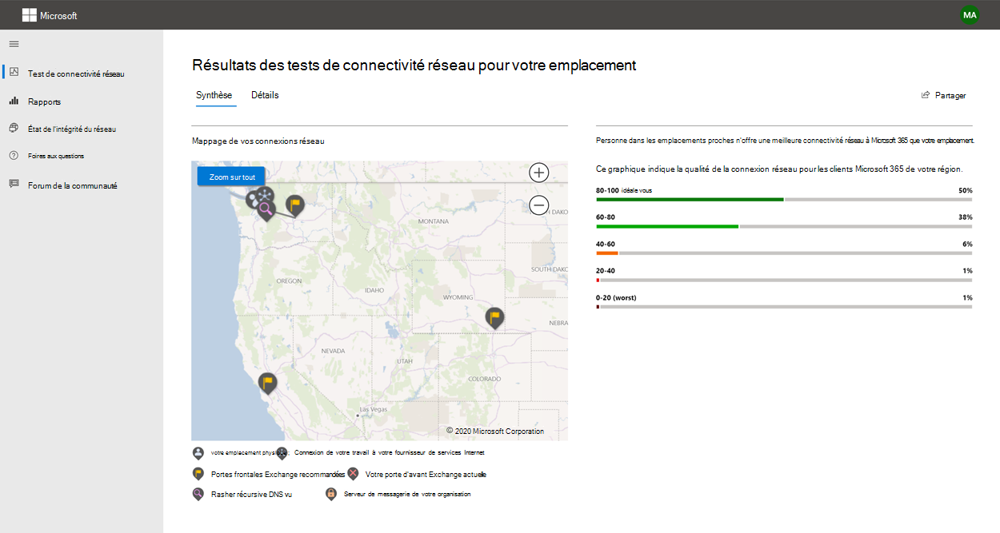
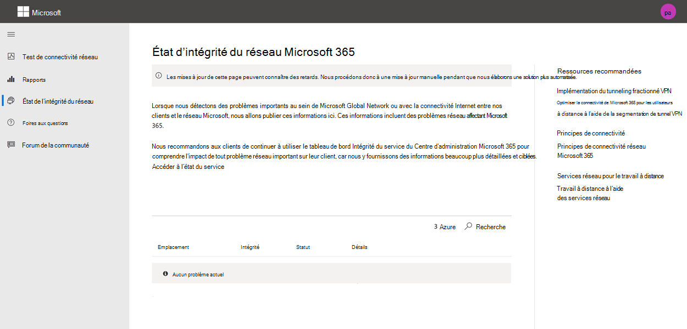

# Microsoft 365 de test de connectivité réseau

L Microsoft 365 de test de connectivité réseau se trouve à l’emplacement .<https://connectivity.office.com> Il s’agit d’un outil précieux pour l’évaluation du réseau et les informations réseau disponibles dans le Centre d'administration Microsoft 365 sous le **centre d'| Menu Connectivité**.

> [!IMPORTANT]
> Il est important de se connectez à votre client Microsoft 365, car tous les rapports de test sont partagés avec votre administrateur et chargés vers le client lorsque vous êtes connecté.

> [!div class="mx-imgBorder"]
> 

>[!NOTE]
>L’outil de test de connectivité réseau prend en charge les locataires dans WW Commercial, mais Cloud de la communauté du secteur public modéré, Cloud de la communauté du secteur public Élevé, DoD ou Chine.

Les informations réseau dans le centre Administration Microsoft 365 sont basées sur des mesures régulières dans le produit pour votre client Microsoft 365, agrégées chaque jour. En comparaison, les informations réseau du test Microsoft 365 de connectivité réseau sont exécutés localement dans l’outil.

Les tests dans le produit sont limités et l’exécution de tests locaux pour l’utilisateur collecte davantage de données, ce qui donne des informations plus approfondies. Les informations réseau du Centre Administration Microsoft 365 montrent qu’il existe un problème de réseau à un emplacement de bureau spécifique. Le test Microsoft 365 de connectivité peut aider à identifier la cause première de ce problème et à fournir une action d’amélioration des performances ciblée.

Nous vous recommandons d’utiliser ces informations ensemble, où l’état de la qualité réseau peut être évalué pour chaque emplacement de bureau dans le Centre Administration Microsoft 365 et des informations plus spécifiques peuvent être trouvées après le déploiement des tests basés sur le test de connectivité Microsoft 365.

## Que se passe-t-il à chaque étape de test ?

### Office’emplacement

Lorsque vous cliquez sur le *bouton Exécuter le test* , nous montrons la page de test en cours d’exécution et identifions l’emplacement du bureau. Vous pouvez taper votre emplacement par ville, état et pays ou choisir de le détecter pour vous. Si vous détectez l’emplacement du bureau, l’outil demande la latitude et la longitude au navigateur web et limite la précision à 300 mètres sur 300 mètres avant d’être utilisé. Il n’est pas nécessaire d’identifier l’emplacement plus précisément que le bâtiment pour mesurer les performances du réseau.

### Tests JavaScript

Après l’identification de l’emplacement du bureau, nous  exécuterons un test de latence TCP dans JavaScript et nous demandons des données au service sur les serveurs de porte d’entrée du service Microsoft 365 en cours d’utilisation et recommandés. Une fois ces tests terminés, nous les montrons sur la carte et dans l’onglet Détails où ils peuvent être vus avant l’étape suivante.

### Télécharger l’application cliente de tests avancés

Ensuite, nous commençons le téléchargement de l’application cliente de tests avancés. Nous dépendons de l’utilisateur pour lancer l’application cliente et .NET 6.0 Runtime doit également être installé.

Le test de connectivité réseau Microsoft 365 se déroule en deux parties : le site <https://connectivity.office.com> web et une application cliente Windows téléchargeable qui exécute des tests de connectivité réseau avancés. La plupart des tests nécessitent l’application à exécuter. Il remplit de nouveau les résultats dans la page web au cours de son application.

Vous serez invité à télécharger l’application de test client avancée à partir du site web une fois les tests du navigateur web terminés. Ouvrez et exécutez le fichier à l’invite.

> [!div class="mx-imgBorder"]
> 

### Démarrer l’application cliente de tests avancés

Une fois que l’application cliente démarre, la page web se met à jour pour afficher ce résultat. Les données de test commencent à être reçues sur la page web. La page est mise à jour chaque fois que de nouvelles données sont reçues et vous pouvez passer en revue les données à mesure qu’elles arrivent.

### Tests avancés terminés et chargement de rapports de test

Une fois les tests terminés, la page web et le client de tests avancés le montrent tous les deux. Si l’utilisateur est signé, le rapport de test est téléchargé vers le client du client.

## Partage de votre rapport de test

Le rapport de test nécessite une authentification de votre Microsoft 365 client. Votre administrateur sélectionne la façon dont vous pouvez partager votre rapport de test.

### Partage de votre rapport avec votre administrateur

Si vous êtes signé lorsqu’un rapport de test se produit, le rapport est partagé avec votre administrateur.

### Partage avec votre équipe de compte Microsoft, le support ou d’autres membres du personnel

Les rapports de test (à l’exception de toute identification personnelle) sont partagés avec les employés de Microsoft. Ce partage est activé par défaut et peut être désactivé par votre administrateur dans le |**Page Connectivité réseau** dans le centre Administration Microsoft 365 réseau.

### Partage avec d’autres utilisateurs qui se connectent au même Microsoft 365 client

Vous pouvez choisir des utilisateurs avec qui partager votre rapport. La possibilité de choisir est activée par défaut, mais elle peut être désactivée par votre administrateur.

> [!div class="mx-imgBorder"]
> 

### Partage avec tout le monde à l’aide d’un lien ReportID

Vous pouvez partager votre rapport de test avec n’importe qui en donnant accès à un lien ReportID. Ce lien génère une URL que vous pouvez envoyer à quelqu’un afin qu’il puisse afficher le rapport de test sans se connexion. Ce partage est désactivé par défaut et doit être activé par votre administrateur.

> [!div class="mx-imgBorder"]
> 

## Résultats des tests de connectivité réseau

Les résultats sont affichés dans les **onglets Résumé** **et** Détails. L’onglet résumé présente une carte du périmètre réseau détecté et une comparaison de l’évaluation du réseau avec d’autres Microsoft 365 à proximité. Il permet également le partage du rapport de test. Voici à quoi ressemble l’affichage des résultats récapitulatifs :

> [!div class="mx-imgBorder"]
> 

Voici un exemple de sortie de l’onglet Détails. Sous l’onglet Détails, une coche verte s’affiche si le résultat a été comparé de façon privilégiée. Nous montrons un point d’exclamation de triangle rouge si le résultat a dépassé un seuil indiquant un aperçu réseau. Les sections suivantes décrivent chacune des lignes de résultats de l’onglet Détails et expliquent les seuils utilisés pour les informations réseau.

> [!div class="mx-imgBorder"]
> 

### Informations sur votre emplacement

Cette section affiche les résultats des tests liés à votre emplacement.

#### Votre emplacement

L’emplacement de l’utilisateur est détecté à partir du navigateur web des utilisateurs. Il peut également être tapé au choix de l’utilisateur. Il permet d’identifier les distances réseau avec des parties spécifiques du périmètre du réseau d’entreprise. Seule la ville de cette détection d’emplacement et la distance avec les autres points réseau sont enregistrées dans le rapport.

L’emplacement du bureau de l’utilisateur est affiché sur l’affichage de carte.

#### Emplacement de sortie réseau (emplacement où votre réseau se connecte à votre isp)

Nous identifions l’adresse IP de sortie du réseau côté serveur. Les bases de données d’emplacements sont utilisées pour rechercher l’emplacement approximatif de la sortie réseau. Ces bases de données ont généralement une précision d’environ 90 % des adresses IP. Si l’emplacement de sortie de l’adresse IP de sortie du réseau n’est pas précis, cela entraînerait un faux résultat. Pour vérifier si cette erreur se produit pour une adresse IP spécifique, vous pouvez utiliser des sites web d’emplacement d’adresse IP réseau accessibles publiquement pour comparer votre emplacement réel.

#### Votre distance par rapport à l'emplacement de la sortie du réseau

Nous déterminons la distance entre cet emplacement et l’emplacement du bureau. Cela s’affiche sous la mesure d’une information réseau si la distance est supérieure à **500 miles** (800 kilomètres), car cela est susceptible d’augmenter la latence TCP de plus de 25 ms et d’affecter l’expérience utilisateur.

La carte indique l’emplacement de sortie réseau par rapport à l’emplacement du bureau de l’utilisateur indiquant le backhaul du réseau à l’intérieur du réseau wan d’entreprise.

Implémenter la sortie réseau locale et directe des emplacements de bureau d’utilisateur vers Internet pour une Microsoft 365 réseau optimale. Les améliorations apportées à la sortie locale et directe sont le meilleur moyen de résoudre ce problème réseau.

#### Informations sur le serveur proxy

Nous identifions si les serveurs proxy sont configurés sur l’ordinateur local pour transmettre Microsoft 365 trafic réseau dans la catégorie **Optimiser**. Nous identifions la distance entre l’emplacement du bureau de l’utilisateur et les serveurs proxy.

La distance est testée en premier par le test PING ICMP. En cas d’échec, nous testons le ping TCP et, enfin, nous allons rechercher l’adresse IP du serveur proxy dans une base de données d’emplacements d’adresses IP. Nous montrons un aperçu du réseau si le serveur proxy se trouve à **plus de 500 km** (800 kilomètres) de l’emplacement du bureau de l’utilisateur.

#### Réseau privé virtuel (VPN) que vous utilisez pour vous connecter à votre organisation

Ce test détecte si vous utilisez un VPN pour vous connecter à Microsoft 365. Un résultat de passage indique si vous n’avez pas de VPN ou si vous avez un VPN avec une configuration de tunnel fractionnement recommandée pour Microsoft 365.

#### Vpn Split Tunnel

Chaque **itinéraire** de catégorie Optimiser pour Exchange Online, SharePoint Online et Microsoft Teams est testé pour voir s’il est tunnelé sur le VPN. Une charge de travail fractionner évite entièrement le VPN. Une charge de travail tunnelée est envoyée sur le VPN. Une charge de travail tunnelée sélective dispose de certains itinéraires envoyés sur le VPN et d’autres fractionnés. Un résultat de passage indique si toutes les charges de travail sont fractionnés ou triés de façon sélective.

#### Clients de votre région métropolitain avec de meilleures performances

La latence du réseau entre l’emplacement du bureau de l’utilisateur et le service Exchange Online est comparée aux autres Microsoft 365 clients dans la même zone de région. Un aperçu réseau s’affiche si 10 % ou plus des clients d’une même zone d’entreprise ont de meilleures performances. Cela signifie que leurs utilisateurs auront de meilleures performances dans l Microsoft 365'interface utilisateur.

Cette information réseau est générée sur la base du fait que tous les utilisateurs d’une ville ont accès à la même infrastructure de télécommunications et à la même proximité des circuits Internet et du réseau de Microsoft.

#### Temps d’effectuer une demande DNS sur votre réseau

Cela indique le serveur DNS configuré sur l’ordinateur client qui a effectué les tests. Il peut s’agit d’un serveur de résolution récursive DNS, mais cela est rare. Il est plus probable qu’il s’agit d’un serveur de forwardeur DNS, qui met en cache les résultats DNS et les demandes DNS non mises en cache vers un autre serveur DNS.

Il est fourni uniquement pour les informations et ne contribue à aucune information réseau.

#### Distance et/ou durée de connexion à un résolveur récursif DNS

Le résolveur récursif DNS en cours d’utilisation est identifié en faisant une demande DNS spécifique, puis en demandant au serveur de noms DNS l’adresse IP à partir de qui il a reçu la même demande. Cette adresse IP est le résolveur récursif DNS et elle sera recherche dans les bases de données d’emplacements d’adresses IP pour trouver l’emplacement. La distance entre l’emplacement du bureau de l’utilisateur et l’emplacement du serveur de résolution récursive DNS est ensuite calculée. Il s’agit d’un aperçu réseau si la distance est supérieure à **500 miles** (800 kilomètres).

L’emplacement de sortie de l’adresse IP de sortie du réseau n’est peut-être pas précis et cela entraînerait un faux résultat à partir de ce test. Pour vérifier si cette erreur se produit pour une adresse IP spécifique, vous pouvez utiliser des sites web d’emplacement d’adresse IP réseau accessibles publiquement.

Cette information réseau aura un impact spécifique sur la sélection de la porte d’Exchange Online service. Pour résoudre ce problème, la sortie du réseau local et direct doit être une condition préalable, puis le résolveur récursif DNS doit être situé à proximité de cette sortie réseau.

### Exchange Online

Cette section présente les résultats des tests liés aux Exchange Online.

#### Exchange l’emplacement de la porte d’entrée du service

La porte d’entrée du service Exchange en cours d’utilisation est identifiée de la même manière que Outlook et nous mesureons la latence TCP du réseau à partir de l’emplacement de l’utilisateur. La latence TCP est affichée et la porte d’Exchange service en cours d’utilisation est comparée à la liste des meilleures portes d’entrée de service pour l’emplacement actuel. Il s’agit d’une information réseau si l’une des meilleures Exchange service frontal n’est pas en cours d’utilisation.

L’utilisation de l’une des meilleures porte d’entrée du service Exchange peut être causée par une rétrograder du réseau avant la sortie du réseau d’entreprise, auquel cas nous recommandons une sortie locale et directe du réseau. Cela peut également être dû à l’utilisation d’un serveur de résolution récursif DNS distant, auquel cas nous vous recommandons d’aligner le serveur de résolution récursif DNS avec la sortie réseau.

Nous calculons une amélioration potentielle de la latence TCP (ms) sur le Exchange frontal du service. Pour ce faire, il s’agit de la latence du réseau d’emplacements du bureau de l’utilisateur testée et de la soustraction de la latence du réseau de l’emplacement actuel aux Exchange frontal du service. La différence représente l’opportunité potentielle d’amélioration.

#### Meilleure Exchange ou porte d’entrée du service pour votre emplacement

Cette liste répertorie les Exchange de service frontal par ville pour votre emplacement.

#### Porte frontale du service enregistrée dans le DNS client

Cela indique le nom DNS et l’adresse IP du serveur Exchange frontal du service vers qui vous avez été dirigé. Il est fourni uniquement pour les informations et il n’y a pas d’informations réseau associées.

### SharePoint Online

Cette section présente les résultats des tests liés à SharePoint Online et OneDrive.

#### Emplacement de la porte d’entrée du service

La porte d’entrée du service SharePoint en cours d’utilisation est identifiée de la même manière que le client OneDrive et nous mesureons la latence TCP du réseau à partir de l’emplacement du bureau de l’utilisateur.

#### Vitesse de téléchargement

Nous mesureons la vitesse de téléchargement d’un fichier de 15 Mo à partir du SharePoint frontal du service. Le résultat est affiché en mégaoctets par seconde pour indiquer quel fichier de taille en mégaoctets peut être téléchargé à partir de SharePoint ou OneDrive en **une seconde**. Le nombre doit être similaire à un dixième de la bande passante du circuit minimum en mégabits par seconde. Par exemple, si vous avez une connexion Internet de 100 Mbits/s, vous pouvez vous attendre à 10 mégaoctets par seconde (10 Mbits/s).

#### Tampons de tampon

Pendant le téléchargement de 15 Mo, nous mesureons la latence TCP sur le SharePoint frontal du service. Il s’agit de la latence sous charge et elle est comparée à la latence lorsqu’elle n’est pas sous charge. L’augmentation de la latence en cas de charge est souvent due au chargement des mémoires tampons des périphériques réseau grand public (ou trop importantes). Une vue d’un réseau est affichée pour tout problème de 1 000 ou plus.

#### Porte frontale du service enregistrée dans le DNS client

Cela indique le nom DNS et l’adresse IP du serveur SharePoint frontal du service vers qui vous avez été dirigé. Il est fourni uniquement pour les informations et il n’y a pas d’informations réseau associées.

### Microsoft Teams

Cette section présente les résultats des tests liés aux Microsoft Teams.

#### Connectivité multimédia (audio, vidéo et partage d’application)

Cela teste la connectivité UDP au Microsoft Teams frontal du service. Si ce blocage est bloqué, Microsoft Teams peut toujours fonctionner à l’aide de TCP, mais l’audio et la vidéo seront altérés. En savoir plus sur ces mesures du réseau UDP, qui s’appliquent également aux Microsoft Teams qualité des médias et performances de [connectivité réseau dans Skype Entreprise Online](/skypeforbusiness/optimizing-your-network/media-quality-and-network-connectivity-performance).

#### Perte de paquets

Indique la perte de paquets UDP mesurée dans un appel audio de test de 10 secondes entre le client et Microsoft Teams le service frontal. Cette valeur doit être inférieure **à 1,00 %** pour une passe.

#### Latence

Indique la latence UDP mesurée, qui doit être inférieure à **100 ms**.

#### Gigue

Indique la gigue UDP mesurée, qui doit être inférieure à **30 ms**.

#### Connectivité

Nous testons la connectivité HTTP à partir de l’emplacement du bureau de l’utilisateur vers tous les points de terminaison Microsoft 365 réseau requis. Ceux-ci sont publiés sur [https://aka.ms/o365ip](./urls-and-ip-address-ranges.md). Un aperçu réseau est affiché pour tous les points de terminaison réseau requis, qui ne peuvent pas être connectés.

La connectivité peut être bloquée par un serveur proxy, un pare-feu ou un autre périphérique de sécurité réseau sur le périmètre du réseau d’entreprise. La connectivité au port TCP 80 est testée avec une demande HTTP et la connectivité au port TCP 443 est testée avec une demande HTTPS. En l’absence de réponse, le nom de groupe est marqué comme un échec. S’il existe un code de réponse HTTP 407, le FQDN est marqué comme un échec. S’il existe un code de réponse HTTP 403, nous vérifions l’attribut serveur de la réponse et s’il s’agit d’un serveur proxy, nous le marquerons comme un échec. Vous pouvez simuler les tests effectués avec l Windows de ligne de commande curl.exe.

Nous testons le certificat SSL à chaque point de terminaison Microsoft 365 réseau requis qui se trouve dans la catégorie Optimiser ou Autoriser, comme défini à [https://aka.ms/o365ip](./urls-and-ip-address-ranges.md). Si des tests ne trouvent pas de certificat Microsoft SSL, le réseau chiffré connecté doit avoir été intercepté par un périphérique réseau intermédiaire. Un aperçu réseau est affiché sur tous les points de terminaison réseau chiffrés interceptés.

Lorsqu’un certificat SSL n’est pas fourni par Microsoft, nous montrons le FQDN du test et le propriétaire du certificat SSL en cours d’utilisation. Ce propriétaire de certificat SSL peut être un fournisseur de serveur proxy ou un certificat auto-signé d’entreprise.

#### Chemin d’accès réseau

Cette section présente les résultats d’un itinéraire de suivi ICMP vers la porte d’entrée du service Exchange Online, la porte d’entrée du service SharePoint Online et la porte d’entrée du service Microsoft Teams. Il est fourni uniquement pour les informations et il n’y a pas d’informations réseau associées. Trois traceroutes sont fournies. Traceroute vers _outlook.office365.com_, traceroute vers les clients SharePoint frontal ou _microsoft.sharepoint.com_ si ce n’est pas le cas, et traceroute vers _world.tr.teams.microsoft.com._

## Rapports de connectivité

Une fois que vous êtes signé, vous pouvez passer en revue les rapports précédents que vous avez exécutés. Vous pouvez également les partager ou les supprimer de la liste.

> [!div class="mx-imgBorder"]
> 

## État d’état du réseau

Cela indique tous les problèmes d’état d’santé importants avec le réseau mondial de Microsoft, ce qui peut avoir un impact sur Microsoft 365 clients.

> [!div class="mx-imgBorder"]
> 

## Test à partir de la ligne de commande

Nous fournissons un exécutable de ligne de commande qui peut être utilisé par vos outils de déploiement et d’exécution à distance et nous exécutons les mêmes tests que dans le site web de l’outil de test de connectivité réseau Microsoft 365.

L’outil de test de ligne de commande peut être téléchargé ici : 

Vous pouvez l’exécuter en double-cliquant sur l’exécutable dans l’Explorateur de fichiers Windows, ou vous pouvez le démarrer à partir d’une invite de commandes, ou vous pouvez le planifier avec le programmeur de tâches.

La première fois que vous lancez l’exécutable, vous êtes invité à accepter le contrat de licence utilisateur final (EULA) avant d’effectuer le test. Si vous avez déjà lu et accepté le LLA, vous pouvez créer un fichier vide appelé Microsoft-365-Network-Connectivity-Test-EULA-accepted.txt dans le répertoire de travail actuel pour le processus exécutable lors de son lancement. Pour accepter le LLA, vous pouvez taper « y » et appuyer sur Entrée dans la fenêtre de ligne de commande lorsque vous y êtes invité.

L’exécutable accepte un paramètre de ligne de commande de /h pour afficher un lien vers cette documentation d’aide.

### Résultats
Les résultats sont écrits dans un fichier JSON dans un dossier appelé TestResults qui est créé dans le répertoire de travail actuel du processus, sauf s’il existe déjà. Le format de nom de fichier pour la sortie est connectivity_test_result_YYYY-MM-DD-HH-MM-SS.json. Les résultats sont dans des nodes JSON qui correspondent à la sortie affichée sur la page web pour le site web de l’outil de test Microsoft 365 connectivité réseau. Un nouveau fichier de résultats est créé chaque fois que vous l’exécutez et l’exécutable autonome ne télécharge pas les résultats vers votre client Microsoft pour les afficher dans les pages Connectivité réseau du Centre d’administration.

### Lancement à partir Windows’Explorateur de fichiers
Vous pouvez simplement double-cliquer sur l’exécutable pour démarrer le test et une fenêtre d’invite de commandes s’affiche.

### Lancement à partir de l’invite de commandes
Dans une CMD.EXE'invite de commandes, vous pouvez taper le chemin d’accès et le nom de l’exécutable pour l’exécuter. Le nom de fichier est Microsoft.Connectivity.Test.exe

### Lancement à partir du Windows de tâches
Dans Windows Scheduler de tâches, vous pouvez ajouter une tâche pour lancer le test autonome exécutable. Vous devez spécifier le répertoire de travail actuel de la tâche à l’endroit où vous avez créé le fichier accepté par le CLA, car l’exécutable bloquera jusqu’à ce que le CLA soit accepté. Vous ne pouvez pas accepter de manière interactive le CLA si le processus est démarré en arrière-plan sans console.

### Plus de détails sur l’exécutable autonome
L’outil de ligne de commande Windows services de localisation pour rechercher les informations du pays de la ville des utilisateurs pour déterminer certaines distances. Si Windows services de localisation est désactivé dans le panneau de contrôle, les évaluations basées sur l’emplacement de l’utilisateur seront vides. Dans Windows Paramètres les « services de localisation » doivent être sur et « Laisser les applications de bureau accéder à votre emplacement » doivent également l’être.

L’outil de ligne de commande tente d’installer le .NET Framework s’il n’est pas déjà installé. Il télécharge également le exécutable de test principal à partir de l Microsoft 365 de test de connectivité réseau et lance ce test.

## FAQ

Voici des réponses à certaines de nos questions fréquemment posées.

### Qu’est-ce qui est requis pour exécuter le client de test avancé ?

Le client de test avancé nécessite .NET 6.0 Runtime. Si vous exécutez le client de test avancé sans celui installé, vous serez dirigé vers la page du programme d’installation [.NET 6.0](https://dotnet.microsoft.com/en-us/download/dotnet/6.0/runtime?utm_source=getdotnetcore). Assurez-vous de l’installer à partir de la colonne Exécuter les applications de bureau pour Windows. Les autorisations d’administrateur sur l’ordinateur sont requises pour installer .NET 6.0 Runtime.

Le client de test avancé utilise SignalR pour communiquer avec la page web. Pour cela, vous devez vous assurer que la connectivité du port TCP 443 **connectivity.service.signalr.net** est ouverte. Cette URL n’est pas publiée dans <https://aka.ms/o365ip> le parce que cette connectivité n’est pas requise pour un Microsoft 365'application cliente.

### Qu’est-ce Microsoft 365 service frontal ?

La Microsoft 365 service frontal est un point d’entrée sur le réseau mondial de Microsoft où les clients et les services Office terminent leur connexion réseau. Pour une connexion réseau optimale à Microsoft 365, il est recommandé que votre connexion réseau soit terminée sur la porte d’Microsoft 365 la plus proche de votre ville ou de votre ville.

> [!NOTE]
> Microsoft 365 service frontal n’a pas de relation directe avec le produit **Azure Front Door Service** disponible sur Azure Marketplace.

### Quelle est la meilleure Microsoft 365 service frontal ?

Une meilleure porte d’Microsoft 365 service (anciennement appelée porte frontale de service optimale) est celle qui est la plus proche de la sortie réseau, généralement dans votre ville ou région. Utilisez l Microsoft 365 de performances réseau pour déterminer l’emplacement de votre Microsoft 365 service en cours d’utilisation et la ou les meilleures porte d’entrée du service. Si l’outil détermine que votre porte frontale en cours d’utilisation est l’une des meilleures, vous devez vous attendre à une excellente connectivité au réseau mondial de Microsoft.

### Qu’est-ce qu’un emplacement de sortie Internet ?

L’emplacement de sortie Internet est l’emplacement où votre trafic réseau quitte votre réseau d’entreprise et se connecte à Internet. Il s’agit également de l’emplacement où vous avez un périphérique de traduction d’adresses réseau (NAT) et généralement où vous vous connectez à un fournisseur de services Internet (ISP). Si vous voyez une longue distance entre votre emplacement et votre emplacement de sortie Internet, cela peut identifier un backhaul wan significatif.

## Voir aussi

[Connectivité réseau dans le centre Administration Microsoft 365 de connexion](office-365-network-mac-perf-overview.md)

[Microsoft 365 informations sur les performances du réseau](office-365-network-mac-perf-insights.md)

[Microsoft 365'évaluation du réseau](office-365-network-mac-perf-score.md)

[Microsoft 365 Network Connectivity Location Services](office-365-network-mac-location-services.md)
