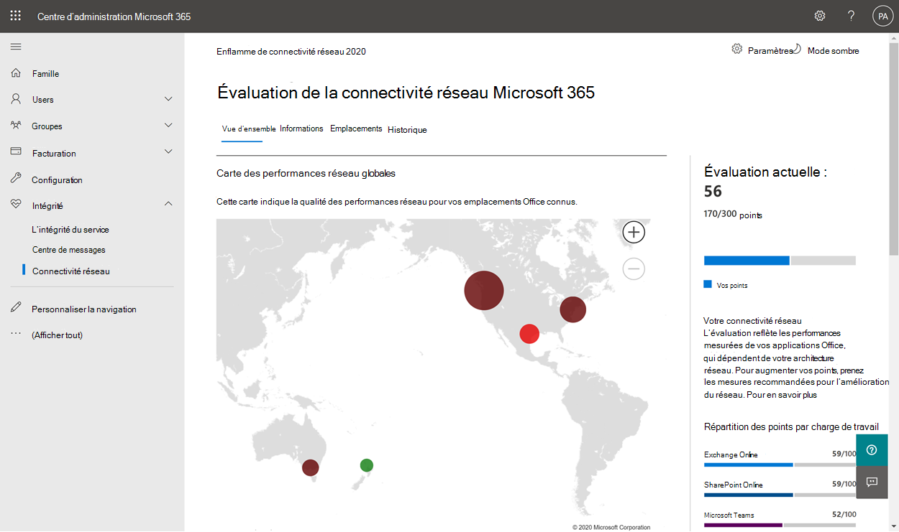
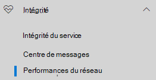
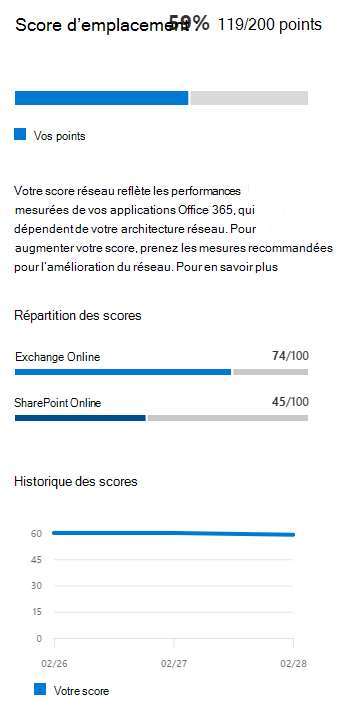
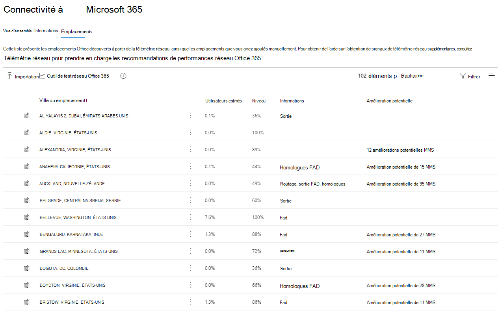
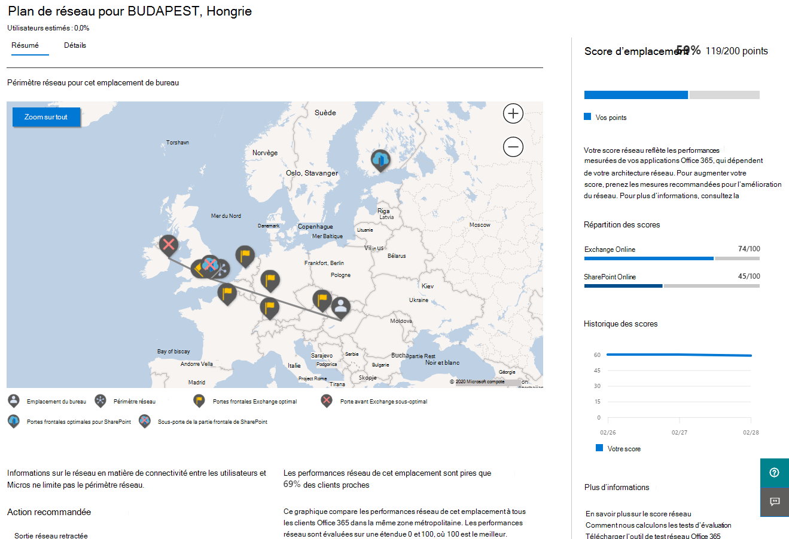
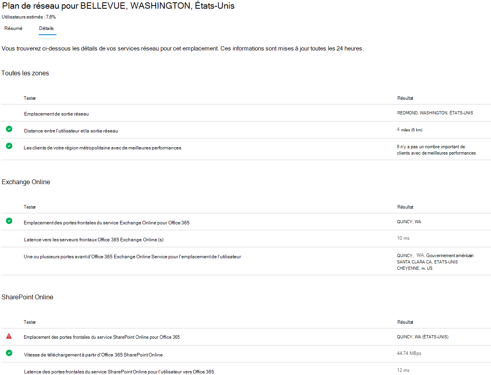
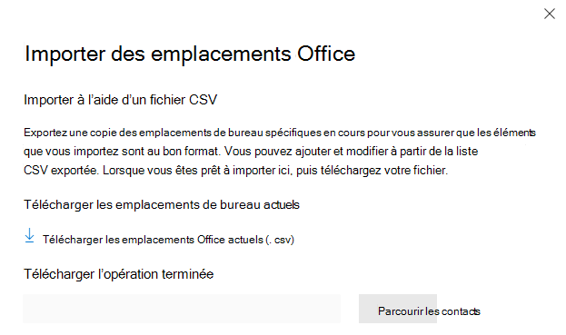
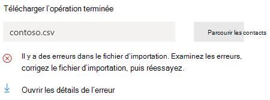

# Connectivité réseau dans le centre Administration Microsoft 365 de connexion

Le centre Administration Microsoft 365 inclut désormais des mesures de connectivité réseau agrégées collectées à partir de votre client Microsoft 365 et disponibles uniquement pour les utilisateurs administratifs de votre client.

> [!div class="mx-imgBorder"]
> 

**Les évaluations réseau** et les informations réseau sont **affichées** dans le Centre de Administration Microsoft 365 sous **Informations sur la | Connectivité réseau**.

> [!div class="mx-imgBorder"]
> 

>[!NOTE]
>La connectivité réseau dans le Centre d’administration prend en charge les locataires de WW Commercial et d’Allemagne, mais Cloud de la communauté du secteur public modéré, Cloud de la communauté du secteur public Élevé, DoD ou Chine.

Lorsque vous accédez à la page de performances réseau pour la première fois, vous devez configurer vos emplacements pour voir la carte des performances globales du réseau, une évaluation réseau étendue à l’ensemble du client, le pourcentage de vos utilisateurs travaillant à distance par rapport au site, ainsi qu’une liste des problèmes actuels pour prendre des mesures et/ou pour poursuivre la recherche. Dans le volet vue d’ensemble, vous pouvez consulter les mesures et problèmes de performances réseau spécifiques par emplacement. Pour plus d’informations, [voir Vue d’ensemble des performances](#network-connectivity-overview-in-the-microsoft-365-admin-center)réseau dans le Administration Microsoft 365.

Vous pouvez être invité à participer à la prévisualisation publique pour cette fonctionnalité au nom de votre organisation. L’acceptation se produit généralement immédiatement, après quoi vous voyez la page de connectivité réseau.

Pour accéder à la page de connectivité réseau, vous devez être administrateur de l’organisation au sein Microsoft 365. Le rôle d’administration lecteur de rapports aura un accès en lecture à ces informations. Pour configurer des emplacements et d’autres éléments de connectivité réseau, un administrateur doit faire partie d’un rôle d’administrateur de serveur tel que le rôle d’administrateur de support technique du service.

## Conditions préalables à l’apparition des évaluations de la connectivité réseau

To get started, turn on your location opt-in setting to automatically collect data from devices using Windows Location Services, go to your Locations list to add or upload location data, or run the Microsoft 365 network connectivity test from your office locations. La connectivité réseau peut être évaluée au sein de l’organisation, toute amélioration de la conception réseau devra être effectuée pour des emplacements de bureau spécifiques. Les informations de connectivité réseau sont fournies pour chaque emplacement de bureau une fois ces emplacements déterminés. Il existe trois options pour obtenir des évaluations réseau à partir de vos bureaux :

### 1. Activer les services Windows localisation

Pour cette option, vous devez avoir au moins deux ordinateurs en cours d’exécution à chaque emplacement de bureau qui prendre en charge les conditions préalables. OneDrive pour Windows version doit être à jour et installée sur chaque ordinateur. Pour plus d’informations sur OneDrive versions, consultez les notes [OneDrive publication.](https://support.office.com/article/onedrive-release-notes-845dcf18-f921-435e-bf28-4e24b95e5fc0) Des mesures réseau sont prévues pour être ajoutées à d’Office 365 applications clientes dans un futur proche.

Windows Le service de localisation doit être accepté sur les ordinateurs. Vous pouvez le tester en exécutant **l’application Cartes** et en vous localisant vous-même. Il peut être activé sur un seul ordinateur avec **Paramètres | Confidentialité | Emplacement** où le paramètre _Autoriser les applications à accéder à_ votre emplacement doit être activé. Windows Le consentement des services de localisation peut être déployé sur des PC à l’aide de la stratégie de groupe ou de la gestion des stratégies de groupe avec le paramètre _LetAppsAccessLocation_.

Il n’est pas nécessaire d’ajouter des emplacements dans le Centre d’administration avec cette méthode, car ils sont automatiquement identifiés au niveau de la résolution de la ville. Plusieurs bureaux dans la même ville ne s’afficheront pas lors de l’utilisation Windows services de localisation. Les informations d’emplacement sont arrondies aux 300 mètres les plus proches sur 300 mètres afin que les informations d’emplacement plus précises ne sont pas accessibles.

Les ordinateurs doivent avoir Wi-Fi réseau au lieu d’un câble ethernet. Les ordinateurs avec un câble ethernet n’ont pas d’informations précises sur l’emplacement.

Les exemples de mesure et les emplacements de bureau doivent commencer à apparaître 24 heures après que ces conditions préalables ont été remplies.

### 2. Ajouter des emplacements et fournir des informations sur le sous-réseau laN

Pour cette option, ni les services Windows de localisation ni Wi-Fi sont requis. Votre OneDrive pour Windows version doit être à jour et installé sur au moins un ordinateur à l’emplacement.

Vous devez également ajouter des emplacements dans la **page Emplacements** ou les importer à partir d’un fichier CSV. Les emplacements ajoutés doivent inclure les informations de votre sous-réseau local d’office.

Cette option vous permet de définir plusieurs bureaux dans une ville.

Toutes les mesures de test des ordinateurs clients incluent les informations du sous-réseau local, qui sont corrélées avec les détails de l’emplacement du bureau que vous avez entrés. Les exemples de mesure et les emplacements de bureau doivent commencer à apparaître 24 heures après que ces conditions préalables ont été remplies.

### 3. Collecte manuelle des rapports de test avec l Microsoft 365 de test de connectivité réseau

Pour cette option, vous devez identifier une personne à chaque emplacement. Demandez-leur d’Microsoft 365 [test](https://connectivity.office.com) de connectivité réseau sur un ordinateur Windows sur lequel ils ont des autorisations administratives. Sur le site web, ils doivent se Office 365 compte de la même organisation que celle dont vous souhaitez voir les résultats. Ensuite, ils doivent cliquer **sur Exécuter le test.** Pendant le test, il existe un exE de test de connectivité téléchargé. Ils doivent ouvrir et exécuter cette opération. Une fois les tests terminés, les résultats du test sont téléchargés vers le Centre d’administration.

Les rapports de test sont liés à un emplacement s’il a été ajouté avec des informations de sous-réseau laN, sinon ils sont affichés uniquement à l’emplacement de la ville.

Les échantillons de mesure et les emplacements de bureau doivent commencer à apparaître 2 à 3 minutes après la fin d’un rapport de test. Pour plus d’informations, [voir Microsoft 365 test de connectivité réseau.](office-365-network-mac-perf-onboarding-tool.md)

> [!NOTE]
> Actuellement, si vous ajoutez vos emplacements de bureau à Microsoft 365 connectivité réseau dans le Centre d'administration Microsoft 365, vous ne pouvez fournir que des adresses IPv4 pour vos sous-réseaux lan. Egress Les adresses IP doivent utiliser IPv4.

## Comment utiliser ces informations ?

**Les informations sur le réseau,** leurs recommandations en matière de performances associées et les évaluations réseau sont conçues pour vous aider à concevoir des périmètres réseau pour vos bureaux. Chaque aperçu fournit des détails sur les caractéristiques de performances d’un problème réseau commun spécifique pour chaque emplacement géographique où les utilisateurs accèdent à votre client. **Les recommandations en matière** de performances pour chaque aperçu réseau offrent des modifications de conception d’architecture réseau spécifiques que vous pouvez apporter pour améliorer l’expérience utilisateur liée Microsoft 365 connectivité réseau. L’évaluation du réseau montre l’impact de la connectivité réseau sur l’expérience utilisateur, ce qui permet de comparer les différentes connexions réseau d’emplacement utilisateur.

**Les évaluations réseau** regroupent de nombreuses mesures de performances réseau dans une capture instantanée de l’état du réseau de votre entreprise, représentée par une valeur de points entre 0 et 100. Les évaluations réseau sont limitées à l’ensemble du client et à chaque emplacement géographique à partir duquel les utilisateurs se connectent à votre client, ce qui permet aux administrateurs Microsoft 365 de saisir instantanément un gestalt de l’état du réseau de l’entreprise et d’obtenir rapidement un rapport détaillé pour n’importe quel emplacement de bureau global.

Les entreprises complexes avec plusieurs bureaux et des architectures de périmètre réseau non triviales peuvent tirer parti de ces informations lors de leur intégration initiale à Microsoft 365 ou pour résoudre les problèmes de performances réseau détectés avec la croissance de l’utilisation. Cela n’est généralement pas nécessaire pour les petites entreprises utilisant Microsoft 365 ou les entreprises qui ont déjà une connectivité réseau simple et directe. Les entreprises de plus de 500 utilisateurs et de plusieurs bureaux devraient en tirer le meilleur parti.

>[!IMPORTANT]
>Les informations sur le réseau, les recommandations en matière de performances et les évaluations dans le Centre Administration Microsoft 365 sont actuellement en état de prévisualisation et sont uniquement disponibles pour les locataires Microsoft 365 qui ont été inscrits au programme d’aperçu des fonctionnalités.

## Enterprise de connectivité réseau

> [!div class="mx-imgBorder"]
> 

De nombreuses entreprises ont des configurations de périmètre réseau qui ont évolué au fil du temps et sont principalement conçues pour prendre en charge l’accès au site web Internet des employés, où la plupart des sites web ne sont pas connus à l’avance et ne sont pas sécurisés. L’objectif le plus indispensable est d’éviter les programmes malveillants et les attaques par hameçonnage à partir de ces sites web inconnus. Cette stratégie de configuration réseau, bien qu’utile à des fins de sécurité, peut entraîner une dégradation des performances Microsoft 365 et de l’expérience utilisateur.

## Comment pouvons-nous résoudre ces défis ?

Les entreprises peuvent améliorer l’expérience utilisateur générale et sécuriser leur environnement en suivant [Office 365](./microsoft-365-network-connectivity-principles.md) principes de connectivité et en utilisant la fonctionnalité de connectivité réseau Administration Microsoft 365 Center. Dans la plupart des cas, le fait de suivre ces principes généraux aura un impact positif significatif sur la latence des utilisateurs finaux, la fiabilité du service et les performances globales des Microsoft 365.

Microsoft est parfois invité à examiner les problèmes de performances réseau liés aux Microsoft 365 pour les clients de grandes entreprises, et ceux-ci ont souvent une cause première liée à l’infrastructure de périmètre du réseau du client. Lorsqu’une cause première courante d’un problème de périmètre de réseau client est trouvée, nous cherchons à identifier des mesures de test simples qui l’identifient. Un test avec un seuil de mesure qui identifie un problème spécifique est utile, car nous pouvons tester la même mesure à n’importe quel emplacement, déterminer si cette cause première est présente et la partager en tant qu’informations réseau avec l’administrateur.

Certaines informations réseau indiquent simplement un problème qui doit faire l’objet d’un examen plus approfondie. Une information réseau dans laquelle nous avons suffisamment de tests pour afficher une action de correction spécifique pour corriger la cause première est répertoriée comme **une action recommandée.** Ces recommandations, basées sur des mesures dynamiques qui révèlent des valeurs qui tombent en dehors d’un seuil prédéterminé, sont beaucoup plus utiles que les conseils généraux des meilleures pratiques, car elles sont propres à votre environnement et montrent l’amélioration réelle une fois que les modifications recommandées ont été apportées.

## Vue d’ensemble de la connectivité réseau dans le centre Administration Microsoft 365 réseau

Microsoft dispose de mesures réseau existantes à partir de plusieurs clients Office bureau et web qui prendre en charge le fonctionnement de Microsoft 365. Ces mesures sont désormais utilisées pour fournir des informations sur la conception de l’architecture réseau et une évaluation du réseau qui sont affichées dans la **page** Connectivité réseau du Centre Administration Microsoft 365.

Par défaut, les informations d’emplacement approximatives associées aux mesures réseau identifient la ville où se trouvent les appareils clients. L’évaluation réseau à chaque emplacement est affichée avec la couleur et le nombre relatif d’utilisateurs à chaque emplacement est représenté par la taille du cercle.

> [!div class="mx-imgBorder"]
> 

La page vue d’ensemble présente également l’évaluation réseau pour le client sous la mesure d’une moyenne pondérée dans tous les bureaux.

> [!div class="mx-imgBorder"]
> 

Vous pouvez afficher un affichage tableau des emplacements où ils peuvent être filtrés, triés et modifiés dans l’onglet **Emplacements.** Les emplacements avec des recommandations spécifiques peuvent également inclure une amélioration de la latence potentielle estimée. Cette valeur est calculée en prenant la latence médiane des utilisateurs de votre organisation à l’emplacement et en soustrayant la latence médiane pour toutes les organisations dans la même ville.

> [!div class="mx-imgBorder"]
> 

## Mesures de l’évaluation du travail à distance et de la connexion utilisateur

Nous classons les journaux de trafic réseau en tant qu’utilisateurs distants ou sur site et afficheons leurs pourcentages dans la section mesures de connexion utilisateur du volet vue d’ensemble. Pour les villes où vous avez des utilisateurs distants, vous trouverez le score d’évaluation du réseau distant spécifique à l’emplacement lorsque vous ouvrez la page de cet emplacement. La liste des emplacements aura à la fois des bureaux et des villes de travail à distance, qui peuvent être filtrés et triés. Nous fournissons le score d’évaluation des travailleurs à distance, avec répartition des points pour les Exchange, SharePoint et Teams.

Les informations sur la mise en réseau des particuliers sont regroupées et signalées au niveau de la ville et limitées aux villes avec un minimum de 5 employés distants. Nous n’identifions pas les employés individuels travaillant à domicile.

Les emplacements sont classés automatiquement sur site ou à distance. Toutefois, vous avez la possibilité d’entrer manuellement toutes vos adresses IP de sortie sur site pour garantir une classification à 100 %. Si vous décidez d’accéder à cet itinéraire, vous devez cocher manuellement la case à cocher Entrer toutes les **adresses IP** de sortie sur site dans le flyout Emplacements Paramètres après avoir ajouté toutes vos adresses IP de sortie. Une fois cette étape effectuée, tous les journaux de trafic réseau provenant d’adresses IP de sortie que vous avez marquées comme sur site seront toujours classés en tant que bureaux et toutes les autres adresses IP de sortie seront classées comme distantes.

## Synthèse et informations sur les performances réseau de l’emplacement des bureaux spécifiques

La sélection d’un emplacement de bureau ouvre une page récapitulatif propre à un emplacement affichant les détails de la sortie réseau identifiée à partir des mesures de cet emplacement.

> [!div class="mx-imgBorder"]
> 

Une carte du réseau de périmètre pour les utilisateurs de votre organisation à l’emplacement est affichée avec tout ou partie de ces éléments :

- **Office-** Emplacement du bureau de la page que vous regardez
- **Périmètre réseau** : emplacement de l’adresse IP source pour les connexions à partir de l’emplacement du bureau. Cela dépend de la précision des bases de données d’emplacements ip géographiques
- **Exchange service** frontal optimal : l’une des Exchange de service recommandées à qui les utilisateurs de cet emplacement de bureau doivent se connecter
- **Exchange frontale sous-optimale** : une porte d’Exchange service frontale à qui les utilisateurs sont connectés, mais qui n’est pas recommandée
- **SharePoint service** frontal optimal : l’une des SharePoint de service recommandées à qui les utilisateurs de cet emplacement de bureau doivent se connecter
- SharePoint service frontal **sous-optimal** : une porte d’SharePoint service à qui les utilisateurs sont connectés, mais qui n’est pas recommandée
- Serveur de résolution récursive **DNS** : emplacement à partir d’une base de données IP géographique du résolveur récursif DNS détecté utilisé pour Exchange Online (si disponible)
- **Votre serveur proxy** : emplacement à partir d’une base de données IP géographique du serveur proxy détecté (si disponible)

La page récapitulatif de l’emplacement du bureau affiche également l’évaluation réseau de l’emplacement, l’historique de l’évaluation du réseau, une comparaison de l’évaluation de cet emplacement avec d’autres clients de la même ville, ainsi qu’une liste d’informations et de recommandations spécifiques que vous pouvez entreprendre pour améliorer les performances et la fiabilité du réseau.

Les comparaisons entre les clients de la même ville sont basées sur l’attente que tous les clients ont un accès égal aux fournisseurs de services réseau, à l’infrastructure de télécommunications et aux points de présence réseau Microsoft à proximité.

Les noms d’emplacement peuvent être personnalisés lors de l’ajout d’un nouvel emplacement ou de la modification d’un emplacement existant dans le flyout d’emplacement. Cela vous offre la possibilité de personnaliser vos noms d’emplacement à tout moment. En outre, lorsque vous ajoutez des sous-réseaux LAN directement dans le volant d’emplacements, nous vous montrons une liste de listes de sous-réseaux LAN de correspondances soft que vous pouvez sélectionner. Les noms de circuits pour des adresses IP de sortie d’office spécifiques peuvent également être ajoutés et modifiés.

L’onglet Détails de la page d’emplacement du bureau affiche les résultats de mesure spécifiques qui ont été utilisés pour obtenir des informations, des recommandations et l’évaluation du réseau. Cela permet aux ingénieurs réseau de valider les recommandations et de prendre en compte les contraintes ou les spécificités de leur environnement. Vous trouverez également le nombre estimé d’utilisateurs pour les échantillons collectés dans ces bureaux, ainsi que les travailleurs à distance dans cette ville.

> [!div class="mx-imgBorder"]
> 

## Partage des données d’évaluation du réseau avec Microsoft

Par défaut, les évaluations réseau de votre organisation et les informations réseau sont partagées avec les employés de Microsoft. Cela n’inclut pas les données personnelles de votre personnel, mais uniquement les mesures d’évaluation réseau spécifiques et les informations réseau affichées dans le Centre d’administration pour vos bureaux. Il n’inclut pas non plus les noms de vos bureaux ou adresses postales. Vous devez donc leur indiquer la ville et l’ID de support du bureau dont vous souhaitez discuter. Si cette information est désactivée, les ingénieurs Microsoft avec qui vous discutez de votre connectivité réseau ne peuvent pas afficher ces informations. L’activation de ce paramètre ne partage que les données futures à compter du jour suivant son activation.

## Importation CSV pour les emplacements de bureau de sous-réseau local

Pour l’identification des bureaux de sous-réseau local, vous devez ajouter chaque emplacement à l’avance. Au lieu d’ajouter des emplacements de bureau individuels dans l’onglet **Emplacements,** vous pouvez les importer à partir d’un fichier CSV. Vous pourrez peut-être obtenir ces données à partir d’autres emplacements que vous avez stockés, tels que le Tableau de bord de qualité des appels ou les sites et services Active Directory.

Dans le fichier CSV, un emplacement de ville découvert apparaît dans la colonne userEntered comme vide, et un emplacement de bureau ajouté manuellement indique 1.

1. Dans la fenêtre _principale Connectivité à Microsoft 365,_ cliquez sur **l’onglet** Emplacements.

1. Cliquez sur le **bouton Importer** juste au-dessus de la liste des emplacements. Le **volant Importer des emplacements** des bureaux s’affiche.

   > [!div class="mx-imgBorder"]
   > 

1. Cliquez sur le lien Télécharger les emplacements des bureaux **actuels (.csv)** pour exporter la liste des emplacements actuels vers un fichier CSV et enregistrez-le sur votre disque dur local. Cela vous fournira un fichier CSV correctement formaté avec des en-tête de colonne à laquelle vous pouvez ajouter des emplacements. Vous pouvez laisser les emplacements exportés existants tels qu’ils sont ; Elles ne seront pas dupliquées lorsque vous importez le CSV mis à jour. Si vous souhaitez modifier l’adresse d’un emplacement existant, elle sera mise à jour lorsque vous importez le CSV. Vous ne pouvez pas modifier l’adresse d’une ville découverte.

1. Ouvrez le CSV et ajoutez vos emplacements en remplissant les champs suivants sur une nouvelle ligne pour chaque emplacement que vous souhaitez ajouter. Laissez tous les autres champs vides ; les valeurs que vous entrez dans d’autres champs seront ignorées.

   1. **userEntered** (obligatoire) : doit être 1 pour un nouvel emplacement de bureau de sous-réseau local en cours d’ajout
   1. **Nom** (obligatoire) : nom de l’emplacement du bureau
   1. **Adresse** (obligatoire) : adresse physique du bureau
   1. **Latitude** (facultative) : rempli à partir Bing recherche de cartes de l’adresse si vide
   1. **Longitude** (facultative) : remplie à partir Bing recherche de cartes de l’adresse si vide
   1. **Egress plages d’adresses IP 1 à 5** (facultatives) : pour chaque plage, entrez le nom du circuit suivi d’une liste séparée par des espaces d’adresses CIDR IPv4 valides. Ces valeurs sont utilisées pour différencier plusieurs emplacements de bureau où vous utilisez les mêmes adresses IP de sous-réseau local. Egress Les plages d’adresses IP doivent toutes être de /24 taille réseau et /24 n’est pas inclus dans l’entrée.
   1. **LanIps** (obligatoire) : rép.des plages de sous-réseaux LAN en cours d’utilisation à cet emplacement de bureau. Les ID de sous-réseau local doivent avoir une taille de réseau CIDR incluse, où la taille du réseau peut être comprise entre /8 et /29. Plusieurs plages de sous-réseaux LAN peuvent être séparées par une virgule ou un point-virgule.

1. Lorsque vous avez ajouté vos emplacements de  bureau et enregistré  le fichier, cliquez sur le bouton Parcourir en Télécharger le champ terminé et sélectionnez le fichier CSV enregistré.

1. Le fichier est automatiquement validé. S’il existe des erreurs de validation, vous verrez le message d’erreur : Il y a des erreurs _dans le fichier d’importation. Examinez les erreurs, corrigez le fichier d’importation, puis réessayez._ Cliquez sur le lien **Ouvrir les détails de l’erreur** pour obtenir la liste des erreurs de validation de champ spécifiques.

   > [!div class="mx-imgBorder"]
   > 

1. S’il n’y a aucune erreur dans le fichier, vous verrez le message : _Le rapport est prêt. Emplacements x trouvés à ajouter et x emplacements à mettre à jour._ Cliquez sur **le bouton** Importer pour télécharger le CSV.

   > [!div class="mx-imgBorder"]
   > 

## FAQ

### Qu’est-ce qu’Microsoft 365 service frontal ?

La Microsoft 365 service frontal est un point d’entrée sur le réseau mondial de Microsoft où Office clients et services terminent leur connexion réseau. Pour une connexion réseau optimale Microsoft 365, il est recommandé que votre connexion réseau soit terminée sur la porte d’Microsoft 365 la plus proche.

>[!NOTE]
>Microsoft 365 service frontal n’a pas de relation directe avec le produit Azure Front Door Service disponible sur Azure Marketplace.

### Qu’est-ce qu’une Microsoft 365 service frontal optimale ?

Une porte Microsoft 365 service frontal optimale est celle qui est la plus proche de la sortie de votre réseau, généralement dans votre ville ou votre région. Utilisez l Microsoft 365 de test de connectivité en cours [(prévisualisation)](office-365-network-mac-perf-onboarding-tool.md) pour déterminer l’emplacement de votre Microsoft 365 service en cours d’utilisation et la porte d’entrée de service optimale. Si l’outil détermine que votre porte frontale en cours d’utilisation est optimale, vous vous connectez de manière optimale au réseau global de Microsoft.

### Qu’est-ce qu’un emplacement de sortie Internet ?

L’emplacement de sortie Internet est l’emplacement où le trafic réseau quitte votre réseau d’entreprise et se connecte à Internet. Il s’agit également de l’emplacement où vous avez un périphérique de traduction d’adresses réseau (NAT) et généralement où vous vous connectez à un fournisseur de services Internet (ISP). Si vous voyez une longue distance entre votre emplacement et votre emplacement de sortie Internet, cela peut indiquer un retour arrière wan important.

### Quelle licence est nécessaire pour cette fonctionnalité ?

Vous avez besoin d’une licence qui donne accès au Centre d'administration Microsoft 365.

## Rubriques connexes

[Microsoft 365 informations sur le réseau (aperçu)](office-365-network-mac-perf-insights.md)

[Microsoft 365'évaluation réseau (prévisualisation)](office-365-network-mac-perf-score.md)

[Microsoft 365 de test de connectivité (prévisualisation)](office-365-network-mac-perf-onboarding-tool.md)

[Microsoft 365 Services de localisation de connectivité réseau (prévisualisation)](office-365-network-mac-location-services.md)
