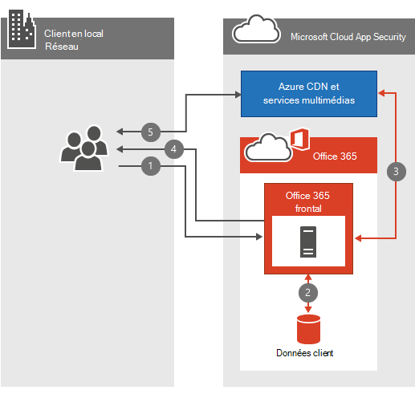

# Office 365 Video networking Frequently Asked Questions

Le référentiel Office 365 vidéo et les services de diffusion en continu rendent le stockage et la diffusion en continu de vidéos au sein de votre organisation simple. Il existe un grand nombre d’informations [sur Office 365 Vidéo](https://support.office.com/article/Find-help-about-Office-365-Video-b435f99a-f47e-4ebd-a946-f5c965844f50); Ce FAQ sur la mise en réseau est conçu pour répondre aux  questions les plus fréquentes concernant la planification de la bande passante, le chiffrement et la façon dont le service tire parti des réseaux de distribution de contenu (CDN).
  
Si vous n’avez pas déjà une connaissance approfondie de ce qui se passe lorsqu’une vidéo est téléchargée ou l vidéo, regardez cette vidéo que nous avons rassemblée, que se passe-t-il à un fichier vidéo lorsqu’il est téléchargé sur [Office 365 Vidéo](https://www.youtube.com/watch?v=HXSZ0jYBKlM).
  
## Quels sont les besoins en Office 365 bande passante vidéo ?

Il existe de nombreux [formats vidéo pris en](https://support.office.com/article/dd1af01c-fd8e-4640-b17b-93ee02b9b817) charge qui peuvent être téléchargés vers Office 365. Chaque fichier vidéo est ensuite codé dans un format standard avec plusieurs qualités vidéo différentes pour la lecture. Office 365 La vidéo utilise la diffusion en continu à débit adaptatif pour sélectionner la meilleure qualité de lecture vidéo en fonction de la bande passante réseau disponible et de la taille du lecteur vidéo. Pour ce faire, le joueur demande initialement la qualité de lecture la plus faible. Le service commence ensuite à envoyer des segments vidéo de 2 secondes au lecteur vidéo. Le joueur peut ensuite demander une qualité de lecture supérieure ou inférieure en fonction de la rapidité de livraison de chaque segment.
  
La diffusion en continu de la vitesse de transmission adaptative fait tout cela en arrière-plan pendant que la vidéo est diffusée avec le moins de perturbation ou de mise en mémoire tampon. Pendant la lecture vidéo, le lecteur vidéo permet à la visionneuse de remplacer manuellement la qualité de lecture automatique, afin de sélectionner une qualité de lecture vidéo spécifique.
  
Voici un tableau rapide qui décrit les exigences réseau pour chacune des qualités de lecture vidéo. La bande passante minimale nécessaire par personne pour lire une vidéo est de 802 Kbits/s.
  
| Qualité de lecture | Vitesse du réseau |
|:-----|:-----|
|288p    |802 Kbits/s    |
|360p    |1,2 Mbits/s    |
|576p    |2,5 Mbits/s    |
|720p    |3,8 Mbits/s    |

([De retour au premier](office-365-video-networking-faq.md)niveau )
  
## Comment les réseaux de distribution de contenu (CDN) aident-ils la lecture vidéo ?

Si plusieurs personnes de la même organisation au sein du même emplacement géographique diffuser en continu les mêmes vidéos, les CDN stockent une copie de ces vidéos dans un emplacement plus proche de cette région géographique. Une fois la vidéo stockée ou mise en cache à l’emplacement le plus proche, chaque personne diffuse la vidéo à partir de l’emplacement le plus proche au lieu d’un emplacement plus éloigné. Office 365 La vidéo utilise Azure Media Services pour gérer ce qui est mis en cache dans les CDN Azure et pendant combien de temps. Azure Media Services pouvez utiliser n’importe quel [emplacement Azure CDN pour](/azure/cdn/cdn-pop-locations) mettre en cache les fragments vidéo et les manifestes pendant quelques jours. Si les membres de votre organisation continuent à regarder les vidéos mises en cache, ils resteront dans le cache. Si personne n’accède à la vidéo pendant plusieurs jours, la vidéo sera finalement abandonnée du cache. La prochaine fois que quelqu’un essaie de regarder la vidéo, elle est de nouveau mise en cache à l’emplacement CDN plus proche.
  
Toutes les personnes qui tentent de regarder la vidéo pendant que le contenu est mis en cache dans un CDN à proximité profitent de la proximité de la vidéo et, dans la plupart des cas, moins de sauts. Cela améliore la vitesse de lecture vidéo . toutefois, cela ne modifie pas l’exigence réseau de lecture de la vidéo.
  
> [!NOTE]
> Dans certaines circonstances, telles que la limite de capacité atteinte, la vidéo peut être supprimée avant que les trois jours soient atteints.
  
([De retour au premier](office-365-video-networking-faq.md)niveau )
  
## Puis-je mettre en cache les vidéos localement pour une lecture plus rapide ?

Oui. Office 365 ne vous empêche pas d’utiliser un CDN local ou un proxy de mise en cache pour apporter du contenu vidéo ou autre Office 365 dans votre réseau local pour un accès plus rapide. Il existe plusieurs façons d’implémenter une solution de mise en cache locale sur votre réseau. La méthode la plus courante consiste à utiliser une solution proxy qui met en cache le contenu localement. Une fois qu’un proxy ou une CDN privée a mis en cache les fragments et les manifestes vidéo, les demandes futures pour les fichiers qui sont acheminés via le proxy ou les CDN privées sont extraites du cache local et ne sont pas extraites d’un emplacement Internet. Prenez en compte la bande passante réseau, la capacité et la concurrence de la lecture vidéo lors de la planification d’une solution comme celle-ci.
  
([De retour au premier](office-365-video-networking-faq.md)niveau )
  
## Comment les vidéos sont-elles chiffrées et sécurisées ?

Office 365 La vidéo sait à quel point il est important de préserver la sécurité et la privé de vos données. [Le Centre de confidentialité Microsoft](https://products.office.com/business/office-365-trust-center-welcome) décrit notre engagement en matière de confidentialité et de sécurité de votre contenu. Avec la lecture vidéo, la vitesse est importante pour une bonne expérience . toutefois, nous ne compromettons pas votre sécurité ou votre confidentialité en échange de la vitesse. Voici comment nous nous chargeons de la vitesse, de la sécurité et de la confidentialité.
  
Lorsque vous ou une personne de votre organisation téléchargez une nouvelle vidéo, cette vidéo est transcodée, chiffrée avec le chiffrement AES-128 et stockée dans Azure Media Services. Cela signifie que les vidéos sont chiffrées à la fois en transit et au repos.
  
Lorsqu’une personne de votre organisation tente de regarder une nouvelle vidéo, elle suit les étapes suivantes :
  
1. Demandez à SharePoint Online s’ils sont autorisés à afficher la vidéo.

2. SharePoint Online utilise les autorisations de fichier pour déterminer si la personne peut regarder la vidéo.

3. Si elles sont autorisées, SharePoint Online récupère un jeton d’Azure à donner au lecteur vidéo.

4. Le lecteur vidéo utilise ensuite le jeton pour demander la clé de déchiffrement à Azure.

5. Une fois la clé de déchiffrement en main, le lecteur vidéo peut diffuser la vidéo en continu.

  
([De retour au premier](office-365-video-networking-faq.md)niveau )
  
## Quelles sont les conditions requises pour lire Office 365 Vidéo ?

Office 365 Les systèmes d’exploitation et navigateurs web pris en charge par la vidéo sont les mêmes que les SharePoint en ligne requises [Office 365 système.](https://support.office.com/article/Office-365-system-requirements-719254c0-2671-4648-9c84-c6a3d4f3be45) En fonction du système d’exploitation et de la configuration du navigateur web que vous avez, vous déterminez les besoins spécifiques du lecteur vidéo. Voici plus d’informations sur les [conditions requises pour la lecture vidéo.](https://support.office.com/article/ca1cc1a9-a615-46e1-b6a3-40dbd99939a6)
  
([De retour au premier](office-365-video-networking-faq.md)niveau )
  
## Je ne peux pas obtenir Office 365 vidéo pour fonctionner, où dois-je commencer ?

La résolution des problèmes de connectivité à Office 365 Vidéo implique le dépannage de votre réseau, de vos isp(s) et de votre configuration de Office 365. Le premier endroit où commencer est le tableau de bord d’état du service. Cela vous indiquera que Office 365 vidéo a un problème ou non. Si tout s’y passe bien, voici quelques ressources supplémentaires pour vous aider.
  
- Assurez-vous que vous pouvez vous connecter aux points [de terminaison réseau requis pour Office 365 vidéo](https://support.office.com/article/Office-365-URLs-and-IP-address-ranges-8548a211-3fe7-47cb-abb1-355ea5aa88a2).

- Vérifiez votre connectivité réseau à l’aide [de notre guide Office 365 résolution des problèmes réseau.](https://support.office.com/article/Office-365-performance-tuning-and-troubleshooting-Admin-and-IT-Pro-1492cb94-bd62-43e6-b8d0-2a61ed88ebae)

- Consultez [nos meilleures pratiques d’utilisation Office 365 sur un réseau lent.](https://support.office.com/article/Best-practices-for-using-Office-365-on-a-slow-network-fd16c8d2-4799-4c39-8fd7-045f06640166)

- [Recherchez de l’aide Office 365 configuration vidéo.](https://support.office.com/article/Find-help-about-Office-365-Video-b435f99a-f47e-4ebd-a946-f5c965844f50)

([De retour au premier](office-365-video-networking-faq.md)niveau )
  
## Office 365 Ressources vidéo

Voici quelques autres ressources pour vous aider à déployer et à utiliser Office 365 Vidéo :
  
[Trouver de l’aide sur Office 365 configuration vidéo](https://support.office.com/article/Find-help-about-Office-365-Video-b435f99a-f47e-4ebd-a946-f5c965844f50)
  
[Découvrir Office 365 Vidéo](https://support.office.com/article/Meet-Office-365-Video-ca1cc1a9-a615-46e1-b6a3-40dbd99939a6)
  
[Créer et gérer un canal dans Office 365 Vidéo](https://support.office.com/article/Create-and-manage-a-channel-in-Office-365-Video-1fede4cc-13c0-435a-b585-e7fbf1c83bb2)
  
[Gérer votre portail Office 365 Video](https://support.office.com/article/Manage-your-Office-365-Video-portal-c059465b-eba9-44e1-b8c7-8ff7793ff5da)
  
[Formats vidéo qui fonctionnent dans Office 365 Vidéo](https://support.office.com/article/Video-formats-that-work-in-Office-365-Video-dd1af01c-fd8e-4640-b17b-93ee02b9b817)
  
([De retour au premier](office-365-video-networking-faq.md)niveau )
  
Voici un lien que vous pouvez utiliser pour revenir : [https://aka.ms/video365networkfaq]()