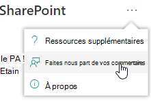
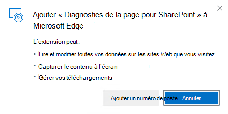
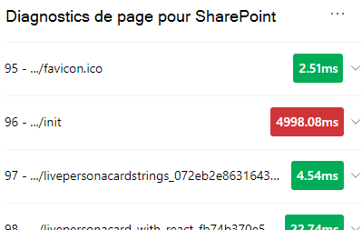
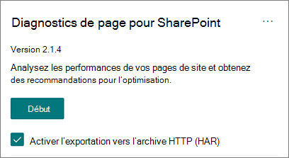

# Utiliser l’outil Diagnostic de page pour SharePoint de page

Cet article explique comment utiliser l’outil Diagnostic de page pour SharePoint pour analyser les pages de sites modernes et classiques SharePoint Online par rapport à un ensemble prédéfin défini de **critères** de performances.

L’outil Diagnostic de page SharePoint peut être installé pour :

- **Microsoft Edge** [(extension Edge)](https://microsoftedge.microsoft.com/addons/detail/ocemkolpnamjcacndljdfmhlpcaoipji)
- **Chrome** [(extension Chrome)](https://chrome.google.com/webstore/detail/inahogkhlkbkjkkaleonemeijihmfagi)

>[!TIP]
>La **version 2.0.0 et** ultérieure inclut la prise en charge des pages modernes en plus des pages de site classiques. Si vous ne savez pas quelle version de l’outil vous utilisez, vous pouvez sélectionner le lien À propos de ou les ellipses (...) pour vérifier votre version.  **Mettez toujours à jour la dernière version lors** de l’utilisation de l’outil.

L’Outil Diagnostic de page pour SharePoint est une extension de navigateur pour le nouveau Microsoft Edge (les navigateurs https://www.microsoft.com/edge) et Chrome que vous pouvez utiliser pour analyser les pages de sites de publication SharePoint classiques et les portails modernes. Cet outil fonctionne uniquement pour SharePoint Online et ne peut pas être utilisé sur SharePoint page système.

L’outil génère un rapport pour chaque page analysée montrant comment la page fonctionne par rapport à un ensemble prédéfiny de règles et affiche des informations détaillées lorsque les résultats d’un test sont en dehors de la valeur de référence. SharePoint Les administrateurs et concepteurs en ligne peuvent utiliser l’outil pour résoudre les problèmes de performances et s’assurer que les nouvelles pages sont optimisées avant la publication.

L’outil Diagnostic de page est conçu pour analyser SharePoint pages de site uniquement, et non les pages système telles que *allitems.aspx* ou *sharepoint.aspx*. Si vous tentez d’exécuter l’outil sur une page système ou une autre page non-site, vous recevrez un message d’erreur vous informant que l’outil ne peut pas être exécuté pour ce type de page.

> [!div class="mx-imgBorder"]
> 

Il ne s’agit pas d’une erreur dans l’outil, car il n’y a aucune valeur à évaluer les bibliothèques ou les pages système. Accédez à une page SharePoint site pour utiliser l’outil. Si cette erreur se produit sur une page SharePoint, vérifiez la page maître pour vous assurer que les métatags SharePoint n’ont pas été supprimés.

Pour fournir des commentaires sur l’outil, sélectionnez les ellipses dans le coin supérieur droit de l’outil, puis [sélectionnez Commentaires.](https://go.microsoft.com/fwlink/?linkid=874109)

> [!div class="mx-imgBorder"]
> 
  
## Installer l’outil Diagnostic de page pour SharePoint de recherche

La procédure d’installation de cette section fonctionne pour les navigateurs Chrome Microsoft Edge navigateurs.

> [!IMPORTANT]
> Microsoft ne lit pas les données ou le contenu de page analysés par l’outil Diagnostic de page pour SharePoint et nous ne capture pas d’informations personnelles, de site web ou de téléchargement d’informations. Les seules informations identifiables consignées dans Microsoft par l’outil sont le nom du client, le nombre de règles qui ont échoué et la date et l’heure d’utilisation de l’outil. Ces informations sont utilisées par Microsoft pour mieux comprendre les tendances d’utilisation des sites de portail et de publication modernes et les problèmes courants de performances.

1. Installez l’outil Diagnostic de page SharePoint pour **Microsoft Edge** [(extension Edge)](https://microsoftedge.microsoft.com/addons/detail/ocemkolpnamjcacndljdfmhlpcaoipji) ou **Chrome** [(extension Chrome).](https://chrome.google.com/webstore/detail/inahogkhlkbkjkkaleonemeijihmfagi) Veuillez consulter la politique de confidentialité de l’utilisateur fournie sur la page de description du Store. Lorsque vous ajoutez l’outil à votre navigateur, vous verrez l’avis d’autorisations suivant.

    > [!div class="mx-imgBorder"]
    > 

    Cette notification est en place, car une page peut contenir du contenu provenant d’emplacements en dehors de SharePoint en fonction des composants Web Parts et des personnalisations de la page. Cela signifie que l’outil lit les demandes et les réponses lorsque l’utilisateur clique sur le bouton Démarrer et uniquement pour l’onglet SharePoint sur lequel l’outil est en cours d’exécution. Ces informations sont capturées localement par le navigateur web et  sont disponibles via le bouton  Exporter vers **JSON** ou Exporter vers le har dans l’onglet Suivi réseau de l’outil. Les informations ne sont pas envoyées à Microsoft ou capturées par **Microsoft.** (L’outil respecte la politique de confidentialité Microsoft accessible [ici.)](https://go.microsoft.com/fwlink/p/?linkid=857875)

    L’autorisation Gérer _vos téléchargements_ couvre l’utilisation de la fonctionnalité **Exporter vers JSON** de l’outil. Suivez les instructions de confidentialité de votre entreprise avant de partager le fichier JSON en dehors de votre organisation, car les résultats contiennent des URL et peuvent être classés en tant qu’informations personnelles d’identification personnelle.
1. Si vous souhaitez utiliser l’outil en mode Incognito ou InPrivate, suivez la procédure pour votre navigateur :
    1. Dans Microsoft Edge, accédez à **Extensions** ou tapez _edge://extensions_ dans la barre d’URL et **sélectionnez Détails** pour l’extension. Dans les paramètres d’extension, cochez la case pour **autoriser inPrivate**.
    1. Dans Chrome, accédez à **Extensions** ou tapez _chrome://extensions_ dans la barre d’URL et **sélectionnez Détails** de l’extension. Dans les paramètres d’extension, sélectionnez le curseur pour **autoriser incognito**.
1. Accédez à la page SharePoint site web sur SharePoint Online que vous souhaitez consulter. Nous avons autorisé le « chargement différé » des éléments sur les pages ; par conséquent, l’outil ne s’arrête pas automatiquement (il s’agit par conception de prendre en charge tous les scénarios de chargement de page). Pour arrêter la collecte, sélectionnez **Arrêter.** Assurez-vous que le chargement de la page est terminé avant d’arrêter la collecte de données ou que vous ne capturez qu’un suivi partiel.
1. Cliquez sur le bouton de barre d’outils de l’extension  pour charger l’outil, la fenêtre d’extension suivante apparaît :

    

Sélectionnez **Démarrer** pour commencer à collecter des données pour analyse.

## Ce que vous verrez dans l’outil Diagnostic de page SharePoint page

1. Cliquez sur les ellipses (...) dans le coin supérieur droit de l’outil pour trouver les liens suivants :
   1. Le **lien Ressources supplémentaires** fournit des instructions générales et des détails sur l’outil, y compris un lien vers cet article.
   1. Le **lien Donner des** commentaires fournit un lien vers le site SharePoint sites et collaboration de la voix de _l’utilisateur._
   1. Le **lien À** propos inclut la version actuellement installée de l’outil et un lien direct vers l’avis tiers de l’outil.  
1. **L’ID de corrélation, SPRequestDuration, SPIISLatency,** le temps de chargement de page et les détails de l’URL sont des informations et peuvent être utilisés à quelques fins.  

    > [!div class="mx-imgBorder"]
    > 

   - **CorrelationID est** un élément important lorsque vous travaillez avec le Support Microsoft, car il leur permet de collecter des données de diagnostic supplémentaires pour la page spécifique.
   - **SPRequestDuration est** le temps qu’il faut SharePoint pour traiter la page. La navigation structurelle, les images de grande taille, de nombreux appels d’API peuvent tous contribuer à des durées plus longues.
   - **SPIISLatency est le** temps en millisecondes pris pour que SharePoint Online commence à charger la page. Cette valeur n’inclut pas le temps de réponse de l’application web.
   - **Le temps de chargement de** la page est la durée totale enregistrée par la page entre l’heure de la demande et l’heure de réception et de rendu de la réponse dans le navigateur. Cette valeur est affectée par divers facteurs, notamment la latence du réseau, les performances de l’ordinateur et le temps qu’il faut au navigateur pour charger la page.
   - **L’URL de page** (Uniform Resource Locator) est l’adresse web de la page actuelle.

1. [**L’onglet Tests de diagnostic**](#how-to-use-the-diagnostic-tests-tab) affiche les résultats de l’analyse dans trois catégories . **Aucune action requise,** **possibilités d’amélioration** et **attention requise.** Chaque résultat de test est représenté par un élément dans l’une de ces catégories, comme décrit dans le tableau suivant :

    |Catégorie  |Couleur  |Description  |
    |---------|---------|---------|
    |**Attention requise** |Rouge |Le résultat du test se situe en dehors de la valeur de référence et affecte les performances de la page. Suivez les instructions de correction.|
    |**Possibilités d’amélioration** |Jaune |Les résultats du test ne sont pas au-delà de la valeur de référence et peuvent contribuer à des problèmes de performances. Des critères spécifiques au test peuvent s’appliquer.|
    |**Aucune action n'est requise** |Vert |Le résultat du test se situe dans la valeur de référence du test.|

    > [!div class="mx-imgBorder"]
    > 

1. Un [**onglet Suivi réseau**](#how-to-use-the-network-trace-tab-and-how-to-export-a-har-file) fournit des détails sur les demandes et réponses de build de page.

## Utilisation de l’onglet Tests de diagnostic

Lorsque vous analysez une page de portail moderne SharePoint ou une page de site de publication classique à l’aide de l’outil Diagnostics de page pour SharePoint, les résultats sont analysés à l’aide de règles prédéfines qui comparent les résultats aux valeurs de référence et s’affichent dans l’onglet Tests de **diagnostic.** Les règles de certains tests peuvent utiliser des valeurs de référence différentes pour les sites de publication classiques et les portails modernes en fonction des différences de caractéristiques de performances spécifiques entre les deux.

Les résultats des  tests qui apparaissent dans les catégories Opportunités d’amélioration ou **Attention** requise indiquent les domaines qui doivent être examinés par rapport aux pratiques recommandées et peuvent être sélectionnés pour afficher des informations supplémentaires sur le résultat. Les détails de  chaque élément incluent un lien En savoir plus qui vous dirigera directement vers les instructions appropriées relatives au test. Les résultats des tests qui apparaissent dans la catégorie Aucune **action requise** indiquent la conformité avec la règle pertinente et n’affichent pas de détails supplémentaires lorsqu’ils sont sélectionnés.

Les informations de l’onglet Tests de diagnostics ne vous indiquent pas comment concevoir des pages, mais mettent en évidence les facteurs qui peuvent avoir un impact sur les performances des pages. Certaines fonctionnalités et personnalisations de page ont un impact inévitable sur les performances de la page et doivent être examinées pour des corrections ou des omissions potentielles de la page si leur impact est considérable.

Les résultats en rouge ou en jaune peuvent également indiquer des composants Web Parts qui actualisent les données trop fréquemment. Par exemple, les actualités d’entreprise ne sont pas mises à jour toutes les secondes, mais les composants Web Parts personnalisés sont souvent conçus pour extraire les dernières actualités toutes les secondes au lieu d’implémenter des éléments de mise en cache qui pourraient améliorer l’expérience utilisateur globale. N’oubliez pas, lorsque vous insévaluez des composants Web Parts sur une page, qu’il existe souvent des moyens simples de réduire leur impact sur les performances en évaluant la valeur de chaque paramètre disponible afin de vous assurer qu’elle est définie correctement pour son objectif.

>[!NOTE]
>Les sites d’équipe classiques dont la fonctionnalité de publication n’est pas activée ne peuvent pas utiliser de CDN. Lorsque vous exécutez l’outil sur ces sites, le test CDN est censé échouer et peut être ignoré, mais tous les tests restants sont applicables. Les fonctionnalités supplémentaires de la fonctionnalité de publication SharePoint peuvent augmenter le temps de chargement des pages, de sorte qu’elle ne doit pas être activée uniquement pour autoriser CDN fonctionnalité.

>[!IMPORTANT]
>Les règles de test sont ajoutées et mises à jour régulièrement. Pour plus d’informations sur les règles actuelles et les informations spécifiques incluses dans les résultats des tests, reportez-vous à la dernière version de l’outil. Vous pouvez vérifier la version en gérant vos extensions et l’extension vous indiquera si une mise à jour est disponible.

## Utilisation de l’onglet Suivi réseau et exportation d’un fichier HAR

**L’onglet Suivi** réseau fournit des informations détaillées sur les demandes de construction de la page et les réponses reçues de SharePoint.

1. **Recherchez les temps de chargement des éléments marqués en rouge.** Chaque requête et réponse est codée en couleur pour indiquer son impact sur les performances globales de la page à l’aide des mesures de latence suivantes :
    - Vert : \< 500 ms
    - Jaune : 500-1000 ms
    - Rouge : \> 1000 ms

    > [!div class="mx-imgBorder"]
    > 

    Dans l’image ci-dessus, l’élément rouge se rapporte à la page par défaut. Elle s’affiche toujours en rouge, sauf si la page se charge \< en 1000 ms (moins d’une seconde).

2. **Temps de chargement des éléments de test.** Dans certains cas, il n’y aura aucun indicateur de temps ou de couleur, car les éléments ont déjà été mis en cache par le navigateur. Pour le tester correctement, ouvrez la page,  ouvrez le cache du navigateur, puis cliquez sur Démarrer car cela forcera un chargement de page « à froid » et sera une véritable réflexion du chargement initial de la page. Il doit ensuite être comparé au chargement de page « chaud », car cela vous aidera également à déterminer quels éléments sont mis en cache sur la page.

3. **Partagez des détails pertinents avec d’autres personnes qui peuvent vous aider à examiner les problèmes.** Pour partager les détails ou les informations fournis dans l’outil avec vos développeurs ou une personne du support technique, l’approche recommandée consiste à utiliser l’outil Activer l’exportation vers l’archive **HTTP ( HAR).** 

   > [!div class="mx-imgBorder"]
   > 

Ce paramètre doit être activé avant de cliquer sur Démarrer, ce qui active ensuite le mode débogage dans votre navigateur. Il génère un fichier d’archive HTTP (HAR) qui est ensuite accessible via l’onglet « Trace réseau ». Cliquez sur « Exporter vers har » pour télécharger le fichier sur votre ordinateur, puis vous pouvez le partager en conséquence. Le fichier peut être ouvert dans divers outils de débogage, tels que F12 Developer Tools et Fiddler.

> [!div class="mx-imgBorder"]
> 

> [!IMPORTANT]
> Ces résultats contiennent des URL qui peuvent être classées en tant qu’informations d’identification personnelle (PiI). Veillez à suivre les instructions de votre organisation avant de distribuer ces informations.

## Impliquer le support Microsoft

Nous avons inclus une fonctionnalité **de niveau support Microsoft** qui ne doit être utilisée que lorsque vous travaillez directement sur un dossier de support. L’utilisation de cette fonctionnalité n’offre aucun avantage en cas d’utilisation sans engagement de l’équipe de prise en charge et peut ralentir considérablement la page. Il n’existe aucune information supplémentaire lors de l’utilisation de cette fonctionnalité dans l’outil, car les informations supplémentaires sont ajoutées à la journalisation dans le service.

Aucune modification n’est visible, sauf que vous serez averti que vous l’avez activée et que les performances de votre page seront considérablement dégradées de 2 à 3 fois plus lents. Elle ne sera pertinente que pour la page particulière et la session active. Pour cette raison, il doit être utilisé avec parcimonie et uniquement en cas de prise en charge active.

### Pour activer la fonctionnalité de niveau support Microsoft

1. Ouvrez l’outil Diagnostic de page SharePoint page.
2. Sur votre clavier, appuyez **sur ALT-Shift-L**. La case à cocher Activer **la journalisation de prise en** charge s’affiche.
3. Cochez la case, puis cliquez sur **Démarrer** pour recharger la page et générer une journalisation détaillée.

   > [!div class="mx-imgBorder"]
   > 
  
    Notez le CorrelationID (affiché en haut de l’outil) et fournissez-le à votre représentant du support technique pour lui permettre de recueillir des informations supplémentaires sur la session de diagnostic.

## Voir aussi

[Optimisation des performances SharePoint Online](tune-sharepoint-online-performance.md)

[Optimisation des performances Office 365](tune-microsoft-365-performance.md)

[Performances offertes par l’expérience moderne de SharePoint](/sharepoint/modern-experience-performance)

[Réseaux de distribution de contenu](content-delivery-networks.md)

[Utilisation du réseau de distribution de contenu Office 365 avec SharePoint Online](use-microsoft-365-cdn-with-spo.md)