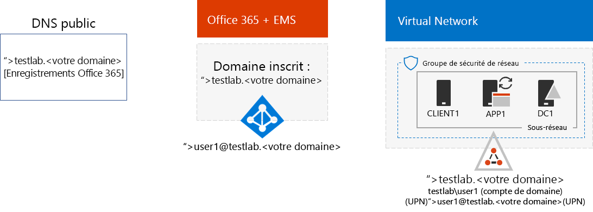
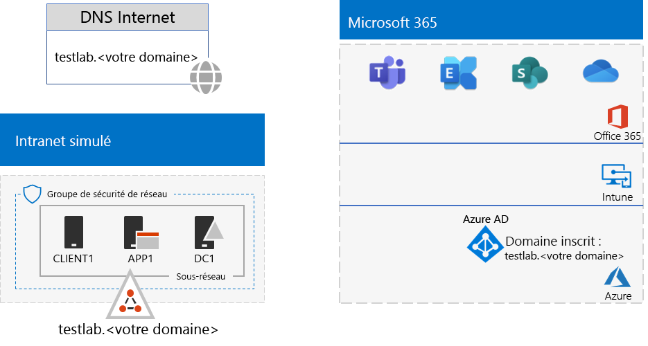

# <a name="password-hash-synchronization-for-your-microsoft-365-test-environment"></a>Synchronisation de hachage de mot de passe pour votre environnement de test Microsoft 365

De nombreuses organisations utilisent Azure AD Connect et le mot de passe hachage de synchronisation d’annuaires pour synchroniser l’ensemble de comptes dans leur forêt Active Directory Domain Services (AD DS) en local à l’ensemble de comptes dans le client Azure AD de leur abonnement Office 365 et EMS E5 . Cet article explique comment vous pouvez ajouter DirSync avec la synchronisation de mot de passe à l’environnement de développement/test Microsoft 365, ce qui entraîne la configuration suivante:
  

  
Les deux phases de configuration de cet environnement de test sont les suivantes :
  
1. Créez l’environnement de test de l’entreprise simulée pour Microsoft 365.
2. Installez et configurez Azure AD Connect sur APP1.
    
> [!TIP]
> Cliquez [ici](https://aka.ms/m365etlgstack) pour afficher le plan de tous les articles de l’ensemble de guides de laboratoire de test de Microsoft 365 Entreprise.
  
## <a name="phase-1-create-the-microsoft-365-simulated-enterprise-test-environment"></a>Phase 1 : création de l’environnement de test de l’entreprise simulée pour Microsoft 365

Suivez les instructions fournies dans l’article [Configuration de base d’une entreprise simulée](simulated-ent-base-configuration-microsoft-365-enterprise.md). Voici la configuration que vous obtenez.
  

  
Cette configuration se compose des éléments suivants :  
  
- Les abonnements à la version payante ou d’évaluation Office 365 E5 et EMS E5.
- Un intranet d’organisation simplifié connecté à Internet, qui se compose des machines virtuelles DC1, APP1 et CLIENT1 sur un sous-réseau d’un réseau virtuel Azure. DC1 est un contrôleur de domaine pour le testlab. \<votre nom de domaine public > domaine Active Directory Domain Services (AD DS).

## <a name="phase-2-create-and-register-the-testlab-domain"></a>Phase 2 : création et enregistrement du domaine testlab

Durant cette phase, vous allez créer un domaine DNS public et l’ajouter à votre abonnement.

Tout d’abord, utilisez votre fournisseur d’enregistrement DNS public pour créer un nom de domaine DNS public en fonction de votre nom de domaine actuel et ajoutez-le à votre abonnement Office 365. Nous vous recommandons d’utiliser le nom **testlab.**\<votre domaine public>. Par exemple, si votre nom de domaine public est <span>**contoso</span>.com**, ajoutez le nom de domaine public **<span>testlab</span>.contoso.com**.
  
Vous pouvez ensuite ajouter les **testlab.**\<votre domaine public > domaine à votre abonnement Office 365 d’évaluation ou payant par le biais le processus d’inscription domaine. Cela se compose de l’ajout d’autres enregistrements DNS pour le **testlab.** \<votre domaine public > domaine. Pour plus d’informations sur ce processus, voir [Ajouter vos utilisateurs et votre domaine à Office 365](https://support.office.com/article/Add-users-and-domain-to-Office-365-6383f56d-3d09-4dcb-9b41-b5f5a5efd611). 

Voici la configuration finale.
  

  
Cette configuration se compose des éléments suivants : 

- Les abonnements à la version payante ou d’évaluation Office 365 E5 et EMS E5 avec le domaine DNS TESTLAB.\<votre nom de domaine> enregistré.
- Un intranet d’organisation simplifié connecté à Internet, qui se compose des machines virtuelles DC1, APP1 et CLIENT1 sur un sous-réseau d’un réseau virtuel Azure.

Notez comment se présente le domaine testlab.\<votre nom de domaine public> :

- Il est pris en charge par les enregistrements DNS publics.
- Il est enregistré dans vos abonnements Office 365 et EMS.
- Le domaine Windows Server AD se trouve sur votre intranet simulé.
     
## <a name="phase-3-install-azure-ad-connect-on-app1"></a>Phase 3 : installation d’Azure AD Connect sur APP1

Durant cette phase, vous allez installer et configurer l’outil Azure AD Connect sur APP1, puis vérifier son fonctionnement.
  
Tout d’abord, installez et configurez Azure AD Connect sur APP1.

1. Dans le [portail Azure](https://portal.azure.com), connectez-vous avec votre compte d’administrateur général, puis connectez-vous à APP1 avec le compte TESTLAB\\Utilisateur1.
    
2. Sur le bureau d’APP1, ouvrez une invite de commandes Windows PowerShell de niveau administrateur, puis exécutez les commandes suivantes :
    
   ```
   Set-ItemProperty -Path "HKLM:\SOFTWARE\Microsoft\Active Setup\Installed Components\{A509B1A7-37EF-4b3f-8CFC-4F3A74704073}" -Name "IsInstalled" -Value 0
   Set-ItemProperty -Path "HKLM:\SOFTWARE\Microsoft\Active Setup\Installed Components\{A509B1A8-37EF-4b3f-8CFC-4F3A74704073}" -Name "IsInstalled" -Value 0
   Stop-Process -Name Explorer -Force
   ```

3. Dans la barre des tâches, cliquez sur **Internet Explorer** et accédez à [https://aka.ms/aadconnect](https://aka.ms/aadconnect).
    
4. Sur la page de Microsoft Azure Active Directory Connect, cliquez sur **Télécharger**, puis cliquez sur **Exécuter**.
    
5. Sur la page **Bienvenue dans Azure AD Connect**, cliquez sur **J’accepte**, puis sur **Continuer**.
    
6. Sur la page **Configuration rapide**, cliquez sur **Utiliser la configuration rapide**.
    
7. Sur la page **Connexion à Azure AD**, tapez le nom de votre compte d’administrateur général Office 365 sous **Nom d’utilisateur** et le mot de passe correspondant sous **Mot de passe**, puis cliquez sur **Suivant**.
    
8. Sur la page **Connexion à AD DS**, tapez **TESTLAB\\Utilisateur1** sous **Nom d’utilisateur**, tapez le mot de passe correspondant sous **Mot de passe**, puis cliquez sur **Suivant**.
    
9. Sur la page **Prêt à configurer**, cliquez sur **Installer**.
    
10. Sur la page **Configuration terminée**, cliquez sur **Quitter**.
    
11. Dans Internet Explorer, accédez au portail Office ([https://office.com](https://office.com)).
    
12. Sur la page principale du portail, cliquez sur **Administrateur**.
    
13. Dans la navigation de gauche, cliquez sur **Utilisateurs > Utilisateurs actifs**.
    
    Notez le compte nommé **Utilisateur 1**. Ce compte provient du domaine TESTLAB AD DS et prouve que la synchronisation d’annuaires a fonctionné.
    
14. Cliquez sur le compte **Utilisateur1**. Pour les licences de produits, cliquez sur **Modifier**.
    
15. Dans **Licences de produits**, sélectionnez votre pays, puis cliquez sur le contrôle **Inactif** pour **Office 365 Entreprise E5** (en le définissant sur **Actif**). Faites de même avec la licence **Enterprise Mobility + Security E5**. 

16. Cliquez sur **Enregistrer** en bas de la page, puis sur **Fermer**.
    
Ensuite, vérifiez si vous pouvez vous connecter à votre abonnement Office 365 avec le <strong>nom d’utilisateur utilisateur1@testlab.</strong>\<votre nom de domaine> du compte Utilisateur1.

1. Dans APP1, déconnectez-vous d’Office 365, puis reconnectez-vous avec un autre compte.

2. Quand vous êtes invité à saisir le nom d’utilisateur et le mot de passe, indiquez <strong>utilisateur1@testlab.</strong>\<votre nom de domaine> et le mot de passe de l’Utilisateur1. Vous serez connecté en tant qu’Utilisateur1. 
 
Notez que même si les utilisateurs User1 disposent des autorisations d’administrateur de domaine pour le domaine TESTLAB AD DS, il n’est pas un administrateur général pour Office 365. Par conséquent, vous ne verrez pas l’icône**Administrateur**comme une option. 

Voici la configuration finale.


Cette configuration se compose des éléments suivants :  
  
- Les abonnements à la version payante ou d’évaluation Office 365 E5 et EMS E5 avec le domaine DNS TESTLAB.\<votre nom de domaine> enregistré.
- Un intranet d’organisation simplifié connecté à Internet, qui se compose des machines virtuelles DC1, APP1 et CLIENT1 sur un sous-réseau d’un réseau virtuel Azure. Azure AD Connect s’exécute sur APP1 pour synchroniser le domaine TESTLAB AD DS avec le client Azure AD, le client de vos abonnements Office 365 et EMS E5.
- Le compte Utilisateur1 dans le domaine TESTLAB  AD DS a été synchronisé avec le client Azure AD.

## <a name="next-step"></a>Étape suivante

Explorez les autres fonctionnalités liées aux [identités](m365-enterprise-test-lab-guides.md#identity) disponibles dans votre environnement de test.

## <a name="see-also"></a>Voir aussi

[Guides de laboratoire de test Microsoft 365 Entreprise](m365-enterprise-test-lab-guides.md)

[Déployer Microsoft 365 Entreprise](deploy-microsoft-365-enterprise.md)

[Documentation Microsoft 365 Entreprise](https://docs.microsoft.com/microsoft-365-enterprise/)


