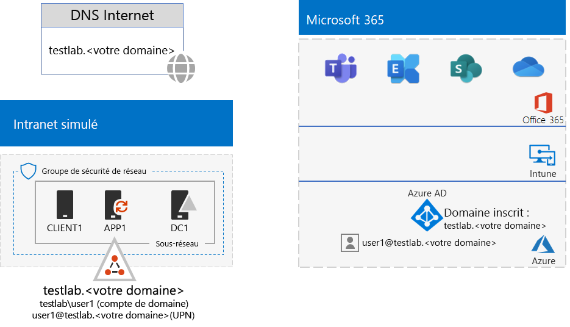

# <a name="password-hash-synchronization-for-your-microsoft-365-test-environment"></a>Synchronisation de hachage de mot de passe pour votre environnement de test Microsoft 365

*Ce Guide de Laboratoire Test peut être utilisé pour les environnements de test Microsoft 365 Entreprise et Office 365 Entreprise*.

De nombreuses organisations utilisent Azure AD Connect et la synchronisation de hachage de mot de passe pour synchroniser l’ensemble de comptes dans leur forêt Active Directory Domain Services (AD DS) en local avec l’ensemble des comptes dans le client Azure AD de leur abonnement Microsoft 365. Cet article explique comment vous pouvez ajouter DirSync avec la synchronisation de mot de passe à l’environnement de développement/test Microsoft 365, ce qui entraîne la configuration suivante:
  

  
Les deux phases de configuration de cet environnement de test sont les suivantes :
  
1. Créez l’environnement de test de l’entreprise simulée pour Microsoft 365.
2. Installez et configurez Azure AD Connect sur APP1.
    
> [!TIP]
> Accédez au [Guide de laboratoire de laboratoire de test Microsoft 365 Entreprise](../media/m365-enterprise-test-lab-guides/Microsoft365EnterpriseTLGStack.pdf) d’une carte visuelle à tous les Articles de la pile de guides de laboratoires de test Microsoft 365 Enterprise.
  
## <a name="phase-1-create-the-microsoft-365-simulated-enterprise-test-environment"></a>Phase 1 : création de l’environnement de test de l’entreprise simulée pour Microsoft 365

Suivez les instructions fournies dans l’article [Configuration de base d’une entreprise simulée](simulated-ent-base-configuration-microsoft-365-enterprise.md). Voici la configuration que vous obtenez.
  

  
Cette configuration se compose des éléments suivants :  
  
- Un abonnement d’évaluation ou payant Microsoft 365 E5 ou Office 365 E5.
- Un intranet d’organisation simplifié connecté à Internet, qui se compose des machines virtuelles DC1, APP1 et CLIENT1 sur un sous-réseau d’un réseau virtuel Azure. DC1 est un contrôleur de domaine pour le domaine testlab.\<your public domain name> AD DS.

## <a name="phase-2-create-and-register-the-testlab-domain"></a>Phase 2 : création et enregistrement du domaine testlab

Durant cette phase, vous allez créer un domaine DNS public et l’ajouter à votre abonnement.

Tout d’abord, travaillez avec votre fournisseur d’inscription DNS public pour créer un nom de domaine DNS public basé sur votre nom de domaine actuel et ajoutez-le à votre abonnement. Nous vous recommandons d’utiliser le nom **testlab.**\<your public domain>. Par exemple, si votre nom de domaine public est **<span>contoso</span>.com**, ajoutez le nom de domaine public testlab.contoso.com.Par exemple, si votre nom de domaine public est contoso.com, ajoutez le nom de domaine public **<span>testlab</span>.contoso.com**.
  
Vous devez ensuite ajouter le domaine **testlab.**\<your public domain> à votre abonnement Microsoft 365 ou Office 365 d’évaluation ou payant par le biais du processus d’inscription domaine. Cela se compose de l’ajout d’autres enregistrements DNS pour le domaine **testlab.** \<your public domain> . Pour plus d’informations sur ce processus, voir [Ajouter un domaine à Office 365](https://docs.microsoft.com/office365/admin/setup/add-domain). 

Voici la configuration finale.
  

  
Cette configuration se compose des éléments suivants : 

- Les abonnements en version payante ou d’évaluation Microsoft 365 E5 et Office 365 E5 avec le domaine DNS testlab.\<your public domain name> Inscrit(e).
- Un intranet d’organisation simplifié connecté à Internet, qui se compose des machines virtuelles DC1, APP1 et CLIENT1 sur un sous-réseau d’un réseau virtuel Azure.

Notez comment le testlab.\<your public domain name> est désormais :

- Il est pris en charge par les enregistrements DNS publics.
- Enregistré dans vos abonnements Microsoft 365.
- Le domaine Windows Server AD se trouve sur votre intranet simulé.
     
## <a name="phase-3-install-azure-ad-connect-on-app1"></a>Phase 3 : installation d’Azure AD Connect sur APP1

Durant cette phase, vous allez installer et configurer l’outil Azure AD Connect sur APP1, puis vérifier son fonctionnement.
  
Tout d’abord, installez et configurez Azure AD Connect sur APP1.

1. Dans le [portail Azure](https://portal.azure.com), connectez-vous avec votre compte d’administrateur général, puis connectez-vous à APP1 avec le compte TESTLAB\\Utilisateur1.
    
2. Sur le bureau d’APP1, ouvrez une invite de commandes Windows PowerShell de niveau administrateur, puis exécutez les commandes suivantes pour désactiver la sécurité renforcée d’Internet Explorer :
    
   ```powershell
   Set-ItemProperty -Path "HKLM:\SOFTWARE\Microsoft\Active Setup\Installed Components\{A509B1A7-37EF-4b3f-8CFC-4F3A74704073}" -Name "IsInstalled" -Value 0
   Set-ItemProperty -Path "HKLM:\SOFTWARE\Microsoft\Active Setup\Installed Components\{A509B1A8-37EF-4b3f-8CFC-4F3A74704073}" -Name "IsInstalled" -Value 0
   Stop-Process -Name Explorer -Force
   ```

3. Dans la barre des tâches, cliquez sur **Internet Explorer** et accédez à [https://aka.ms/aadconnect](https://aka.ms/aadconnect).
    
4. Sur la page de Microsoft Azure Active Directory Connect, cliquez sur **Télécharger**, puis cliquez sur **Exécuter**.
    
5. Sur la page **Bienvenue dans Azure AD Connect**, cliquez sur **J’accepte**, puis sur **Continuer**.
    
6. Sur la page **Configuration rapide**, cliquez sur **Utiliser la configuration rapide**.
    
7. Sur la page **Connexion à Azure AD**, saisissez le nom de votre compte d’administrateur général sous **Nom d’utilisateur** et le mot de passe correspondant sous **Mot de passe**, puis cliquez sur **Suivant**.
    
8. Sur la page **Connexion à AD DS**, tapez **TESTLAB\\Utilisateur1** sous **Nom d’utilisateur**, tapez le mot de passe correspondant sous **Mot de passe**, puis cliquez sur **Suivant**.
    
9. Sur la page **Prêt à configurer**, cliquez sur **Installer**.
    
10. Sur la page **Configuration terminée**, cliquez sur **Quitter**.
    
11. Dans Internet Explorer, accédez au Centre d’administration Microsoft 365 ([https://portal.microsoft.com](https://portal.microsoft.com)).
    
12. Dans la navigation de gauche, cliquez sur **Utilisateurs > Utilisateurs actifs**.
    
    Notez le compte nommé **Utilisateur 1**. Ce compte provient du domaine TESTLAB AD DS et prouve que la synchronisation d’annuaires a fonctionné.
    
13. Cliquez sur le compte **utilisateur1**, puis cliquez sur **Licences et applications**.
    
14. Dans **Licences de produits**, sélectionnez votre lieu (le cas échéant), désactivez la licence **Office 365 E5** et activez la licence **Microsoft 365 E5**. 

15. Cliquez sur **Enregistrer** en bas de la page, puis sur **Fermer**.
    
Ensuite, vérifiez si vous pouvez vous connecter à votre abonnement avec le nom d’utilisateur <strong>user1@testlab.</strong>\<your domain name> nom d’utilisateur du compte utilisateur1.

1. Dans APP1, déconnectez-vous, puis reconnectez-vous avec un compte différent.

2. Quand vous êtes invité à saisir le nom d’utilisateur et le mot de passe, indiquez <strong>utilisateur1@testlab.</strong>\<your domain name> et le mot de passe utilisateur1. Vous devez correctement vous connecter en tant qu’ Utilisateur1. 
 
Veuillez noter que même si l’utilisateur User1 dispose des autorisations d’administrateur pour le domaine TESTLAB AD DS, il n’est pas un administrateur général. Par conséquent, vous ne verrez pas l’icône**Administrateur**comme une option. 

Voici la configuration finale.


Cette configuration se compose des éléments suivants :  
  
- Les abonnements en version payante ou d’évaluation Microsoft 365 E5 et Office 365 E5 avec le domaine DNS TESTLAB.\<your domain name> Inscrit(e).
- Un intranet d’organisation simplifié connecté à Internet, qui se compose des machines virtuelles DC1, APP1 et CLIENT1 sur un sous-réseau d’un réseau virtuel Azure. Azure AD Connect s’exécute sur APP1 pour synchroniser le domaine TESTLAB AD DS avec le client Azure AD de votre abonnement Microsoft 365 de manière périodique.
- Le compte Utilisateur1 dans le domaine TESTLAB  AD DS a été synchronisé avec le client Azure AD.

## <a name="next-step"></a>Étape suivante

Explorez les autres fonctionnalités liées aux [identités](m365-enterprise-test-lab-guides.md#identity) disponibles dans votre environnement de test.

## <a name="see-also"></a>Voir aussi

[Guides de laboratoire de test Microsoft 365 Entreprise](m365-enterprise-test-lab-guides.md)

[Déployer Microsoft 365 Entreprise](deploy-microsoft-365-enterprise.md)

[Documentation Microsoft 365 Entreprise](https://docs.microsoft.com/microsoft-365-enterprise/)


