# <a name="performance-troubleshooting-plan-for-office-365"></a>Plan de résolution des problèmes de performances pour Office 365

Devez-vous connaître les étapes à suivre pour identifier et corriger les retards, les blocages et les performances lentes entre SharePoint Online, OneDrive Entreprise, Exchange Online ou Skype Entreprise Online et votre ordinateur client ? Avant d’appeler le support, cet article peut vous aider à résoudre Office 365 problèmes de performances et même à résoudre certains des problèmes les plus courants.

Cet article est en fait un exemple de plan d’action que vous pouvez utiliser pour capturer des données précieuses sur votre problème de performances au fur et à mesure qu’il se produit. Certains des principaux problèmes sont également inclus dans cet article.

Si vous débutez avec les performances du réseau et que vous souhaitez établir un plan à long terme pour surveiller les performances entre vos machines clientes et Office 365, jetez un coup d’œil à [Office 365 réglage des performances et à la résolution des problèmes - Administrateur et Pro informatique](performance-tuning-using-baselines-and-history.md).

## <a name="sample-performance-troubleshooting-action-plan"></a>Exemple de plan d’action de résolution des problèmes de performances

Ce plan d’action contient deux parties : une phase de préparation et une phase de journalisation. Si vous rencontrez un problème de performances et que vous devez effectuer la collecte de données, vous pouvez commencer à utiliser ce plan immédiatement.

### <a name="prepare-the-client-computer"></a>Préparer l’ordinateur client

- Recherchez un ordinateur client capable de reproduire le problème de performances. Cet ordinateur sera utilisé lors de la résolution des problèmes.
- Notez les étapes qui provoquent le problème de performances afin que vous soyez prêt quand vient le temps de tester.
- Installez des outils pour collecter et enregistrer des informations :
  - Installez [Netmon 3.4](https://www.microsoft.com/download/details.aspx?id=4865) (ou utilisez un outil de suivi réseau équivalent).
  - Installez l’édition basic gratuite de [HTTPWatch](https://www.httpwatch.com/download/) (ou utilisez un outil de suivi réseau équivalent).
  - Utilisez un enregistreur d’écran ou exécutez l’enregistreur d’étapes (PSR.exe) fourni avec Windows Vista et versions ultérieures, afin de conserver un enregistrement des étapes que vous effectuez pendant le test.

### <a name="log-the-performance-issue"></a>Consigner le problème de performances

- Fermez tous les navigateurs Internet superflus.
- Démarrez l’enregistreur d’étapes ou un autre enregistreur d’écran.
- Démarrez votre capture Netmon (ou outil de suivi réseau).
- Effacez votre cache DNS sur l’ordinateur client de la ligne de commande en tapant ipconfig /flushdns.
- Démarrez une nouvelle session de navigateur et activez HTTPWatch.
- Facultatif : si vous testez Exchange Online, exécutez l’outil Analyseur de performances client Exchange à partir de la console d’administration Office 365.
- Reproduisez les étapes exactes à l’origine du problème de performances.
- Arrêtez la trace de votre Netmon ou d’un autre outil.
- Sur la ligne de commande, exécutez un itinéraire de trace vers votre abonnement Office 365 en tapant la commande suivante, puis en appuyant sur Entrée :

  ``` cmd
  tracert <subscriptionname>.onmicrosoft.com
  ```

- Arrêtez l’enregistreur d’étapes et enregistrez la vidéo. Veillez à inclure la date et l’heure de la capture et à indiquer si elle montre de bonnes ou de mauvaises performances.
- Enregistrez les fichiers de trace. Là encore, veillez à inclure la date et l’heure de la capture et s’il présente des performances correctes ou incorrectes.

Si vous n’êtes pas familiarisé avec l’exécution des outils mentionnés dans cet article, ne vous inquiétez pas, car nous vous fournissons ensuite ces étapes. Si vous êtes habitué à effectuer ce type de capture réseau, vous pouvez passer [à La collecte des bases de référence](performance-tuning-using-baselines-and-history.md#how-to-collect-baselines), qui décrit le filtrage et la lecture des journaux d’activité.

### <a name="flush-the-dns-cache-first"></a>Vider d’abord le cache DNS

Pourquoi ? En vidant le cache DNS, vous démarrez vos tests avec une nouvelle ardoise. En désactivant le cache, vous réinitialisez le contenu du programme de résolution DNS aux entrées les plus récentes. N’oubliez pas qu’un vidage ne supprime pas les entrées de fichier HOST. Si vous utilisez intensivement les entrées de fichier HOST, vous devez copier ces entrées dans un fichier d’un autre répertoire, puis vider le fichier HOST.

#### <a name="flush-your-dns-resolver-cache"></a>Vider le cache de votre programme de résolution DNS

1. Ouvrez l’invite de commandes (**commande** **Démarrer** \> **l’exécution** \> ou Windows **cmd** **de clé**\>).
2. Tapez la commande suivante, puis appuyez sur Entrée :

    ``` cmd
    ipconfig /flushdns
    ```

## <a name="netmon"></a>Netmon

L’outil de surveillance réseau ([Netmon](https://www.microsoft.com/download/details.aspx?id=4865)) de Microsoft analyse les paquets, c’est-à-dire le trafic, qui passent entre les ordinateurs sur les réseaux. En utilisant Netmon pour suivre le trafic avec Office 365 vous pouvez capturer, afficher et lire les en-têtes de paquets, identifier les appareils intervenants, vérifier les paramètres importants sur le matériel réseau, rechercher les paquets supprimés et suivre le flux de trafic entre les ordinateurs de votre réseau d’entreprise et Office 365. Étant donné que le corps réel du trafic est chiffré, c’est-à-dire qu’il (se déplace sur le port 443 via SSL/TLS, vous ne pouvez pas lire les fichiers envoyés. Au lieu de cela, vous obtenez une trace non filtrée du chemin d’accès que le paquet prend, ce qui peut vous aider à suivre le comportement du problème.

Veillez à ne pas appliquer de filtre pour l’instant. Au lieu de cela, exécutez les étapes et illustrez le problème avant d’arrêter la trace et d’enregistrer.

Après avoir installé Netmon 3.4, ouvrez l’outil et procédez comme suit :

### <a name="take-a-netmon-trace-and-reproduce-the-issue"></a>Effectuer une trace Netmon et reproduire le problème

1. Lancez Netmon 3.4.
La page **De démarrage** comprend trois **volets : Captures récentes**, **Sélectionner des réseaux** et **Prise en main avec Microsoft Network Monitor 3.4. Notez**. Le panneau Sélectionner des réseaux vous donne également une liste des réseaux par défaut à partir desquels vous pouvez capturer. Assurez-vous que les cartes réseau sont sélectionnées ici.

2. Cliquez sur **Nouvelle capture** en haut de la page **de démarrage** . Cela ajoute un nouvel onglet en regard de l’onglet **Page de démarrage** appelé **Capture 1**.
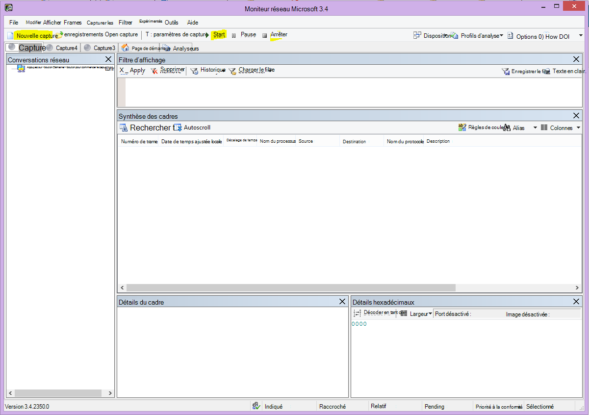

3. Pour effectuer une capture simple, cliquez sur **Démarrer** dans la barre d’outils.

4. Reproduisez les étapes qui présentent un problème de performances.

5. Cliquez sur **Arrêter** \> **le fichier** \> **sous**. N’oubliez pas de donner la date et l’heure avec le fuseau horaire et de mentionner s’il montre des performances médiocres ou bonnes.

## <a name="httpwatch"></a>HTTPWatch

[HTTPWatch](https://www.httpwatch.com/download/) est disponible en version payante et une édition gratuite. L’édition Basic gratuite couvre tout ce dont vous avez besoin pour ce test. HTTPWatch surveille le trafic réseau et le temps de chargement des pages directement à partir de la fenêtre de votre navigateur. HTTPWatch est un plug-in d’Internet Explorer qui décrit graphiquement les performances. L’analyse peut être enregistrée et affichée dans HTTPWatch Studio.

> [!NOTE]
> Si vous utilisez un autre navigateur, tel que Firefox, Google Chrome, ou si vous ne pouvez pas installer HTTPWatch dans Internet Explorer, ouvrez une nouvelle fenêtre de navigateur et appuyez sur F12 sur votre clavier. La fenêtre contextuelle Outil développeur doit s’afficher en bas de votre navigateur. Si vous utilisez Opera, appuyez sur Ctrl+Maj+I pour l’inspecteur web, puis cliquez sur l’onglet **Réseau** et effectuez les tests décrits ci-dessous. Les informations seront légèrement différentes, mais les temps de chargement restent affichés en millisecondes. > HTTPWatch est également très utile pour les problèmes liés à SharePoint temps de chargement de page en ligne.

### <a name="run-httpwatch-and-reproduce-the-issue"></a>Exécuter HTTPWatch et reproduire le problème

HTTPWatch étant un plug-in de navigateur, l’exposition de l’outil dans le navigateur est légèrement différente pour chaque version d’Internet Explorer. En règle générale, vous pouvez trouver HTTPWatch sous la barre des commandes dans le navigateur Internet Explorer. Si vous ne voyez pas le plug-in HTTPWatch dans la fenêtre de votre navigateur, vérifiez la version de votre navigateur en cliquant sur **Aide** \> **à propos**, ou dans les versions ultérieures d’Internet Explorer, cliquez sur le symbole d’engrenage et **à propos d’Internet Explorer**. Pour lancer la barre **commandes** , cliquez avec le bouton droit sur la barre de menus dans Internet Explorer, puis cliquez sur **La barre des commandes**.

Par le passé, HTTPWatch a été associé aux barres Commandes et Explorateur. Par conséquent, une fois que vous avez installé, si vous ne voyez pas immédiatement l’icône (même après le redémarrage), vérifiez **les outils** et vos barres d’outils pour l’icône. N’oubliez pas que les barres d’outils peuvent être personnalisées et que des options peuvent être ajoutées.

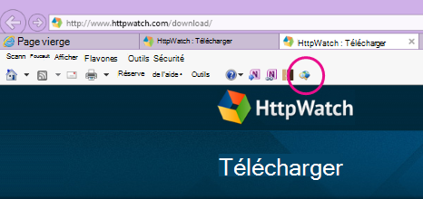

1. Lancez HTTPWatch dans une fenêtre de navigateur Internet Explorer. Il apparaîtra ancré au navigateur en bas de cette fenêtre. Cliquez sur **Enregistrer**.

2. Reproduisez les étapes exactes impliquées dans le problème de performances. Cliquez sur le bouton **Arrêter** dans HTTPWatch.

3. **Enregistrez** le httpwatch ou **l’envoi par e-mail**. N’oubliez pas de nommer le fichier afin qu’il inclue des informations de date et d’heure et une indication indiquant si votre Montre contient une démonstration de performances correctes ou incorrectes.


Cette capture d’écran est tirée de la version Professional de HTTPWatch. Vous pouvez ouvrir les traces prises dans la version de base sur un ordinateur avec une version Professional et la lire. Des informations supplémentaires peuvent être disponibles à partir de la trace par le biais de cette méthode.

## <a name="problem-steps-recorder"></a>Enregistreur des étapes de problème

L’enregistreur d’étapes, ou PSR.exe, vous permet d’enregistrer les problèmes au fur et à mesure qu’ils se produisent. Il s’agit d’un outil très utile et simple à exécuter.

### <a name="run-problem-steps-recorder-psrexe-to-record-your-work"></a>Exécuter l’enregistreur des étapes de problème (PSR.exe) pour enregistrer votre travail

1. Utilisez le type **Démarrer** \> **l’exécution** \> **PSR.exe** \> **OK**, ou cliquez sur le **type de clé** \> **WindowsPSR.exe** \>, puis appuyez sur Entrée.

2. Lorsque la petite fenêtre PSR.exe s’affiche, cliquez sur **Démarrer l’enregistrement** et reproduisez les étapes qui reproduisent le problème de performances. Vous pouvez ajouter des commentaires en fonction des besoins, en cliquant sur **Ajouter des commentaires**.

3. Cliquez sur **Arrêter l’enregistrement** lorsque vous avez effectué les étapes. Si le problème de performances est un rendu de page, attendez que la page s’affiche avant d’arrêter l’enregistrement.

4. Cliquez sur **Enregistrer**.


La date et l’heure sont enregistrées pour vous. Cela lie votre RSE à votre trace Netmon et HTTPWatch dans le temps, et aide à résoudre les problèmes de précision. La date et l’heure de l’enregistrement PSR peuvent indiquer qu’une minute est passée entre la connexion et la navigation de l’URL et le rendu partiel du site d’administration, par exemple.

## <a name="read-your-traces"></a>Lire vos traces

Il n’est pas possible d’apprendre tout sur la résolution des problèmes de réseau et de performances que quelqu’un doit connaître par le biais d’un article. L’obtention de performances optimales nécessite de l’expérience et des connaissances sur le fonctionnement et les performances de votre réseau. Mais il est possible d’arrondir une liste des principaux problèmes et de montrer comment les outils peuvent vous permettre d’éliminer plus facilement les problèmes les plus courants.

Si vous souhaitez sélectionner des compétences pour lire les traces réseau de vos sites Office 365, il n’y a pas de meilleur enseignant que de créer des traces de chargements de pages régulièrement et d’acquérir de l’expérience pour les lire. Par exemple, lorsque vous avez une chance, chargez un service Office 365 et tracez le processus. Filtrez la trace du trafic DNS ou recherchez le nom du service que vous avez parcouru dans FrameData. Analysez la trace pour obtenir une idée des étapes qui se produisent lorsque le service se charge. Cela vous aidera à découvrir à quoi doit ressembler le chargement normal des pages et, dans le cas d’une résolution des problèmes, en particulier en ce qui concerne les performances, la comparaison de traces correctes et incorrectes peut vous apprendre beaucoup.

Netmon utilise Microsoft Intellisense dans le champ Filtre d’affichage. Intellisense, ou complétion intelligente du code, est cette astuce où vous tapez dans un point et toutes les options disponibles sont affichées dans une zone de sélection déroulante. Par exemple, vous vous inquiétez de la mise à l’échelle des fenêtres TCP. Vous pouvez ainsi accéder à un filtre (tel que  `.protocol.tcp.window < 100`) .

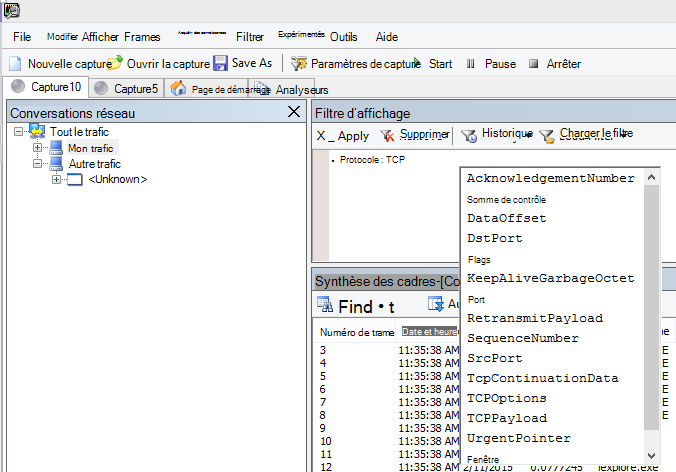

Les traces Netmon peuvent contenir beaucoup de trafic. Si vous n’avez pas l’expérience de les lire, il est probable que vous serez submergé lors de la première ouverture de la trace. La première chose à faire est de séparer le signal du bruit de fond dans la trace. Vous avez testé sur Office 365, et c’est le trafic que vous souhaitez voir. Si vous avez l’habitude de parcourir les traces, vous n’avez peut-être pas besoin de cette liste.

Le trafic entre votre client et Office 365 transite par TLS, ce qui signifie que le corps du trafic sera chiffré et non lisible dans une trace Netmon générique. Votre analyse des performances n’a pas besoin de connaître les spécificités des informations contenues dans le paquet. Toutefois, il est très intéressé par les en-têtes de paquets et les informations qu’ils contiennent.

### <a name="tips-to-get-a-good-trace"></a>Astuces pour obtenir une bonne trace

- Connaître la valeur de l’adresse IPv4 ou IPv6 de votre ordinateur client. Vous pouvez l’obtenir à partir de l’invite de commandes en tapant **IPConfig** , puis en appuyant sur Entrée. Le fait de connaître cette adresse vous permet de savoir en un coup d’œil si le trafic dans la trace implique directement votre ordinateur client. S’il existe un proxy connu, effectuez un test ping et obtenez également son adresse IP.

- Videz votre cache de programme de résolution DNS et, si possible, fermez tous les navigateurs, à l’exception de celui dans lequel vous exécutez vos tests. Si vous n’êtes pas en mesure de le faire, par exemple, si la prise en charge utilise un outil basé sur un navigateur pour voir le bureau de votre ordinateur client, préparez-vous à filtrer votre trace.

- Dans une trace occupée, recherchez le service Office 365 que vous utilisez. Si vous n’avez jamais ou rarement vu votre trafic auparavant, il s’agit d’une étape utile pour séparer le problème de performances des autres bruits réseau. Il existe plusieurs façons de le faire. Directement avant votre test, vous pouvez utiliser _ping_ ou _PsPing_ sur l’URL du service spécifique (`ping outlook.office365.com` ou `psping -4 microsoft-my.sharepoint.com:443`, par exemple). Vous pouvez également facilement trouver ce ping ou PsPing dans une trace Netmon (par son nom de processus). Cela vous donnera un endroit pour commencer à chercher.

Si vous utilisez uniquement le suivi Netmon au moment du problème, cela ne pose pas de problème. Pour vous orienter, utilisez un filtre similaire `ContainsBin(FrameData, ASCII, "office")` ou `ContainsBin(FrameData, ASCII, "outlook")`. Vous pouvez enregistrer votre numéro d’image à partir du fichier de trace. Vous pouvez également faire défiler le volet _Résumé du cadre_ jusqu’à droite et rechercher la colonne ID de conversation. Il existe un nombre indiqué pour l’ID de cette conversation spécifique que vous pouvez également enregistrer et examiner de manière isolée ultérieurement. N’oubliez pas de supprimer ce filtre avant d’appliquer un autre filtrage.

> [!TIP]
> Netmon dispose de nombreux filtres intégrés utiles. Essayez le bouton **Filtre de charge** en haut du volet _Filtre d’affichage_ .


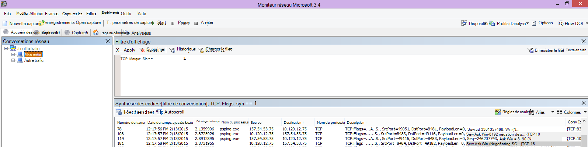

Familiarisez-vous avec votre trafic et apprenez à localiser les informations dont vous avez besoin. Par exemple, apprenez à déterminer quel paquet de la trace contient la première référence au service Office 365 que vous utilisez (par exemple, « Outlook »).

En prenant Office 365 Outlook Online comme exemple, le trafic commence comme suit :

- Requête standard DNS et réponse DNS pour outlook.office365.com avec des queryID correspondants. Il est important de noter le décalage de temps pour ce tour de passe et l’endroit où, dans le monde, le Office 365 DNS global envoie la demande de résolution de noms. Dans l’idéal, aussi localement que possible, plutôt qu’à la moitié du monde.

- Requête HTTP GET dont le rapport d’état a été déplacé définitivement (301)

- Trafic RWS, y compris les demandes de Connecter RWS et les réponses Connecter. (Il s’agit de Winsock distant qui fait une connexion pour vous.)

- Conversation TCP SYN et TCP SYN/ACK. De nombreux paramètres de cette conversation ont un impact sur vos performances.

- Ensuite, une série de trafic TLS:TLS, qui est l’endroit où les conversations de négociation TLS et de certificat TLS ont lieu. (N’oubliez pas que les données sont chiffrées via SSL/TLS.)

Toutes les parties du trafic sont importantes et connectées, mais de petites parties de la trace contiennent des informations importantes en termes de résolution des problèmes de performances. Nous allons donc nous concentrer sur ces domaines. En outre, étant donné que nous avons effectué suffisamment de Office 365 résolution des problèmes de performances chez Microsoft pour compiler une liste des dix principaux problèmes courants, nous allons nous concentrer sur ces problèmes et sur la façon d’utiliser les outils dont nous avons besoin pour les raciner ensuite.

Si vous ne les avez pas encore installés, la matrice ci-dessous utilise plusieurs outils lorsque cela est possible. Des liens sont fournis vers les points d’installation. La liste inclut des outils de traçage réseau courants tels [que Netmon](https://www.microsoft.com/download/details.aspx?id=4865) et [Wireshark](https://www.wireshark.org/), mais utilisez n’importe quel outil de traçage avec lequel vous êtes à l’aise et dans lequel vous êtes habitué à filtrer le trafic réseau. Lorsque vous effectuez des tests, n’oubliez pas :

- *Fermez vos navigateurs et testez avec un seul navigateur en cours d’exécution*  . Cela réduit le trafic global que vous capturez. Cela permet une trace moins occupée.
- *Vider le cache de votre programme de résolution DNS sur l’ordinateur client*  . Cela vous donnera une nouvelle ardoise lorsque vous commencerez à prendre votre capture, pour une trace plus propre.

## <a name="common-issues"></a>Problèmes courants

Certains problèmes courants que vous pouvez rencontrer et comment les trouver dans votre trace réseau.

### <a name="tcp-windows-scaling"></a>Mise à l’échelle Windows TCP

Trouvé dans SYN - SYN/ACK. Le matériel hérité ou vieillissant peut ne pas tirer parti de la mise à l’échelle des fenêtres TCP.  Sans les paramètres de mise à l’échelle des fenêtres TCP appropriés, la mémoire tampon 16 bits par défaut dans les en-têtes TCP se remplit en millisecondes.  Le trafic ne peut pas continuer à envoyer tant que le client n’a pas reçu un accusé de réception des données d’origine, ce qui entraîne des retards.

#### <a name="tools"></a>Outils

- Netmon
- Wireshark

#### <a name="what-to-look-for"></a>Ce qu’il faut rechercher

Recherchez le trafic SYN - SYN/ACK dans votre trace réseau.  Dans Netmon, utilisez un filtre comme  `tcp.flags.syn == 1`. Ce filtre est le même dans Wireshark.

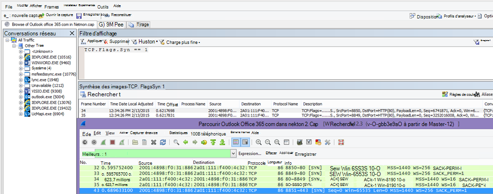

Notez que pour chaque SYN, il existe un numéro de port source (SrcPort) qui est mis en correspondance dans le port de destination (DstPort) de l’accusé de réception associé (SYN/ACK).

Pour afficher la valeur de mise à l’échelle Windows utilisée par votre connexion réseau, développez d’abord syn, puis syn/ACK associé.

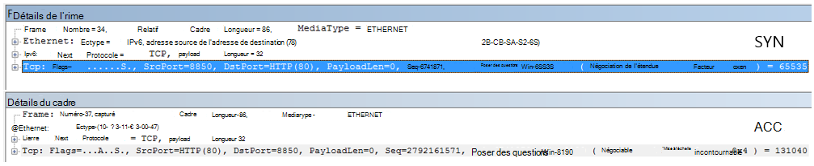

### <a name="tcp-idle-time-settings"></a>Durée d’inactivité TCP Paramètres

Historiquement, la plupart des réseaux de périmètre sont configurés pour les connexions temporaires, ce qui signifie que les connexions inactives sont généralement arrêtées. Les sessions TCP inactives peuvent être arrêtées par des proxys et des pare-feu supérieurs à 100 à 300 secondes. Cela est problématique pour Outlook Online, car il crée et utilise des connexions à long terme, qu’elles soient inactives ou non.

Lorsque les connexions sont arrêtées par des périphériques proxy ou pare-feu, le client n’est pas informé et une tentative d’utilisation de Outlook Online signifie qu’un ordinateur client essaiera, à plusieurs reprises, de réactiver la connexion avant d’en créer un nouveau. Vous pouvez voir des blocages dans le produit, des invites ou des performances lentes lors du chargement de la page.

#### <a name="tools"></a>Outils

- Netmon
- Wireshark

#### <a name="what-to-look-for"></a>Ce qu’il faut rechercher

Dans Netmon, examinez le champ Décalage de temps pour un aller-retour. Un aller-retour est le temps entre l’envoi d’une demande au serveur par le client et la réception d’une réponse. Vérifier entre le client et le point de sortie (par exemple, Client --\> Proxy) ou client à Office 365 (Client --\> Office 365). Vous pouvez le voir dans de nombreux types de paquets.

Par exemple, le filtre dans Netmon peut ressembler  `.Protocol.IPv4.Address == 10.102.14.112 AND .Protocol.IPv4.Address == 10.201.114.12`à , ou, dans Wireshark,  `ip.addr == 10.102.14.112 &amp;&amp; ip.addr == 10.201.114.12`.

> [!TIP]
> Vous ne savez pas si l’adresse IP de votre trace appartient à votre serveur DNS ? Essayez de le regarder vers le haut à la ligne de commande. Cliquez sur **Démarrer** \> **l’exécution** \> et tapez **cmd**, ou **appuyez sur Windows Touche** \> et tapez **cmd**. À l’invite, tapez  `nslookup <the IP address from the network trace>`. Pour tester, utilisez nslookup par rapport à l’adresse IP de votre propre ordinateur. > Pour afficher la liste des plages d’adresses IP de Microsoft, consultez [Office 365 URL et plages d’adresses IP](./urls-and-ip-address-ranges.md).

En cas de problème, attendez-vous à ce que les décalages de temps longs apparaissent, dans ce cas (Outlook Online), en particulier dans les paquets TLS:TLS qui affichent le passage des données d’application (par exemple, dans Netmon, vous pouvez trouver des paquets de données d’application via `.Protocol.TLS AND Description == "TLS:TLS Rec Layer-1 SSL Application Data"`). Vous devriez voir une progression fluide dans le temps au cours de la session. Si vous constatez de longs retards lors de l’actualisation de votre Outlook Online, cela peut être dû à un degré élevé de réinitialisations envoyées.

### <a name="latencyround-trip-time"></a>Latence/durée des allers-retours

La latence est une mesure qui peut changer beaucoup en fonction de nombreuses variables, telles que la mise à niveau des appareils vieillissants, l’ajout d’un grand nombre d’utilisateurs à un réseau et le pourcentage de bande passante globale consommée par d’autres tâches sur une connexion réseau.

Il existe des calculatrices de bande passante pour Office 365 disponibles à partir de cette [planification réseau et de l’optimisation des performances pour Office 365](network-planning-and-performance.md) page.

Vous devez mesurer la vitesse de votre connexion ou la bande passante de votre connexion ISP ? Essayez ce site (ou des sites comme celui-ci) : [Site officiel Speedtest](https://www.speedtest.net/), ou interrogez votre moteur de recherche favori pour le **test de vitesse** d’expression.

#### <a name="tools"></a>Outils

- Ping
- PsPing
- Netmon
- Wireshark

#### <a name="what-to-look-for"></a>Ce qu’il faut rechercher

Pour suivre la latence dans une trace, vous tirerez parti de l’enregistrement de l’adresse IP de l’ordinateur client et de l’adresse IP du serveur DNS dans Office 365. Cela facilite le filtrage des traces. Si vous vous connectez via un proxy, vous aurez besoin de l’adresse IP de votre ordinateur client, de l’adresse IP de proxy/sortie et de l’adresse IP DNS Office 365, pour faciliter le travail.

Une demande ping envoyée à outlook.office365.com vous indique le nom du centre de données qui reçoit la demande, même si ping  *ne*  peut pas être en mesure de se connecter pour envoyer les paquets ICMP consécutifs à la marque. Si vous utilisez PsPing (un outil gratuit pour le téléchargement), et spécifique au port (443) et peut-être pour utiliser IPv4 (-4), vous obtiendrez un temps aller-retour moyen pour les paquets envoyés. Cela fonctionne pour d’autres URL dans les services Office 365, par exemple `psping -4 yourSite.sharepoint.com:443`. En fait, vous pouvez spécifier un certain nombre de pings pour obtenir un échantillon plus grand pour votre moyenne, essayez quelque chose comme `psping -4 -n 20 yourSite-my.sharepoint.com:443`.

> [!NOTE]
> PsPing n’envoie pas de paquets ICMP. Il effectue un test ping avec des paquets TCP sur un port spécifique, afin que vous puissiez utiliser celui que vous connaissez pour être ouvert. Dans Office 365, qui utilise SSL/TLS, essayez d’attacher le port :443 à votre PsPing.


Si vous avez chargé la page Office 365 lente tout en effectuant une trace réseau, vous devez filtrer une trace Netmon ou Wireshark pour `DNS`. C’est l’une des adresses IP que nous recherchons.

Voici les étapes à suivre pour filtrer votre Netmon afin d’obtenir l’adresse IP (et examinez la latence DNS). Cet exemple utilise outlook.office365.com, mais peut également utiliser l’URL d’un locataire SharePoint Online (hithere.sharepoint.com par exemple).

1. Effectuez un test ping sur l’URL `ping outlook.office365.com` et, dans les résultats, enregistrez le nom et l’adresse IP du serveur DNS auquel la requête ping a été envoyée.
2. Trace réseau ouvrant la page, ou effectuant l’action qui vous donne le problème de performances, ou, si vous voyez une latence élevée sur le ping, lui-même, le suivi réseau.
3. Ouvrez la trace dans Netmon et filtrez pour DNS (ce filtre fonctionne également dans Wireshark, mais il est sensible à la casse `-- dns`). Étant donné que vous connaissez le nom du serveur DNS à partir de votre test ping, vous pouvez également filtrer plus rapidement dans Netmon comme suit : `DNS AND ContainsBin(FrameData, ASCII, "namnorthwest")`, ce qui ressemble à ceci dans les dns Wireshark et le frame contient « namnorthwest ».<br/>Ouvrez le paquet de réponse et, dans la fenêtre **Détails du cadre** Netmon, cliquez sur **DNS** pour développer pour plus d’informations. Dans les informations DNS, vous trouverez l’adresse IP du serveur DNS vers lequel la requête a été envoyée dans Office 365. Vous aurez besoin de cette adresse IP pour l’étape suivante (l’outil PsPing). Supprimez le filtre, cliquez avec le bouton droit sur la réponse DNS dans Netmon (**Résumé** \> du cadre **trouver les conversations** \> **DNS**) pour afficher la requête et la réponse DNS côte à côte.
4. Dans Netmon, notez également la colonne Décalage de temps entre la requête DNS et la réponse. À l’étape suivante, l’outil [PsPing](/sysinternals/downloads/psping) facile à installer et à utiliser est très pratique, à la fois parce qu’ICMP est souvent bloqué sur les pare-feu et parce que PsPing suit élégamment la latence en millisecondes. PsPing termine une connexion TCP à une adresse et un port (dans notre cas, ouvrez le port 443).
5. Installez PsPing.
6. Ouvrez une invite de commandes (cmd de type Démarrer \> l’exécution \> ou Windows cmd de type clé\>) et remplacez le répertoire par le répertoire dans lequel vous avez installé PsPing pour exécuter la commande PsPing. Dans mes exemples, vous pouvez voir que j’ai créé un dossier « Perf » à la racine de C. Vous pouvez faire de même pour l’accès rapide.
7. Tapez la commande pour effectuer votre PsPing sur l’adresse IP du serveur DNS Office 365 à partir de votre trace Netmon antérieure, y compris le numéro de port, par exemple `psping -n 20 132.245.24.82:445`. Cela vous donne un échantillonnage de 20 pings et une moyenne de la latence lorsque PsPing s’arrête.

Si vous allez Office 365 via un serveur proxy, les étapes sont un peu différentes. Vous devez d’abord envoyer PsPing à votre serveur proxy pour obtenir une valeur de latence moyenne en millisecondes vers le proxy/sortie et vers l’arrière, puis exécuter PsPing sur le proxy, ou sur un ordinateur avec une connexion Internet directe pour obtenir la valeur manquante (celle à Office 365 et de retour).

Si vous choisissez d’exécuter PsPing à partir du proxy, vous aurez deux valeurs en millisecondes : ordinateur client vers serveur proxy ou point de sortie, et serveur proxy à Office 365. Et tu as terminé ! Eh bien, les valeurs d’enregistrement, de toute façon.

Si vous exécutez PsPing sur un autre ordinateur client qui dispose d’une connexion directe à Internet, autrement dit, sans proxy, vous aurez deux valeurs en millisecondes : ordinateur client vers serveur proxy ou point de sortie, et ordinateur client à Office 365. Dans ce cas, soustraitez la valeur de l’ordinateur client au serveur proxy ou au point de sortie de la valeur de l’ordinateur client à Office 365, et vous aurez les numéros RTT de votre ordinateur client vers le serveur proxy ou le point de sortie, et du serveur proxy ou du point de sortie vers Office 365.

Toutefois, si vous pouvez trouver un ordinateur client à l’emplacement concerné qui est directement connecté ou contourne le proxy, vous pouvez choisir de voir si le problème se reproduit à cet emplacement pour commencer et de l’utiliser par la suite.

La latence, comme indiqué dans une trace Netmon, ces millisecondes supplémentaires peuvent s’additionner, si elles sont suffisantes dans une session donnée.

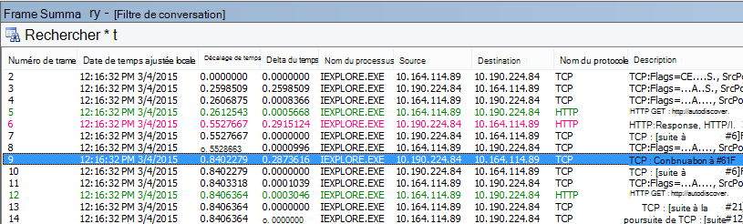

> [!NOTE]
> Votre adresse IP peut être différente des adresses IP indiquées ici, par exemple, votre test ping peut renvoyer quelque chose de plus semblable à 157.56.0.0/16 ou une plage similaire. Pour obtenir la liste des plages utilisées par Office 365, consultez [Office 365 URL et plages d’adresses IP](./urls-and-ip-address-ranges.md).

N’oubliez pas de développer tous les nœuds (il y a un bouton en haut pour cela) si vous souhaitez rechercher, par exemple, 132.245.

### <a name="proxy-authentication"></a>Authentification du proxy

Cela ne s’applique qu’à vous si vous utilisez un serveur proxy. Si ce n’est pas le cas, vous pouvez ignorer ces étapes. Lorsque vous travaillez correctement, l’authentification proxy doit avoir lieu en millisecondes, de manière cohérente. Vous ne devriez pas voir de performances médiocres intermittentes pendant les périodes de pointe d’utilisation (par exemple).

Si l’authentification par proxy est activée, chaque fois que vous créez une nouvelle connexion TCP à Office 365 pour obtenir des informations, vous devez passer par un processus d’authentification en arrière-plan. Par exemple, lorsque vous passez du calendrier au courrier dans Outlook Online, vous vous authentifierez. Et dans SharePoint Online, si une page affiche un média ou des données provenant de plusieurs sites ou emplacements, vous vous authentifierez pour chaque connexion TCP différente nécessaire pour afficher les données.

Dans Outlook Online, vous pouvez rencontrer des temps de chargement lents chaque fois que vous basculez entre calendrier et votre boîte aux lettres, ou des chargements de pages lents dans SharePoint Online. Toutefois, d’autres symptômes ne sont pas répertoriés ici.

L’authentification par proxy est un paramètre sur votre serveur proxy de sortie. S’il est à l’origine d’un problème de performances avec Office 365, vous devez consulter votre équipe réseau.

#### <a name="tools"></a>Outils

- Netmon
- Wireshark

#### <a name="what-to-look-for"></a>Ce qu’il faut rechercher

L’authentification proxy a lieu chaque fois qu’une nouvelle session TCP doit être lancée, généralement pour demander des fichiers ou des informations au serveur ou pour fournir des informations. Par exemple, vous pouvez voir l’authentification proxy autour des requêtes HTTP GET ou HTTP POST. Si vous souhaitez voir les trames dans lesquelles vous authentifiez les demandes dans votre trace, ajoutez la colonne « Résumé NTLMSSP » à Netmon et filtrez pour  `.property.NTLMSSPSummary`. Pour voir la durée de l’authentification, ajoutez la colonne Delta du temps.

Pour ajouter une colonne à Netmon :

1. Cliquez avec le bouton droit sur une colonne telle que **Description**.
2. Cliquez sur **Choisir des colonnes**.
3. Recherchez _NTLMSSP Summary_ and _Time Delta_ dans la liste, puis cliquez sur **Ajouter**.
4. Déplacez les nouvelles colonnes en place avant ou derrière la colonne _Description_ afin de pouvoir les lire côte à côte.
5. Cliquez sur **OK**.

Même si vous n’ajoutez pas la colonne, le filtre Netmon fonctionne. Mais votre résolution des problèmes sera beaucoup plus facile si vous pouvez voir dans quelle étape de l’authentification vous êtes.

Lorsque vous recherchez des instances d’authentification proxy, veillez à étudier toutes les images où il existe un défi NTLM ou un message d’authentification. Si nécessaire, cliquez avec le bouton droit sur la partie spécifique du trafic et recherchez le protocole TCP conversations \> . Tenez compte des valeurs delta du temps dans ces conversations.

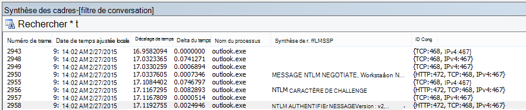

Délai de quatre secondes pour l’authentification par proxy, comme indiqué dans Wireshark. Le **delta de temps de la colonne frame affichée précédente** a été effectué en cliquant avec le bouton droit sur le champ du même nom dans les détails du cadre et en sélectionnant Ajouter en tant que colonne.  <br/> 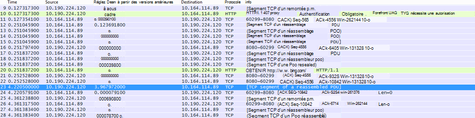

### <a name="dns-performance"></a>Performances DNS

La résolution de noms fonctionne le mieux et le plus rapidement lorsqu’elle se produit le plus près possible du pays du client.

Si la résolution de noms DNS a lieu à l’étranger, elle peut ajouter des secondes aux chargements de page. Dans l’idéal, la résolution de noms se produit en moins de 100 ms. Si ce n’est pas le cas, vous devez effectuer une enquête plus approfondie.

> [!TIP]
> Vous ne savez pas comment fonctionne la connectivité client dans Office 365 ? Jetez un coup d’œil au document de référence sur la connectivité [du client ici](/previous-versions//dn741250(v=technet.10)).

#### <a name="tools"></a>Outils

- Netmon
- Wireshark
- PsPing

#### <a name="what-to-look-for"></a>Ce qu’il faut rechercher

L’analyse des performances DNS est généralement un autre travail pour une trace réseau. Toutefois, PsPing est également utile pour déterminer une cause possible.

Le trafic DNS est basé sur les requêtes TCP et UDP et les réponses sont clairement marquées avec un ID qui permet de faire correspondre une demande spécifique à sa réponse spécifique. Vous verrez le trafic DNS quand, par exemple, SharePoint Online utilise un nom de réseau ou une URL sur une page web. En règle générale, la plupart de ce trafic, sauf lors du transfert de zones, s’exécute sur UDP.

Dans Netmon et Wireshark, le filtre le plus simple qui vous permettra d’examiner le trafic DNS est simplement `dns`. Veillez à utiliser des minuscules lors de la spécification du filtre. N’oubliez pas de vider votre cache de résolveur DNS avant de commencer à reproduire le problème sur votre ordinateur client. Par exemple, si vous avez un chargement lent SharePoint page en ligne pour la page d’accueil, vous devez fermer tous les navigateurs, ouvrir un nouveau navigateur, démarrer le suivi, vider le cache de votre programme de résolution DNS et accéder à votre site SharePoint Online. Une fois la page entière résolue, vous devez arrêter et enregistrer la trace.

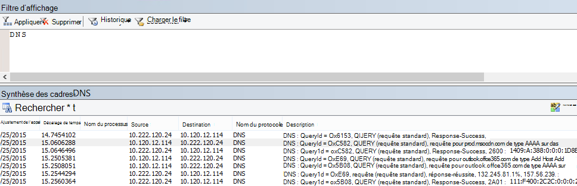

Vous voulez examiner le décalage horaire ici. Et il peut être utile d’ajouter la colonne **Delta du temps** à Netmon, ce que vous pouvez faire en effectuant les étapes suivantes :

1. Cliquez avec le bouton droit sur une colonne telle que **Description**.
2. Cliquez sur **Choisir des colonnes**.
3. Recherchez _time delta_ dans la liste, puis cliquez sur **Ajouter**.
4. Déplacez la nouvelle colonne en place avant ou derrière la colonne _Description_ afin de pouvoir la lire côte à côte.
5. Cliquez sur **OK**.

Si vous trouvez une requête intéressante, envisagez de l’isoler en cliquant avec le bouton droit sur cette requête dans le panneau de détails du cadre, en choisissant Rechercher le **DNS** **conversations**\>. Notez que le panneau Conversations réseau passe directement à la conversation spécifique dans son journal du trafic UDP.

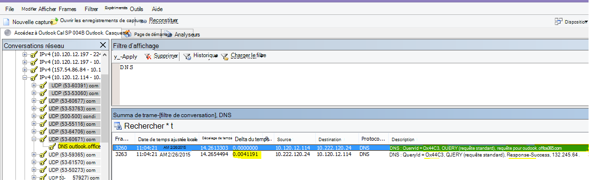

Dans Wireshark, vous pouvez créer une colonne pour le temps DNS. Prenez votre trace (ou ouvrez une trace) dans Wireshark et filtrez par `dns`, ou, plus utilement,  `dns.time`. Cliquez sur n’importe quelle requête DNS et, dans le panneau affichant les détails, développez les  `Domain Name System (response)` détails. Vous verrez un champ pour le temps (par exemple, `[Time: 0.001111100 seconds]`. Cliquez avec le bouton droit cette fois et **sélectionnez Appliquer en tant que colonne**. Vous disposerez ainsi d’une colonne **Time** pour un tri plus rapide de votre trace. Cliquez sur la nouvelle colonne à trier en fonction des valeurs décroissantes pour voir quel appel DNS a pris le plus de temps à résoudre.

[Une recherche sur SharePoint Online filtrée dans Wireshark par dns.time (en minuscules), avec l’heure des détails dans une colonne et triée par ordre croissant.](../media/1439dcc2-12ff-4ee2-9ef3-1484cf79c384.PNG)

Si vous souhaitez effectuer plus d’investigations sur le temps de résolution DNS, essayez un PsPing sur le port DNS utilisé par TCP (par exemple,  `psping <IP address of DNS server>:53`) . Voyez-vous toujours un problème de performances ? Si c’est le cas, le problème est plus susceptible d’être un problème réseau plus large qu’un problème spécifique de l’application DNS que vous rencontrez pour résoudre ce problème. Il est également intéressant de mentionner, encore une fois, qu’un test ping pour outlook.office365.com vous indiquera où la résolution de noms DNS pour Outlook Online a lieu (par exemple, outlook-namnorthwest.office365.com).

Si le problème semble spécifique à DNS, il peut être nécessaire de contacter votre service informatique pour examiner les configurations DNS et les redirecteurs DNS pour approfondir l’examen de ce problème.

### <a name="proxy-scalability"></a>Extensibilité du proxy

Des services comme Outlook Online dans Office 365 accordent aux clients plusieurs connexions à long terme. Par conséquent, chaque utilisateur peut utiliser davantage de connexions qui nécessitent une durée de vie plus longue.

#### <a name="tools"></a>Outils

Mathématiques

#### <a name="what-to-look-for"></a>Ce qu’il faut rechercher

Il n’existe aucun outil de suivi réseau ou de dépannage spécifique à ce problème. Au lieu de cela, il est basé sur des calculs de bande passante donnés limitations et d’autres variables.

### <a name="tcp-max-segment-size"></a>Taille maximale du segment TCP

Trouvé dans SYN - SYN/ACK.  Effectuez cette vérification dans toute trace réseau de performances que vous avez effectuée pour vous assurer que les paquets TCP sont configurés pour transporter la quantité maximale de données possible.

L’objectif est de voir un MSS de 1460 octets pour la transmission des données. Si vous êtes derrière un proxy ou si vous utilisez un NAT, n’oubliez pas d’exécuter ce test du client au proxy/sortie/NAT, et du proxy/sortie/NAT à Office 365 pour obtenir de meilleurs résultats ! Il s’agit de différentes sessions TCP.

#### <a name="tools"></a>Outils

Netmon

#### <a name="what-to-look-for"></a>Ce qu’il faut rechercher

La taille de segment maximale TCP (MSS) est un autre paramètre de l’établissement d’une liaison triple dans votre trace réseau, ce qui signifie que vous trouverez les données dont vous avez besoin dans le paquet SYN - SYN/ACK. MSS est en fait assez simple à voir.

Ouvrez la trace réseau de performances dont vous disposez et recherchez la connexion qui vous intéresse, ou qui illustre le problème de performances.

> [!NOTE]
> Si vous examinez une trace et que vous devez trouver le trafic pertinent pour votre conversation, filtrez par l’adresse IP du client, l’adresse IP du serveur proxy ou du point de sortie, ou les deux. En accédant directement, vous devez effectuer un test ping sur l’URL que vous testez pour l’adresse IP de Office 365 dans la trace, puis filtrer par celle-ci.

Vous regardez la trace de seconde main ? Essayez d’utiliser des filtres pour vous orienter. Dans Netmon, exécutez une recherche basée sur l’URL, par `Containsbin(framedata, ascii, "sphybridExample")`exemple, prenez note du numéro d’image.

Dans Wireshark, utilisez quelque chose comme  `frame contains "sphybridExample"`. Si vous remarquez que vous avez trouvé le trafic RWS (Remote Winsock) (il peut apparaître sous la forme d’un [PSH, ACK] dans Wireshark), n’oubliez pas que les connexions RWS peuvent être vues peu de temps avant syn - SYN/ACKs pertinents, comme indiqué précédemment.

À ce stade, vous pouvez enregistrer le numéro d’image, supprimer le filtre, cliquer sur **Tout le trafic** dans la fenêtre Conversations réseau dans Netmon pour examiner la syn la plus proche.

Plus important encore, si vous n’avez reçu aucune des informations d’adresse IP au moment de la trace, la recherche de votre URL dans la trace (partie de `sphybridExample-my.sharepoint.com`, par exemple) vous donnera des adresses IP à filtrer.

Recherchez la connexion dans la trace qui vous intéresse. Pour ce faire, vous pouvez analyser la trace, filtrer par adresses IP ou sélectionner des ID de conversation spécifiques à l’aide de la fenêtre Conversations réseau dans Netmon. Une fois que vous avez trouvé le paquet SYN, développez TCP (dans Netmon) ou Transmission Control Protocol (dans Wireshark) dans le panneau Détails du cadre. Développez les options TCP et MaxSegmentSize. Recherchez le frame SYN-ACK associé et développez les options TCP et MaxSegmentSize. La plus petite des deux valeurs sera votre taille de segment maximale. Dans cette image, j’utilise la colonne intégrée dans Netmon appelée résolution des problèmes TCP.

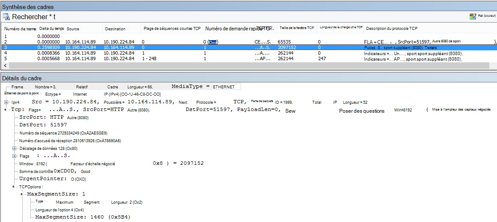

La colonne intégrée se trouve en haut du panneau Détails du **cadre** . (Pour revenir à votre affichage normal, cliquez à nouveau sur **Colonnes** , puis choisissez **Fuseau horaire**.)


Voici une trace filtrée dans Wireshark. Il existe un filtre spécifique à la valeur MSS (`tcp.options.mss`). Les trames d’une liaison SYN, SYN/ACK, ACK sont liées au bas de Wireshark équivalent à Frame Details (frame 47 ACK, links to 46 SYN/ACK, links to 43 SYN) pour faciliter ce type de travail.

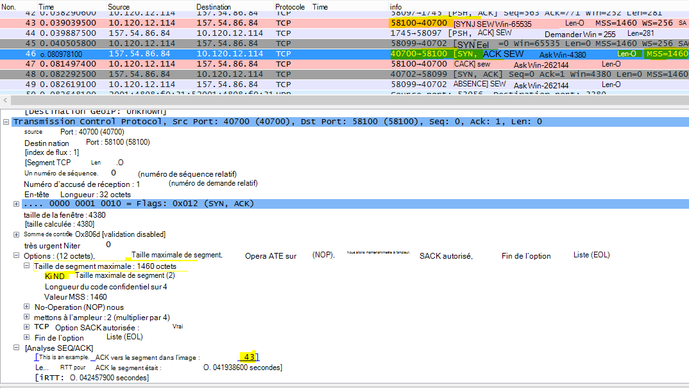

Si vous devez vérifier **l’accusé de réception sélectif** (rubrique suivante dans cette matrice), ne fermez pas votre trace !

### <a name="selective-acknowledgment"></a>Accusé de réception sélectif

Trouvé dans SYN - SYN/ACK. Doit être signalé comme autorisé dans SYN et SYN/ACK. L’accusé de réception sélectif (SACK) permet une retransmission plus fluide des données lorsqu’un paquet ou des paquets sont manquants. Les appareils peuvent désactiver cette fonctionnalité, ce qui peut entraîner des problèmes de performances.

Si vous êtes derrière un proxy ou si vous utilisez un NAT, n’oubliez pas d’exécuter ce test du client au proxy/sortie/NAT, et du proxy/sortie/NAT à Office 365 pour obtenir de meilleurs résultats ! Il s’agit de différentes sessions TCP.

#### <a name="tools"></a>Outils

Netmon

#### <a name="what-to-look-for"></a>Ce qu’il faut rechercher

L’accusé de réception sélectif (SACK) est un autre paramètre dans l’établissement de liaison SYN-SYN/ACK. Vous pouvez filtrer votre trace pour SYN - SYN/ACK de nombreuses façons.

Recherchez la connexion dans la trace qui vous intéresse soit en analysant la trace, en filtrant par adresses IP, soit en cliquant sur un ID de conversation à l’aide de la fenêtre Conversations réseau dans Netmon. Une fois que vous avez trouvé le paquet SYN, développez TCP dans Netmon ou Transmission Control Protocol dans Wireshark dans la section Détails du cadre. Développez les options TCP, puis SACK. Recherchez le cadre SYN-ACK associé et développez les options TCP et son champ SACK. Assurez-vous que SACK est autorisé dans SYN et SYN/ACK. Voici les valeurs SACK comme indiqué dans Netmon et Wireshark.

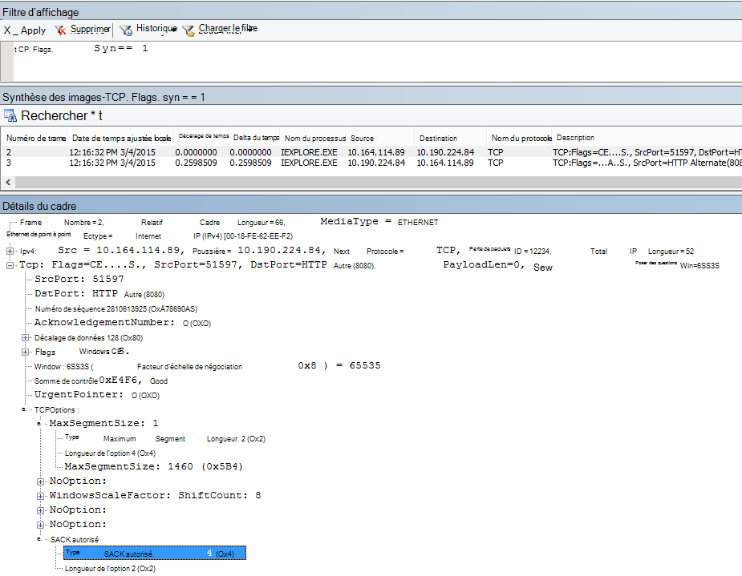

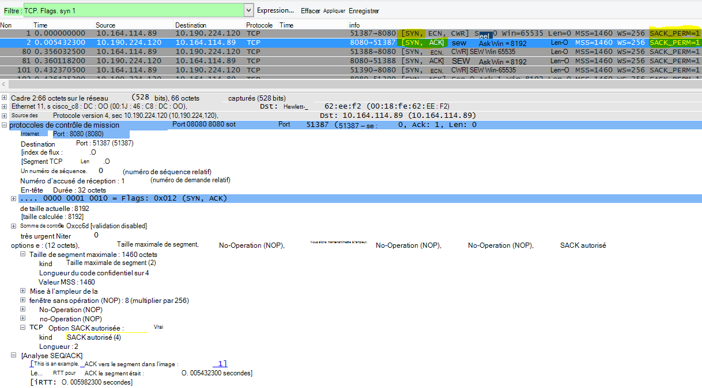

### <a name="dns-geolocation"></a>Géolocalisation DNS

Où dans le monde Office 365 tente de résoudre votre appel DNS affecte votre vitesse de connexion.

Dans Outlook Online, une fois la première recherche DNS terminée, l’emplacement de ce DNS sera utilisé pour se connecter à votre centre de données le plus proche. Vous serez connecté à un serveur d’administration centrale Outlook Online, qui utilisera le réseau principal pour vous connecter au centre de données (dC) où vos données sont stockées. C’est plus rapide.

Lors de l’accès à SharePoint Online, un utilisateur voyageant à l’étranger est dirigé vers son centre de données actif , c’est-à-dire le centre de données dont l’emplacement est basé sur la base d’accueil de son locataire SPO (donc, une base de données aux États-Unis si l’utilisateur est basé sur les États-Unis).

Lync Online a des nœuds actifs dans plusieurs DC à la fois. Lorsque des demandes sont envoyées pour des instances en ligne Lync, le DNS de Microsoft détermine d’où provient la requête dans le monde et retourne les adresses IP de la base de données régionale la plus proche où Lync Online est actif.

> [!TIP]
> Vous avez besoin d’en savoir plus sur la façon dont les clients se connectent à Office 365 ? Consultez l’article de référence [sur la connectivité du client](/previous-versions//dn741250(v=technet.10)) (et ses graphiques utiles).

#### <a name="tools"></a>Outils

- Ping
- PsPing

#### <a name="what-to-look-for"></a>Ce qu’il faut rechercher

Les demandes de résolution de noms des serveurs DNS du client vers les serveurs DNS de Microsoft doivent dans la plupart des cas entraîner le renvoi par Microsoft DNS de l’adresse IP d’un centre de données régional (dC). Qu’est-ce que cela signifie pour vous ? Si votre siège social se trouve à Bengalre, en Inde, mais que vous voyagez dans le États-Unis, lorsque votre navigateur effectue une demande de Outlook Online, les serveurs DNS de Microsoft doivent vous remettre des adresses IP aux centres de données du États-Unis , un centre de données régional. Si la messagerie est nécessaire à partir de Outlook, ces données transitent par le réseau principal rapide de Microsoft entre les centres de données.

DNS fonctionne le plus rapidement lorsque la résolution de noms est effectuée le plus près possible de l’emplacement de l’utilisateur. Si vous êtes en Europe, vous souhaitez accéder à un DNS Microsoft en Europe et (idéalement) faire affaire avec un centre de données en Europe. Les performances d’un client en Europe allant à DNS et d’un centre de données en Amérique seront plus lentes.

Exécutez l’outil Ping sur outlook.office365.com pour déterminer où dans le monde votre requête DNS est routée. Si vous êtes en Europe, vous devriez voir une réponse de quelque chose comme outlook-emeawest.office365.com. Dans les Amériques, attendez-vous à quelque chose comme outlook-namnorthwest.office365.com.

Ouvrez l’invite de commandes sur l’ordinateur client (via la cmd Démarrer \> l’exécution \> ou Windows cmd de type de clé\>). Tapez ping outlook.office365.com et appuyez sur Entrée. N’oubliez pas de spécifier -4 si vous souhaitez spécifier pour effectuer un test ping via IPv4. Vous ne pouvez pas obtenir de réponse à partir des paquets ICMP, mais vous devez voir le nom du DNS vers lequel la requête a été routée. Si vous souhaitez voir les numéros de latence de cette connexion, essayez PsPing à l’adresse IP du serveur retourné par ping.


### <a name="office-365-application-troubleshooting"></a>résolution des problèmes d’application Office 365

#### <a name="tools"></a>Outils

- Netmon
- HTTPWatch
- Console F12 dans le navigateur

Nous ne abordons pas les outils utilisés dans la résolution des problèmes propres à l’application dans cet article spécifique au réseau. Mais vous trouverez des ressources que vous  *pouvez*  utiliser [sur cette page](https://support.office.com/article/Network-planning-and-performance-tuning-for-Office-365-e5f1228c-da3c-4654-bf16-d163daee8848).

## <a name="related-topics"></a>Rubriques connexes

[Gestion des points de terminaison Office 365](https://support.office.com/article/99cab9d4-ef59-4207-9f2b-3728eb46bf9a)

[Points de terminaison Office 365 - FAQ](https://support.office.com/article/d4088321-1c89-4b96-9c99-54c75cae2e6d)