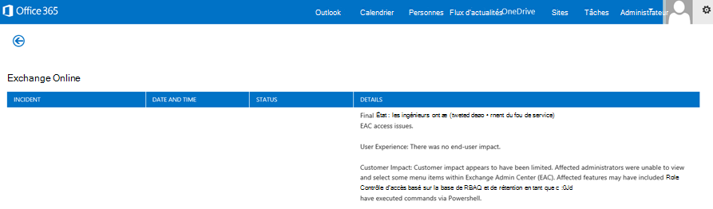
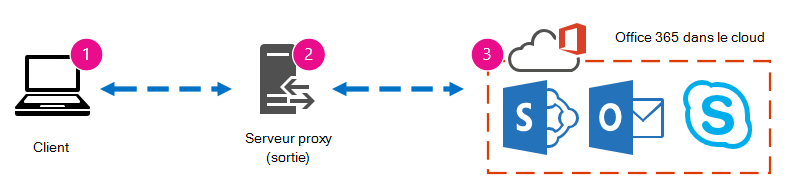

# Optimisation des performances d’Office 365 à l’aide de lignes de référence et de l’historique des performances

Il existe quelques méthodes simples pour vérifier les performances de connexion entre Office 365 et votre entreprise qui vous permet d’établir une base de référence approximative de votre connectivité. La connaissance de l’historique des performances de vos connexions d’ordinateur client peut vous aider à détecter les problèmes émergentes tôt, à identifier et à prévoir les problèmes.
  
Si vous n’êtes pas habitué à travailler sur les problèmes de performances, cet article est conçu pour vous aider à prendre en compte certaines questions courantes, telles que comment savoir si le problème que vous voyez est un problème de performances et non un incident de service Office 365 ? Comment planifier de bonnes performances à long terme ? Comment pouvez-vous garder un œil sur les performances ? Si vos équipes ou clients voient des performances lentes lors de l’utilisation de Office 365, et que vous vous interrogez sur l’une de ces questions, lisez la suite.
  
> [!IMPORTANT]
> **Vous avez un problème de performances entre votre client et Office 365 maintenant ?** Suivez les étapes décrites dans le plan de résolution des [problèmes de performances pour Office 365](performance-troubleshooting-plan.md). 
    
## Informations à connaître sur les performances Office 365 performances

Office 365 vie au sein d’un réseau Microsoft à haute capacité et dédié qui est surveillé de manière continuelle non seulement par l’automatisation, mais par des personnes réelles. Une partie du rôle de maintenance du cloud Office 365 est d’affiner les performances et de simplifier les choses lorsque cela est possible. Étant donné que les clients du cloud Office 365 doivent se connecter via Internet, il est toujours possible d’affiner les performances entre les services Office 365 web. Les améliorations des performances ne s’arrêtent jamais vraiment dans le cloud, et il existe une grande expérience en matière de maintien de l’état d’un cloud sain et rapide. Si vous avez un problème de performances lors de la connexion de votre emplacement à Office 365, il est préférable de ne pas commencer par un cas de support et d’attendre. Au lieu de cela, vous devez commencer à examiner le problème de « de l’intérieur ». C’est-à-dire, commencez à l’intérieur de votre réseau et vous Office 365. Avant d’ouvrir un cas avec Office 365 support technique, vous pouvez collecter des données et prendre des mesures qui exploreront et pourront résoudre votre problème.
  
> [!IMPORTANT]
> N’ignorez pas les limites et la planification de la capacité Office 365. Ces informations vous placeront en tête de la courbe lorsque vous tenterez de résoudre un problème de performances. Voici un lien vers les descriptions [Microsoft 365 et Office 365 service.](/office365/servicedescriptions/office-365-service-descriptions-technet-library) Il s’agit d’un concentrateur central et tous les services Office 365 ont un lien qui permet d’y trouver leurs propres descriptions de service. Cela signifie que, si vous devez voir les limites standard pour SharePoint Online, par exemple, vous devez cliquer sur [SharePoint Description](/office365/servicedescriptions/sharepoint-online-service-description/sharepoint-online-service-description) du service en ligne et rechercher sa section SharePoint [Limites](/office365/servicedescriptions/sharepoint-online-service-description/sharepoint-online-limits)en ligne . 
  
Assurez-vous d’aller dans votre résolution des problèmes en comprenant que les performances sont une échelle de glissement, il ne s’agit pas d’obtenir une valeur idéalisée et de la maintenir définitivement (si vous pensez que c’est le cas, alors les tâches à bande passante élevée occasionnelles, comme l’embarquement d’un grand nombre d’utilisateurs ou l’exécution de migrations de données importantes, seront très gênantes; planifiez donc les impacts sur les performances). Vous pouvez et devez avoir une idée approximative de vos objectifs de performances, mais un grand nombre de variables jouent en fonction des performances, par conséquent, les performances varient. C’est la nature des performances. 
  
Le dépannage des performances ne s’agit pas de répondre à des objectifs spécifiques et de maintenir ces nombres indéfiniment, mais d’améliorer les activités existantes, compte tenu de toutes les variables. 
  
## Ok, à quoi ressemble un problème de performances ?

Tout d’abord, vous devez vous assurer que ce que vous rencontrez est bien un problème de performances et non un incident de service. Un problème de performances est différent d’un incident de service Office 365. Voici comment les distinguer.
  
Si le service Office 365 a des problèmes, il s’agit d’un incident de service. Vous verrez des icônes  rouge ou jaune sous État actuel dans le Centre d’administration Microsoft 365, vous pouvez également remarquer des performances lentes sur les ordinateurs clients qui se connectent à Office 365. Par exemple, si l’état d’état actuel signale une icône rouge et que vous voyez l’instruction en regard de Exchange, vous pouvez également recevoir un groupe d’appels de personnes de votre organisation qui se plaignent que les boîtes aux lettres clientes qui utilisent Exchange Online ne s’exécutent pas correctement.  Dans ce cas, il est raisonnable de supposer que vos performances Exchange Online sont simplement devenues une victime de problèmes au sein du service. 
  

  
À ce stade, vous, l’administrateur  Office 365, devez vérifier l’état actuel, puis afficher les **détails** et l’historique, fréquemment, pour rester à jour sur la maintenance que nous effectuerons sur le système. Le **tableau de bord d’état** actuel a été mis à jour pour vous tenir informé des modifications et des problèmes liés au service. Les notes et explications écrites dans l’historique d’état de santé, administrateur à administrateur, sont là pour vous aider à évaluer votre impact et à vous tenir au courant du travail en cours. 
  

  
Un problème de performances n’est pas un incident de service, même si les incidents peuvent entraîner des performances lentes. Un problème de performances se ressemble :
  
- Un problème de performances se produit  quel que soit l’état d’état actuel du centre d’administration. 
    
-  Un comportement qui était auparavant relativement transparent prend beaucoup de temps ou ne se termine jamais. 
    
- Vous pouvez également répliquer le problème ou, au moins, vous savez qu’il se produira si vous faites la bonne série d’étapes.
    
-  Si le problème est intermittent, il existe toujours un modèle, par exemple, vous savez que d’ici 10h00, vous aurez des appels d’utilisateurs qui ne pourront pas accéder de manière fiable à Office 365, et que les appels vont se faire vers midi. 
    
Cela semble probablement familier ; peut-être trop familier. Une fois que vous savez qu’il s’agit d’un problème de performances, la question suivante se pose : « Que faire ensuite ? » Le reste de cet article vous aide à déterminer exactement cela.
  
## Comment définir et tester le problème de performances

Les problèmes de performances apparaissent souvent au fil du temps. Il peut donc être difficile de définir le problème réel. Vous devez créer une bonne déclaration de problème et une bonne idée du contexte de problème, puis vous devez répéter les étapes de test pour gagner la journée. Dans le cas contraire, vous risquez d’être perdu sans erreur. Pourquoi ? Voici quelques exemples de déclarations de problèmes qui ne fournissent pas suffisamment d’informations :
  
- Le passage de ma boîte de réception à mon calendrier était quelque chose que je n’ai pas remarqué, et il s’agit maintenant d’une pause-café. Pouvez-vous faire en sorte qu’il se agisse comme avant ?
    
- Le chargement de mes fichiers sur SharePoint Online prend une vie indéfinie. Pourquoi est-ce lent à l’été, mais qu’à tout autre moment, c’est rapide ? Ne peut-il pas être rapide ?
    
Les déclarations de problème ci-dessus posent plusieurs défis importants. Plus précisément, il existe un grand nombre d’ambiguïtés à traiter. par exemple :
  
- Il n’est pas clair comment basculer entre la boîte de réception et le calendrier utilisé pour agir sur l’ordinateur portable.
    
- Lorsque l’utilisateur dit « Ne peut-il pas être rapide », qu’est-ce qui est « rapide » ?
    
- Combien de temps est « forever » ? S’agit-il de plusieurs secondes, ou minutes, ou l’utilisateur peut-il se rendre au déjeuner et finirait-il dix minutes après son retour ?
    
Tout cela est sans tenir compte du fait que l’administrateur et l’analyseur de problèmes ne peuvent pas connaître de nombreux détails des déclarations de problème comme celles-ci. Par exemple, lorsque le problème a commencé ; Que l’utilisateur travaille à domicile et ne voit que le changement lent lorsqu’il est sur un réseau à domicile ; Que l’utilisateur doit exécuter plusieurs autres applications ram intensives sur le client local, que l’utilisateur exécute un système d’exploitation plus ancien ou qu’il n’a pas exécuté de mises à jour récentes.
  
Lorsque les utilisateurs signalent un problème de performances, de nombreuses informations sont à collecter. La collecte de ces informations fait partie d’un processus appelé portée du problème ou examen de celui-ci. Voici une liste d’portée de base que vous pouvez utiliser pour collecter des informations sur votre problème de performances. Cette liste n’est pas exhaustive, mais c’est un endroit où commencer l’une des vôtres : 
  
- À quelle date le problème s’est-il produit et à quelle heure du jour ou de la nuit ?
    
- Quel type d’ordinateur client utilisiez-vous et comment se connecte-t-il au réseau d’entreprise (VPN, câblé, sans fil) ?
    
- Travailliez-vous à distance ou étiez-vous au bureau ?
    
- Avez-vous essayé les mêmes actions sur un autre ordinateur et avez-vous vu le même comportement ?
    
- Vous pouvez parcourir les étapes qui vous donnent des difficultés pour pouvoir écrire les actions que vous prenez.
    
- Quelle est la lenteur des performances en secondes ou en minutes ?
    
- Où êtes-vous dans le monde ?
    
Certaines de ces questions sont plus évidentes que d’autres. La plupart des personnes comprendront qu’un dépanneur doit suivre les étapes exactes pour reproduire le problème. Après tout, comment pouvez-vous enregistrer d’autres problèmes et comment tester si le problème est résolu ? Des informations moins évidentes sont telles que « Quelle date et quelle heure avez-vous vu le problème ? » et « Où êtes-vous ? », des informations qui peuvent être utilisées en tandem. Selon le moment où l’utilisateur travaillait, une différence de temps de quelques heures peut signifier que la maintenance est déjà en cours sur certaines parties du réseau de votre entreprise. Si, par exemple, votre entreprise possède une implémentation hybride, comme une recherche SharePoint hybride, qui peut interroger des index de recherche dans SharePoint Online et une instance SharePoint Server 2013 sur site, des mises à jour peuvent être en cours dans la batterie de serveurs sur site. Si votre entreprise est dans le cloud, la maintenance du système peut inclure l’ajout ou la suppression de matériel réseau, le déploiement de mises à jour à l’échelle de l’entreprise ou la modification du DNS ou d’une autre infrastructure principale.
  
Lorsque vous dépannagez un problème de performances, il s’agit d’un peu comme une scène de délit, vous devez être précis et observateur pour tirer des conclusions à partir des preuves. Pour ce faire, vous devez obtenir une bonne déclaration de problème en recueillant des preuves. Il doit inclure le contexte de l’ordinateur, le contexte de l’utilisateur, le début du problème et les étapes exactes qui ont exposé le problème de performances. Cette déclaration de problème doit être, et rester, la page la plus haute dans vos notes. En parant à nouveau l’instruction du problème après avoir travaillé sur la résolution, vous prenez les mesures nécessaires pour tester et prouver si les actions que vous avez prises ont résolu le problème. Cela est essentiel pour savoir quand votre travail est effectué.
  
## Connaissez-vous l’apparence des performances lorsqu’elles étaient bonnes ?

Si vous ne faites rien, personne ne le sait. Personne n’avait de nombres. Cela signifie que personne ne peut répondre à la question simple « Combien de secondes a été utilisée pour ouvrir une boîte de réception dans Office 365 ? » ou « Combien de temps cela a-t-il pris lorsque les cadres ont eu une réunion Lync Online ? », ce qui est un scénario courant pour de nombreuses entreprises.
  
Ce qui est manquant ici est une ligne de base de performances.
  
Les lignes de base vous donnent un contexte pour vos performances. Vous devez prendre une base de référence de temps à autre, en fonction des besoins de votre entreprise. Si vous êtes une grande entreprise, votre équipe des opérations peut déjà prendre des lignes de base pour votre environnement local. Par exemple, si vous patchez tous les serveurs Exchange le premier lundi du mois et tous vos serveurs SharePoint le troisième lundi, votre équipe des opérations dispose probablement d’une liste de tâches et de scénarios qu’elle exécute après la correction, pour prouver que les fonctions critiques sont opérationnelles. Par exemple, ouvrent la boîte de réception, cliquent sur Envoyer/Recevoir et s’assurent que les dossiers sont mis à jour, ou, dans SharePoint, en parcourant la page principale du site, en allant dans la page de recherche d’entreprise et en faisant une recherche qui renvoie des résultats.
  
Si vos applications sont en Office 365, vous pouvez mesurer la durée (en millisecondes) d’un ordinateur client à l’intérieur de votre réseau, vers un point de sortie ou le point où vous quittez votre réseau et que vous quittez Office 365. Voici quelques lignes de base utiles que vous pouvez examiner et enregistrer :
  
- Identifiez les périphériques entre votre ordinateur client et votre point de sortie, par exemple, votre serveur proxy.
    
  - Vous devez connaître vos périphériques afin d’avoir un contexte (adresses IP, type d’appareil, etc.) pour les problèmes de performances qui surviennent.
    
  - Les serveurs proxy sont des points de sortie courants. Vous pouvez donc vérifier votre navigateur web pour voir le serveur proxy qu’il est prêt à utiliser, le cas besoin.
    
  - Il existe des outils tiers qui peuvent découvrir et ma cartographier votre réseau, mais le moyen le plus sûr de connaître vos appareils consiste à demander à un membre de votre équipe réseau.
    
- Identifiez votre fournisseur de services Internet (ISP), notez ses informations de contact et demandez le nombre de circuits dont vous avez la bande passante.
    
- Au sein de votre entreprise, identifiez les ressources pour les appareils entre votre client et le point de sortie, ou identifiez un contact d’urgence pour parler des problèmes de réseau.
    
Voici quelques lignes de base que des tests simples à l’aide d’outils peuvent calculer pour vous :
  
- Temps écoulé entre votre ordinateur client et votre point de sortie en millisecondes
    
- Temps écoulé entre le point de sortie et Office 365 en millisecondes
    
- Emplacement dans le monde du serveur qui résout les URL des Office 365 lorsque vous parcourez
    
- La vitesse de résolution DNS de votre isp en millisecondes, les incohérences dans l’arrivée des paquets (gigue réseau), les temps de chargement et de téléchargement en millisecondes
    
Si vous ne savez pas comment effectuer ces étapes, nous allons passer en revue plus en détail dans cet article. 
  
## Qu’est-ce qu’une ligne de base ?

Vous en sconnaissez l’impact lorsque cela se passe mal, mais si vous ne connaissez pas vos données de performances historiques, il n’est pas possible d’avoir un contexte pour savoir à quel point elles sont devenues mauvaises et quand. Ainsi, sans référence, il vous manque l’indice clé pour résoudre le puzzle : l’image de la zone de puzzle. Dans le dépannage des performances, vous avez besoin d’un point de *comparaison.* Les bases de référence de performances simples ne sont pas difficiles à prendre. Votre équipe des opérations peut être chargée d’effectuer ces opérations selon un calendrier. Par exemple, supposons que votre connexion ressemble à ceci : 
  

  
Cela signifie que vous avez vérifié auprès de votre équipe réseau et découvert que vous quittez votre entreprise pour Internet via un serveur proxy, et que ce proxy gère toutes les demandes que votre ordinateur client envoie au cloud. Dans ce cas, vous devez dessiner une version simplifiée de votre connexion qui répertorie tous les périphériques intermédiaires. À présent, insérez des outils que vous pouvez utiliser pour tester les performances entre le client, le point de sortie (où vous quittez votre réseau pour Internet) et le Office 365 cloud.
  

  
Les options sont répertoriées  comme **simples** et avancées en raison de la quantité d’expertise dont vous avez besoin pour trouver les données de performances. Une trace réseau prend beaucoup de temps, par rapport à l’exécution d’outils en ligne de commande tels que PsPing et TraceTCP. Ces deux outils en ligne de commande ont été choisis parce qu’ils n’utilisent pas de paquets ICMP, qui seront bloqués par Office 365 et parce qu’ils donnent le temps en millisecondes nécessaires pour quitter l’ordinateur client ou le serveur proxy (si vous avez accès) et arriver à Office 365. Chaque saut individuel d’un ordinateur à un autre se termine par une valeur de temps, ce qui est idéal pour les lignes de base ! Tout aussi important, ces outils en ligne de commande vous permettent d’ajouter un numéro de port à la commande, car Office 365 communique sur le port 443, qui est le port utilisé par SSL et TLS (Secure Sockets Layer and Transport Layer Security). Toutefois, d’autres outils tiers peuvent être de meilleures solutions pour votre situation. Microsoft ne prend pas en charge tous ces outils, donc si, pour une raison quelconque, vous ne pouvez pas faire fonctionner PsPing et TraceTCP, vous pouvez passer à une trace réseau avec un outil tel que Netmon. 
  
Vous pouvez prendre une planification avant les heures d’ouverture, à nouveau pendant une utilisation importante, puis à nouveau après les heures d’ouverture. Cela signifie que vous avez peut-être une structure de dossiers qui ressemble un peu à ceci à la fin :
  

  
Vous devez également choisir une convention d’attribution de noms pour vos fichiers. Voici quelques exemples :
  
- Feb_09_2015_9amPST_PerfBaseline_Netmon_ClientToEgress_Normal
    
- Jan_10_2015_3pmCST_PerfBaseline_PsPing_ClientToO365_bypassProxy_SLOW
    
- Feb_08_2015_2pmEST_PerfBaseline_BADPerf
    
- Feb_08_2015_8-30amEST_PerfBaseline_GoodPerf
    
Il existe de nombreuses façons de le faire, mais l’utilisation du format **\<dateTime\>\<what's happening in the test\>** est un bon point de départ. Le fait d’être prudent à ce sujet vous aidera beaucoup lorsque vous tenterez de résoudre des problèmes ultérieurement. Par la suite, vous pourrez dire « J’ai suivi deux suivis le 8 février, l’un a affiché de bonnes performances et l’autre a affiché de mauvaises performances, afin de pouvoir les comparer ». Cela est extrêmement utile pour la résolution des problèmes. 
  
Vous devez avoir une façon organisée de conserver vos références historiques. Dans cet exemple, les méthodes simples ont produit trois sorties de ligne de commande et les résultats ont été collectés sous forme de captures d’écran, mais vous pouvez avoir des fichiers de capture réseau à la place. Utilisez la méthode qui vous est la plus efficace. Stockez vos références historiques et faites-y référence aux points où vous remarquez des modifications dans le comportement des services en ligne. 
  
## Pourquoi collecter des données de performances au cours d’un projet pilote ?

Il n’y a pas de meilleur moment pour commencer à effectuer des planifications que pendant un pilote du service Office 365 service. Votre bureau peut avoir des milliers d’utilisateurs, des centaines de milliers ou cinq, mais même avec un petit nombre d’utilisateurs, vous pouvez effectuer des tests pour mesurer les variations de performances. Dans le cas d’une grande entreprise, un échantillon représentatif de plusieurs centaines d’utilisateurs pilotant des Office 365 peut être projeté vers l’extérieur à plusieurs milliers pour vous aider à savoir où les problèmes peuvent survenir avant qu’ils ne se produisent.
  
Dans le cas d’une petite entreprise, où l’embarquement signifie que tous les utilisateurs utilisent le service en même temps et qu’il n’existe pas de pilote, conservez des mesures de performances afin que vous avez des données à présenter à toute personne qui risque de devoir résoudre des problèmes d’une opération dont les performances sont mauvaises. Par exemple, si vous remarquez que vous pouvez vous déplacer dans votre bâtiment le temps qu’il faut pour télécharger un graphique de taille moyenne où il se produit très rapidement.
  
## Comment collecter les lignes de base

Pour tous les plans de résolution des problèmes, vous devez au minimum identifier les éléments ci-après :
  
- L’ordinateur client que vous utilisez (le type d’ordinateur ou d’appareil, une adresse IP et les actions à l’origine du problème)
    
- Emplacement où se trouve l’ordinateur client dans le monde (par exemple, si cet utilisateur est sur un réseau VPN, travaille à distance ou sur l’intranet de l’entreprise)
    
- Point de sortie utilisé par l’ordinateur client à partir de votre réseau (point auquel le trafic quitte votre entreprise pour un fournisseur de services Internet ou Internet)
    
 Vous pouvez connaître la disposition de votre réseau auprès de l’administrateur réseau. Si vous êtes sur un réseau de petite taille, jetez un œil aux appareils qui vous connectent à Internet et appelez votre fournisseur de services Internet si vous avez des questions sur la disposition. Créez un graphique de la disposition finale pour votre référence. 
  
Cette section est décomposée en outils et méthodes de ligne de commande simples et en options d’outils plus avancées. Nous allons tout d’abord couvrir les méthodes simples. Toutefois, si vous avez un problème de performances pour le moment, vous devez passer aux méthodes avancées et essayer l’exemple de plan d’action de résolution des problèmes de performances.
  
### Méthodes simples

L’objectif de ces méthodes simples est d’apprendre à prendre, à comprendre et à stocker correctement des bases de référence de performances simples au fil du temps afin d’être informé des performances Office 365 performances. Voici le diagramme très simple pour le plus simple, comme vous l’avez vu auparavant :
  

  
> [!NOTE]
> TraceTCP est inclus dans cette capture d’écran, car il s’agit d’un outil utile pour afficher, en millisecondes, la durée de traitement d’une demande et le nombre de sauts réseau, ou de connexions d’un ordinateur à l’autre, que la demande prend pour atteindre une destination. TraceTCP peut également donner les noms des serveurs utilisés pendant les sauts, ce qui peut être utile pour un Microsoft Office 365 résolution des problèmes dans le support technique. > commandes TraceTCP peuvent être très simples, telles que : >> n’oubliez pas d’inclure le numéro de port dans  `tracetcp.exe outlook.office365.com:443` la commande ! > [TraceTCP est](https://simulatedsimian.github.io/tracetcp_download.html) un téléchargement gratuit, mais s’appuie sur Wincap. Wincap est un outil qui est également utilisé et installé par Netmon. Nous utilisons également Netmon dans la section méthodes avancées. 
  
 Si vous avez plusieurs bureaux, vous devez également conserver un ensemble de données d’un client à chacun de ces emplacements. Ce test mesure la latence, qui, dans ce cas, est une valeur de nombre qui décrit la durée entre un client envoyant une demande à Office 365 et Office 365 répondre à la demande. Le test provient de votre domaine sur un ordinateur client et cherche à mesurer un aller-retour depuis l’intérieur de votre réseau, à travers un point de sortie, sur Internet pour Office 365 et retour. 
  
Il existe plusieurs façons de gérer le point de sortie, dans ce cas, le serveur proxy. Vous pouvez suivre de 1 à 2, puis de 2 à 3, puis ajouter les nombres en millisecondes pour obtenir un total final au bord de votre réseau. Vous pouvez également configurer la connexion pour qu’elle contourne le proxy Office 365 adresses. Dans un réseau de plus grande taille avec un pare-feu, un proxy inverse ou une combinaison des deux, vous devrez peut-être faire des exceptions sur le serveur proxy pour autoriser le trafic à passer pour un grand nombre d’URL. Pour obtenir la liste des points de terminaison utilisés par Office 365, voir Office 365 [URL et plages d’adresses IP.](https://support.office.com/article/8548a211-3fe7-47cb-abb1-355ea5aa88a2) Si vous avez un proxy d’authentification, commencez par tester les exceptions pour les données suivantes :
  
- Ports 80 et 443
    
- TCP et HTTPs
    
- Connexions sortantes vers l’une de ces URL :
    
- \*.microsoftonline.com
    
- \*.microsoftonline-p.com
    
- \*.sharepoint.com
    
- \*.outlook.com
    
- \*.lync.com
    
- osub.microsoft.com
    
Tous les utilisateurs doivent être autorisés à se rendre à ces adresses sans interférences de proxy ou authentification. Sur un réseau plus petit, vous devez les ajouter à votre liste de contournement de proxy dans votre navigateur web. 
  
Pour les ajouter à votre liste de  contournement de proxy dans Internet Explorer, allez à \> Outils **Internet Options** \> **Connexions** \> **avancées.** \>  L’onglet avancé est également l’endroit où vous trouverez votre serveur proxy et votre port de serveur proxy. Vous devrez peut-être cliquer sur la case à cocher Utiliser un serveur proxy pour votre **laN** pour accéder au **bouton** Avancé. Assurez-vous que le contournement du **serveur proxy pour les adresses locales** est vérifié. Une fois que **vous avez cliqué** sur Avancé, vous verrez une zone de texte dans laquelle vous pouvez entrer des exceptions. Séparez les URL génériques répertoriées ci-dessus par des points-virgules, par exemple :
  
\*.microsoftonline.com; \*.sharepoint.com
  
Une fois que vous avez contourné votre proxy, vous devez être en mesure d’utiliser ping ou PsPing directement sur une URL Office 365 suivante. L’étape suivante consiste à tester la commande ping **outlook.office365.com**. Ou, si vous utilisez PsPing ou un autre outil qui vous permet de fournir un numéro de port à la commande, PsPing par rapport à **portal.microsoftonline.com:443** pour voir le temps d’aller-retour moyen en millisecondes. 
  
Le temps d’aller-retour, ou RTT, est une valeur de nombre qui mesure le temps qu’il faut pour envoyer une demande HTTP à un serveur comme outlook.office365.com et obtenir une réponse qui reconnaît que le serveur sait que vous l’avez fait. Vous verrez parfois cette abréviation en tant que RTT. Cette durée doit être relativement courte.
  
Vous devez utiliser [PSPing](/sysinternals/downloads/psping) ou un autre outil qui n’utilise pas de paquets ICMP qui sont bloqués par Office 365 pour ce test. 
  
 **Utilisation de PsPing pour obtenir une durée d’aller-retour globale en millisecondes directement à partir d’une URL Office 365'accès**
  
1. Exécutez une invite de commandes avec élévation de niveau élevé en effectuant les étapes suivantes :
    
1. Cliquez sur **Démarrer**.
    
2. Dans la **zone Démarrer la** recherche, tapez cmd, puis appuyez sur Ctrl+Shift+Entrée.
    
3. Si la boîte de dialogue **Contrôle de compte d'utilisateur** apparaît, confirmez que l'action affichée est celle que vous souhaitez, puis cliquez sur **Continue** r.
    
2. Accédez au dossier où l’outil (dans ce cas, PsPing) est installé et testez les URL Office 365:.
    
  - admin.microsoft.com:443
    
  - microsoft-my.sharepoint.com:443
    
  - outlook.office365.com:443
    
  - www.yammer.com:443
    
    
  
N’oubliez pas d’inclure le numéro de port 443. N’oubliez Office 365 fonctionne sur un canal chiffré. Si vous psPing sans le numéro de port, votre demande échouera. Une fois que vous avez lancé une commande ping sur votre liste courte, recherchez le temps moyen en millisecondes (ms). C’est ce que vous souhaitez enregistrer !
  

  
Si vous n’êtes pas familiarisé avec le contournement de proxy et que vous préférez prendre les choses étape par étape, vous devez d’abord connaître le nom de votre serveur proxy. In Internet Explorer go to **Tools** \> **Internet Options** \> **Connections** \> **LAN settings** \> **Advanced**. **L’onglet** Avancé est l’endroit où votre serveur proxy est répertorié. Testez ce serveur proxy à l’invite de commandes en effectuant cette tâche : 
  
 **Pour pingr le serveur proxy et obtenir une valeur d’aller-retour en millisecondes pour l’étape 1 à 2**
  
1. Exécutez une invite de commandes avec élévation de niveau élevé en effectuant les étapes suivantes :
    
1. Cliquez sur **Démarrer**.
    
2. Dans la **zone Démarrer la** recherche, tapez cmd, puis appuyez sur Ctrl+Shift+Entrée.
    
3. Si la boîte de dialogue **Contrôle de compte d'utilisateur** apparaît, confirmez que l'action affichée est celle que vous souhaitez, puis cliquez sur **Continue** r.
    
2. Tapez \<the name of the proxy server your browser uses, or the IP address of the proxy server\> ping, puis appuyez sur Entrée. Si vous avez installé PsPing ou un autre outil, vous pouvez choisir d’utiliser cet outil à la place. 
    
    Votre commande peut ressembler à l’un des exemples suivants : 
    
  - ping ourproxy.ourdomain.industry.business.com
    
  - ping 155.55.121.55
    
  - ping ourproxy
    
  - ourproxy.ourdomain.industry.business.com:80
    
  - 155.55.121.55:80
    
  - ing ourproxy:80
    
3. Lorsque le suivi cesse d’envoyer des paquets de test, vous obtenez un petit résumé qui répertorie une moyenne, en millisecondes, et c’est la valeur que vous cherchez. Prenez une capture d’écran de l’invite et enregistrez-la à l’aide de votre convention d’attribution de noms. À ce stade, il peut également être utile de remplir le diagramme avec la valeur.
    
Vous avez peut-être pris un suivi au début de la journée et votre client peut rapidement se rendre au proxy (ou à tout autre serveur sortant vers Internet). Dans ce cas, vos numéros peuvent ressembler à ceci :
  

  
Si votre ordinateur client est l’un des quelques-uns sélectionnés ayant accès au serveur proxy (ou à la sortie), vous pouvez exécuter la partie suivante du test en vous connectant à distance à cet ordinateur, en exécutant l’invite de commandes psPing vers une URL Office 365 à partir de cet emplacement. Si vous n’avez pas accès à cet ordinateur, vous pouvez contacter vos ressources réseau pour obtenir de l’aide sur la prochaine étape et obtenir des numéros exacts de cette façon. Si ce n’est pas possible, comparez un PsPing à l’URL Office 365 en question et comparez-le à l’heure PsPing ou Ping par rapport à votre serveur proxy. 
  
Par exemple, si vous avez 51,84 millisecondes entre le client et l’URL Office 365 et que vous avez 2,8 millisecondes entre le client et le proxy (ou point de sortie), vous avez 49,04 millisecondes entre la sortie et Office 365. De même, si vous avez un PsPing de 12,25 millisecondes entre le client et le proxy pendant la hauteur de la journée et de 62,01 millisecondes entre le client et l’URL Office 365, votre valeur moyenne pour la sortie du proxy vers l’URL Office 365 est de 49,76 millisecondes.
  

  
En termes de résolution des problèmes, vous trouverez peut-être quelque chose d’intéressant simplement en conservant ces lignes de base. Par exemple, si vous constatez que vous avez généralement entre 40 et 59 millisecondes de latence entre le proxy ou le point de sortie vers l’URL Office 365, et avoir un client pour proxy ou une latence de point de sortie d’environ 3 à 7 millisecondes (en fonction de la quantité de trafic réseau que vous voyez pendant cette heure de la journée), vous savez certainement quelque chose qui pose problème si vos trois derniers clients à proxy ou sortie des lignes de base indiquent une latence de 45 millisecondes.
  
### Méthodes avancées

Si vous voulez vraiment savoir ce qui se passe avec vos demandes Internet à Office 365, vous devez vous familiariser avec les suivis réseau. Peu importe les outils que vous préférez pour ces suivis, HTTPWatch, Netmon, Message Analyzer, Wireshark, Fiddler, l’outil Tableau de bord du développeur ou tout autre outil, tant que cet outil peut capturer et filtrer le trafic réseau. Vous verrez dans cette section qu’il est utile d’exécuter plusieurs de ces outils pour obtenir une image plus complète du problème. Lorsque vous testez, certains de ces outils agissent également en tant que proxies. Outils utilisés dans l’article complémentaire, Plan de résolution des problèmes de performances [pour Office 365](performance-troubleshooting-plan.md), incluent [Netmon 3.4](https://www.microsoft.com/download/details.aspx?id=4865), [HTTPWatch](https://www.httpwatch.com/download/)ou [WireShark](https://www.wireshark.org/).
  
La prise d’une ligne de base de performances est la partie simple de cette méthode, et de nombreuses étapes sont les mêmes que lorsque vous dépanner un problème de performances. Les méthodes plus avancées de création de bases de référence pour les performances nécessitent que vous prenons et stockiez les suivis réseau. La plupart des exemples de cet article utilisent SharePoint Online, mais vous devez développer une liste d’actions courantes dans les services Office 365 auquel vous vous abonnez pour tester et enregistrer. Voici un exemple de référence :
  
- Liste de référence pour SPO - ** Étape 1 : ** Parcourir la page d’accueil du site web SPO et suivre le réseau. Enregistrez le suivi. 
    
- Liste de référence pour SPO - Étape **2** : rechercher un terme (par exemple, le nom de votre société) via Enterprise recherche et effectuer un suivi réseau. Enregistrez le suivi. 
    
- Liste de référence pour SPO - Étape **3** : Télécharger fichier de grande taille dans une bibliothèque de documents SharePoint Online et suivre le réseau. Enregistrez le suivi. 
    
- Liste de référence pour SPO - **Étape 4 : parcourir** la page d’accueil du site OneDrive web et suivre le réseau. Enregistrez le suivi. 
    
Cette liste doit inclure les actions courantes les plus importantes que les utilisateurs prennent SharePoint Online. Notez que la dernière étape, pour suivre l’accès à OneDrive Entreprise, crée une comparaison entre la charge de la page d’accueil SharePoint Online (qui est souvent personnalisée par les entreprises) et la page d’accueil OneDrive Entreprise, qui est rarement personnalisée. Il s’agit d’un test très simple lorsqu’il s’agit d’un site SharePoint Online à chargement lent. Vous pouvez créer un enregistrement de cette différence dans vos tests.
  
Si vous êtes au milieu d’un problème de performances, la plupart des étapes sont les mêmes que lors de la prise d’une ligne de base. Les suivis réseau deviennent essentiels. Nous allons donc gérer les suivis importants ensuite.  
  
Pour résoudre un problème de  *performances,*  pour l’instant, vous devez suivre le problème au moment où vous rencontrez le problème de performances. Vous devez avoir les outils appropriés disponibles pour collecter les journaux, et vous avez besoin d’un plan d’action, c’est-à-dire une liste d’actions de dépannage à prendre pour collecter les meilleures informations possibles. La première chose à faire est d’enregistrer la date et l’heure du test afin que les fichiers soient enregistrés dans un dossier qui reflète le minutage. Ensuite, limitez-vous aux étapes du problème elles-mêmes. Voici les étapes exactes que vous utiliserez pour les tests. N’oubliez pas les principes de base : si le problème n’est qu’avec Outlook, veillez à enregistrer que le comportement du problème se produit dans un seul service Office 365 service. Le fait de restreindre l’étendue de ce problème vous aidera à vous concentrer sur un point que vous pouvez résoudre. 
  
## Voir aussi

[Gestion des points de terminaison Office 365](https://support.office.com/article/99cab9d4-ef59-4207-9f2b-3728eb46bf9a)