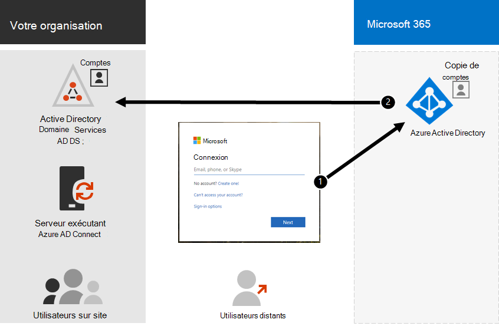

# Synchronisation d’annuaires et d’identités hybrides pour Microsoft 365

*Cet article est valable pour Microsoft 365 Entreprise et Office 365 Entreprise.*

En fonction des besoins de votre entreprise et des exigences techniques, le modèle d’identité hybride et la synchronisation d’annuaires sont le choix le plus courant pour les clients d’entreprise qui adoptent Microsoft 365. La synchronisation d’annuaires vous permet de gérer les identités dans vos services de domaine Active Directory (AD DS) et toutes les mises à jour des comptes d’utilisateur, des groupes et des contacts sont synchronisées avec le client Azure Active Directory (Azure AD) de votre abonnement Microsoft 365.

>[!Note]
>Lorsque les comptes d’utilisateurS AD DS sont synchronisés pour la première fois, ils ne se voit pas attribuer automatiquement une licence Microsoft 365 et ne peuvent pas accéder aux services Microsoft 365, tels que la messagerie électronique. Vous devez d’abord leur attribuer un emplacement d’utilisation. Ensuite, attribuez une licence à ces comptes d’utilisateurs, individuellement ou dynamiquement par le biais de l’appartenance à un groupe.
>

## Authentification pour l’identité hybride

Il existe deux types d’authentification lors de l’utilisation du modèle d’identité hybride :

- Authentification gérée

  Azure AD gère le processus d’authentification à l’aide d’une version de hachage stockée localement du mot de passe ou envoie les informations d’identification à un agent logiciel local pour qu’ils soient authentifiés par les services AD DS locaux.

- Authentification fédérée

  Azure AD redirige l’ordinateur client demandant l’authentification vers un autre fournisseur d’identité.

### Authentification gérée

Il existe deux types d’authentification gérée :

- Synchronisation de hachage de mot de passe (PHS)

  Azure AD effectue l’authentification proprement dite.

- Authentification directe (PTA)

  Azure AD dispose d’AD DS qui effectue l’authentification.

#### Synchronisation de hachage de mot de passe (PHS)

Avec PHS, vous synchronisez vos comptes d’utilisateur AD DS avec Microsoft 365 et gérez vos utilisateurs en local. Les hèses de mots de passe utilisateur sont synchronisés à partir de vos services AD DS avec Azure AD afin que les utilisateurs disposent du même mot de passe en local et dans le cloud. Il s’agit du moyen le plus simple d’activer l’authentification pour les identités AD DS dans Azure AD. 

Lorsque des mots de passe sont modifiés ou réinitialisés en local, les nouveaux hésiteurs de mot de passe sont synchronisés avec Azure AD afin que vos utilisateurs peuvent toujours utiliser le même mot de passe pour les ressources cloud et les ressources sur site. Les mots de passe utilisateur ne sont jamais envoyés à Azure AD ou stockés dans Azure AD en texte clair. Certaines fonctionnalités premium d’Azure AD, telles que identity protection, nécessitent PHS, quelle que soit la méthode d’authentification sélectionnée.
  
Pour en [savoir plus,](/azure/active-directory/hybrid/choose-ad-authn) voir choisir la méthode d’authentification la plus efficace.
  
#### Authentification directe (PTA)

PTA fournit une validation de mot de passe simple pour les services d’authentification Azure AD à l’aide d’un agent logiciel s’exécutant sur un ou plusieurs serveurs locaux pour valider les utilisateurs directement avec vos services AD DS. Avec LTA, vous synchronisez les comptes d’utilisateur AD DS avec Microsoft 365 et gérez vos utilisateurs en local. 

PTA permet à vos utilisateurs de se connectent à la fois aux ressources et applications sur site et Microsoft 365 à l’aide de leur compte local et de leur mot de passe. Cette configuration valide les mots de passe des utilisateurs directement par rapport à vos AD DS sur site sans stocker les hchéhes de mot de passe dans Azure AD. 

PTA est également pour les organisations ayant une obligation de sécurité d’appliquer immédiatement les états de compte d’utilisateur local, les stratégies de mot de passe et les heures d’ouverture de bureau. 
  
Pour en [savoir plus,](/azure/active-directory/hybrid/choose-ad-authn) voir choisir la méthode d’authentification la plus efficace.
  
### Authentification fédérée

L’authentification fédérée est principalement destinée aux grandes entreprises ayant des exigences d’authentification plus complexes. Les identités AD DS sont synchronisées avec Microsoft 365 et les comptes d’utilisateurs sont gérés localement. Avec l’authentification fédérée, les utilisateurs ont le même mot de passe en local et dans le cloud et ils n’ont pas besoin de se connecter à nouveau pour utiliser Microsoft 365. 

L’authentification fédérée peut prendre en charge des exigences d’authentification supplémentaires, telles que l’authentification basée sur une carte à puce ou une authentification multifacteur tierce. Elle est généralement requise lorsque les organisations ont une exigence d’authentification non prise en charge en natif par Azure AD.
 
Pour en [savoir plus,](/azure/active-directory/hybrid/choose-ad-authn) voir choisir la méthode d’authentification la plus efficace.
  
#### Fournisseurs d’identité et d’authentification tiers

Les objets d’annuaire locaux peuvent être synchronisés avec Microsoft 365 et l’accès aux ressources cloud est principalement géré par un fournisseur d’identité (IdP) tiers. Si votre organisation utilise une solution de fédération tierce, vous pouvez configurer l' sign-on avec cette solution pour Microsoft 365 à condition que la solution de fédération tierce soit compatible avec Azure AD.
  
Pour en savoir plus, consultez la liste de compatibilité de fédération [Azure AD.](/azure/active-directory/connect/active-directory-aadconnect-federation-compatibility)
  
## Préparation des AD DS

Pour garantir une transition transparente vers Microsoft 365 à l’aide de la synchronisation, vous devez préparer votre forêt AD DS avant de commencer votre déploiement de synchronisation d’annuaires Microsoft 365.
  
La préparation de votre annuaire doit se concentrer sur les tâches suivantes :

- Supprimez les **attributs proxyAddress** et **userPrincipalName en** double.
- Mettez à jour les attributs **userPrincipalName vides** et non valides avec des attributs **userPrincipalName** valides.
- Supprimez les caractères non valides et discutables dans les attributs **givenName**, surname ( **sn** ), **sAMAccountName**, **displayName**, **mail**, **proxyAddresses**, **mailNickname** et **userPrincipalName.** Pour plus d’informations sur la préparation des attributs, voir Liste des attributs synchronisés par l’outil de synchronisation [Azure Active Directory.](https://go.microsoft.com/fwlink/p/?LinkId=396719)

    > [!NOTE]
    > Il s’agit des mêmes attributs que ceux synchronisés par Azure AD Connect. 
  
## Considérations sur le déploiement à forêts multiples

Pour plusieurs forêts et options DSO, utilisez une installation personnalisée [d’Azure AD Connect](/azure/active-directory/hybrid/how-to-connect-install-custom).
  
Si votre organisation possède plusieurs forêts pour l’authentification (forêts d’authentification), nous vous recommandons vivement les points suivants :
  
- **Envisagez de consolider vos forêts.** En règle générale, une surcharge supplémentaire est nécessaire pour gérer plusieurs forêts. À moins que votre organisation ne possède des contraintes de sécurité qui imposent la nécessité de forêts distinctes, envisagez de simplifier votre environnement local.
- **À utiliser uniquement dans votre forêt d' logo principale.** Envisagez de déployer Microsoft 365 uniquement dans votre forêt principale pour votre déploiement initial de Microsoft 365. 

Si vous ne pouvez pas consolider votre déploiement AD DS à forêts multiples ou si vous utilisez d’autres services d’annuaire pour gérer les identités, vous pourrez peut-être les synchroniser avec l’aide de Microsoft ou d’un partenaire.
  
Pour plus [d’informations, voir Topologies pour Azure AD Connect.](/azure/active-directory/hybrid/plan-connect-topologies)
  
## Fonctionnalités qui dépendent de la synchronisation d’annuaires
  
La synchronisation d’annuaires est requise pour les fonctionnalités suivantes :
  
- Azure AD Seamless Single Sign-On (SSO)
- Coexistence skype
- Déploiement hybride Exchange, notamment :
  - Liste d’adresses globale (LAL) entièrement partagée entre votre environnement Exchange local et Microsoft 365.
  - Synchronisation des informations GAL provenant de différents systèmes de messagerie.
  - Possibilité d’ajouter des utilisateurs à des offres de services Microsoft 365 et de les supprimer. Cette possibilité nécessite ce qui suit :
  - La synchronisation double doit être configurée lors de la configuration de la synchronisation d’annuaires. Par défaut, les outils de synchronisation d’annuaires écrivent les informations d’annuaire uniquement dans le cloud. Lorsque vous configurez la synchronisation à double sens, vous activez la fonctionnalité d’écriture/écriture de manière à ce qu’un nombre limité d’attributs d’objet soient copiés à partir du cloud, puis écrits dans votre AD DS local. L’écriture en écriture arrière est également appelée mode hybride Exchange. 
  - Un déploiement hybride Exchange local
  - Possibilité de déplacer certaines boîtes aux lettres utilisateur vers Microsoft 365 tout en conservant d’autres boîtes aux lettres utilisateur en local.
  - Les expéditeurs sûrs et les expéditeurs bloqués locaux sont répliqués vers Microsoft 365.
  - Fonctionnalité de délégation de base et d’envoi de courrier « de la part de ».
  - Vous avez une solution d’authentification multifacteur ou de carte à puce sur site intégrée.
- Synchronisation des photos, des miniatures, des salles de conférence et des groupes de sécurité

## Étape suivante

Lorsque vous êtes prêt à déployer l’identité hybride, voir [préparer la synchronisation d’annuaires.](prepare-for-directory-synchronization.md)
