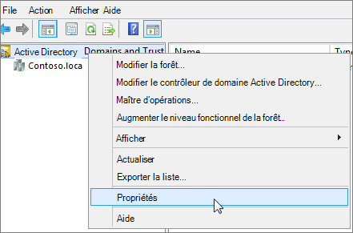
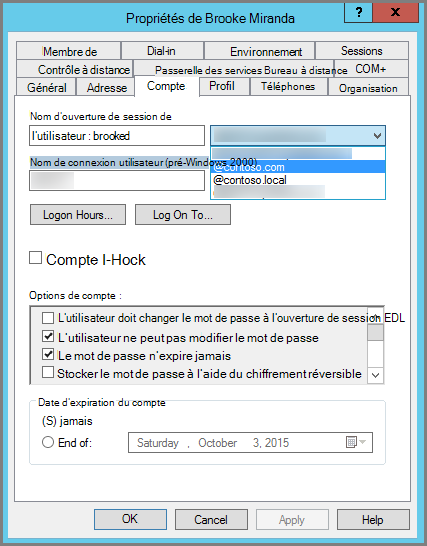

# <a name="prepare-a-non-routable-domain-for-directory-synchronization"></a>Préparation d’un domaine non routable pour la synchronisation d’annuaires

Lorsque vous synchronisez votre annuaire local avec Microsoft 365, vous devez avoir un domaine vérifié dans Azure Active Directory (Azure AD). Seuls les noms d’utilisateur principaux (UPN) associés au domaine AD DS (Active Directory Domain Services) local sont synchronisés. Toutefois, tout UPN qui contient un domaine non routable, tel que « .local » (exemple : billa@contoso.local), sera synchronisé avec un domaine .onmicrosoft.com (par exemple : billa@contoso.onmicrosoft.com). 

Si vous utilisez actuellement un domaine « .local » pour vos comptes d’utilisateur dans AD DS, il est recommandé de les modifier pour utiliser un domaine vérifié, tel que billa@contoso.com, afin de synchroniser correctement avec votre domaine Microsoft 365.
  
## <a name="what-if-i-only-have-a-local-on-premises-domain"></a>Que se passe-t-il si je n’ai qu’un domaine local « .local » ?

Vous utilisez Azure AD Connecter pour synchroniser vos AD DS avec le client Azure AD de Microsoft 365 client. Pour plus d’informations, voir Intégration de vos [identités locales à Azure AD.](/azure/architecture/reference-architectures/identity/azure-ad)
  
Azure AD Connecter synchronise l’UPN et le mot de passe de vos utilisateurs afin que les utilisateurs se connectent avec les mêmes informations d’identification qu’ils utilisent en local. Toutefois, Azure AD Connecter synchronise uniquement les utilisateurs avec les domaines qui sont vérifiés par Microsoft 365. Cela signifie que le domaine est également vérifié par Azure AD, car les identités Microsoft 365 sont gérées par Azure AD. En d’autres termes, le domaine doit être un domaine Internet valide (par exemple, .com, .org, .net, .us). Si votre AD DS interne utilise uniquement un domaine non routable (par exemple, « .local »), cela ne peut pas correspondre au domaine vérifié dont vous avez besoin pour votre client Microsoft 365. Vous pouvez résoudre ce problème en modifiant votre domaine principal dans votre AD DS local ou en ajoutant un ou plusieurs suffixes UPN.
  
### <a name="change-your-primary-domain"></a>Modifier votre domaine principal

Modifiez votre domaine principal en un domaine que vous avez vérifié dans Microsoft 365, par exemple, contoso.com. Chaque utilisateur qui possède le domaine contoso.local est ensuite mis à jour contoso.com. Il s’agit toutefois d’un processus très complexe, et une solution plus facile est décrite dans la section suivante.
  
### <a name="add-upn-suffixes-and-update-your-users-to-them"></a>Ajouter des suffixes UPN et mettre à jour vos utilisateurs

Vous pouvez résoudre le problème « .local » en enregistrant de nouveaux suffixes UPN dans AD DS pour qu’ils correspondent au ou aux domaines que vous avez vérifiés dans Microsoft 365. Après avoir inscrit le nouveau suffixe, vous mettez à jour les UPN utilisateur pour remplacer le « .local » par le nouveau nom de domaine, par exemple, afin qu’un compte d’utilisateur ressemble à billa@contoso.com.
  
Une fois que vous avez mis à jour les UPN pour utiliser le domaine vérifié, vous êtes prêt à synchroniser vos AD DS locaux avec Microsoft 365.
  
#### <a name="step-1-add-the-new-upn-suffix"></a>Étape 1 : Ajouter le nouveau suffixe UPN**
  
1. Sur le contrôleur de domaine AD DS, dans le Gestionnaire de serveur, choisissez Outils Domaines et  \> **trusts Active Directory**.
    
    **Ou, si vous n’avez pas de Windows Server 2012**
    
    Appuyez **Windows + R pour**  ouvrir la boîte de dialogue Exécuter, puis tapez Domain.msc, puis choisissez **OK**.
    
    
  
2. Dans la **fenêtre Domaines et trusts Active Directory,** cliquez avec le bouton droit sur Domaines et **trusts Active Directory,** puis choisissez **Propriétés.**
    
    
  
3. Sous **l’onglet Suffixes UPN,** dans la zone Autres **suffixes UPN,** tapez votre  nouveau suffixe UPN ou suffixes, puis choisissez Ajouter \> **appliquer**.
    
    
  
    Choisissez **OK** lorsque vous avez terminé d’ajouter des suffixes. 
    
 #### <a name="step-2-change-the-upn-suffix-for-existing-users"></a>Étape 2 : Modifier le suffixe UPN pour les utilisateurs existants
  
1. Sur le contrôleur de domaine AD DS, dans le Gestionnaire de serveur, choisissez **Outils** Utilisateurs \> **et ordinateurs Active Directory.**
    
    **Ou, si vous n’avez pas de Windows Server 2012**
    
    Appuyez **Windows + R pour**  ouvrir la boîte de dialogue Exécuter, puis tapez Dsa.msc, puis cliquez sur **OK**
    
2. Sélectionnez un utilisateur, cliquez avec le bouton droit, puis choisissez **Propriétés.**
    
3. Sous **l’onglet** Compte, dans la liste de listes de listes des suffixes UPN, choisissez le nouveau suffixe UPN, puis **choisissez OK.**
    
    
  
4. Effectuer ces étapes pour chaque utilisateur.
    
   
### <a name="use-powershell-to-change-the-upn-suffix-for-all-of-your-users"></a>Utiliser PowerShell pour modifier le suffixe UPN de tous vos utilisateurs

Si vous avez un grand nombre de comptes d’utilisateur à mettre à jour, il est plus facile d’utiliser PowerShell. L’exemple suivant utilise les cmdlets [Get-ADUser](/previous-versions/windows/it-pro/windows-server-2008-R2-and-2008/ee617241(v=technet.10)) et [Set-ADUser](/previous-versions/windows/it-pro/windows-server-2008-R2-and-2008/ee617215(v=technet.10)) pour modifier tous les suffixes contoso.local en contoso.com dans AD DS. 

Par exemple, vous pouvez exécuter les commandes PowerShell suivantes pour mettre à jour tous les suffixes contoso.local contoso.com :
    
  ```powershell
  $LocalUsers = Get-ADUser -Filter "UserPrincipalName -like '*contoso.local'" -Properties userPrincipalName -ResultSetSize $null
  $LocalUsers | foreach {$newUpn = $_.UserPrincipalName.Replace("@contoso.local","@contoso.com"); $_ | Set-ADUser -UserPrincipalName $newUpn}
  ```

Consultez [le module Windows PowerShell Active Directory](/previous-versions/windows/it-pro/windows-server-2008-R2-and-2008/ee617195(v=technet.10)) pour en savoir plus sur l Windows PowerShell dans AD DS.