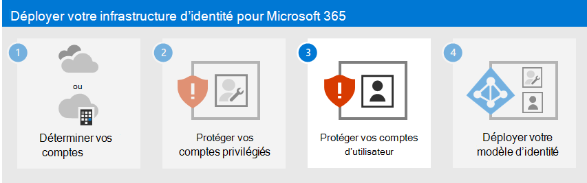

# Étape 2. Protéger vos comptes privilégiés Microsoft 365

*Cet article est valable pour Microsoft 365 Entreprise et Office 365 Entreprise.*

Les violations de sécurité d’un locataire Microsoft 365, notamment la collecte d’informations et les attaques par hameçonnage, sont généralement effectuées en compromettant les informations d’identification d’un compte privilégié Microsoft 365. La sécurité dans le cloud est un partenariat entre vous et Microsoft :
  
- Les services de cloud computing Microsoft reposent sur la confiance et la sécurité. Microsoft met à votre disposition des contrôles et fonctionnalités de sécurité pour vous aider à protéger vos données et applications.
    
- Il est de votre responsabilité de protéger vos données et votre identité, ainsi que d’assurer la sécurité de vos ressources locales et des composants cloud que vous contrôlez.
    
Microsoft fournit des fonctionnalités pour protéger votre organisation, mais elles ne sont efficaces que si vous les utilisez. Si vous ne les utilisez pas, vous risquez d’être vulnérable aux attaques. Pour protéger vos comptes privilégiés, Microsoft est là pour vous aider à obtenir des instructions détaillées pour :
  
1. Créez des comptes dédiés, privilégiés et basés sur le cloud et utilisez-les uniquement si nécessaire.
    
2. Configurez l’authentification multifacteur (MFA) pour vos comptes privilégiés Microsoft 365 dédiés et utilisez la forme la plus forte d’authentification secondaire.

3. Protégez les comptes privilégiés avec Confiance nulle des recommandations d’identité et d’accès aux appareils.

> [!NOTE]
> Pour sécuriser vos rôles privilégiés, consultez [les meilleures pratiques pour les rôles Azure AD](/azure/active-directory/roles/best-practices) afin de sécuriser l’accès privilégié à votre locataire.

## 1. Créer des comptes d’utilisateur dédiés, privilégiés et basés sur le cloud et les utiliser uniquement si nécessaire

Au lieu d’utiliser des comptes d’utilisateurs quotidiens auxquels des rôles d’administrateur ont été attribués, créez des comptes d’utilisateur dédiés qui ont les rôles d’administrateur dans Azure AD. 

À partir de ce moment, vous vous connectez avec les comptes privilégiés dédiés uniquement pour les tâches qui nécessitent des privilèges d’administrateur. Toutes les autres administrations de Microsoft 365 doivent être effectuées en attribuant d’autres rôles d’administration à des comptes d’utilisateur.
  
> [!NOTE]
> Cela nécessite des étapes supplémentaires pour vous déconnecter en tant que compte d’utilisateur quotidien et vous connecter avec un compte d’administrateur dédié. Toutefois, cela ne doit être effectué qu’occasionnellement pour les opérations d’administrateur. Tenez compte du fait que la récupération de votre abonnement Microsoft 365 après une violation de compte d’administrateur nécessite beaucoup plus d’étapes.

Vous devez également créer des [comptes d’accès d’urgence](/azure/active-directory/roles/security-emergency-access) pour éviter d’être verrouillé accidentellement dans Azure AD.

Vous pouvez protéger davantage vos comptes privilégiés avec Azure AD Privileged Identity Management (PIM) pour l’attribution à la demande et juste-à-temps des rôles d’administrateur. 
 
## 2. Configurer l’authentification multifacteur pour vos comptes privilégiés Microsoft 365 dédiés

L’authentification multifacteur (MFA) nécessite des informations supplémentaires au-delà du nom et du mot de passe du compte. Microsoft 365 prend en charge ces méthodes de vérification supplémentaires :
  
- L’application Microsoft Authenticator
- appel téléphonique ;
- Code de vérification généré de manière aléatoire envoyé par le biais d’un SMS
- Une carte à puce (virtuelle ou physique) (nécessite une authentification fédérée)
- appareil biométrique.
- Jeton Oauth
    
>[!Note]
>Pour les organisations qui doivent respecter les normes du National Institute of Standards and Technology (NIST), l’utilisation d’un appel téléphonique ou de méthodes de vérification supplémentaires basées sur des SMS est limitée. Cliquez [ici](https://pages.nist.gov/800-63-FAQ/#q-b01) pour plus d’informations.
>

Si vous êtes une petite entreprise qui utilise des comptes d’utilisateur stockés uniquement dans le cloud (le modèle d’identité cloud uniquement), [configurez l’authentification](/office365/admin/security-and-compliance/set-up-multi-factor-authentication) multifacteur pour configurer l’authentification multifacteur à l’aide d’un appel téléphonique ou d’un code de vérification de sms envoyé à un téléphone intelligent pour chaque compte privilégié dédié.
    
Si vous êtes une grande organisation qui utilise un modèle d’identité hybride Microsoft 365, vous disposez d’autres options de vérification. Si vous disposez déjà de l’infrastructure de sécurité pour une méthode d’authentification secondaire plus forte, [configurez l’authentification multifacteur](../admin/security-and-compliance/set-up-multi-factor-authentication.md) et configurez chaque compte privilégié dédié pour la méthode de vérification appropriée.
  
Si l’infrastructure de sécurité de la méthode de vérification renforcée souhaitée n’est pas en place et ne fonctionne pas pour Microsoft 365 MFA, nous vous recommandons vivement de configurer des comptes privilégiés dédiés avec l’authentification multifacteur à l’aide de l’application Microsoft Authenticator, d’un appel téléphonique ou d’un code de vérification par SMS envoyé à un téléphone intelligent pour vos comptes privilégiés comme mesure de sécurité provisoire. Ne laissez pas vos comptes privilégiés dédiés sans la protection supplémentaire fournie par l’authentification multifacteur.
  
Pour plus d’informations, consultez [MFA pour Microsoft 365](../admin/security-and-compliance/multi-factor-authentication-microsoft-365.md).
  
## 3. Protéger les comptes d’administrateur avec des recommandations d’identité Confiance nulle et d’accès aux appareils

Pour garantir une main-d’œuvre sécurisée et productive, Microsoft fournit un ensemble de recommandations pour [l’accès aux identités et aux appareils](../security/office-365-security/microsoft-365-policies-configurations.md). Pour l’identité, utilisez les recommandations et les paramètres de ces articles :

- [Conditions préalables](../security/office-365-security/identity-access-prerequisites.md)
- [Stratégies communes pour les identités et l’accès aux appareils](../security/office-365-security/identity-access-policies.md)

## Protections supplémentaires pour les organisations d’entreprise

Utilisez ces méthodes supplémentaires pour vous assurer que votre compte privilégié et la configuration que vous effectuez à l’aide de celui-ci sont aussi sécurisés que possible.
  
### Station de travail d’accès privilégié

Pour vous assurer que l’exécution de tâches à privilèges élevés est aussi sécurisée que possible, utilisez une station de travail à accès privilégié (PAW). Un PAW est un ordinateur dédié qui est utilisé uniquement pour les tâches de configuration sensibles, telles que la configuration Microsoft 365 qui nécessite un compte privilégié. Étant donné que cet ordinateur n’est pas utilisé quotidiennement pour la navigation internet ou la messagerie, il est mieux protégé contre les attaques et menaces Internet.
  
Pour obtenir des instructions sur la configuration d’un PAW, consultez [https://aka.ms/cyberpaw](/security/compass/privileged-access-devices).

Pour activer Azure PIM pour votre client Azure AD et vos comptes d’administrateur, consultez les [étapes de configuration de PIM](/azure/active-directory/active-directory-privileged-identity-management-configure).

Reportez-vous à la rubrique [Sécurisation de l’accès privilégié pour les déploiements hybrides et cloud dans Azure AD](/azure/active-directory/admin-roles-best-practices) pour développer une feuille de route détaillée qui sécurise l’accès privilégié contre les cyber-attaquants.

### Azure AD Privileged Identity Management

Au lieu d’attribuer définitivement un rôle d’administrateur à vos comptes privilégiés, vous pouvez utiliser Azure AD PIM pour activer l’attribution juste-à-temps à la demande du rôle d’administrateur quand cela est nécessaire.
  
Vos comptes d’administrateur passent d’administrateurs permanents à administrateurs éligibles. Le rôle d'administrateur est inactif tant que vous n'en avez pas besoin. Vous terminez ensuite un processus d’activation pour ajouter le rôle d’administrateur au compte privilégié pendant une durée prédéterminée. Lorsque l’heure expire, PIM supprime le rôle d’administrateur du compte privilégié.
  
L’utilisation de PIM et de ce processus réduit considérablement la durée pendant laquelle vos comptes privilégiés sont vulnérables aux attaques et à l’utilisation par des utilisateurs malveillants.

PIM est disponible avec Azure Active Directory Premium P2, qui est inclus avec Microsoft 365 E5. Vous pouvez également acheter des licences Azure Active Directory Premium P2 individuelles pour vos comptes d’administrateur.
  
Pour plus d’informations, consultez l’article suivant :

- [Azure AD Privileged Identity Management](/azure/active-directory/active-directory-privileged-identity-management-configure).
- [Sécuriser l’accès privilégié pour les déploiements hybrides et cloud dans Azure AD](/azure/active-directory/roles/security-planning)
  

### Gestion des accès privilégiés

Vous activez la gestion des accès privilégiés en configurant des stratégies qui indiquent l’accès juste-à-temps pour les activités basées sur des tâches dans votre client. Elle peut vous aider à protéger votre organisation contre les violations qui pourraient survenir par le biais de comptes d’administrateur privilégiés existants qui donnent un accès permanent à des données sensibles ou à des paramètres de configuration critiques. Par exemple, vous pouvez configurer une stratégie de gestion des accès privilégiés qui requiert une approbation explicite pour pouvoir accéder aux paramètres de boîte aux lettres de votre organisation dans votre client et les modifier.

Dans cette étape, vous allez activer la gestion des accès privilégiés dans votre locataire et configurer des stratégies d’accès privilégié qui fournissent une sécurité supplémentaire pour l’accès basé sur les tâches aux données et aux paramètres de configuration de votre organisation. Il existe trois étapes de base pour commencer à utiliser l’accès privilégié dans votre organisation :

- Création d’un groupe d’approbateurs
- Activation des accès privilégiés
- Création de stratégies d’approbation

La gestion des accès privilégiés permet à votre organisation de fonctionner avec zéro privilège permanent et de fournir une couche de défense contre les vulnérabilités découlant d’un tel accès administratif permanent. L’accès privilégié nécessite des approbations pour l’exécution d’une tâche à laquelle une stratégie d’approbation associée est définie. Les utilisateurs qui doivent exécuter des tâches incluses dans la stratégie d’approbation doivent demander et obtenir l’approbation de l’accès.

Pour activer la gestion des accès privilégiés, consultez [Configurer la gestion des accès privilégiés](/office365/securitycompliance/privileged-access-management-configuration).

Pour plus d’informations, consultez [Privileged Access Management](/office365/securitycompliance/privileged-access-management-overview).

### Logiciel SIEM (Security Information and Event Management) pour la journalisation Microsoft 365

Le logiciel SIEM exécuté sur un serveur effectue une analyse en temps réel des alertes de sécurité et des événements créés par les applications et le matériel réseau. Pour permettre à votre serveur SIEM d’inclure des alertes et des événements de sécurité Microsoft 365 dans ses fonctions d’analyse et de création de rapports, intégrez Azure AD à votre SEIM. Voir [Présentation de Azure Log Integration](/azure/security/security-azure-log-integration-overview).

## Étape suivante

Passez à [l’étape 3](microsoft-365-secure-sign-in.md) pour sécuriser vos comptes d’utilisateur.
