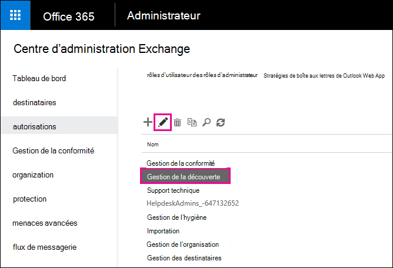
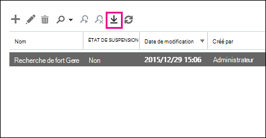
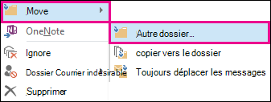
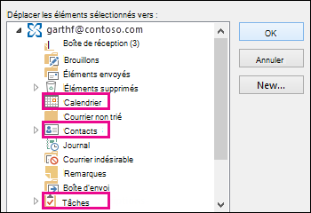

# Récupérer des éléments supprimés dans la boîte aux lettres d’un utilisateur

**Cet article est destiné aux administrateurs. Essayez-vous de récupérer des éléments supprimés dans votre propre boîte aux lettres ?** Effectuez l’une des actions suivantes : 
- [Récupérer des éléments supprimés dans Outlook pour Windows](https://support.office.com/article/49e81f3c-c8f4-4426-a0b9-c0fd751d48ce)
- [Récupérer des éléments ou des messages supprimés dans Outlook Web App](https://support.office.com/article/c3d8fc15-eeef-4f1c-81df-e27964b7edd4)
- [Restaurer des messages électroniques supprimés dans Outlook sur le Web](https://support.office.com/article/a8ca78ac-4721-4066-95dd-571842e9fb11)
- [Outlook.com](https://go.microsoft.com/fwlink/p/?LinkID=623435)
   
Un utilisateur a-t-il supprimé définitivement des éléments de sa boîte aux lettres Outlook ? L’utilisateur le souhaite à nouveau, mais ne peut pas les récupérer. Vous pouvez récupérer les éléments purgés s’ils n’ont pas été définitivement supprimés de la boîte aux lettres de l’utilisateur. Pour ce faire, utilisez l’outil de découverte électronique inaltérable dans Exchange Online pour rechercher des courriers électroniques supprimés et d’autres éléments, tels que des contacts, des rendez-vous de calendrier et des tâches, dans la boîte aux lettres d’un utilisateur. Si vous trouvez les éléments supprimés, vous pouvez les exporter vers un fichier PST (également appelé fichier de données Outlook), que l’utilisateur peut ensuite utiliser pour restaurer les éléments dans leur boîte aux lettres.
  
Voici la procédure à suivre pour restaurer des éléments supprimés dans la boîte aux lettres d’un utilisateur. Quelle est la durée de cette opération ? La première fois peut prendre 20 à 30 minutes pour effectuer toutes les étapes, en fonction du nombre d’éléments que vous essayez de récupérer.
  
> [!NOTE]
> Vous devez être **administrateur Exchange** ou **administrateur général** dans Microsoft 365 ou être membre du groupe de rôles gestion de l’organisation dans Exchange Online pour effectuer les étapes décrites dans cet article. Si vous souhaitez en savoir plus, consultez l’article [À propos des rôles d’administrateur Microsoft 365](https://support.office.com/article/da585eea-f576-4f55-a1e0-87090b6aaa9d). 
  
## Étape 1 : assignez des autorisations eDiscovery

La première étape consiste à vous attribuer les autorisations nécessaires dans Exchange Online afin de pouvoir utiliser l’outil de découverte électronique inaltérable pour rechercher la boîte aux lettres d’un utilisateur. Vous ne devez effectuer cette opération qu’une seule fois. Si vous devez rechercher une autre boîte aux lettres à l’avenir, vous pouvez ignorer cette étape.
  
1. [Où se connecter à Microsoft 365 pour les entreprises](https://support.microsoft.com/office/where-to-sign-into-microsoft-365-for-business-e9eb7d51-5430-4929-91ab-6157c5a050b4) avec votre compte professionnel ou scolaire. 
    
2. Sélectionnez l’icône du lanceur d’applications  dans la partie supérieure gauche, puis cliquez sur **administrateur**.
    
3. Dans le volet de navigation de gauche du centre d’administration de Microsoft 365, développez **centres d’administration**, puis cliquez sur **Exchange**.
    
    
  
4. Dans le centre d’administration Exchange, cliquez sur **autorisations**, puis cliquez sur **rôles d’administrateur**.
    
5. Dans l’affichage liste, sélectionnez **gestion**de la découverte, puis cliquez sur **modifier**l'  .
    
    
  
6. Dans **groupe de rôles**, sous **membres**, cliquez sur **Ajouter**une  .
    
7. Dans **Sélectionner les membres**, sélectionnez-vous dans la liste des noms, cliquez sur **Ajouter**, puis cliquez sur **OK**.
    
    > [!NOTE]
    > Vous pouvez également ajouter un groupe dont vous êtes membre, tel que gestion de l’organisation ou TenantAdmins. Si vous ajoutez un groupe, les autres membres du groupe se verront attribuer les autorisations nécessaires pour exécuter l’outil de découverte électronique inaltérable. 
  
8. Dans **groupe de rôles**, cliquez sur **Enregistrer**.
    
9. Déconnectez-vous de Microsoft 365.
    
    Vous devez vous déconnecter avant de commencer l’étape suivante afin que les nouvelles autorisations prennent effet.
    
> [!CAUTION]
> Les membres du groupe de rôles Gestion de la découverte peuvent accéder au contenu des messages sensibles. Il s’agit notamment de rechercher dans toutes les boîtes aux lettres de votre organisation, d’afficher un aperçu des résultats de la recherche (et d’autres éléments de boîte aux lettres), de copier les résultats dans une boîte aux lettres de découverte et d’exporter les résultats de la recherche dans un fichier PST. 
  
[Revenir au début](recover-deleted-items-in-a-mailbox.md)
  
## Étape 2 : recherche des éléments supprimés dans la boîte aux lettres de l’utilisateur

Lorsque vous exécutez une recherche de découverte électronique inaltérable, le dossier éléments récupérables de la boîte aux lettres que vous recherchez est automatiquement inclus dans la recherche. Le dossier éléments récupérables est l’emplacement de stockage des éléments supprimés jusqu’à ce qu’ils soient purgés (supprimés définitivement) de la boîte aux lettres. Par conséquent, si un élément n’a pas été purgé, vous devriez pouvoir le trouver à l’aide de l’outil de découverte électronique inaltérable.
  
1. [Où se connecter à Microsoft 365 pour les entreprises](https://support.microsoft.com/office/where-to-sign-into-microsoft-365-for-business-e9eb7d51-5430-4929-91ab-6157c5a050b4) avec votre compte professionnel ou scolaire. 
    
2. Sélectionnez l’icône du lanceur d’applications  dans la partie supérieure gauche, puis cliquez sur **administrateur**.
    
3. Dans le volet de navigation de gauche du centre d’administration de Microsoft 365, développez **administrateur**, puis cliquez sur **Exchange**.
    
4. Dans le centre d’administration Exchange, cliquez sur **gestion de la conformité**, cliquez sur ** &amp; blocage de la découverte électronique**inaltérable, puis cliquez sur **nouvelle**  .
    
    
  
5. Sur la page **nom et description** , tapez un nom pour la recherche (par exemple, le nom de l’utilisateur pour lequel vous récupérez du courrier électronique), une description facultative, puis cliquez sur **suivant**.
    
6. Dans la page **boîtes aux lettres** , cliquez sur **spécifier les boîtes aux lettres à rechercher**, puis cliquez sur **Ajouter**une  .
    
    
  
7. Recherchez et sélectionnez le nom de l’utilisateur pour lequel vous récupérez le courrier électronique supprimé, cliquez sur **Ajouter**, puis sur **OK**.
    
8. Cliquez sur **Suivant**.
    
    La page **requête de recherche** s’affiche. C’est ici que vous définissez les critères de recherche qui vous aideront à trouver les éléments manquants dans la boîte aux lettres de l’utilisateur. 
    
9. Dans la page **Requête de recherche**, complétez les champs suivants : 
    
  - **Inclure tout le contenu** Sélectionnez cette option pour inclure tout le contenu de la boîte aux lettres de l’utilisateur dans les résultats de la recherche. Si vous sélectionnez cette option, vous ne pouvez pas spécifier de critères de recherche supplémentaires. 
    
  - **Filtre basé sur des critères** Sélectionnez cette option pour spécifier les critères de recherche, y compris les mots clés, les dates de début et de fin, les adresses des expéditeurs et des destinataires, ainsi que les types de messages. 
    
    
  
|**Field**|**Utilisez-le pour...**|
|:-----|:-----|
|             |Spécifiez les mots clés, la plage de dates, les destinataires et les types de messages.    |
|             |Recherchez des messages contenant des mots clés ou des expressions, et utilisez des opérateurs logiques comme **and** ou **or**.    |
|             |Rechercher les messages envoyés ou reçus dans une plage de dates.    |
|             |Rechercher les messages reçus ou envoyés à des personnes spécifiques.    |
|             |Recherchez tous les types de messages ou sélectionnez ceux qui sont spécifiques.    |
   
   > [!TIP]
   >  Voici quelques conseils sur la façon de créer une requête de recherche pour rechercher les éléments manquants. Essayez d’obtenir toutes les informations de l’utilisateur pour vous aider à créer une requête de recherche, afin de trouver ce que vous recherchez. Si vous ne savez pas comment trouver un message manquant, envisagez d’utiliser l’option **inclure tout le contenu** . Les résultats de la recherche incluent tous les éléments du dossier éléments récupérables de l’utilisateur, y compris le dossier masqué (appelé le dossier purges) qui contiennent des éléments qui ont été purgés par l’utilisateur. Ensuite, vous pouvez passer à l’étape 3, copier les résultats dans une boîte aux lettres de découverte et examiner le message dans le dossier masqué. Si vous avez peu de certitude lorsque le message manquant a été envoyé ou reçu par l’utilisateur à l’origine, utilisez les options **spécifier la date de début** et spécifier la date de **fin** pour fournir une plage de dates. Cette opération renverra tous les messages envoyés ou reçus par l’utilisateur au sein de cette plage de dates. La spécification d’une plage de dates est une excellente façon de limiter les résultats de la recherche. Si vous êtes responsable de la personne qui a envoyé le courrier manquant, utilisez la zone **de** pour spécifier cet expéditeur. Si vous souhaitez limiter les résultats de la recherche à différents types d’éléments de boîte aux lettres, cliquez sur **Sélectionner des types de messages**, cliquez sur **Sélectionner les types de messages à rechercher**, puis choisissez un type de message spécifique à rechercher. Par exemple, vous pouvez rechercher uniquement des éléments de calendrier ou des contacts. Voici une capture d’écran des différents types de messages que vous pouvez rechercher ; par défaut, la recherche porte sur tous les types de messages. 
  
   Cliquez sur **suivant** lorsque vous avez terminé la page **requête de recherche** . 
    
10. Sur la page **paramètres de la conservation inaltérable** , cliquez sur **Terminer** pour démarrer la recherche. Pour récupérer le courrier supprimé, il n’y a aucune raison de placer la boîte aux lettres en conservation de l’utilisateur. 
    
    Une fois que vous avez démarré la recherche, Exchange affiche une estimation de la taille totale et du nombre d’éléments qui seront renvoyés par la recherche en fonction des critères que vous avez spécifiés.
    
11. Sélectionnez la recherche que vous venez de créer et cliquez sur **Actualiser**  l’actualisation pour mettre à jour les informations affichées dans le volet d’informations. Le statut de l' **estimation réussie** indique que la recherche est terminée. Exchange affiche également une estimation du nombre total d’éléments (et leur taille) trouvés par la recherche en fonction des critères de recherche que vous avez spécifiés à l’étape 9. 
    
12. Dans le volet d’informations, cliquez sur **aperçu des résultats** de la recherche pour afficher les éléments qui ont été trouvés. Cela peut vous aider à identifier les éléments que vous recherchez. Si vous trouvez les éléments que vous tentez de récupérer, passez à l’étape 4 pour exporter les résultats de la recherche dans un fichier PST. 
    
    
  
13. Si vous ne trouvez pas ce que vous recherchez, vous pouvez modifier vos critères de recherche en sélectionnant la recherche, en cliquant sur **modifier**  , puis en cliquant sur **requête de recherche**. Modifiez les critères de recherche, puis réexécutez la recherche.
    
[Revenir au début](recover-deleted-items-in-a-mailbox.md)
  
## Module Étape 3 : copier les résultats de la recherche dans une boîte aux lettres de découverte

Si vous ne parvenez pas à trouver d’éléments en prévisualisant les résultats de la recherche ou si vous souhaitez voir quels éléments se trouvent dans le dossier éléments récupérables de l’utilisateur, vous pouvez copier les résultats de la recherche dans une boîte aux lettres spéciale (appelée boîte aux lettres de découverte), puis ouvrir cette boîte aux lettres dans Outlook sur le Web pour afficher les éléments réels. La meilleure raison de copier les résultats de la recherche est de vous permettre d’afficher les éléments dans le dossier éléments récupérables de l’utilisateur. Plus vraisemblablement, l’élément que vous tentez de récupérer se trouve dans le sous-dossier purges. 
  
1. Dans le centre d’administration Exchange, accédez à **gestion de la conformité** \> **de &amp; la découverte électronique**inaltérable.
    
2. Dans la liste des recherches, sélectionnez la recherche que vous avez créée à l’étape 2.
    
3. Cliquez **sur**  de recherche, puis **sur copier les résultats** de la recherche dans la liste déroulante. 
    
    
  
4. Sur la page **copier les résultats de recherche** , cliquez sur **Parcourir**.
    
    
  
5. Sous **nom d’affichage**, cliquez sur **boîte aux lettres de découverte**, puis cliquez sur **OK**.
    
    
  
    > [!NOTE]
    > La boîte aux lettres de découverte est une boîte aux lettres de découverte par défaut qui est automatiquement créée dans votre organisation Microsoft 365. 
  
6. De retour dans la page **copier les résultats de recherche** , cliquez sur **copier** pour lancer le processus de copie des résultats de la recherche dans la boîte aux lettres de découverte. 
    
    
  
7. Cliquez sur **Actualiser**  l’actualisation pour mettre à jour les informations sur l’état de copie affiché dans le volet d’informations. 
    
8. Une fois la copie terminée, cliquez sur **ouvrir** pour ouvrir la boîte aux lettres de découverte pour afficher les résultats de la recherche. 
    
    
  
    Les résultats de la recherche copiés dans la boîte aux lettres de découverte sont placés dans un dossier portant le même nom que la recherche de découverte électronique inaltérable. Vous pouvez cliquer sur un dossier pour afficher les éléments contenus dans ce dossier.
    
    
  
    Lorsque vous exécutez une recherche, le dossier éléments récupérables de l’utilisateur est également recherché. Cela signifie que si les éléments du dossier éléments récupérables répondent aux critères de recherche, ils sont inclus dans les résultats de la recherche. Les éléments du dossier suppressions sont des éléments que l’utilisateur a supprimés définitivement (en supprimant un élément du dossier éléments supprimés ou en le sélectionnant et en appuyant sur **MAJ + SUPPR**. Un utilisateur peut utiliser l’outil de récupération des éléments supprimés dans Outlook ou Outlook sur le Web pour récupérer des éléments dans le dossier de suppressions. Les éléments du dossier purges sont les éléments que l’utilisateur a purgés à l’aide de l’outil récupérer les éléments supprimés ou les éléments qu’ils ont été supprimés automatiquement par une stratégie appliquée à la boîte aux lettres. Dans les deux cas, seul un administrateur peut récupérer des éléments dans le dossier purges. 
    
    > [!TIP]
    > Si un utilisateur ne parvient pas à trouver un élément supprimé à l’aide de l’outil éléments récupérables, mais qu’il est toujours récupérable (ce qui signifie qu’il n’a pas été supprimé définitivement de la boîte aux lettres), il est plus que probable qu’il se trouve dans le dossier purges. Veillez donc à consulter le dossier purges de l’élément supprimé que vous tentez de récupérer pour un utilisateur. 
  
[Revenir au début](recover-deleted-items-in-a-mailbox.md)
  
## Étape 4 : exporter les résultats de la recherche dans un fichier PST

Une fois que vous avez trouvé l’élément que vous tentez de récupérer pour un utilisateur, l’étape suivante consiste à exporter les résultats de la recherche que vous avez exécutée à l’étape 2 vers un fichier PST. L’utilisateur utilisera ce fichier PST à l’étape suivante pour restaurer l’élément supprimé dans sa boîte aux lettres.
  
1. Dans le centre d’administration Exchange, accédez à **gestion de la conformité** \> **de &amp; la découverte électronique**inaltérable.
    
2. Dans la liste des recherches, sélectionnez la recherche que vous avez créée à l’étape 2.
    
3. Cliquez sur **Exporter vers un fichier PST**.
    
    
  
4. Si vous êtes invité à installer l’outil d’exportation de découverte électronique, cliquez sur **exécuter**.
    
5. Dans l’outil d’exportation PST eDiscovery, cliquez sur **Parcourir** pour spécifier l’emplacement où vous souhaitez télécharger le fichier PST. 
    
    
  
    Vous pouvez ignorer les options pour activer la déduplication et inclure les éléments impossibles à rechercher.
    
6. Cliquez sur **Démarrer** pour télécharger le fichier PST sur votre ordinateur. 
    
    L' **outil d’exportation PST eDiscovery** affiche des informations sur l’état du processus d’exportation. Une fois l’exportation terminée, vous pouvez accéder au fichier à l’emplacement où il a été téléchargé. 
    
[Revenir au début](recover-deleted-items-in-a-mailbox.md)
  
## Étape 5 : restaurer les éléments récupérés dans la boîte aux lettres de l’utilisateur

La dernière étape consiste à utiliser le fichier PST qui a été exporté à l’étape 4 pour restaurer les éléments récupérés dans la boîte aux lettres de l’utilisateur. Une fois que vous avez envoyé le fichier PST à l’utilisateur, le reste de cette étape est effectué par l’utilisateur pour ouvrir le fichier PST, puis déplacer les éléments récupérés vers un autre dossier de leur boîte aux lettres. Pour obtenir des instructions pas à pas, vous pouvez également envoyer à l’utilisateur un lien vers cette rubrique : [ouvrir et fermer des fichiers de données Outlook (. pst)](https://support.office.com/article/381b776d-7511-45a0-953a-0935c79d24f2). Sinon, vous pouvez envoyer à l’utilisateur un lien vers la [boîte de réception des éléments supprimés vers une boîte aux lettres à l’aide d’une section de fichier PST](recover-deleted-items-in-a-mailbox.md#restoredeleteditems) ci-dessous et lui demander d’effectuer ces étapes. 
  
 **Envoyer le fichier PST à l’utilisateur**
  
La dernière étape à effectuer consiste à envoyer le fichier PST exporté à l’étape 4 vers l’utilisateur. Il existe plusieurs façons d’effectuer cette opération :
  
- Joignez le fichier PST à un message électronique. Si Outlook est configuré pour bloquer les fichiers PST, vous devrez le compresser, puis le joindre au message. Voici comment procéder :
    
1. Dans l’Explorateur Windows ou l’Explorateur de fichiers, accédez au fichier PST.
    
2. Cliquez avec le bouton droit sur le fichier, puis sélectionnez **Envoyer vers** le \> **dossier compressé (zippé)**. Windows crée un fichier zip et lui attribue un nom identique à celui du fichier PST.
    
3. Joignez le fichier PST compressé à un message électronique et envoyez-le à l’utilisateur, qui peut ensuite décompresser le fichier en cliquant simplement dessus.
    
- Copiez le fichier PST dans un dossier partagé auquel l’utilisateur peut accéder et pour le récupérer.
    
Les étapes de la section suivante sont effectuées par l’utilisateur pour restaurer les éléments supprimés dans leur boîte aux lettres.
  
 
**Restaurer des éléments supprimés dans une boîte aux lettres à l’aide d’un fichier PST**
  
Vous devez utiliser l’application de bureau Outlook pour restaurer un élément supprimé à l’aide d’un fichier PST. Vous ne pouvez pas utiliser Outlook Web App ou Outlook sur le Web pour ouvrir un fichier PST.
  
1. Dans Outlook 2013 ou Outlook 2016, cliquez sur l’onglet **fichier** . 
    
2. Cliquez sur **ouvrir l' &amp; exportation**, puis sur **ouvrir le fichier de données Outlook**.
    
3. Naviguez jusqu’à l’emplacement où vous avez enregistré le fichier PST que votre administrateur a envoyé.
    
4. Sélectionnez le fichier PST, puis cliquez sur **ouvrir**.
    
    Le fichier PST apparaît dans la barre de navigation de gauche dans Outlook.
    
    
  
5. Cliquez sur les flèches pour développer le fichier PST et les dossiers sous celui-ci pour localiser l’élément que vous souhaitez récupérer.
    
    
  
    > [!TIP]
    > Recherchez dans le dossier purges l’élément que vous souhaitez récupérer. Il s’agit d’un dossier masqué dans lequel les éléments purgés sont déplacés vers. Il est probable que l’élément récupéré par votre administrateur se trouve dans ce dossier. 
  
6. Cliquez avec le bouton droit sur l’élément à récupérer, puis cliquez sur **déplacer** un \> **autre dossier**.
    
    
  
7. Pour déplacer l’élément dans votre boîte de réception, cliquez sur **boîte de réception**, puis cliquez sur **OK**.
    
    **Conseil :** Pour récupérer d’autres types d’éléments, effectuez l’une des opérations suivantes : 
    
  - Pour récupérer un élément de calendrier, cliquez dessus avec le bouton droit, puis cliquez sur **déplacer** un \> **autre** \> **calendrier**de dossier.
    
  - Pour récupérer un contact, cliquez dessus avec le bouton droit, puis cliquez sur **déplacer** \> **les autres** \> **contacts**de dossier.
    
  - Pour récupérer une tâche, cliquez dessus avec le bouton droit, puis cliquez sur **déplacer** \> **les autres** \> **tâches**de dossier.
    

  
   > [!NOTE]
   > Les éléments de calendrier, les contacts et les tâches se trouvent directement dans le dossier purges, et non dans un sous-dossier calendrier, contacts ou tâches. Toutefois, vous pouvez trier par **type** pour regrouper des types d’éléments similaires. 
    
8. Lorsque vous avez terminé de restaurer les éléments supprimés, cliquez avec le bouton droit sur le fichier PST dans la barre de navigation de gauche, puis sélectionnez **Fermer "nom du fichier PST"**.
    
[Return to top](recover-deleted-items-in-a-mailbox.md)
  
## Plus d’informations

- Un utilisateur peut récupérer un élément supprimé définitivement si la période de rétention des éléments supprimés de l’élément n’a pas expiré. En tant qu’administrateur, vous avez peut-être spécifié la durée de disponibilité des éléments dans le dossier éléments récupérables pour la récupération. Par exemple, il peut y avoir une stratégie qui supprime tout ce qui se trouve dans le dossier éléments supprimés d’un utilisateur pendant 30 jours, et une autre stratégie qui permet aux utilisateurs de récupérer des éléments dans le dossier éléments récupérables pendant 14 jours maximum. Toutefois, après ces 14 jours, vous pouvez toujours pouvoir récupérer un élément dans la boîte aux lettres d’un utilisateur à l’aide des procédures décrites dans cette rubrique.
    
- Les utilisateurs peuvent récupérer un élément supprimé s'il n'a pas été supprimé définitivement et si la période de rétention de l'élément supprimé de cet élément n'a pas expiré. Pour aider les utilisateurs à récupérer les éléments supprimés dans leur boîte aux lettres, pointez-les vers l’une des rubriques suivantes :
    
  - [Récupérer des éléments supprimés dans Outlook pour Windows](https://support.office.com/article/49e81f3c-c8f4-4426-a0b9-c0fd751d48ce)
    
  - [Récupérer des éléments supprimés dans Outlook 2010](https://support.office.com/article/cd9dfe12-8e8c-4a21-bbbf-4bd103a3f1fe)
    
  - [Récupérer des éléments ou des messages supprimés dans Outlook Web App](https://support.office.com/article/c3d8fc15-eeef-4f1c-81df-e27964b7edd4)
    
  - [Restaurer des messages électroniques supprimés dans Outlook sur le Web](https://support.office.com/article/a8ca78ac-4721-4066-95dd-571842e9fb11)
    
  - [Récupérer un contact supprimé dans Outlook](https://support.office.com/article/51c83288-6888-4dcd-8c99-4932daabf643)
    
  - [Restaurer les messages électroniques supprimés dans Outlook.com](https://go.microsoft.com/fwlink/p/?LinkID=623435)
    
[Revenir au début](recover-deleted-items-in-a-mailbox.md)
  

