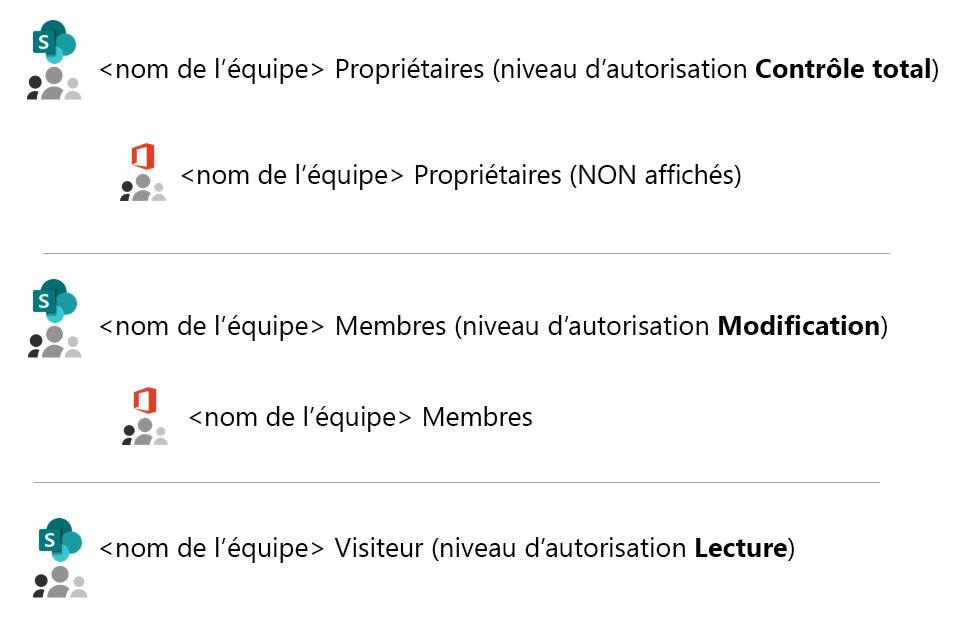
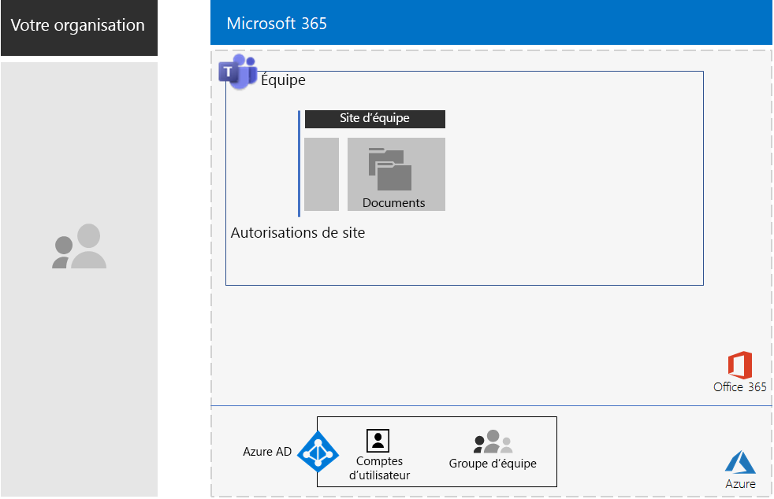
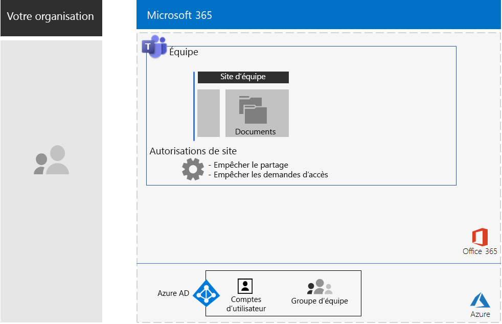
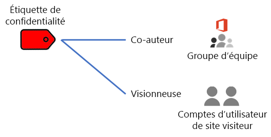
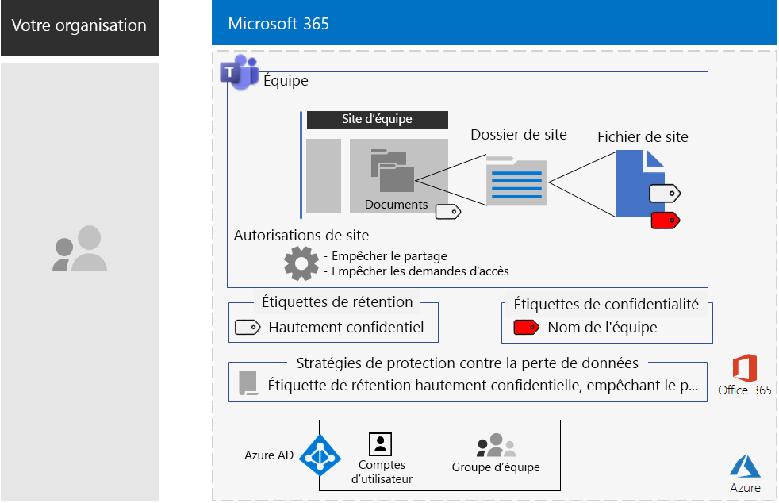

# Teams pour les données hautement réglementées

Cet article décrit les recommandations et les étapes à suivre pour configurer une équipe privée dans Microsoft Teams, qui donne l’accès aux fonctionnalités de Teams, telles que les conversations, réunions et fichiers, uniquement aux membres et aux propriétaires du groupe Office 365 pour l’équipe. 

Au-delà de l’accès privé sur la base du groupe Office 365, cet article décrit comment configurer le site d’équipe SharePoint privé sous-jacent, auquel vous pouvez accéder à partir de la section **Fichiers** d’un canal d’équipe, afin de renforcer la sécurité nécessaire pour stocker les données hautement réglementées. Sur ce site d’équipe SharePoint, vous pouvez stocker et collaborer sur des fichiers, des pages, un calendrier partagé, des tâches, un bloc-notes et des listes.

>[!Note]
> Un scénario similaire utilisant SharePoint est consultable [ici](teams-sharepoint-online-sites-highly-regulated-data.md).
>

Les éléments de configuration d’une équipe pour les données hautement réglementées sont les suivants :

- Une équipe privée avec un groupe Office 365 associé qui dispose de comptes propriétaire et utilisateur.
- Une sécurité supplémentaire sur le site SharePoint sous-jacent pour l’équipe qui :
  - Empêche les membres du site d’octroyer l’accès à d’autres personnes.
  - Empêche les non-membres du site de demander l’accès au site.
- Une étiquette de rétention Office 365 pour le site SharePoint sous-jacent qui est automatiquement appliquée aux nouveaux fichiers sur le site comme moyen par défaut pour définir les stratégies de rétention.
- Une stratégie de prévention contre la perte de données (DLP) qui utilise l’étiquette de rétention et empêche les utilisateurs de partager ou d’envoyer des fichiers en dehors de l’organisation.
- Une étiquette de confidentialité Office 365 ou sous-étiquette d’une étiquette hautement réglementée avec le chiffrement activé et les autorisations de co-édition pour le groupe Office 365 de l’équipe. Les utilisateurs appliquent les étiquettes ou sous-étiquettes aux fichiers stockés dans la section **Fichiers** de l’équipe à partir de l’option de la barre de menus **Confidentialité** dans Word, Excel et PowerPoint.

Voici la configuration obtenue avec une étiquette de confidentialité.

Pour voir un bref aperçu, regardez cette courte vidéo.

> [!VIDEO https://www.microsoft.com/videoplayer/embed/RE4mGHf]

 Pour un résumé d’une page de ce scénario, voir l’[affiche Teams pour les données hautement réglementées](../media/secure-teams-highly-regulated-data-scenario/TeamsHighlyRegulatedData.pdf).

Vous pouvez également télécharger cette affiche au format [PDF](https://github.com/MicrosoftDocs/microsoft-365-docs/raw/public/microsoft-365/media/secure-teams-highly-regulated-data-scenario/TeamsHighlyRegulatedData.pdf) ou [PowerPoint](https://github.com/MicrosoftDocs/microsoft-365-docs/raw/public/microsoft-365/media/secure-teams-highly-regulated-data-scenario/Teams-Highly-Regulated-Data-Poster.pptx) et l’imprimer sur du papier au format lettre, légal ou tabloïd (11 x 17).

## Phase 1 : configurer une équipe pour les données hautement réglementées

La configuration de bout en bout comprend les étapes suivantes :

1. Configuration des accès aux identités et appareils.
2. Création d’une équipe privée.
3. Configuration du site SharePoint sous-jacent pour une sécurité supplémentaire.
4. Création d’une étiquette de rétention et d’une stratégie DLP.
5. Création de l’étiquette ou de la sous-étiquette de l’étiquette très réglementée.

### Etape 1 : configuration des accès aux identités et appareils

Pour protéger l’accès à l’équipe et au site SharePoint sous-jacent, vérifiez que vous avez configuré les [stratégies pour les identités et l’accès aux appareils](https://docs.microsoft.com/microsoft-365/enterprise/identity-access-policies) et les [stratégies d’accès à SharePoint Online](https://docs.microsoft.com/microsoft-365/enterprise/sharepoint-file-access-policies) recommandées.

### Etape 2 : création d’une équipe privée

Suivez [ces instructions](https://support.office.com/article/create-a-team-from-scratch-174adf5f-846b-4780-b765-de1a0a737e2b) pour créer une équipe privée.

Lorsque vous créez une équipe privée, voici les autorisations par défaut :

- Le groupe Office 365 pour l’équipe (le groupe d’équipe) est constitué de propriétaires du groupe et de membres du groupe
- Pour le site SharePoint sous-jacent pour l’équipe (le site d’équipe) :
  - Les administrateurs de collection de sites sont configurés pour les propriétaires du groupe d’équipe
  - Pour le site d’équipe : 
    - Le groupe SharePoint des propriétaires du site d’équipe, avec le niveau d’autorisation contrôle total, est relié aux propriétaires du groupe d’équipe
    - Le groupe SharePoint des membres du site d’équipe, avec le niveau d’autorisation modification, est relié aux membres du groupe d’équipe
    - Le groupe SharePoint des visiteurs du site d’équipe, avec le niveau d’autorisation lecture, ne possède pas de groupe ou de comptes d’utilisateur

Voici les autorisations par défaut pour le site d’équipe.

 
>[!Note]
>Si vous consultez le groupe SharePoint des propriétaires de \<nom de l’équipe> pour le niveau d’autorisation modification, celui-ci n’affiche pas les propriétaires de \<nom de l’équipe>.
>

Les autorisations obtenues permettent :

- Aux propriétaires du groupe d’équipe de gérer le site et de disposer d’un contrôle total sur son contenu.
- Aux membres d’un groupe d’équipe de créer et modifier des fichiers sur le site. 

La maintenance des autorisations est identique à la maintenance des membres d’équipe et des propriétaires.

Voici la configuration obtenue pour l’instant.

 
### Etape 3 : configuration du site SharePoint sous-jacent pour une sécurité supplémentaire

À partir du site d’équipe, configurez ces paramètres d’autorisation.

1. Dans la barre d’outils, cliquez sur l’icône Paramètres, puis cliquez sur **Autorisations du site**.
2. Dans le volet **Autorisations de site**, sous **Paramètres de partage**, cliquez sur **Modifier les paramètres de partage**.
3. Sous **Autorisations de partage**, sélectionnez **Seuls les propriétaires du site peuvent partager des fichiers, des dossiers et le site**.
4. Désactivez **Autoriser les demandes d’accès**, puis cliquez sur **Enregistrer**.

Avec ces paramètres, la possibilité pour les membres du groupe d’équipe de partager le site d’équipe avec d’autres membres ou pour les non-membres de demander l’accès au site d’équipe est désactivée.

Voici la configuration obtenue pour l’instant.

 
### Etape 4 : création d’une étiquette de rétention et d’une stratégie DLP

Utilisez [ces instructions](https://docs.microsoft.com/microsoft-365/security/office-365-security/deploy-teams-retention-dlp) pour :

1. Créer et publier une étiquette de rétention pour les données hautement réglementées (le cas échéant).
2. Configurer le site d’équipe pour l’étiquette de rétention créée à l’étape 1.
3. Créer une stratégie DLP pour les données hautement réglementées qui utilise l’étiquette de rétention créée à l’étape 2 et qui empêche les utilisateurs d’envoyer des fichiers à l’extérieur de l’organisation. Vous pouvez également configurer la stratégie pour définir des exigences supplémentaires, telles que celles correspondant aux réglementations sectorielles sur la santé et la finance, sur la base des [modèles de stratégie de DLP](https://docs.microsoft.com/microsoft-365/compliance/data-loss-prevention-policies#dlp-policy-templates).

Voici la configuration obtenue pour l’instant.

 
### Étape 5 : créer une étiquette de confidentialité ou une sous-étiquette de l’étiquette de confidentialité extrêmement réglementée

Contrairement à une étiquette de sensibilité pour les données hautement réglementées qu’une personne peut appliquer à n’importe quel fichier, une équipe sécurisée doit avoir sa propre étiquette ou sous-étiquette de sorte que les fichiers auxquels elle est attribuée :

- Soient chiffrés et que le chiffrement soit acheminé avec le fichier.
- Contiennent des autorisations personnalisées de sorte que seuls les membres du groupe d’équipe puissent l’ouvrir.

Pour atteindre ce niveau de sécurité supplémentaire pour les fichiers stockés sur le site d’équipe, vous devez configurer une nouvelle étiquette de sensibilité qui est soit sa propre étiquette, soit une sous-étiquette de l’étiquette générale pour les fichiers hautement réglementés. Seuls les membres du groupe d’équipe la verront dans leur liste d’étiquettes.

Utilisez une étiquette de confidentialité lorsque vous avez besoin d’un petit nombre d’étiquettes à la fois pour un usage global et pour des équipes privées individuelles. Utilisez une sous-étiquette de confidentialité lorsque vous avez un grand nombre d’étiquettes ou si vous souhaitez organiser les étiquettes pour les équipes privées sous l’étiquette hautement réglementée.

[Suivez ces instructions](https://docs.microsoft.com/microsoft-365/compliance/encryption-sensitivity-labels) pour configurer une étiquette distincte ou une sous-étiquette avec les paramètres suivants :

- Le nom de l’étiquette contient le nom de l’équipe
- Le chiffrement est activé
- Le groupe d’équipe possède des autorisations de co-création

Voici la configuration obtenue avec la nouvelle étiquette.

Voici la relation entre l’étiquette de confidentialité et le groupe d’équipe.

>[!Note]
>Si vous configurez l’étiquette de confidentialité ou la sous-étiquette pour les autorisations définies par l’utilisateur ou avec une date d’expiration, vous ne pouvez pas ouvrir le fichier à partir de Teams ou de SharePoint. Vous devez utiliser une application Office.
>

### Autorisations personnalisées

Vous pouvez également configurer les autorisations des sites SharePoint personnalisés pour le site d’équipe et, si nécessaire, l’étiquette de confidentialité correspondante. Voici deux exemples.

#### Exemple 1 : délégation de l’administration d’un site SharePoint

Si le propriétaire de l’équipe ne dispose pas d’une expérience d’administration de SharePoint ou souhaite déléguer l’administration du site d’équipe, il peut ajouter le compte d’utilisateur d’un administrateur de services SharePoint à la liste des propriétaires d’équipe. L’administrateur de services SharePoint dispose alors d’un accès total à l’équipe et à toutes ses ressources et peut ouvrir un fichier avec l’étiquette de confidentialité appliquée. 

Pour empêcher l’octroi de trop grands privilèges, ajoutez le compte d’utilisateur de l’administrateur de services SharePoint au groupe SharePoint propriétaires du site d’équipe dans les paramètres d’autorisations avancés du site. L’administrateur de services SharePoint peut gérer le site, mais ne peut pas accéder à l’équipe et à ses ressources, ni ouvrir les fichiers avec l’étiquette de confidentialité attribuée.

#### Exemple 2 : autoriser l’accès en affichage seul aux fichiers étiquetés

Si certains membres du personnel doivent seulement consulter le contenu des fichiers étiquetés du site d’équipe, ajoutez leurs comptes d’utilisateur individuels au :

- groupe SharePoint visiteurs \<nom de l’équipe >, qui par défaut dispose du niveau d’autorisation lecture. 
- Étiquette de confidentialité avec autorisations d’affichage.

Voici les autorisations obtenues sur l’étiquette.

 
Les visiteurs du site pourront accéder directement au site d’équipe et afficher le contenu des fichiers sur lesquels la sous-étiquette est appliquée. Mais, étant donné qu’ils ne sont pas membres du groupe d’équipe, ils ne pourront accéder ni à l’équipe, ni à aucune de ses ressources.

## Phase 2 : favoriser l’adoption par les utilisateurs pour les membres de l’équipe

Une fois l’équipe en place, il est temps de stimuler l’adoption de cette équipe et de sa sécurité supplémentaire pour les membres de l’équipe.

### Étape 1 : former vos utilisateurs

Les membres du groupe d’équipe peuvent accéder à l’équipe et à toutes ses ressources, y compris aux conversations, réunions et autres applications. Lorsque vous travaillez avec des fichiers de la section **Fichiers** d’un canal, les membres du groupe d’équipe doivent affecter l’étiquette ou la sous-étiquette de confidentialité aux fichiers créés pour l’équipe sécurisée. Voici un exemple.

 
Lorsque l’étiquette est appliquée au fichier, celui-ci devient sécurisé. Les membres du groupe d’équipe peuvent l’ouvrir dans Teams et collaborer en temps réel. Il est chiffré et inclut les autorisations de co-édition définies pour les membres du groupe d’équipe. Si le fichier quitte le site et est transmis à un utilisateur malveillant, celui-ci devra fournir les informations d’identification d’un compte d’utilisateur membre du groupe d’équipe pour ouvrir le fichier et afficher son contenu. 

Formez les membres de votre équipe :

- Sur l’importance de l’utilisation de la nouvelle équipe pour les conversations, les réunions, les fichiers et les autres ressources du site de l’équipe, et les conséquences d’une fuite de données hautement réglementées, telles que des conséquences juridiques, des amendes réglementaires, des rançongiciels ou la perte de l’avantage concurrentiel.
- Accès à l’équipe.
- Création de nouveaux fichiers sur le site et chargement de nouveaux fichiers stockés localement.
- Blocage du partage des fichiers en externe par la stratégie DLP.
- Mode d’étiquetage de fichiers à l’aide de l’étiquette ou de la sous-étiquette personnalisée pour l’équipe.
- Comment l’étiquette ou la sous-étiquette protège des fichiers même lorsque ceux-ci ont été divulgués hors du site.

Cette formation doit inclure des exercices pratiques pour que les membres de votre équipe puissent se familiariser avec ces fonctionnalités et leurs résultats.

### Étape 2 : conduire des vérifications périodiques de l’utilisation et donner suite aux commentaires des membres de l’équipe

Dans les semaines suivant la formation :

- Traitez rapidement les commentaires des membres de l’équipe et affinez les stratégies et les configurations.
- Analysez l’utilisation pour l’équipe et comparez-la avec les attentes en matière d’utilisation.
- Vérifiez que les fichiers hautement réglementés ont été correctement étiquetés avec l’étiquette ou la sous-étiquette de sensibilité personnalisée.

  Vous pouvez voir quels fichiers disposent d'une étiquette attribuée en affichant un dossier dans SharePoint Online et en ajoutant la colonne **Confidentialité** via l'option **Afficher/masquer les colonnes** de la fonction **Ajouter une colonne**.

Formez à nouveau vos utilisateurs, le cas échéant.

## Faites ceci dans un environnement de test

Pour créer votre propre environnement pour tester les équipes pour les fichiers confidentiels et hautement confidentiels, consultez [ces instructions](https://docs.microsoft.com/microsoft-365/security/office-365-security/secure-team-for-files-in-a-dev-test-environment). 

## Comment Contoso Corporation a utilisé une équipe sécurisée pour un projet top secret

Contoso Corporation est un conglomérat de fabricants international fictif mais représentatif. Découvrez comment Contoso a configuré et stimulé l’adoption d’une [équipe sécurisée](contoso-team-for-top-secret-project.md) pour un projet top secret afin de développer et de commercialiser un nouvel ensemble de produits et services. 

## Voir aussi

[Sites SharePoint pour les données hautement réglementées](teams-sharepoint-online-sites-highly-regulated-data.md)

[Scénarios et charges de travail Microsoft 365 Entreprise](deploy-workloads.md)

[Bibliothèque de productivité Microsoft 365](https://aka.ms/productivitylibrary)https://aka.ms/productivitylibrary)

[Guide de déploiement](deploy-microsoft-365-enterprise.md)
